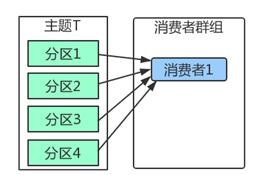
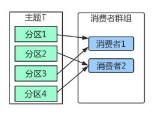
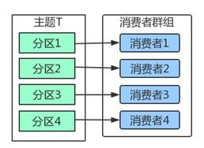
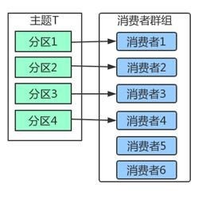
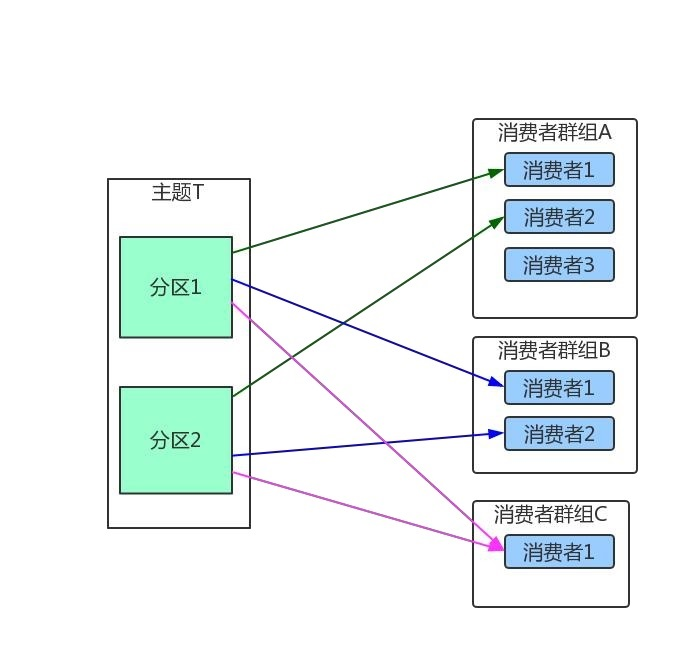

# 3. Java原生整合Kafka
[[toc]]
### 3.1 配置参数以及依赖

### 3.1.1 server.properties

```shell
vi /root/kafka_2.11-2.0.0/config/server.properties
#### 注意要开启borker远程访问配置
advertised.listeners=PLAINTEXT://101.43.21.33:9092
```

### 3.1.2 maven依赖
```xml
<dependencies>
    <dependency>
        <groupId>org.apache.kafka</groupId>
        <artifactId>kafka-clients</artifactId>
        <version>1.1.0</version>
    </dependency>
    <dependency>
        <groupId>com.alibaba</groupId>
        <artifactId>fastjson</artifactId>
        <version>1.1.41</version>
    </dependency>
    <dependency>
        <groupId>ch.qos.logback</groupId>
        <artifactId>logback-core</artifactId>
        <version>1.1.3</version>
    </dependency>
    <dependency>
        <groupId>ch.qos.logback</groupId>
        <artifactId>logback-classic</artifactId>
        <version>1.1.1</version>
    </dependency>
</dependencies>
```

## 3.2 Kafka 的生产者

### 3.2.1 生产者配置参数

#### acks：

Kafka 内部的复制机制是比较复杂的，这里不谈论内部机制（后续章节进行细讲），我们只讨论生产者发送消息时与副本的关系。 指定了必须要有多少个分区副本收到消息，生产者才会认为写入消息是成功的，这个参数对消息丢失的可能性有重大影响。 

acks=0：生产者在写入消息之前不会等待任 何来自服务器的响应，容易丢消息，但是吞吐量高。 

acks=1：只要集群的首领节点收到消息，生产者会收到来自服务器的成功响应。如果消息无法到达首领节点（比如首领节点崩溃，新首领没有选举出 来），生产者会收到一个错误响应，为了避免数据丢失，生产者会重发消息。不过，如果一个没有收到消息的节点成为新首领，消息还是会丢失。默认 使用这个配置。 

acks=all：只有当所有参与复制的节点都收到消息，生产者才会收到一个来自服务器的成功响应。延迟高。 金融业务，主备外加异地灾备。所以很多高可用场景一般不是设置 2 个副本，有可能达到 5 个副本，不同机架上部署不同的副本，异地上也部署一套副本。

#### buffer.memory 

设置生产者内存缓冲区的大小（结合生产者发送消息的基本流程），生产者用它缓冲要发送到服务器的消息。如果数据产生速度大于向 broker 发送的速度，导致生产者空间不足，producer 会阻塞或者抛出异常。缺省 33554432 (32M) 

#### max.block.ms 

指定了在调用 send()方法或者使用 partitionsFor()方法获取元数据时生产者的阻塞时间。当生产者的发送缓冲区已满，或者没有可用的元数据时，这些 方法就会阻塞。在阻塞时间达到 max.block.ms 时，生产者会抛出超时异常。缺省 60000ms 

#### retries

发送失败时，指定生产者可以重发消息的次数（缺省 Integer.MAX_VALUE）。默认情况下，生产者在每次重试之间等待 100ms，可以通过参数 retry.backoff.ms 参数来改变这个时间间隔。 

#### receive.buffer.bytes 和 send.buffer.bytes 

指定 TCP socket 接受和发送数据包的缓存区大小。如果它们被设置为-1，则使用操作系统的默认值。如果生产者或消费者处在不同的数据中心，那么 可以适当增大这些值，因为跨数据中心的网络一般都有比较高的延迟和比较低的带宽。缺省 102400 

#### batch.size 

当多个消息被发送同一个分区时，生产者会把它们放在同一个批次里。该参数指定了一个批次可以使用的内存大小，按照字节数计算。当批次内存 被填满后，批次里的所有消息会被发送出去。但是生产者不一定都会等到批次被填满才发送，半满甚至只包含一个消息的批次也有可能被发送。缺省 16384(16k) ，如果一条消息超过了批次的大小，会写不进去。

#### linger.ms 

指定了生产者在发送批次前等待更多消息加入批次的时间。它和 batch.size 以先到者为先。也就是说，一旦我们获得消息的数量够 batch.size 的数量 了，他将会立即发送而不顾这项设置，然而如果我们获得消息字节数比 batch.size 设置要小的多，我们需要“linger”特定的时间以获取更多的消息。这个设 置默认为 0，即没有延迟。设定 linger.ms=5，例如，将会减少请求数目，但是同时会增加 5ms 的延迟，但也会提升消息的吞吐量。

#### compression.type 

producer 用于压缩数据的压缩类型。默认是无压缩。正确的选项值是 none、gzip、snappy。压缩最好用于批量处理，批量处理消息越多，压缩性能越好。snappy 占用 cpu 少，提供较好的性能和可观的压缩比，如果比较关注性能和网络带宽，用这个。如果带宽紧张，用 gzip，会占用较多的 cpu，但提供 更高的压缩比。 

#### client.id 

当向 server 发出请求时，这个字符串会发送给 server。目的是能够追踪请求源头，以此来允许 ip/port 许可列表之外的一些应用可以发送信息。这项 应用可以设置任意字符串，因为没有任何功能性的目的，除了记录和跟踪。 

#### max.in.flight.requests.per.connection 

指定了生产者在接收到服务器响应之前可以发送多个消息，值越高，占用的内存越大，当然也可以提升吞吐量。发生错误时，可能会造成数据的发 送顺序改变,默认是 5 (修改）。 如果需要保证消息在一个分区上的严格顺序，这个值应该设为 1。不过这样会严重影响生产者的吞吐量。 

#### request.timeout.ms 

客户端将等待请求的响应的最大时间,如果在这个时间内没有收到响应，客户端将重发请求;超过重试次数将抛异常，默认 30 秒。 

#### metadata.fetch.timeout.ms 

是指我们所获取的一些元数据的第一个时间数据。元数据包含：topic，host，partitions。此项配置是指当等待元数据 fetch 成功完成所需要的时间， 否则会跑出异常给客户端

#### max.request.size 

控制生产者发送请求最大大小。默认这个值为 1M，如果一个请求里只有一个消息，那这个消息不能大于 1M，如果一次请求是一个批次，该批次包 含了 1000 条消息，那么每个消息不能大于 1KB。注意：broker 具有自己对消息记录尺寸的覆盖，如果这个尺寸小于生产者的这个设置，会导致消息被拒 绝。这个参数和 Kafka 主机的 message.max.bytes 参数有关系。如果生产者发送的消息超过 message.max.bytes 设置的大小，就会被 Kafka 服务器拒绝。 

以上参数不用去，一般来说，就记住 acks、batch.size、linger.ms、max.request.size 就行了，因为这 4 个参数重要些，其他参数一般没有太大必要调整。


```java
    Properties props = new Properties();
    props.put(ProducerConfig.BOOTSTRAP_SERVERS_CONFIG, "101.43.21.33:9092,101.43.21.33:29092,101.43.21.33:39092");
        //todo 发出消息持久化机制参数
    /** todo （1）acks=0： 表示producer不需要等待任何broker确认收到消息的回复，就可以继续发送下一条消息。性能最高，但是最容易丢消息。*/
    /** todo （2）acks=1： 至少要等待leader已经成功将数据写入本地log，但是不需要等待所有follower是否成功写入。
        * 就可以继续发送下一条消息。这种情况下，如果follower没有成功备份数据，而此时leader
    又挂掉，则消息会丢失。*/
    /** todo （3）acks=-1或all： 这意味着leader需要等待所有备份(min.insync.replicas配置的备份个数)都成功写入日志，
        这种策略会保证只要有一个备份存活就不会丢失数据。这是最强的数据保证。todo 一般除非是金融级别，或跟钱打交道的场景才会使用这种配置。
    */
    props.put(ProducerConfig.ACKS_CONFIG, "1");
    //TODO 发送失败会重试，默认重试间隔100ms，重试能保证消息发送的可靠性，但是也可能造成消息重复发送，比如网络抖动，所以需要在接收者那边做好消息接收的幂等性处理
    props.put(ProducerConfig.RETRIES_CONFIG, 3);
    //TODO 重试间隔设置
    props.put(ProducerConfig.RETRY_BACKOFF_MS_CONFIG, 100);
    //TODO 设置发送消息的本地缓冲区，如果设置了该缓冲区，消息会先发送到本地缓冲区，可以提高消息发送性能，默认值是33554432，即32MB
    props.put(ProducerConfig.BUFFER_MEMORY_CONFIG, 33554432);
    //TODO kafka本地线程会从缓冲区取数据，批量发送到broker，
    //TODO 设置批量发送消息的大小，默认值是16384，即16kb，就是说一个batch满了16kb就发送出去
    props.put(ProducerConfig.BATCH_SIZE_CONFIG, 16384);
    //TODO 默认值是0，意思就是消息必须立即被发送，但这样会影响性能
    //TODO 一般设置100毫秒左右，就是说这个消息发送完后会进入本地的一个batch，如果100毫秒内，这个batch满了16kb就会随batch一起被发送出去
    //TODO 如果100毫秒内，batch没满，那么也必须把消息发送出去，不能让消息的发送延迟时间太长
    props.put(ProducerConfig.LINGER_MS_CONFIG, 100);
    //TODO 把发送的key从字符串序列化为字节数组
    props.put(ProducerConfig.KEY_SERIALIZER_CLASS_CONFIG, StringSerializer.class.getName());
    //TODO 把发送消息value从字符串序列化为字节数组
    props.put(ProducerConfig.VALUE_SERIALIZER_CLASS_CONFIG, StringSerializer.class.getName());
```

### 3.2.2 发送方式

#### 同步发送方式
获得 send 方法返回的 Future 对象，在合适的时候调用 Future 的 get 方法。

```java
//TODO 等待消息发送成功的同步阻塞方法
RecordMetadata metadata = producer.send(producerRecord).get();
System.out.println("同步方式发送消息结果：" + "topic-" + metadata.topic() + "|partition-"
        + metadata.partition() + "|offset-" + metadata.offset());
```

#### 异步发送方式
实现接口 org.apache.kafka.clients.producer.Callback，然后将实现类的实例作为参数传递给 send 方法
```java
producer.send(producerRecord, new Callback() {
    @Override
    public void onCompletion(RecordMetadata metadata, Exception exception) {
        if (exception != null) {
            System.err.println("发送消息失败：" + exception.getStackTrace());

        }
        if (metadata != null) {
            System.out.println("异步方式发送消息结果：" + "topic-" + metadata.topic() + "|partition-"
                    + metadata.partition() + "|offset-" + metadata.offset());
        }
        countDownLatch.countDown();
    }
});
```

--------------------

## 3.3 kafka消费者

### 3.3.1 消费者群组
Kafka 里消费者从属于消费者群组，一个群组里的消费者订阅的都是同一个主题，每个消费者接收主题一部分分区的消息。

<a data-fancybox title="kafka" href="./image/xiaofeiqunzu01.jpg"></a>
如上图，主题 T 有 4 个分区，群组中只有一个消费者，则该消费者将收到主题 T1 全部 4 个分区的消息。

<a data-fancybox title="kafka" href="./image/xiaofeiqunzu02.jpg"></a>
如上图，在群组中增加一个消费者 2，那么每个消费者将分别从两个分区接收消息，上图中就表现为消费者 1 接收分区 1 和分区 3 的消息，消费者 2 接收分区 2 和分区 4 的消息

<a data-fancybox title="kafka" href="./image/xiaofeiqunzu03.jpg"></a>
如上图，在群组中有 4 个消费者，那么每个消费者将分别从 1 个分区接收消息。

<a data-fancybox title="kafka" href="./image/xiaofeiqunzu04.jpg"></a>
但是，当我们增加更多的消费者，超过了主题的分区数量，就会有一部分的消费者被闲置，不会接收到任何消息。

<a data-fancybox title="kafka" href="./image/xiaofeiqunzu05.jpg"></a>
往消费者群组里增加消费者是进行横向伸缩能力的主要方式。所以我们有必要为主题设定合适规模的分区，在负载均衡的时候可以加入更多的消费者。但是要记住，一个群组里消费者数量超过了主题的分区数量，多出来的消费者是没有用处的。 如果是多个应用程序，需要从同一个主题中读取数据，只要保证每个应用程序有自己的消费者群组就行了。


### 3.3.2 发送配置参数说明

```java
    //TODO  消费分组名
    props.put(ConsumerConfig.GROUP_ID_CONFIG, "testGroup777");
    //TODO  是否自动提交offset
    /*props.put(ConsumerConfig.ENABLE_AUTO_COMMIT_CONFIG, "true");
    //TODO  自动提交offset的间隔时间
    props.put(ConsumerConfig.AUTO_COMMIT_INTERVAL_MS_CONFIG , "1000");*/
    //props.put(ConsumerConfig.ENABLE_AUTO_COMMIT_CONFIG, "false");
    /** TODO 心跳时间，服务端broker通过心跳确认consumer是否故障，如果发现故障，就会通过心跳下发
        TODO rebalance的指令给其他的consumer通知他们进行rebalance操作，这个时间可以稍微短一点
    */
    props.put(ConsumerConfig.HEARTBEAT_INTERVAL_MS_CONFIG, 1000);
    //TODO 服务端broker多久感知不到一个consumer心跳就认为他故障了，默认是10秒
    props.put(ConsumerConfig.SESSION_TIMEOUT_MS_CONFIG, 10 * 1000);
    /*
    TODO 如果两次poll操作间隔超过了这个时间，broker就会认为这个consumer处理能力太弱，
    TODO 会将其踢出消费组，将分区分配给别的consumer消费
    */
    props.put(ConsumerConfig.MAX_POLL_INTERVAL_MS_CONFIG, 30 * 1000);
    props.put(ConsumerConfig.KEY_DESERIALIZER_CLASS_CONFIG, StringDeserializer.class.getName());
    props.put(ConsumerConfig.VALUE_DESERIALIZER_CLASS_CONFIG, StringDeserializer.class.getName());
    KafkaConsumer<String, String> consumer = new KafkaConsumer<>(props);
    //TODO 消费主题
    String topicName = "test777";
    consumer.subscribe(Arrays.asList(topicName));
    //TODO 消费指定分区
    //consumer.assign(Arrays.asList(new TopicPartition(topicName, 0)));

    //TODO 消息回溯消费
    /*consumer.assign(Arrays.asList(new TopicPartition(topicName, 0)));
    *//*consumer.seekToBeginning(Arrays.asList(new TopicPartition(topicName, 0)));*//*
    //TODO 指定offset消费
    consumer.seek(new TopicPartition(topicName, 0), 10);
    */
    //        //TODO 从指定时间点开始消费
    //        Map<TopicPartition, Long> map = new HashMap<>();
```


## 3.4 完整示例演示

```java
package com.tqk.kafka;

import com.alibaba.fastjson.JSON;
import org.apache.kafka.clients.producer.*;
import org.apache.kafka.common.serialization.StringSerializer;

import java.util.Properties;
import java.util.concurrent.CountDownLatch;
import java.util.concurrent.ExecutionException;
import java.util.concurrent.TimeUnit;

public class MsgProducer {
    public static void main(String[] args) throws InterruptedException, ExecutionException {
        Properties props = new Properties();
        props.put(ProducerConfig.BOOTSTRAP_SERVERS_CONFIG, "101.43.21.33:9092,101.43.21.33:29092,101.43.21.33:39092");
         //todo 发出消息持久化机制参数
        /** todo （1）acks=0： 表示producer不需要等待任何broker确认收到消息的回复，就可以继续发送下一条消息。性能最高，但是最容易丢消息。*/
        /** todo （2）acks=1： 至少要等待leader已经成功将数据写入本地log，但是不需要等待所有follower是否成功写入。
         * 就可以继续发送下一条消息。这种情况下，如果follower没有成功备份数据，而此时leader
        又挂掉，则消息会丢失。*/
        /** todo （3）acks=-1或all： 这意味着leader需要等待所有备份(min.insync.replicas配置的备份个数)都成功写入日志，
           这种策略会保证只要有一个备份存活就不会丢失数据。这是最强的数据保证。todo 一般除非是金融级别，或跟钱打交道的场景才会使用这种配置。
        */
        props.put(ProducerConfig.ACKS_CONFIG, "1");
        //TODO 发送失败会重试，默认重试间隔100ms，重试能保证消息发送的可靠性，但是也可能造成消息重复发送，比如网络抖动，所以需要在接收者那边做好消息接收的幂等性处理
        props.put(ProducerConfig.RETRIES_CONFIG, 3);
        //TODO 重试间隔设置
        props.put(ProducerConfig.RETRY_BACKOFF_MS_CONFIG, 100);
        //TODO 设置发送消息的本地缓冲区，如果设置了该缓冲区，消息会先发送到本地缓冲区，可以提高消息发送性能，默认值是33554432，即32MB
        props.put(ProducerConfig.BUFFER_MEMORY_CONFIG, 33554432);
        //TODO kafka本地线程会从缓冲区取数据，批量发送到broker，
        //TODO 设置批量发送消息的大小，默认值是16384，即16kb，就是说一个batch满了16kb就发送出去
        props.put(ProducerConfig.BATCH_SIZE_CONFIG, 16384);
        //TODO 默认值是0，意思就是消息必须立即被发送，但这样会影响性能
        //TODO 一般设置100毫秒左右，就是说这个消息发送完后会进入本地的一个batch，如果100毫秒内，这个batch满了16kb就会随batch一起被发送出去
        //TODO 如果100毫秒内，batch没满，那么也必须把消息发送出去，不能让消息的发送延迟时间太长
        props.put(ProducerConfig.LINGER_MS_CONFIG, 100);
        //TODO 把发送的key从字符串序列化为字节数组
        props.put(ProducerConfig.KEY_SERIALIZER_CLASS_CONFIG, StringSerializer.class.getName());
        //TODO 把发送消息value从字符串序列化为字节数组
        props.put(ProducerConfig.VALUE_SERIALIZER_CLASS_CONFIG, StringSerializer.class.getName());

        Producer<String, String> producer = new KafkaProducer<>(props);

        int msgNum = 5;
        CountDownLatch countDownLatch = new CountDownLatch(msgNum);
        for (int i = 1; i <= msgNum; i++) {
            Order order = new Order(i, 100 + i, 1, 1000.00);
            //TODO 指定发送分区
            ProducerRecord<String, String> producerRecord = new ProducerRecord<String, String>("test777"
                    , 0, order.getOrderId().toString(), JSON.toJSONString(order));
            //TODO 未指定发送分区，具体发送的分区计算公式：hash(key)%partitionNum
            /*ProducerRecord<String, String> producerRecord = new ProducerRecord<String, String>("my-replicated-topic"
                    , order.getOrderId().toString(), JSON.toJSONString(order));*/

            //TODO 等待消息发送成功的同步阻塞方法
			RecordMetadata metadata = producer.send(producerRecord).get();
			System.out.println("同步方式发送消息结果：" + "topic-" + metadata.topic() + "|partition-"
			        + metadata.partition() + "|offset-" + metadata.offset());

            //TODO 异步方式发送消息
//            producer.send(producerRecord, new Callback() {
//                @Override
//                public void onCompletion(RecordMetadata metadata, Exception exception) {
//                    if (exception != null) {
//                        System.err.println("发送消息失败：" + exception.getStackTrace());
//
//                    }
//                    if (metadata != null) {
//                        System.out.println("异步方式发送消息结果：" + "topic-" + metadata.topic() + "|partition-"
//                                + metadata.partition() + "|offset-" + metadata.offset());
//                    }
//                    countDownLatch.countDown();
//                }
//            });

            //TODO 送积分
            System.out.println("循环发送次数："+i);
        }

        countDownLatch.await(5, TimeUnit.SECONDS);
        producer.close();
    }
}

```

----------------------------------

### 3.3.2 消息消费者
```java
package com.tqk.kafka;

import org.apache.kafka.clients.consumer.ConsumerConfig;
import org.apache.kafka.clients.consumer.ConsumerRecord;
import org.apache.kafka.clients.consumer.ConsumerRecords;
import org.apache.kafka.clients.consumer.KafkaConsumer;
import org.apache.kafka.common.serialization.StringDeserializer;

import java.util.Arrays;
import java.util.Properties;

public class MsgConsumer {
    public static void main(String[] args) {
        Properties props = new Properties();
//        props.put(ProducerConfig.BOOTSTRAP_SERVERS_CONFIG, "101.43.21.33:9092,101.43.21.33:29092,101.43.21.33:39092");
        props.put(ConsumerConfig.BOOTSTRAP_SERVERS_CONFIG, "101.43.21.33:9092");
        //TODO  消费分组名
        props.put(ConsumerConfig.GROUP_ID_CONFIG, "testGroup777");
        //TODO  是否自动提交offset
		/*props.put(ConsumerConfig.ENABLE_AUTO_COMMIT_CONFIG, "true");
		//TODO  自动提交offset的间隔时间
		props.put(ConsumerConfig.AUTO_COMMIT_INTERVAL_MS_CONFIG , "1000");*/
        //props.put(ConsumerConfig.ENABLE_AUTO_COMMIT_CONFIG, "false");
		/** TODO 心跳时间，服务端broker通过心跳确认consumer是否故障，如果发现故障，就会通过心跳下发
         TODO rebalance的指令给其他的consumer通知他们进行rebalance操作，这个时间可以稍微短一点
		*/
        props.put(ConsumerConfig.HEARTBEAT_INTERVAL_MS_CONFIG, 1000);
        //TODO 服务端broker多久感知不到一个consumer心跳就认为他故障了，默认是10秒
        props.put(ConsumerConfig.SESSION_TIMEOUT_MS_CONFIG, 10 * 1000);
        /*
        TODO 如果两次poll操作间隔超过了这个时间，broker就会认为这个consumer处理能力太弱，
        TODO 会将其踢出消费组，将分区分配给别的consumer消费
        */
        props.put(ConsumerConfig.MAX_POLL_INTERVAL_MS_CONFIG, 30 * 1000);
        props.put(ConsumerConfig.KEY_DESERIALIZER_CLASS_CONFIG, StringDeserializer.class.getName());
        props.put(ConsumerConfig.VALUE_DESERIALIZER_CLASS_CONFIG, StringDeserializer.class.getName());
        KafkaConsumer<String, String> consumer = new KafkaConsumer<>(props);
        //TODO 消费主题
        String topicName = "test777";
        consumer.subscribe(Arrays.asList(topicName));
        //TODO 消费指定分区
        //consumer.assign(Arrays.asList(new TopicPartition(topicName, 0)));

        //TODO 消息回溯消费
        /*consumer.assign(Arrays.asList(new TopicPartition(topicName, 0)));
        *//*consumer.seekToBeginning(Arrays.asList(new TopicPartition(topicName, 0)));*//*
        //TODO 指定offset消费
        consumer.seek(new TopicPartition(topicName, 0), 10);
*/
//        //TODO 从指定时间点开始消费
//        Map<TopicPartition, Long> map = new HashMap<>();
//        List<PartitionInfo> topicPartitions = consumer.partitionsFor(topicName);
//        //TODO 从半小时前开始消费
//        long fetchDataTime =System.currentTimeMillis() - 1000 * 60 * 60;
//        for (PartitionInfo par : topicPartitions) {
//            map.put(new TopicPartition(topicName, par.partition()), fetchDataTime);
//        }
//        Map<TopicPartition, OffsetAndTimestamp> parMap = consumer.offsetsForTimes(map);
//        for (Map.Entry<TopicPartition, OffsetAndTimestamp> entry : parMap.entrySet()) {
//            TopicPartition key = entry.getKey();
//            OffsetAndTimestamp value = entry.getValue();
//            if (key == null || value == null) {
//                continue;
//            }
//            Long offset = value.offset();
//            System.out.println("partition-" + key.partition() + "|offset-" + offset);
//            System.out.println();
//            //TODO 根据消费里的timestamp确定offset
//            if (value != null) {
//                //TODO 没有这行代码会导致下面的报错信息
//                consumer.assign(Arrays.asList(key));
//                consumer.seek(key, offset);
//            }
//        }

        while (true) {
            /**
             * TODO poll() API 是拉取消息的长轮询，主要是判断consumer是否还活着，只要我们持续调用poll()，
             * TODO 消费者就会存活在自己所在的group中，并且持续的消费指定partition的消息。
             * TODO 底层是这么做的：消费者向server持续发送心跳，如果一个时间段（session.
             * TODO timeout.ms）consumer挂掉或是不能发送心跳，这个消费者会被认为是挂掉了，
             * TODO 这个Partition也会被重新分配给其他consumer
             */
            ConsumerRecords<String, String> records = consumer.poll(10000);
            for (ConsumerRecord<String, String> record : records) {
                System.out.printf("收到消息：offset = %d, key = %s, value = %s%n", record.offset(), record.key(),
                        record.value());
            }

            if (records.count() > 0) {
                //TODO 提交offset
                consumer.commitSync();
            }
        }
    }
}
```

