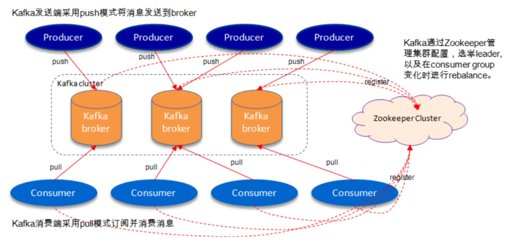
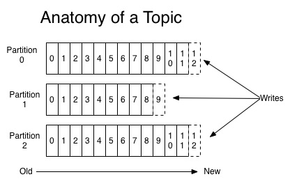
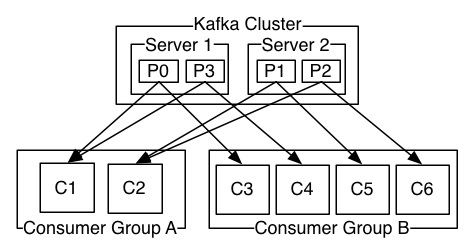

# 1. kafka概述以及安装

# 1.1 Kafka基本概念

kafka是一个分布式的，分区的消息(官方称之为commit log)服务。它提供一个消息系统应该具备的功能，但是确有着独特的设计。可以这样来说，Kafka借鉴了JMS规范的思想，但是确并没有完全遵循JMS规范。首先，让我们来看一下基础的消息(Message)相关术语：


:::tip Kafka中的基本概念
1. <font color='#aa2116'><strong>Broker 消息中间件处理节点</strong></font>，一个Kafka节点就是 一个broker，一个或者多个Broker可以组成一个Kafka集群 
2. <font color='#aa2116'><strong>Topic 主题</strong></font> Kafka根据topic对消息进行归类，发布到 Kafka集群的每条消息都需要指定一个topic 
3. <font color='#aa2116'><strong>Partition 分区</strong></font> 物理上的概念，一个topic可以分为多个 partition，每个partition内部消息是有序的
4. <font color='#aa2116'><strong>Producer 消息生产者</strong></font> 向Broker发送消息的客户端 Consumer 消息消费者，从Broker读取消息的客户端 
5. <font color='#aa2116'><strong>ConsumerGroup 消费者群组</strong></font> 每个Consumer属于一个特定的Consumer Group，一条消息可以被多个不同的 Consumer Group消费，但是一个 Consumer Group中只能有一个Consumer 能够消费该消息 
6. 批次
7. 偏移量
:::

因此，从一个较高的层面上来看，producer通过网络发送消息到Kafka集群，然后consumer来进行消费，如下图：

<a data-fancybox title="kafka" href="./image/kafka01.jpg"></a>

服务端(brokers)和客户端(producer、consumer)之间通信通过<font color='#d93a49'><strong>TCP协议</strong></font>来完成

### 1.1.1 主题Topic和消息日志Log

让我们首先深入理解Kafka提出一个高层次的抽象概念-Topic。 可以理解Topic是一个类别的名称，**同类消息发送到同一个Topic**下面。对于每一个Topic，下面可以有**多个分区 (Partition)日志文件**:

<a data-fancybox title="kafka" href="./image/kafka02.jpg"></a>


**Partition是一个有序的message序列**，这些message按顺序添加到一个叫做commit log的文件中。每个partition中的消息都有一个唯一的编号，**称之为offset，用来唯一标示某个分区中的message**。 

**提示**：每个partition，都对应一个commit log文件。一个partition中的message的offset都是唯一的，但是不同的 partition中的message的offset可能是相同的（**分区+offset唯一**）。

#### 可以这么来理解Topic，Partition和Broker 

一个topic，代表逻辑上的一个业务数据集，比如按数据库里不同表的数据操作消息区分放入不同topic，订单相关操作消 息放入订单topic，用户相关操作消息放入用户topic，对于大型网站来说，后端数据都是海量的，订单消息很可能是非常 巨量的，比如有几百个G甚至达到TB级别，如果把这么多数据都放在一台机器上可定会有容量限制问题，那么就可以在 **topic内部划分多个partition来分片存储数据，不同的partition可以位于不同的机器上，每台机器上都运行一个Kafka的进程Broker**

### 为什么要对Topic下数据进行分区存储？ 

1.  commit log文件会受到所在机器的文件系统大小的限制，分区之后，理论上一个topic可以处理任意数量的数据。 
2. 为了提高并行度

kafka集群，在配置的时间范围内，维护所有的由producer生成的消息，而不管这些消息有没有被消费。例如日志保留( log retention )时间被设置为2天。kafka会维护最近2天生产的所有消息，而2天前的消息会被丢弃。kafka的性能与保留 的数据量的大小没有关系，因此保存大量的数据(日志信息)不会有什么影响。

每个consumer是基于自己在commit log中的消费进度(offset)来进行工作的。在kafka中，消费offset由consumer自 己来维护；一般情况下我们按照顺序逐条消费commit log中的消息，当然我可以通过指定offset来重复消费某些消息， 或者跳过某些消息。 

这意味kafka中的consumer对集群的影响是非常小的，添加一个或者减少一个consumer，对于集群或者其他consumer 来说，都是没有影响的，因为每个consumer维护各自的offset。所以说kafka集群是无状态的，性能不会因为 consumer数量受太多影响。kafka还将很多关键信息记录在zookeeper里，保证自己的无状态，从而在水平扩容时非常方便。

### 1.1.2 分布式Distribution

log的partitions分布在kafka集群中不同的broker上，每个broker可以请求备份其他broker上partition上的数据。kafka 集群支持配置一个partition备份的数量。 

针对每个partition，都有一个broker起到“leader”的作用，0个或多个其他的broker作为“follwers”的作用。 

leader处理所有的针对这个partition的读写请求，而followers被动复制leader的结果。如果这个leader失效了，其中 的一个follower将会自动的变成新的leader。

### 1.1.3 Producers

生产者将消息发送到topic中去，同时负责选择将message发送到topic的哪一个partition中。通过round­robin做简单的 负载均衡。也可以根据消息中的某一个关键字来进行区分。通常第二种方式使用的更多。

### 1.1.4 Consumers

传统的消息传递模式有2种：**队列( queue) 和（publish-subscribe）** 

queue模式：多个consumer从服务器中读取数据，消息只会到达一个consumer。 

publish-subscribe模式：消息会被广播给所有的consumer。

Kafka基于这2种模式提供了一种consumer的抽象概念：**consumer group**。 

queue模式：所有的consumer都位于同一个consumer group 下。 
publish-subscribe模式：所有的consumer都有着自己唯一的consumer group。

<a data-fancybox title="kafka" href="./image/kafka03.jpg"></a>

上图说明：由2个broker组成的kafka集群，总共有4个partition(P0-P3)。这个集群由2个Consumer Group， A有2个consumer instances ，B有四个。 

通常一个topic会有几个consumer group，每个consumer group都是一个逻辑上的订阅者（ logical subscriber ）。每个consumer group由多个consumer instance组成，从而达到可扩展和容灾的功能。

### 1.1.5 消费顺序

Kafka比传统的消息系统有着更强的顺序保证。 一个partition同一个时刻在一个consumer group中只有一个consumer instance在消费，从而保证顺序。**consumer group中的consumer instance的数量不能比一个Topic中的partition的数量多**，**否则，多出来的 consumer消费不到消息**

## 1.2 kafka搭建与使用

### 1.2.1 安装前的环境准备

1. 由于Kafka是用Scala语言开发的，运行在JVM上，因此在安装Kafka之前需要先安装JDK。
```bash
#下载安装包然后执行该命令
rpm -ivh jdk-8u211-linux-x64.rpm
```
2. kafka依赖zookeeper，所以需要先安装zookeeper

```bash
## 获取不到，手工下载 
wget http://mirror.bit.edu.cn/apache/zookeeper/stable/zookeeper‐3.4.12.tar.gz 

tar ‐zxvf apache-zookeeper-3.6.3-bin.tar.gz

cd zookeeper‐3.6.3 

cp conf/zoo_sample.cfg conf/zoo.cfg 

# 启动zookeeper 
bin/zkServer.sh start 

bin/zkCli.sh 
#查看zk的根目录相关节点
ls / 
```
### 1.2.2 下载安装包并启动

```shell
## 下不了可以换一个比较新的版本，资源会好一点
wget https://archive.apache.org/dist/kafka/2.0.0/kafka_2.11-2.0.0.tgz
tar ‐xzf kafka_2.11-2.0.0.tgz 
cd kafka_2.11‐1.1.0
# 现在来启动kafka服务
cd bin
./kafka-server-start.sh  -daemon /root/kafka_2.11-2.0.0/config/server.properties

# 我们进入zookeeper目录通过zookeeper客户端查看下zookeeper的目录树 
/root/apache-zookeeper-3.6.3-bin/bin/zkCli.sh
#查看zk的根目录kafka相关节点  
ls / 
#查看kafka节点
ls /brokers/ids 
```

### 1.2.3 server.properties核心配置详解

:::tip server.properties核心配置详解
1. 每个broker都可以用一个唯一的非负整数id进行标识；这个id可以作为broker的“名字”，你可以选择任意你喜欢的数字作为id，只要id是 唯一的即可。
```
broker.id=0
```

2. kafka存放数据的路径。这个路径并不是唯一的，可以是多个，路径之间只需要使用逗号分隔即可；每当创建新partition时，都会选择在包含最少partitions的路径下进行
```
log.dirs=/tmp/kafka-logs
```
3. server接受客户端连接的端口
```
listeners=PLAINTEXT://:9092
```
4. zooKeeper连接字符串的格式为：hostname:port，此处hostname和port分别是ZooKeeper集群中某个节点的host和port；zookeeper 如果是集群，连接方式为 hostname1:port1, hostname2:port2,hostname3:port3
```
zookeeper.connect=localhost:2181
```
5. 每个日志文件删除之前保存的时间。默认数据保存时间对所有topic都一样。单位小时
```
log.retention.hours=168
```

6. 当producer设置acks为-1时，min.insync.replicas指定replicas的最小数目（必须确认每一个repica的写数据都是成功的），如果这个数 没有达到，producer发送消息会产生异常
```shell
min.insync.replicas=1
```
7. 是否允许删除主题
```shell
delete.topic.enable=false
```
:::

### 1.2.4 创建删除主题

#### 创建主题

现在我们来创建一个名字为“tqk001”的Topic，这个topic只有一个partition，并且备份因子也设置为1：

```shell
cd /root/kafka_2.11-2.0.0/bin
[root@YUN01 bin]# ./kafka-topics.sh --create --zookeeper 101.43.21.33:2181 --replication-factor 1 --partitions 1 --topic tqk001
Created topic "tqk001".
```
现在我们可以通过以下命令来查看kafka中目前存在的topic

```shell
[root@YUN01 bin]# ./kafka-topics.sh --list --zookeeper 101.43.21.33:2181
tqk001

```
除了我们通过手工的方式创建Topic，当producer发布一个消息到某个指定的Topic，**这个Topic如果不存在，就自动创建**。

#### 删除主题

```shell
[root@YUN01 bin]# ./kafka-topics.sh --delete --topic tqk001 --zookeeper 101.43.21.33:2181
Topic tqk001 is marked for deletion.
Note: This will have no impact if delete.topic.enable is not set to true.
# 再次查看已不存在
[root@YUN01 bin]# ./kafka-topics.sh --list --zookeeper 101.43.21.33:2181
[root@YUN01 bin]# 
```

### 1.2.5 发送消费消息

#### 发送消息
kafka自带了一个producer命令客户端，可以从本地文件中读取内容，或者我们也可以以命令行中直接输入内容，并将这 些内容以消息的形式发送到kafka集群中。在默认情况下，每一个行会被当做成一个独立的消息。 首先我们要运行发布消息的脚本，然后在命令中输入要发送的消息的内容：

```sh
[root@YUN01 bin]# ./kafka-console-producer.sh  --broker-list 101.43.21.33:9092 --topic tqk001
>this is a msg
>this is a other msg
```

#### 消费消息
对于consumer，kafka同样也携带了一个命令行客户端，会将获取到内容在命令中进行输出，***默认是消费最新的消息***
```sh
[root@YUN01 bin]# ./kafka-console-consumer.sh --bootstrap-server 101.43.21.33:9092 --consumer-property  group.id=testGroup --topic tqk001
thi
my name is tqk
```

**如果想要消费之前的消息可以通过--from-beginning参数指定**，如下命令：
```sh
[root@YUN01 bin]# ./kafka-console-consumer.sh --bootstrap-server 101.43.21.33:9092  --from-beginning --topic tqk001
this i
this is a other msg
thi
my name is tqk
```

#### 查看组名
```sh
[root@YUN01 bin]# ./kafka-consumer-groups.sh --bootstrap-server 101.43.21.33:9092  --list
console-consumer-73860
testGroup
console-consumer-46311

```
#### 查看消费者的消费偏移量
```sh
[root@YUN01 bin]# ./kafka-consumer-groups.sh --bootstrap-server 101.43.21.33:9092 --describe --group testGroup

TOPIC           PARTITION  CURRENT-OFFSET  LOG-END-OFFSET  LAG             CONSUMER-ID                                     HOST            CLIENT-ID
tqk001          0          6               6               0               consumer-1-2c58d09e-dcbb-407b-a29f-92e1b8fd86df /10.0.16.5      consumer-1

```
#### 消费多主题
```sh
[root@YUN01 bin]# ./kafka-console-consumer.sh --bootstrap-server 101.43.21.33:9092  --whitelist "tqk001|test"

```
#### 单播消费
一条消息只能被某一个消费者消费的模式，类似queue模式，只需让所有消费者在同一个消费组里即可 分别在两个客户端执行如下消费命令，然后往主题里发送消息，结果只有一个客户端能收到消息
```sh
[root@YUN01 bin]# ./kafka-console-consumer.sh --bootstrap-server 101.43.21.33:9092 --consumer-property  group.id=testGroup --topic tqk001
```
#### 多播消费

一条消息能被多个消费者消费的模式，类似publish-subscribe模式费，针对Kafka同一条消息只能被同一个消费组下的某一个消费者消费的特性，要实现多播只要保证这些消费者属于不同的消费组即可。我们再增加一个消费者，该消费者属于testGroup-2消费 组，结果两个客户端都能收到消息

```sh
[root@YUN01 bin]# ./kafka-console-consumer.sh --bootstrap-server 101.43.21.33:9092 --consumer-property  group.id=testGroup2 --topic tqk001
```

## 1.3 kafka集群搭建与使用
到目前为止，我们都是在一个单节点上运行broker，这并没有什么意思。对于kafka来说，一个单独的broker意味着 kafka集群中只有一个节点。要想增加kafka集群中的节点数量，只需要多启动几个broker实例即可。为了有更好的理解，现在我们在一台机器上同时启动三个broker实例。

**Broker 如何加入 Kafka 集群非常简单，只需要两个参数。**  
第一、配置 zookeeper.connect   
第二、为新增的 broker 设置一个集群内的唯一性id(**broker.id**)。 Kafka 中的集群是可以动态扩容的。  

### 1.3.1 kafka集群配置

**模拟单个服务器搭建多个borker**
首先，我们需要建立好其他2个broker的配置文件：
```cpp
cp config/server.properties config/server‐1.properties 
cp config/server.properties config/server‐2.properties
```
**配置文件的内容分别如下：**

-----------------------------------

**config/server-1.properties:**

```shell
# borker的编号,如果集群中有多个,则每个borker需设置不同的编号
broker.id=2

#broker对外提供服务入口的端口(默认9092)
listeners=PLAINTEXT://:29092

#存放消息日志文件地址
log.dirs=/tmp/kafka/kafkaData-2/kafka-logs

# kafka所需zookeeper集群地址
zookeeper.connect=localhost:2181
```

------------------------------------

**config/server-2.properties:**

```shell
# borker的编号,如果集群中有多个,则每个borker需设置不同的编号
broker.id=3

#broker对外提供服务入口的端口(默认9092)
listeners=PLAINTEXT://:39092

#存放消息日志文件地址
log.dirs=/tmp/kafkaData-3/kafka-logs

# kafka所需zookeeper集群地址
zookeeper.connect=localhost:2181

```
------------------------------------

#### 目前我们已经有一个zookeeper实例和一个broker实例在运行了，现在我们只需要在启动2个broker实例即可：
```shell
cd bin
./kafka-server-start.sh  -daemon /root/kafka_2.11-2.0.0/config/server-1.properties &
./kafka-server-start.sh  -daemon /root/kafka_2.11-2.0.0/config/server-2.properties &
# 查看是否启动成功
[root@YUN01 bin]# jps -m
25202 Kafka /root/kafka_2.11-2.0.0/config/server-2.properties
22723 Kafka /root/kafka_2.11-2.0.0/config/server-1.properties
3060 Kafka /root/kafka_2.11-2.0.0/config/server.properties

```

#### 现在我们创建一个新的topic，副本数设置为3，分区数设置为2:**

```cpp
[root@YUN01 bin]# ./kafka-topics.sh --create --zookeeper 101.43.21.33:2181 --replication-factor 3 --partitions 2 --topic tqkjiqun
Created topic "tqkjiqun".
```
#### 查看下topic的情况

```shell
[root@YUN01 bin]#  ./kafka-topics.sh  --zookeeper 101.43.21.33:2181 --topic tqkjiqun --describe
Topic:tqkjiqun	PartitionCount:2	ReplicationFactor:3	Configs:
	Topic: tqkjiqun	Partition: 0	Leader: 3	Replicas: 3,0,2	Isr: 3,0,2
	Topic: tqkjiqun	Partition: 1	Leader: 0	Replicas: 0,2,3	Isr: 0,2,3

```
以下是输出内容的解释，第一行是所有分区的概要信息，之后的每一行表示每一个partition的信息。 

1. leader节点负责给定partition的所有读写请求。 
2. replicas 表示某个partition在哪几个broker上存在备份。不管这个几点是不是”leader“，甚至这个节点挂了，也会列出。
3. isr 是replicas的一个子集，它只列出当前还存活着的，并且已同步备份了该partition的节点。


我们可以运行相同的命令查看之前创建的名称为”tqk001“的topic

```shell
[root@YUN01 bin]#  ./kafka-topics.sh  --zookeeper 101.43.21.33:2181 --topic tqk001 --describe
Topic:tqk001	PartitionCount:1	ReplicationFactor:1	Configs:
	Topic: tqk001	Partition: 0	Leader: 0	Replicas: 0	Isr: 0

```
之前设置了topic的partition数量为1，备份因子为1，因此显示就如上所示了。当然我们也可以通过如下**命令增加topic 的分区数量(目前kafka不支持减少分区)：**

```shell
[root@YUN01 bin]# ./kafka-topics.sh  --alter --partitions 3 --zookeeper 101.43.21.33:2181 --topic tqk001
WARNING: If partitions are increased for a topic that has a key, the partition logic or ordering of the messages will be affected
Adding partitions succeeded!
[root@YUN01 bin]#  ./kafka-topics.sh  --zookeeper 101.43.21.33:2181 --topic tqk001 --describe
Topic:tqk001	PartitionCount:3	ReplicationFactor:1	Configs:
	Topic: tqk001	Partition: 0	Leader: 0	Replicas: 0	Isr: 0
	Topic: tqk001	Partition: 1	Leader: 2	Replicas: 2	Isr: 2
	Topic: tqk001	Partition: 2	Leader: 3	Replicas: 3	Isr: 3

```

#### 现在我们向新建的 my-replicated-topic 中发送一些message，kafka集群可以加上所有kafka节点：
```shell
[root@YUN01 bin]#  ./kafka-console-producer.sh --broker-list  101.43.21.33:9092,101.43.21.33:29092,101.43.21.33:39092 --topic tqkjiqun
>this is jiqun

```
#### 现在开始消费：

```shell
[root@YUN01 bin]#  ./kafka-console-consumer.sh --bootstrap-server 101.43.21.33:9092 --consumer-property  group.id=testGroup --topic tqkjiqun
this is jiqun
```

