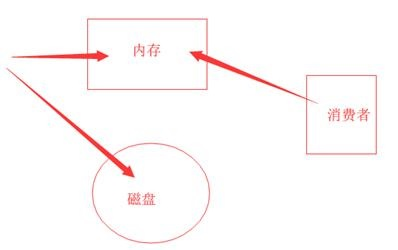

# 2. kafka配置再说明
[[toc]]
## 2.1 Broker常规配置

### 2.1.1 broker.id 

在单机时无需修改，但在集群下部署时往往需要修改。它是个每一个 broker 在集群中的唯一表示，要求是正数。当该服务器的 IP 地址发生改变时， broker.id 没有变化，则不会影响 consumers 的消息情况 

### 2.1.2 listeners 

监听列表(以逗号分隔 不同的协议(如 plaintext,trace,ssl、不同的 IP 和端口)),hostname 如果设置为 0.0.0.0 则绑定所有的网卡地址；如果 hostname 为空 则绑定默认的网卡。如果 没有配置则默认为 java.net.InetAddress.getCanonicalHostName()。 如：PLAINTEXT://myhost:9092,TRACE://:9091 或 PLAINTEXT://0.0.0.0:9092,

### 2.1.3 advertised.listeners
注意要开启borker远程访问必须配置  advertised.listeners=PLAINTEXT://101.43.21.33:9092

### 2.1.4 zookeeper.connect 

zookeeper 集群的地址，可以是多个，多个之间用逗号分割。（一组 hostname:port/path 列表,hostname 是 zk 的机器名或 IP、port 是 zk 的端口、/path 是可选 zk 的路径，如果不指定，默认使用根路径）

### 2.1.5 log.dirs 

Kafka 把所有的消息都保存在磁盘上，存放这些数据的目录通过 log.dirs 指定。**可以使用多路径，使用逗号分隔**。如果是多路径，Kafka 会根据“最少使用”原则，把同一个分区的日志片段保存到同一路径下。会往拥有最少数据分区的路径新增分区。 

### 2.1.6 num.recovery.threads.per.data.dir 

每数据目录用于日志恢复启动和关闭时的线程数量。因为这些线程只是服务器启动（正常启动和崩溃后重启）和关闭时会用到。所以完全可以设置 大量的线程来达到并行操作的目的。注意，这个参数指的是每个日志目录的线程数，比如本参数设置为 8，而 log.dirs 设置为了三个路径，则总共会启动 24 个线程。 

### 2.1.7 auto.create.topics.enable 

是否允许自动创建主题。如果设为 true，那么 produce（生产者往主题写消息），consume（消费者从主题读消息）或者 fetch metadata（任意客户端 向主题发送元数据请求时）一个不存在的主题时，就会自动创建。缺省为 true。 

### 2.1.8 delete.topic.enable=true 

删除主题配置，默认未开启

## 2.2 Broker主题配置

### 2.2.1 num.partitions 

每个新建主题的分区个数（分区个数只能增加，不能减少 ）。这个参数一般要评估，比如，每秒钟要写入和读取 1000M 数据，如果现在每个消费者 每秒钟可以处理 50MB 的数据，那么需要 20 个分区，这样就可以让 20 个消费者同时读取这些分区，从而达到设计目标。（一般经验，把分区大小限制在 25G 之内比较理想） 

### 2.2.2 log.retention.hours 

日志保存时间，默认为 7 天（168 小时）。超过这个时间会清理数据。bytes 和 minutes 无论哪个先达到都会触发。与此类似还有 log.retention.minutes 和 log.retention.ms，都设置的话，优先使用具有最小值的那个。（提示：时间保留数据是通过检查磁盘上日志片段文件的最后修改时间来实现的。也就 是最后修改时间是指日志片段的关闭时间，也就是文件里最后一个消息的时间戳） 

### 2.2.3 log.retention.bytes 

topic 每个分区的最大文件大小，一个 topic 的大小限制 = 分区数*log.retention.bytes。-1 没有大小限制。log.retention.bytes 和 log.retention.minutes 任意一个达到要求，都会执行删除。(注意如果是 log.retention.bytes 先达到了，则是删除多出来的部分数据)，一般不推荐使用最大文件删除策略，而是推 荐使用文件过期删除策略。 

### 2.2.4 log.segment.bytes 

分区的日志存放在某个目录下诸多文件中，这些文件将分区的日志切分成一段一段的，我们称为日志片段。这个属性就是每个文件的最大尺寸；当 尺寸达到这个数值时，就会关闭当前文件，并创建新文件。被关闭的文件就开始等待过期。默认为 1G。 如果一个主题每天只接受 100MB 的消息，那么根据默认设置，需要 10 天才能填满一个文件。而且因为日志片段在关闭之前，消息是不会过期的，所 以如果 log.retention.hours 保持默认值的话，那么这个日志片段需要 17 天才过期。因为关闭日志片段需要 10 天，等待过期又需要 7 天。

### 2.2.5 log.segment.ms 

作用和 log.segment.bytes 类似，只不过判断依据是时间。同样的，两个参数，以先到的为准。这个参数默认是不开启的。 

### 2.2.6 message.max.bytes 

表示一个服务器能够接收处理的消息的最大字节数，注意这个值 producer 和 consumer 必须设置一致，且不要大于 fetch.message.max.bytes 属性的值 (消费者能读取的最大消息,这个值应该大于或等于 message.max.bytes)。该值默认是 1000000 字节，大概 900KB~1MB。如果启动压缩，判断压缩后的值。 这个值的大小对性能影响很大，值越大，网络和 IO 的时间越长，还会增加磁盘写入的大小。 

Kafka 设计的初衷是迅速处理短小的消息，一般 10K 大小的消息吞吐性能最好（LinkedIn 的 kafka 性能测试）

## 2.3 硬件配置对 Kafka 性能的影响

为 Kafka 选择合适的硬件更像是一门艺术，就跟它的名字一样，我们分别从磁盘、内存、网络和 CPU 上来分析，确定了这些关注点，就可以在预算范围之内选择最优的硬件配置。

### 2.3.1 磁盘吞吐量/磁盘容量 

磁盘吞吐量（IOPS 每秒的读写次数）会影响生产者的性能。因为生产者的消息必须被提交到服务器保存，大多数的客户端都会一直等待，直到至少有一个服务器确认消息已经成功提交为止。也就是说，磁盘写入速度越快，生成消息的延迟就越低。（SSD 固态贵单个速度快，HDD 机械偏移可以多买几 个，设置多个目录加快速度，具体情况具体分析） 

磁盘容量的大小，则主要看需要保存的消息数量。如果每天收到 1TB 的数据，并保留 7 天，那么磁盘就需要 7TB 的数据。 

### 2.3.2 内存

Kafka 本身并不需要太大内存，内存则主要是影响消费者性能。在大多数业务情况下，消费者消费的数据一般会从内存（页面缓存，从系统内存中分） 中获取，这比在磁盘上读取肯定要快的多。一般来说运行 Kafka 的 JVM 不需要太多的内存，剩余的系统内存可以作为页面缓存，或者用来缓存正在使用的日志片段，所以我们一般 Kafka 不会同其他的重要应用系统部署在一台服务器上，因为他们需要共享页面缓存，这个会降低 Kafka 消费者的性能。

### 2.3.3 网络

**网络吞吐量决定了 Kafka 能够处理的最大数据流量**。它和磁盘是制约 Kafka 拓展规模的主要因素。对于生产者、消费者写入数据和读取数据都要瓜分网络流量。同时做集群复制也非常消耗网络。 

### 2.3.4 CPU

Kafka 对 cpu 的要求不高，主要是用在对消息解压和压缩上。所以 cpu 的性能不是在使用 Kafka 的首要考虑因素。 

### 2.3.5 总结

我们要为 Kafka 选择合适的硬件时，优先考虑存储，包括存储的大小，然后考虑生产者的性能（也就是磁盘的吞吐量），选好存储以后，再来选择 CPU 和内存就容易得多。

网络的选择要根据业务上的情况来定，也是非常重要的一环。