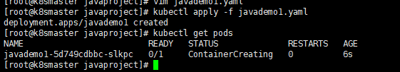
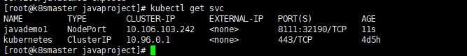

# 16. K8s容器交付

如何在k8s集群中部署Java项目

## 16.1 容器交付流程

- 开发代码阶段
  - 编写代码
  - 编写Dockerfile【打镜像做准备】
- 持续交付/集成
  - 代码编译打包
  - 制作镜像
  - 上传镜像仓库
- 应用部署
  - 环境准备
  - Pod
  - Service
  - Ingress
- 运维
  - 监控
  - 故障排查
  - 应用升级

## 16.2 k8s部署Java项目流程

- 制作镜像【Dockerfile】
- 上传到镜像仓库【Dockerhub、阿里云、网易】
- 控制器部署镜像【Deployment】
- 对外暴露应用【Service、Ingress】
- 运维【监控、升级】

## 16.3 k8s部署Java项目

### 16.3.1 准备Java项目

第一步，准备java项目，把java进行打包【jar包或者war包】

:::tip maven命令
1. **打包**：mvn package
2. **编译**：mvn compile
3. **清空**：mvn clean（清除编译后目录，默认是target目录）
4. **运行测试**：mvn test
5. **安装jar包到本地仓库中**：mvn install
6. **跳过测试**：mvn xxx -DskipTests
:::


### 16.3.2 依赖环境

在打包java项目的时候，我们首先需要两个环境

- java环境【JDK】
- maven环境

然后把java项目打包成jar包

```bash
# 项目目录下执行该命令
mvn clean install
# 或者
mvn package
```

- 在 target 目录下，我们会发现编译生成的 class 文件


### 16.3.3 编写Dockerfile文件

Dockerfile 内容如下所示

```bash
FROM openjdk:8-jdk-alpine
VOLUME /tmp
ADD ./target/demojenkins.jar demojenkins.jar
ENTRYPOINT ["java","-jar","/demojenkins.jar", "&"]
```

### 16.3.4 制作镜像

- 在我们创建好Dockerfile文件后，我们就可以制作镜像了

- 我们首先将我们的项目，放到我们的服务器上
```bash
[root@master1 mydocker]# pwd
/root/mydocker
[root@master1 mydocker]# ls -lrt
总用量 192400
-rw-r--r-- 1 root root 179439263 7月   7 2019 jdk-8u211-linux-x64.rpm
-rw-r--r-- 1 root root  17566601 12月 20 14:09 demojenkins.jar
-rw-r--r-- 1 root root       127 12月 20 14:29 Dockerfile
-rw-r--r-- 1 root root       452 12月 20 16:01 tqkdemo1.yaml
```

- 然后执行下面命令打包镜像

```bash
docker build -t tqk-demo:latest .
```
- 等待一段后，即可制作完成我们的镜像
```bash
[root@master1 mydocker]# docker build -t tqk-demo:latest .
Sending build context to Docker daemon    197MB
Step 1/4 : FROM openjdk:8-jdk-alpine
 ---> a3562aa0b991
Step 2/4 : VOLUME /tmp
 ---> Using cache
 ---> 8927f70ce46e
Step 3/4 : ADD ./demojenkins.jar demojenkins.jar
 ---> Using cache
 ---> 9490c96665a9
Step 4/4 : ENTRYPOINT ["java","-jar","/demojenkins.jar", "&"]
 ---> Using cache
 ---> 66f324da7999
Successfully built 66f324da7999
Successfully tagged tqk-demo:latest

#---最后通过下面命令，即可查看我们的镜像了----------------------------
[root@master1 mydocker]# docker images
REPOSITORY                                                        TAG                 IMAGE ID            CREATED             SIZE
tqk-demo                                                          latest              66f324da7999        56 minutes ago      122MB


```
<!-- 
 -->


### 16.3.5 启动镜像

- 在我们制作完成镜像后，我们就可以启动我们的镜像了

```bash
docker run -d -p 8111:8111 tqk-demo:latest -t
```

- 启动完成后，我们通过浏览器进行访问，即可看到我们的java程序

```bash
http://192.168.222.10:8111/user
```


### 16.3.6 推送镜像

- 下面我们需要将我们制作好的镜像，上传到镜像服务器中【阿里云、DockerHub】

首先我们需要到 阿里云 [容器镜像服务](https://cr.console.aliyun.com/cn-hangzhou/instances/repositories)，然后开始创建镜像仓库


- 然后选择本地仓库


- 我们点击我们刚刚创建的镜像仓库，就能看到以下的信息


#### 登录镜像服务器


<font color='red'>注意自己注册的城市--registry.cn-hangzhou.aliyuncs.com</font>

```bash
[root@master1 mydocker]# docker images
REPOSITORY                                                        TAG                 IMAGE ID            CREATED             SIZE
tqk-demo                                                          latest              66f324da7999        56 minutes ago      122MB

#### 登录镜像服务器
$ docker login --username=田起凯 registry.cn-hangzhou.aliyuncs.com

#### 镜像添加版本号
$ docker tag [ImageId] registry.cn-hangzhou.aliyuncs.com/tqk-space/tqk-demo:[镜像版本号]
#### 推送镜像
$ docker push registry.cn-hangzhou.aliyuncs.com/tqk-space/tqk-demo:[镜像版本号]

# 举例

#### 登录镜像服务器

[root@master1 mydocker]# docker login --username=田起凯 registry.cn-hangzhou.aliyuncs.com
Password: 
WARNING! Your password will be stored unencrypted in /root/.docker/config.json.
Configure a credential helper to remove this warning. See
https://docs.docker.com/engine/reference/commandline/login/#credentials-store

Login Succeeded
#### 镜像添加版本号
[root@master1 mydocker]# docker tag 66f324da7999 registry.cn-hangzhou.aliyuncs.com/tqk-space/tqk-demo:1.0.0
#### 推送镜像
[root@master1 mydocker]# docker push registry.cn-hangzhou.aliyuncs.com/tqk-space/tqk-demo:1.0.0
The push refers to repository [registry.cn-hangzhou.aliyuncs.com/tqk-space/tqk-demo]
468e6bbec318: Pushed 
ceaf9e1ebef5: Pushed 
9b9b7f3d56a0: Pushed 
f1b5933fe4b5: Pushed 
1.0.0: digest: sha256:45915e83f95f3277cc416e7ad931e9b2a8ded14fa1d17ccebebac71c1d16bb6f size: 1159

```

- 操作完成后


### 16.3.7 控制器部署镜像

在我们推送镜像到服务器后，就可以通过控制器部署镜像了

首先我们需要根据刚刚的镜像，导出yaml

```bash
# 导出yaml
[root@master1 mydocker]# kubectl create deployment  tqkdemo1 --image=registry.cn-hangzhou.aliyuncs.com/tqk-space/tqk-demo:1.0.0 --dry-run -o yaml > tqkdemo1.yaml
W1220 15:49:20.300858   58026 helpers.go:535] --dry-run is deprecated and can be replaced with --dry-run=client.

```

- 导出后的 tqkdemo1.yaml 如下所示

```bash
apiVersion: apps/v1
kind: Deployment
metadata:
  creationTimestamp: null
  labels:
    app: tqkdemo1
  name: tqkdemo1
spec:
  replicas: 1
  selector:
    matchLabels:
      app: tqkdemo1
  strategy: {}
  template:
    metadata:
      creationTimestamp: null
      labels:
        app: tqkdemo1
    spec:
      containers:
      - image: registry.cn-hangzhou.aliyuncs.com/tqk-space/tqk-demo:1.0.0
        name: tqk-demo
        resources: {}
status: {}

```

- 然后通过下面命令，通过yaml创建我们的deployment

```bash
# 创建
[root@master1 mydocker]# kubectl apply -f tqkdemo1.yaml
deployment.apps/tqkdemo1 created
# 查看 pods
[root@master1 mydocker]# kubectl get pods
NAME                          READY   STATUS    RESTARTS   AGE
nginx-dep1-58b7bf955f-gz67j   1/1     Running   0          4h30m
nginx-dep1-58b7bf955f-nfmfk   1/1     Running   0          4h30m
nginx-dep1-58b7bf955f-s2xdh   1/1     Running   0          4h30m
nginx-f89759699-c24zc         1/1     Running   0          6h32m
tqkdemo1-d4bcf9475-k9w6m      1/1     Running   0          44s
```
<!-- 
 -->

- 或者我们可以进行扩容，多创建几个副本

```bash
kubectl scale deployment tqkdemo1 --replicas=3
```

<!--  -->

- 然后我们还需要对外暴露端口【通过service 或者 Ingress】

```bash
# 对外暴露端口
kubectl expose deployment tqkdemo1 --port=8111  --target-port=8111 --type=NodePort
# 查看对外端口号
kubectl get svc

[root@master1 mydocker]# kubectl expose deployment tqkdemo1 --port=8111  --target-port=8111 --type=NodePort
service/tqkdemo1 exposed
[root@master1 mydocker]# kubectl get svc
NAME         TYPE        CLUSTER-IP     EXTERNAL-IP   PORT(S)          AGE
kubernetes   ClusterIP   10.1.0.1       <none>        443/TCP          7h13m
nginx        NodePort    10.1.101.161   <none>        80:30974/TCP     6h36m
tqkdemo1     NodePort    10.1.203.178   <none>        8111:31654/TCP   7s

```

<!--  -->

- 然后通过下面的地址访问

```bash
# 对内访问
[root@localhost ~]# curl http://10.1.203.178:8111/user
hello

# 对外访问
http://192.168.222.10:31654/user
```

### 16.3.8 运维

....