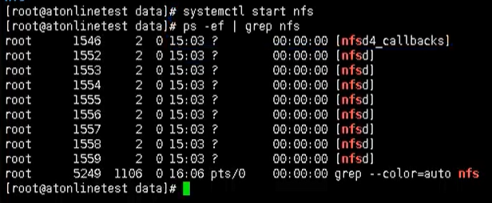
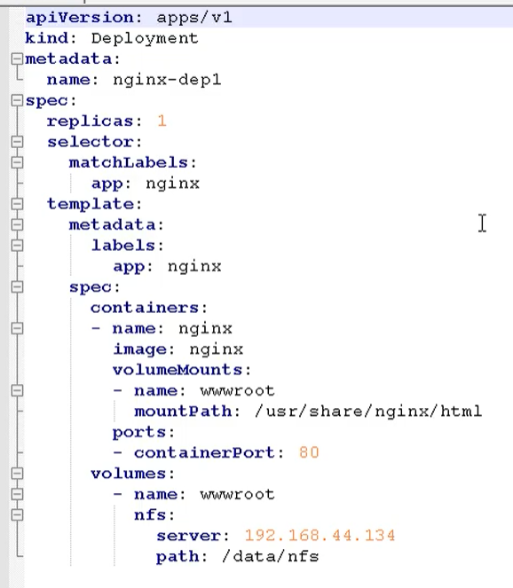
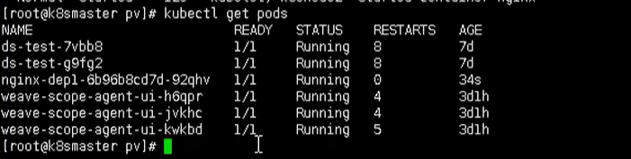
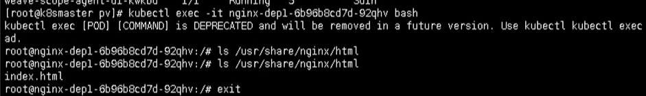
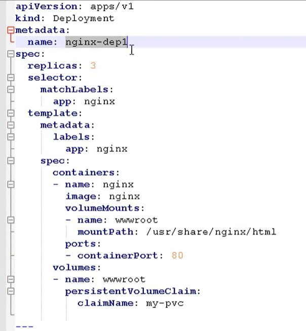
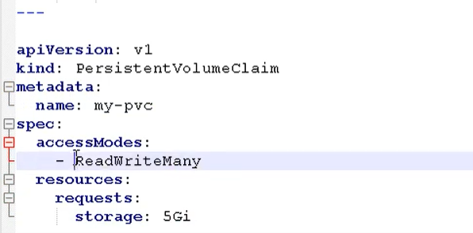
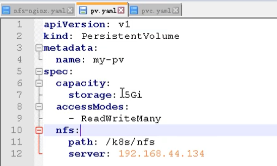

# 13. K8s持久化存储

## 13.1 前言

之前我们有提到数据卷：`emptydir` ，是本地存储，pod重启，数据就不存在了，需要对数据持久化存储

对于数据持久化存储【pod重启，数据还存在】，有两种方式

- nfs：网络存储【通过一台服务器来存储】

## 13.2 安装步骤

### 13.2.1 持久化服务器安装

- 找一台新的服务器nfs服务端，安装nfs
- 设置挂载路径

- 使用命令安装nfs

```bash
yum install -y nfs-utils
```

- 首先创建存放数据的目录

```bash
mkdir -p /data/nfs
```

- 设置挂载路径

```bash
# 打开文件
vim /etc/exports
# 添加如下内容
/data/nfs *(rw,no_root_squash)
```
#### 启动nfs服务端

下面我们回到**nfs服务端**，启动我们的nfs服务

```bash
# 启动服务
systemctl start rpcbind && systemctl enable rpcbind
systemctl start nfs && systemctl enable nfs

# ------实际操作
[root@localhost ~]# systemctl status nfs
● nfs-server.service - NFS server and services
   Loaded: loaded (/usr/lib/systemd/system/nfs-server.service; enabled; vendor preset: disabled)
  Drop-In: /run/systemd/generator/nfs-server.service.d
           └─order-with-mounts.conf
   Active: active (exited) since 一 2021-12-20 10:04:25 CST; 1min 46s ago
 Main PID: 7419 (code=exited, status=0/SUCCESS)
   CGroup: /system.slice/nfs-server.service

12月 20 10:04:25 localhost.localdomain systemd[1]: Starting NFS server and services...
12月 20 10:04:25 localhost.localdomain systemd[1]: Started NFS server and services.

```



执行完成后，即部署完我们的持久化服务器

### 13.2.2 Node节点上操作

然后需要在k8s集群**node节点上安装nfs**，这里需要在 **node1 和 node2节点**上安装

```bash
yum install -y nfs-utils
```

执行完成后，会自动帮我们挂载上
--------------------

- 每个node查询NFS服务器,检查是否挂载成功

```bash
showmount -e nfs-ip
# ---------------------
[root@localhost ~]# showmount -e 192.168.222.6
Export list for 192.168.222.6:
/data/nfs *
```

### 13.2.3 K8s集群部署应用

- 最后我们在k8s集群**master**上部署应用，使用nfs持久化存储

```bash
# 创建一个pv文件
mkdir pv
# 进入
cd pv
```

- 然后创建一个yaml文件  `nfs-nginx.yaml`
```yaml
cat >/root/pv/nfs-nginx.yaml<<EOF
apiVersion: apps/v1
kind: Deployment
metadata:
  name: nginx-dep1
spec:
  replicas: 1
  selector:
    matchLabels:
      app: nginx
  template:
    metadata:
      labels:
        app: nginx
    spec:
      containers:
      - name: nginx
        image: nginx
        volumeMounts:
        - name: wwwroot
          mountPath: /usr/share/nginx/html
        ports:
        - containerPort: 80
      volumes:
        - name: wwwroot
          nfs:
            server: 192.168.222.6
            path: /data/nfs
EOF
```


通过这个方式，就挂载到了刚刚我们的nfs数据节点下的 /data/nfs 目录

最后就变成了：  /usr/share/nginx/html    ->  192.168.44.134/data/nfs   内容是对应的

- 我们通过这个 yaml文件，创建一个pod

```bash
kubectl apply -f nfs-nginx.yaml
```

- 创建完成后，我们也可以查看日志

```bash
kubectl describe pod nginx-dep1
```

```log
  Type    Reason     Age        From               Message
  ----    ------     ----       ----               -------
  Normal  Scheduled  <unknown>  default-scheduler  Successfully assigned default/nginx-dep1-dbd9d8594-4mgns to node1
  Normal  Pulling    23s        kubelet, node1     Pulling image "nginx"
  Normal  Pulled     6s         kubelet, node1     Successfully pulled image "nginx"
  Normal  Created    6s         kubelet, node1     Created container nginx
  Normal  Started    6s         kubelet, node1     Started container nginx
```


可以看到，我们的pod已经成功创建出来了，同时下图也是出于Running状态



### 13.2.4 测试

下面我们就可以进行测试了，比如现在nfs服务节点上添加数据，然后在看数据是否存在 pod中

```bash
# 进入pod中查看
kubectl exec -it nginx-dep1-dbd9d8594-4mgns bash

root@nginx-dep1-dbd9d8594-4mgns:/# cd /usr/share/nginx/html
root@nginx-dep1-dbd9d8594-4mgns:/usr/share/nginx/html# ls -lrt
total 0
# nfs服务器上创建一个文件index.html 再次查看
# [root@localhost nfs]# pwd
# /data/nfs
# [root@localhost nfs]# vi index.html

root@nginx-dep1-dbd9d8594-4mgns:/usr/share/nginx/html# ls
index.html
```


## 13.3 PV和PVC

对于上述的方式，我们都知道，我们的ip 和端口是直接放在我们的容器上的，这样管理起来可能不方便


所以这里就需要用到 pv  和 pvc的概念了，方便我们配置和管理我们的 ip 地址等元信息

PV：持久化存储，对存储的资源进行抽象，对外提供可以调用的地方【生产者】

PVC：用于调用，不需要关心内部实现细节【消费者】

PV 和 PVC 使得 K8S 集群具备了存储的逻辑抽象能力。使得在配置Pod的逻辑里可以忽略对实际后台存储
技术的配置，而把这项配置的工作交给PV的配置者，即集群的管理者。存储的PV和PVC的这种关系，跟
计算的Node和Pod的关系是非常类似的；PV和Node是资源的提供者，根据集群的基础设施变化而变
化，由K8s集群管理员配置；而PVC和Pod是资源的使用者，根据业务服务的需求变化而变化，由K8s集
群的使用者即服务的管理员来配置。

### 13.3.1 实现流程

- PVC绑定PV
- 定义PVC
- 定义PV【数据卷定义，指定数据存储服务器的ip、路径、容量和匹配模式】

### 13.3.2 举例

创建一个 pvc.yaml



第一部分是定义一个 deployment，做一个部署

- 副本数：3
- 挂载路径
- 调用：是通过pvc的模式

然后定义pvc



然后在创建一个 `pv.yaml`



然后就可以创建pod了

```bash
kubectl apply -f pv.yaml
```

然后我们就可以通过下面命令，查看我们的 pv  和 pvc之间的绑定关系

```bash
kubectl get pv, pvc
```


到这里为止，我们就完成了我们 pv 和 pvc的绑定操作，通过之前的方式，进入pod中查看内容

```bash
kubect exec -it nginx-dep1 bash
```

然后查看  /usr/share/nginx.html


也同样能看到刚刚的内容，其实这种操作和之前我们的nfs是一样的，只是多了一层pvc绑定pv的操作


## 13.4 安装部署问题

### 13.4.1 在客户端尝试查询NFS服务器可挂载目录不通

```bash
[root@localhost ~]# showmount -e 192.168.222.6
clnt_create: RPC: Port mapper failure - Unable to receive: errno 113 (No route to host)
[root@localhost ~]# showmount -e 192.168.222.6
rpc mount export: RPC: Unable to receive; errno = No route to host
[root@localhost ~]# showmount -e 192.168.222.6
Export list for 192.168.222.6:
/data/nfs *
```
- 得到错误提示为

> clnt_create: RPC: Port mapper failure - Unable to receive: errno 113 (No route to host)


- 寻思是服务器防火墙导致的使用

> firewall-cmd --get-service | grep -E (nfs|rpc)
- 查询发现有相关服务nfs和rpc-bind 故在防火墙对服务予以放行

```bash
firewall-cmd --add-service=nfs
firewall-cmd --add-service=rpc-bind
```
- 在客户端再次尝试showmount命令得到不一样的错误提示

> rpc mount export: RPC: Unable to receive; errno = No route to host

网上搜了下关键字"RPC: Unable to receive firewalld"
发现有文章描述NFS服务依赖服务有
```
portmap
nfsd
mountd
```
再使用firewall-cmd --get-service查询到预设服务中有mountd
在防火墙对其放行
> firewall-cmd --add-service=mountd
#### 或者直接关闭防火墙

```
systemctl stop firewalld
systemctl disable firewalld
```
————————————————————————————————————————————————————————————
