# 12. K8s核心技术Helm

Helm就是一个包管理工具【类似于npm】

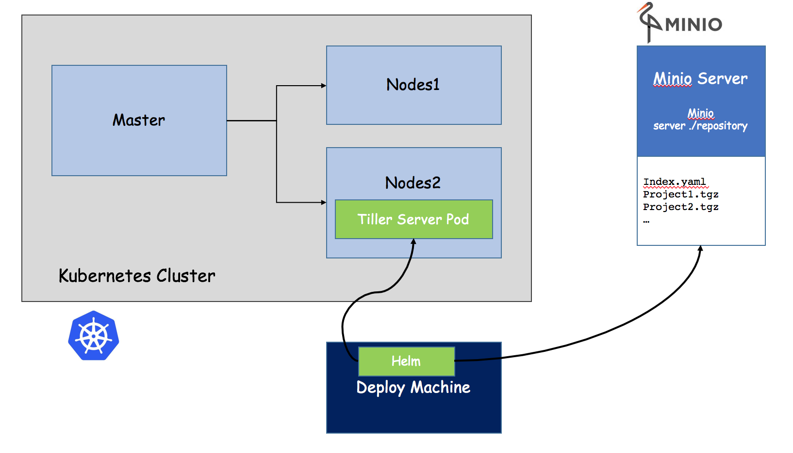

## 12.1 为什么引入Helm

首先在原来项目中都是基于yaml文件来进行部署发布的，而目前项目大部分微服务化或者模块化，会分成很多个组件来部署，每个组件可能对应一个deployment.yaml,一个service.yaml,一个Ingress.yaml还可能存在各种依赖关系，这样一个项目如果有5个组件，很可能就有15个不同的yaml文件，这些yaml分散存放，如果某天进行项目恢复的话，很难知道部署顺序，依赖关系等，而所有这些包括

- 基于yaml配置的集中存放
- 基于项目的打包
- 组件间的依赖

但是这种方式部署，会有什么问题呢？

- 如果使用之前部署单一应用，少数服务的应用，比较合适
- 但如果部署微服务项目，可能有几十个服务，每个服务都有一套yaml文件，需要维护大量的yaml文件，版本管理特别不方便

------------------

Helm的引入，就是为了解决这个问题

- 使用Helm可以把这些YAML文件作为整体管理
- 实现YAML文件高效复用
- 使用helm应用级别的版本管理

## 12.2 Helm介绍

Helm是一个Kubernetes的包管理工具，就像Linux下的包管理器，如yum/apt等，可以很方便的将之前打包好的yaml文件部署到kubernetes上。

Helm有三个重要概念

- helm：一个命令行客户端工具，主要用于Kubernetes应用chart的创建、打包、发布和管理
- Chart：应用描述，一系列用于描述k8s资源相关文件的集合
- Release：基于Chart的部署实体，一个chart被Helm运行后将会生成对应的release，将在K8S中创建出真实的运行资源对象。也就是应用级别的版本管理
- Repository：用于发布和存储Chart的仓库

## 12.3 Helm组件及架构

Helm采用客户端/服务端架构，有如下组件组成

- Helm CLI是Helm客户端，可以在本地执行
- Tiller是服务器端组件，在Kubernetes集群上运行，并管理Kubernetes应用程序
- Repository是Chart仓库，Helm客户端通过HTTP协议来访问仓库中Chart索引文件和压缩包

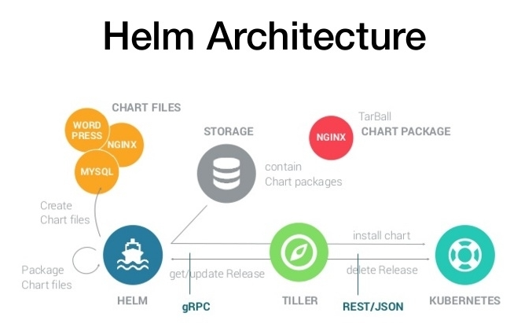

## 12.4 Helm v3变化

2019年11月13日，Helm团队发布了Helm v3的第一个稳定版本

该版本主要变化如下

- 架构变化

  - 最明显的变化是Tiller的删除
  - V3版本删除Tiller
  - relesase可以在不同命名空间重用

V3之前

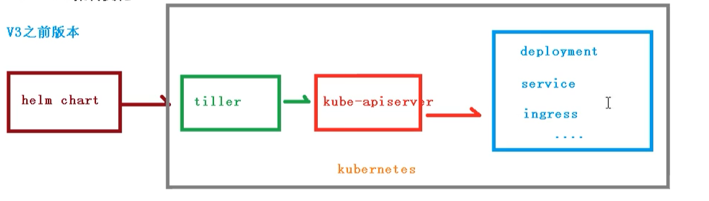

 V3版本

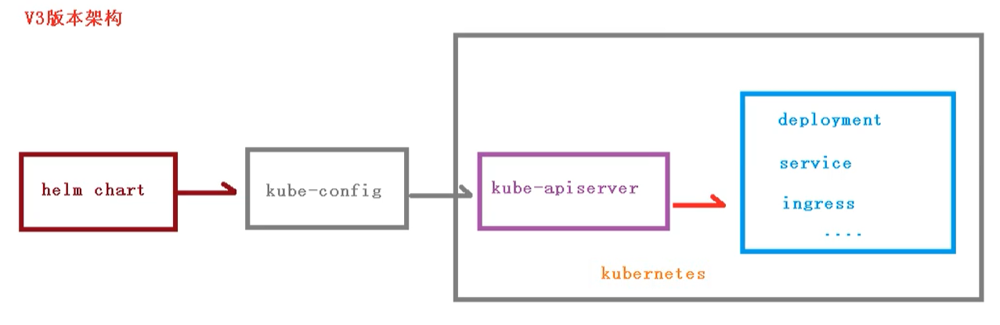

## 12.5 helm配置

首先我们需要去 [官网下载](https://helm.sh/docs/intro/quickstart/)

- 第一步，[下载helm](https://github.com/helm/helm/releases)安装压缩文件，上传到linux系统中
    ```bash
    wget https://get.helm.sh/helm-v3.2.4-linux-amd64.tar.gz
    ```

- 第二步，解压helm压缩文件，把解压后的helm目录复制到 usr/bin 目录中
- 使用命令：helm

```sh
# 下载版本注意版本后缀amd还是arm
[root@k8smaster helm]# tar -zxvf helm-v3.5.3-linux-amd64.tar.gz 
linux-amd64/
linux-amd64/helm
linux-amd64/LICENSE
linux-amd64/README.md
[root@k8smaster helm]#  mv linux-amd64/helm /usr/bin/helm
[root@k8smaster helm]# helm version
version.BuildInfo{Version:"v3.5.3", GitCommit:"041ce5a2c17a58be0fcd5f5e16fb3e7e95fea622", GitTreeState:"dirty", GoVersion:"go1.15.8"}
```

**我们都知道yum需要配置yum源，那么helm就要配置helm源**

## 12.6 helm仓库

- 添加仓库

```bash
helm repo add 仓库名  仓库地址 
```

- 例如

```bash
# 配置微软源
helm repo add stable http://mirror.azure.cn/kubernetes/charts
# 配置阿里源
helm repo add aliyun https://kubernetes.oss-cn-hangzhou.aliyuncs.com/charts
# 配置google源
helm repo add google https://kubernetes-charts.storage.googleapis.com/
# 更新
helm repo update
```

- 然后可以查看我们添加的仓库地址

```bash
# 查看全部
helm repo list
# 查看某个
helm search repo stable
```

```bash
[root@k8smaster helm]# helm search repo aliyun
NAME                          	CHART VERSION	APP VERSION  	DESCRIPTION                                       
aliyun/acs-engine-autoscaler  	2.1.3        	2.1.1        	Scales worker nodes within agent pools            
aliyun/aerospike              	0.1.7        	v3.14.1.2    	A Helm chart for Aerospike in Kubernetes          
aliyun/anchore-engine         	0.1.3        	0.1.6        	Anchore container analysis and policy evaluatio...
aliyun/artifactory            	7.0.3        	5.8.4        	Universal Repository Manager supporting all maj...
aliyun/artifactory-ha         	0.1.0        	5.8.4        	Universal Repository Manager supporting all maj...
```

- 或者可以删除我们添加的源

```bash
helm repo remove stable
```

## 12.7 helm基本命令

- chart install
- chart upgrade
- chart rollback

## 12.8 使用helm快速部署应用

### 12.8.1 使用命令搜索应用

首先我们使用命令，搜索我们需要安装的应用

```bash
# 搜索 weave仓库
helm search repo weave

[root@k8smaster helm]# helm search repo weave
NAME              	CHART VERSION	APP VERSION	DESCRIPTION                                       
aliyun/weave-cloud	0.1.2        	           	Weave Cloud is a add-on to Kubernetes which pro...
aliyun/weave-scope	0.9.2        	1.6.5      	A Helm chart for the Weave Scope cluster visual...
```

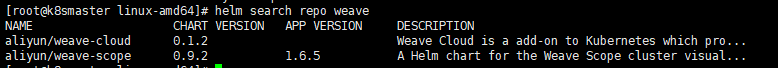

### 12.8.2 根据搜索内容选择安装

- 搜索完成后，使用命令进行安装

weave通过在docker集群的每个主机上启动虚拟的路由器，将主机作为路由器，形成互联互通的网络拓扑，在此基础上，实现容器的跨主机通信。其主机网络拓扑参见下图：

```bash
helm install ui aliyun/weave-scope
```

```bash
[root@k8smaster helm]# helm install ui apphub/weave-scope
NAME: ui
LAST DEPLOYED: Sat Dec 18 16:51:22 2021
NAMESPACE: default
STATUS: deployed
REVISION: 1
NOTES:
You should now be able to access the Scope frontend in your web browser, by
using kubectl port-forward:

kubectl -n default port-forward $(kubectl -n default get endpoints \
ui-weave-scope -o jsonpath='{.subsets[0].addresses[0].targetRef.name}') 8080:4040

then browsing to http://localhost:8080/.
For more details on using Weave Scope, see the Weave Scope documentation:

https://www.weave.works/docs/scope/latest/introducing/

```
<!-- 
- 可以通过下面命令，来下载yaml文件【如果】

```bash
kubectl apply -f weave-scope.yaml
``` -->

- 安装完成后，通过下面命令即可查看

```bash
helm list
```

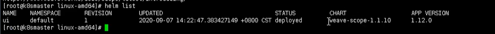

- 同时可以通过下面命令，查看更新具体的信息

```bash
helm status ui
```

- 但是我们通过查看 svc状态，发现没有对象暴露端口

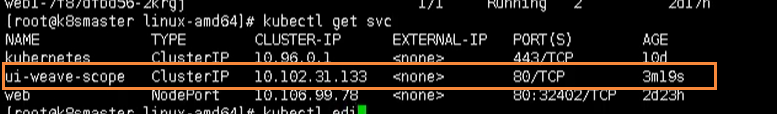

- 所以我们需要修改service的yaml文件，添加NodePort

```bash
#打开yaml文件进行修改
kubectl edit svc ui-weave-scope
```

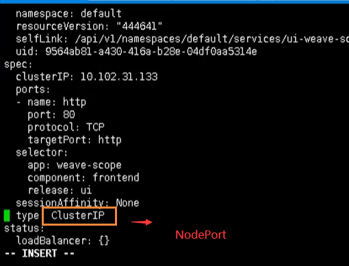

- 这样就可以对外暴露端口了

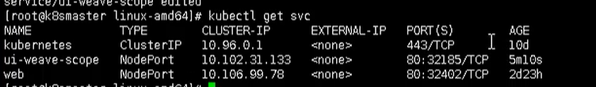

- 然后我们通过 ip + 32185 即可访问

## 12.9 如何自己创建Chart

- 使用命令，自己创建Chart

```bash
helm create mychart
```

- 创建完成后，我们就能看到在当前文件夹下，创建了一个 mychart目录


### 12.9.1 目录格式

- templates：编写yaml文件存放到这个目录
- values.yaml：存放的是全局的yaml文件
- chart.yaml：当前chart属性配置信息

### 12.9.2 templates文件夹创建两个文件

我们创建以下两个
- deployment.yaml
- service.yaml

我们可以通过下面命令创建出yaml文件

```bash
cd templates/
# 导出deployment.yaml
kubectl create deployment tqk001 --image=nginx --dry-run -o yaml > deployment.yaml
# 创建 tqk001 pod
kubectl apply -f deployment.yaml
# 导出service.yaml 【可能需要创建 deployment，不然会报错】--对外暴露端口
kubectl expose deployment tqk001 --port=80 --target-port=80 --type=NodePort --dry-run -o yaml > service.yaml
```

### 12.9.3 安装mychart

执行命令创建

```bash
helm install webserver-ng mychart
```

```bash
[root@k8smaster helm]# kubectl delete -f ./mychart/templates/deployment.yaml 
deployment.apps "tqk001" deleted
[root@k8smaster helm]# helm install tqk001 mychart
NAME: tqk001
LAST DEPLOYED: Sat Dec 18 17:38:47 2021
NAMESPACE: default
STATUS: deployed
REVISION: 1
NOTES:
1. Get the application URL by running these commands:
  export POD_NAME=$(kubectl get pods --namespace default -l "app.kubernetes.io/name=mychart,app.kubernetes.io/instance=tqk001" -o jsonpath="{.items[0].metadata.name}")
  export CONTAINER_PORT=$(kubectl get pod --namespace default $POD_NAME -o jsonpath="{.spec.containers[0].ports[0].containerPort}")
  echo "Visit http://127.0.0.1:8080 to use your application"
  kubectl --namespace default port-forward $POD_NAME 8080:$CONTAINER_PORT
```

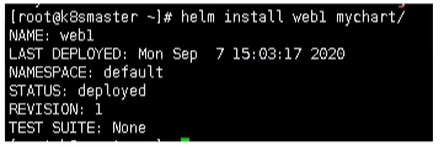

### 12.9.4 应用升级

当我们修改了mychart中的东西后，就可以进行升级操作

```bash
helm upgrade tqk001 mychart
```

## 12.10 chart模板使用

通过传递参数，动态渲染模板，yaml内容动态从传入参数生成

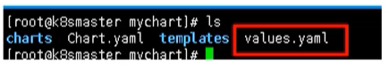

刚刚我们创建mychart的时候，看到有values.yaml文件，这个文件就是一些全局的变量，然后在templates中能取到变量的值，下面我们可以利用这个，来完成动态模板

- 在values.yaml定义变量和值
- 具体yaml文件，获取定义变量值
- yaml文件中大体有几个地方不同
  - image
  - tag
  - label
  - port
  - replicas

### 12.10.1 定义变量和值

在values.yaml定义变量和值
```yaml
image: nginx
repository: nginx16
tag: 1.16
label: nginx
port: 80
replicas: 1

```

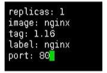

### 12.10.2 获取变量和值

我们通过表达式形式 使用全局变量  `{{.Values.变量名称}} `

例如： `{{.Release.Name}}`

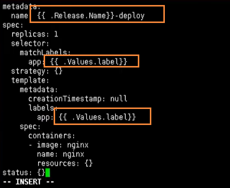

- deployment.yaml
```yml
apiVersion: apps/v1
kind: Deployment
metadata:
  name: {{.Release.Name}}-tqk
  creationTimestamp: null
  labels:
    app: {{.Values.label}}
  name: {{.Values.label}}
spec:
  replicas: 1
  selector:
    matchLabels:
      app: {{.Values.label}}
  strategy: {}
  template:
    metadata:
      creationTimestamp: null
      labels:
        app: {{.Values.label}}
    spec:
      containers:
      - image: nginx
        name: nginx
        resources: {}
status: {}
```

- service.yaml 

```yml
apiVersion: v1
kind: Service
metadata:
  name: {{.Release.Name}} -tqk
  creationTimestamp: null
  labels:
    app: {{.Values.label}}
  name: {{.Values.label}}
spec:
  ports:
  - port: {{.Values.port}}
    protocol: TCP
    targetPort: {{.Values.port}}
  selector:
    app: {{.Values.label}}
  type: NodePort
status:
  loadBalancer: {}
```
### 12.10.3 安装应用

在我们修改完上述的信息后，就可以尝试的创建应用了

```bash
[root@k8smaster helm]# helm install  web2 mychart
NAME: web2
LAST DEPLOYED: Sat Dec 18 20:07:59 2021
NAMESPACE: default
STATUS: deployed
REVISION: 1
NOTES:
1. Get the application URL by running these commands:
  export POD_NAME=$(kubectl get pods --namespace default -l "app.kubernetes.io/name=mychart,app.kubernetes.io/instance=web2" -o jsonpath="{.items[0].metadata.name}")
  export CONTAINER_PORT=$(kubectl get pod --namespace default $POD_NAME -o jsonpath="{.spec.containers[0].ports[0].containerPort}")
  echo "Visit http://127.0.0.1:8080 to use your application"
  kubectl --namespace default port-forward $POD_NAME 8080:$CONTAINER_PORT
[root@k8smaster helm]# kubectl get pods
NAME                                                READY   STATUS      RESTARTS   AGE
mypod                                               0/1     Completed   0          11h
nginx-f89759699-xffhv                               1/1     Running     0          33h
nginx16-756c7d47b6-m9vp2                            1/1     Running     0          24s

```

```bash
[root@k8smaster helm]# helm install --dry-run web2-tqk mychart
NAME: web2-tqk
LAST DEPLOYED: Sat Dec 18 19:58:59 2021
NAMESPACE: default
STATUS: pending-install
REVISION: 1
HOOKS:
---
# Source: mychart/templates/tests/test-connection.yaml
apiVersion: v1
kind: Pod
metadata:
  name: "web2-tqk-mychart-test-connection"
  labels:
    helm.sh/chart: mychart-0.1.0
    app.kubernetes.io/name: mychart
    app.kubernetes.io/instance: web2-tqk
    app.kubernetes.io/version: "1.16.0"
    app.kubernetes.io/managed-by: Helm
  annotations:
    "helm.sh/hook": test
spec:
  containers:
    - name: wget
      image: busybox
      command: ['wget']
      args: ['web2-tqk-mychart:80']
  restartPolicy: Never
MANIFEST:
---
# Source: mychart/templates/serviceaccount.yaml
apiVersion: v1
kind: ServiceAccount
metadata:
  name: web2-tqk-mychart
  labels:
    helm.sh/chart: mychart-0.1.0
    app.kubernetes.io/name: mychart
    app.kubernetes.io/instance: web2-tqk
    app.kubernetes.io/version: "1.16.0"
    app.kubernetes.io/managed-by: Helm
---
# Source: mychart/templates/service.yaml
apiVersion: v1
kind: Service
metadata:
  name: web2-tqk -tqk 
  creationTimestamp: null
  labels:
    app: nginx.1.16
  name: nginx.1.16
spec:
  ports:
  - port: 80
    protocol: TCP
    targetPort: 80 
  selector:
    app: nginx.1.16
  type: NodePort
status:
  loadBalancer: {}
---
# Source: mychart/templates/deployment.yaml
apiVersion: apps/v1
kind: Deployment
metadata:
  name: web2-tqk-tqk
  creationTimestamp: null
  labels:
    app: nginx.1.16
  name: nginx.1.16
spec:
  replicas: 1
  selector:
    matchLabels:
      app: nginx.1.16
  strategy: {}
  template:
    metadata:
      creationTimestamp: null
      labels:
        app: nginx.1.16
    spec:
      containers:
      - image: nginx
        name: nginx
        resources: {}
status: {}

NOTES:
1. Get the application URL by running these commands:
  export POD_NAME=$(kubectl get pods --namespace default -l "app.kubernetes.io/name=mychart,app.kubernetes.io/instance=web2-tqk" -o jsonpath="{.items[0].metadata.name}")
  export CONTAINER_PORT=$(kubectl get pod --namespace default $POD_NAME -o jsonpath="{.spec.containers[0].ports[0].containerPort}")
  echo "Visit http://127.0.0.1:8080 to use your application"
  kubectl --namespace default port-forward $POD_NAME 8080:$CONTAINER_PORT
```


```bah
helm install  web2-tqk mychart
```
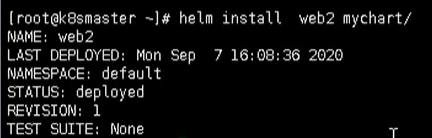


## 12.11 安装问题

### 问题一
--在使用helm安装应用的时候报如下错误：
```bash
[root@k8smaster bin]# helm install testweave testrepo/weave-scope
Error: INSTALLATION FAILED: unable to build kubernetes objects from release manifest: [unable to recognize "": no matches for kind "DaemonSet" in version "extensions/v1beta1", unable to recognize "": no matches for kind "Deployment" in version "apps/v1beta1"]
```
--更换一个helm源即可：

```bash
helm repo add apphub https://apphub.aliyuncs.com
```