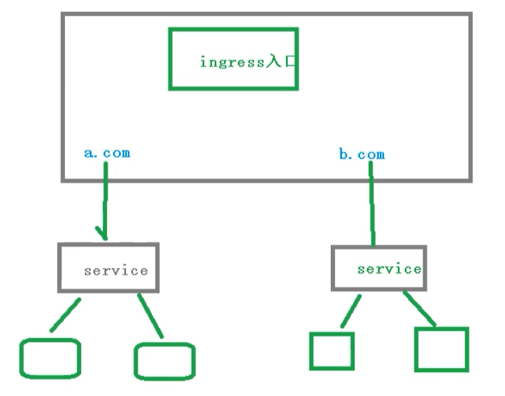
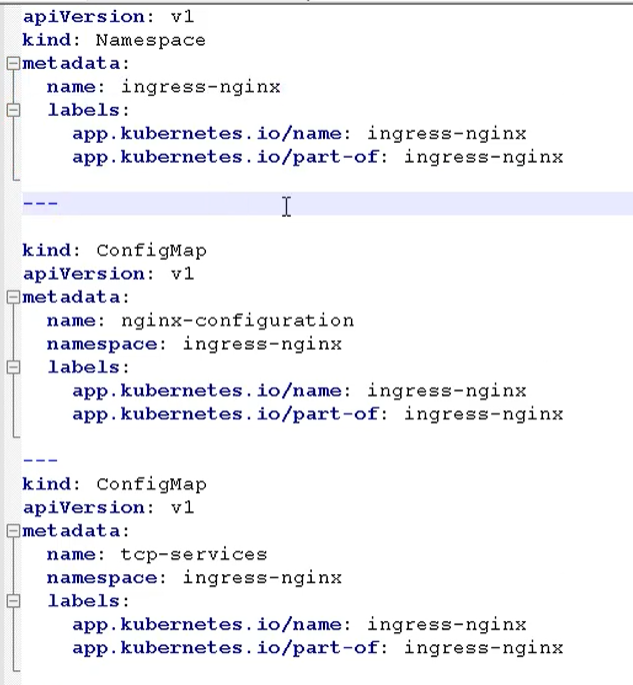

# 11. K8s核心技术Ingress

## 前言

原来我们需要将端口号对外暴露，通过 ip + 端口号就可以进行访问

原来是使用Service中的NodePort来实现

- 在每个节点上都会启动端口
- 在访问的时候通过任何节点，通过ip + 端口号就能实现访问

但是NodePort还存在一些缺陷

- 因为端口不能重复，所以每个端口只能使用一次，一个端口对应一个应用
- 实际访问中都是用域名，根据不同域名跳转到不同端口服务中

## 11.1 Ingress和Pod关系

pod 和 ingress 是通过service进行关联的，而ingress作为统一入口，由service关联一组pod中


- 首先service就是关联我们的pod
- 然后ingress作为入口，首先需要到service，然后发现一组pod
- 发现pod后，就可以做负载均衡等操作

## 11.2 Ingress工作流程

在实际的访问中，我们都是需要维护很多域名， a.com  和  b.com

- 然后不同的域名对应的不同的Service，然后service管理不同的pod



需要注意，ingress不是内置的组件，需要我们单独的安装

## 11.3 使用Ingress

步骤如下所示

- 部署ingress Controller【需要下载官方的】
- 创建ingress规则【对哪个Pod、名称空间配置规则】

### 11.3.1 创建Nginx Pod

创建一个nginx应用，然后对外暴露端口

```bash
# 创建pod
kubectl create deployment web-tqk-ingress --image=nginx
# 查看
kubectl get pods
```

- 对外暴露端口

```bash
kubectl expose deployment web-tqk-ingress --port=80 --target-port=80 --type=NodePort
```

### 11.3.2 部署 ingress controller

- 下面我们来通过yaml的方式，部署我们的ingress，配置文件如下所示



----------------

```yml
apiVersion: v1
kind: Namespace
metadata:
  name: ingress-nginx
  labels:
    app.kubernetes.io/name: ingress-nginx
    app.kubernetes.io/part-of: ingress-nginx

---

kind: ConfigMap
apiVersion: v1
metadata:
  name: nginx-configuration
  namespace: ingress-nginx
  labels:
    app.kubernetes.io/name: ingress-nginx
    app.kubernetes.io/part-of: ingress-nginx

---
kind: ConfigMap
apiVersion: v1
metadata:
  name: tcp-services
  namespace: ingress-nginx
  labels:
    app.kubernetes.io/name: ingress-nginx
    app.kubernetes.io/part-of: ingress-nginx

```

- 这个文件里面，需要注意的是 hostNetwork: true，改成ture是为了让后面访问到

```bash
kubectl apply -f ingress-controller.yaml
```

- 通过这种方式，其实我们在外面就能访问，这里还需要在外面添加一层

```bash
[root@k8smaster ~]# kubectl apply -f ingress-controller.yaml
namespace/ingress-nginx created
configmap/nginx-configuration created
configmap/tcp-services created
configmap/udp-services created
serviceaccount/nginx-ingress-serviceaccount created
clusterrole.rbac.authorization.k8s.io/nginx-ingress-clusterrole created
role.rbac.authorization.k8s.io/nginx-ingress-role created
rolebinding.rbac.authorization.k8s.io/nginx-ingress-role-nisa-binding created
clusterrolebinding.rbac.authorization.k8s.io/nginx-ingress-clusterrole-nisa-binding created
deployment.apps/nginx-ingress-controller created
limitrange/ingress-nginx created

```


- 最后通过下面命令，查看是否成功部署 ingress

```bash
kubectl get pods -n ingress-nginx

[root@k8smaster ~]# kubectl get pods -n ingress-nginx
NAME                                       READY   STATUS              RESTARTS   AGE
nginx-ingress-controller-766fb9f77-blmfw   0/1     ContainerCreating   0          25s

```


### 11.3.3 创建ingress规则文件

- 创建ingress规则文件，ingress01.yaml
```yml
apiVersion: networking.k8s.io/v1beta1
kind: Ingress
metadata:
  name: example-ingress
spec:
  rules:
  - host: example.ingredemo.com
    http:
      paths:
      - path: /
        backend:
          serviceName: web-tqk-ingress
          servicePort: 80
```


```bash
kubectl apply -f ingress01.yaml

```
### 11.3.4 添加域名访问规则

- 在windows 的 hosts文件，添加域名访问规则【因为我们没有域名解析，所以只能这样做】

```bash
# 查看部署在哪台服务器上
kubectl get pods -n ingress-nginx -o wide
[root@k8smaster ~]# kubectl get pods -n ingress-nginx -o wide
NAME                                       READY   STATUS    RESTARTS   AGE   IP              NODE        NOMINATED NODE   READINESS GATES
nginx-ingress-controller-766fb9f77-blmfw   1/1     Running   0          31m   192.168.222.5   k8s-node2   <none>           <none>
```
#### C:\Windows\System32\drivers\etc
```hosts
192.168.222.5 example.ingredemo.com
```

最后通过域名就能访问
[example.ingredemo.com]

