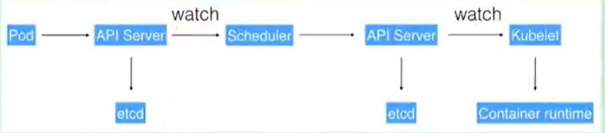

# 1. K8s组件介绍
[[toc]]

k8s是容器的编排工具  
Kubernetes(k8s)是Google开源的容器集群管理系统（谷歌内部:Borg），目前已经成为容器编排一个标准。在Docker技术的基础上，为容器化的应用提供部署运行、资源调度、服务发现和动态伸缩、高可用等一系列完整功能，提高了大规模容器集群管理的便捷性

:::tip Kubernetes优势:
1. 容器编排
2. 轻量级
3. 开源
4. 弹性伸缩
5. 负载均衡
:::

## 1.1 K8S架构组件

### 1.1.1 完整架构图

### 1.1.2 架构细节
K8S架构主要包含两部分：Master（主控节点）和 node（工作节点）
### 1.1.3 Master
**控制节点，职责是调度，即决定将应用放在哪里运行**。Master 运行 Linux 操作系统，可以是物理机或者虚拟机。为了实现高可用，可以运行多个 Master。

**master节点架构图**

:::tip master：主控节点

- API Server：集群统一入口，以restful风格进行操作，同时交给etcd存储
  - 提供认证、授权、访问控制、API注册和发现等机制
- scheduler：节点的调度，选择node节点应用部署
- controller-manager：处理集群中常规后台任务，一个资源对应一个控制器
- etcd：存储系统，用于保存集群中的相关数据
:::

### 1.1.4 Node
**工作节点，职责是运行容器应用**。Node 由 Master 管理，Node 负责监控并汇报容器的状态，并根据 Master 的要求管理容器的生命周期。Node 运行在 Linux 操作系统，可以是物理机或者是虚拟机。

**Node节点架构图**

k8s 集群控制节点，对集群进行调度管理，接受集群外用户去集群操作请求；

:::tip Work node：工作节点

- Kubelet：master派到node节点代表，管理本机容器
  - 一个集群中每个节点上运行的代理，它保证容器都运行在Pod中
  - 负责维护容器的生命周期，同时也负责Volume(CSI) 和 网络(CNI)的管理
- kube-proxy：提供网络代理，负载均衡等操作
:::

-----------------------

:::tip 容器运行环境【Container Runtime】

- 容器运行环境是负责运行容器的软件
- Kubernetes支持多个容器运行环境：Docker、containerd、cri-o、rktlet以及任何实现Kubernetes CRI (容器运行环境接口) 的软件。
:::

fluentd：是一个守护进程，它有助于提升 集群层面日志

## 1.2 K8s基础概念

### 1.2.1 Cluster
Cluster 是计算、存储和网络资源的集合，Kubernetes 利用这些资源运行各种基于容器的应用。

### 1.2.2 Namespace
将一个物理的 Cluster 逻辑上划分成多个虚拟 Cluster，每个 Cluster 就是一个 Namespace。不同 Namespace 里的资源是完全隔离的。

:::tip 命名空间，逻辑隔离
- 一个集群内部的逻辑隔离机制【鉴权、资源】
- 每个资源都属于一个namespace
- 同一个namespace所有资源不能重复
- 不同namespace可以资源名重复
:::

### 1.2.5 Pod-☆

K8S的最小工作单元。每个 Pod 包含一个或多个容器。Pod 中的容器会作为一个整体被 Master 调度到一个 Node 上运行

1. 有些容器天生就是需要紧密联系，一起工作。Pod 提供了比容器更高层 次的抽象，K8s 以 Pod 为最小单位进行调度、扩展、共享资源、管理生命周期。 

2. Pod中的所有容器使用同一个网络的namespace，即**相同的IP地址和Port 空间**。**它们可以直接用 localhost 通信**。同样的，这些容器可以共享存储， 当 K8s 挂载 Volume 到 Pod 上，本质上是将 volume 挂载到 Pod 中的每一个容器。

---------------------
:::tip Pod
- Pod是K8s中最小的单元
- 一组容器的集合
- 共享网络【一个Pod中的所有容器共享同一网络】
- 生命周期是短暂的（服务器重启后，就找不到了）
:::

### 1.2.6 Controller
管理Pod的工具。Deployment 是最常用的 Controller，Deployment 可以管理 Pod 的多个副本，并确保 Pod 按照期望的状态运行。

:::tip Controller

- 确保预期的pod副本数量【ReplicaSet】
- 无状态应用部署【Deployment】
  - 无状态就是指，不需要依赖于网络或者ip
- 有状态应用部署【StatefulSet】
  - 有状态需要特定的条件
- 确保所有的node运行同一个pod 【DaemonSet】
- 一次性任务和定时任务【Job和CronJob】
:::

### 1.2.7 Service
定义外界访问一组特定 Pod 的方式。Service 有自己的 IP 和端口，并把这个IP和后端的Pod所跑的服务的关联起来。Service 为 Pod 提供了负载均衡

:::tip Service
- 定义一组pod的访问规则
- Pod的负载均衡，提供一个或多个Pod的稳定访问地址
- 支持多种方式【ClusterIP、NodePort、LoadBalancer】
:::
可以用来组合pod，同时对外提供服务

### 1.2.8 ☆etcd

**etcd**的官方将它定位成一个可信赖的分布式键值存储服务，它能够为整个分布式集群存储 一些关键数据，协助分布式集群的正常运转--**可以简单理解为是一个数据库**

推荐在 Kubernetes 集群中使用 Etcd v3，v2 版本已在 Kubernetes v1.11 中弃用

:::tip Etcd四个部分
1. HTTP Server： 用于处理用户发送的API请求以及其他etcd节点的同步与心跳信息请求

2. Store: 用于处理 etcd 支持的各类功能的事务，包括数据索引、节点状态变更、监控与反馈、事件处理与执行等等，是 etcd 对用户提供的大多数 API 功能的具体实现。

3. Raft： Raft 强一致性算法的具体实现，是 etcd 的核心。

4. WAL：Write Ahead Log（预写式日志/日志先行），是 etcd 的数据存储方式，也是一种实现事务日志的标准方法。etcd通过 WAL 进行持久化存储，所有的数据提交前都会事先记录日志。

    Snapshot 是为了防止数据过多而进行的状态快照；Entry 表示存储的具体日志内容
:::

:::tip K8s核心组件以及插件
1. **APISERVER**：所有服务访问统一入口
2. **CrontrollerManager**：维持副本期望数目
3. **Scheduler**：负责介绍任务，选择合适的节点进行分配任务
4. **ETCD**：键值对数据库储存K8S集群所有重要信息（持久化）
5. **Kubelet**：直接跟容器引擎交互实现容器的生命周期管理
6. **Kube-proxy**：负责写入规则至 IPTABLES、IPVS 实现服务映射访问的

1. **COREDNS**：可以为集群中的SVC创建一个域名IP的对应关系解析
2. **DASHBOARD**：给 K8S 集群提供一个 B/S 结构访问体系
3. **INGRESS CONTROLLER**：官方只能实现四层代理，INGRESS 可以实现七层代理
4. **☆FEDERATION**：提供一个可以跨集群中心多K8S统一管理功能
5. **PROMETHEUS**：提供K8S集群的监控能力
6. **ELK**：提供 K8S 集群日志统一分析介入平台
:::

### 1.2.9 Pod 控制器☆

K8s 通常不直接创建 Pod，而是通过 Controller 来管理 Pod。Controller 中 定义了 pod 的部署属性，比如几个副本、在什么样的 Node 上运行等。 K8s 提供了多种 Controller，包括 Deployment、ReplicaSet、DaemonSet、 StatefuleSet、Job 等。

:::tip Pod控制器
- **ReplicationController （副本控制器）**，确保 Pod 的数量始终保持设 定的个数。也支持 Pod 的滚动更新。 

-  **ReplicaSet （副本集）**，它不直接使用，有一个声明式更新的控制器 叫**Deployment 来负责管理**。但是 Deployment 只能负责管理那些无状态 的应用。 
    

-  **StatefulSet （有状态副本集）**，负责管理有状态的应用。 

-  **DaemonSet** ，如果需要在每一个 Node 上只运行一个副本，而不是随意运行，就需要 DaemonSet。 

-  **Job运行作业**，对于时间不固定的操作，比如：某个应用生成了一大 堆数据集，现在需要临时启动一个 Pod 去清理这些数据集，清理完成后， 这个 Pod 就可以结束了。 

    -这些不需要一直处于运行状态的应用，就用 Job 这个类型的控制器去控制。如果 Pod 运行过程中意外中止了，Job 负责重启 Pod。如果 Pod 任务执行完了，就不需要再启动了。 

-  **Cronjob**，周期性作业
:::

### 1.2.10 API

我们通过Kubernetes的API来操作整个集群

同时我们可以通过 kubectl 、ui、curl 最终发送 http + json/yaml 方式的请求给API Server，然后控制整个K8S集群，K8S中所有的资源对象都可以采用 yaml 或 json 格式的文件定义或描述

如下：使用yaml部署一个nginx的pod

### 完整流程

- 通过Kubectl提交一个创建RC（Replication Controller）的请求，该请求通过APlserver写入etcd

- 此时Controller Manager通过API Server的监听资源变化的接口监听到此RC事件

- 分析之后，发现当前集群中还没有它所对应的Pod实例

- 于是根据RC里的Pod模板定义一个生成Pod对象，通过APIServer写入etcd

- 此事件被Scheduler发现，它立即执行执行一个复杂的调度流程，为这个新的Pod选定一个落户的Node，然后通过API Server讲这一结果写入etcd中

- 目标Node上运行的Kubelet进程通过APiserver监测到这个"新生的Pod.并按照它的定义，启动该Pod并任劳任怨地负责它的下半生，直到Pod的生命结束

- 随后，我们通过Kubectl提交一个新的映射到该Pod的Service的创建请求

- ControllerManager通过Label标签查询到关联的Pod实例，然后生成Service的Endpoints信息，并通过APIServer写入到etod中，

- 接下来，所有Node上运行的Proxy进程通过APIServer查询并监听Service对象与其对应的Endponts信息，建立一个软件方式的负载均衡器来实现Service访问到后端Pod的流量转发功能