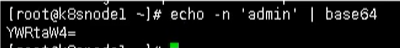
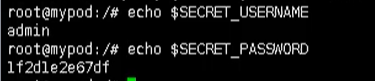
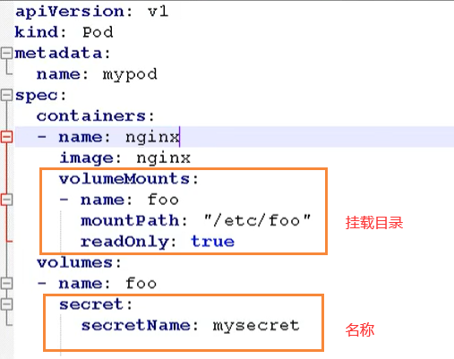
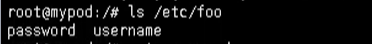
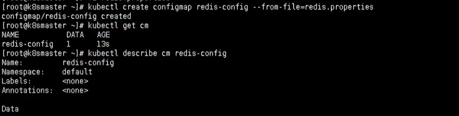
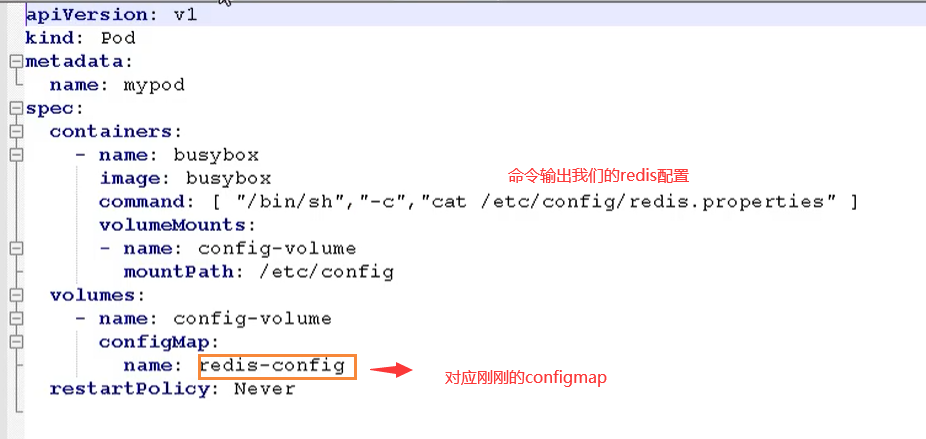
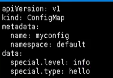
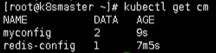
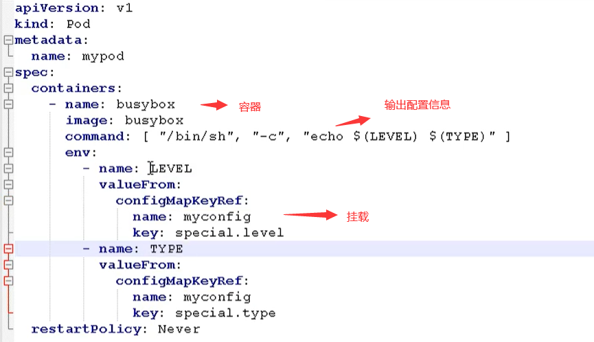

# 9. K8s配置管理

## 9.1 Secret

Secret的主要作用就是加密数据，然后存在etcd里面，让Pod容器以挂载Volume方式进行访问

**场景：用户名 和 密码进行加密**

- 一般场景的是对某个字符串进行base64编码 进行加密

```bash
echo -n 'admin' | base64
```



### 9.1.1 变量形式挂载到Pod

- 创建secret加密数据的yaml文件    secret.yaml


```yml
apiVersion: v1
kind: Secret
metadata:
  name: mysecret
type: Opaque
data:
  username: YWRtaW4=
  password: MWYyZDFlMmU2N2Rm

```

- 然后使用下面命令创建一个pod

```bash
kubectl create -f secret.yaml
```

- 通过get命令查看

```bash
kubectl get secret
[root@k8smaster ~]# kubectl get secret
NAME                  TYPE                                  DATA   AGE
default-token-rxj6c   kubernetes.io/service-account-token   3      15h
mysecret              Opaque 
```

- 创建Pod数据的yaml文件  secret-var.yaml
```yaml
apiVersion: v1
kind: Pod
metadata:
  name: mypod
spec:
  containers:
  - name: nginx
    image: nginx
    env:
      - name: SECRET_USERNAME
        valueFrom:
          secretKeyRef:
            name: mysecret
            key: username
      - name: SECRET_PASSWORD
        valueFrom:
          secretKeyRef:
            name: mysecret
            key: password
```

```bash
kubectl create -f secret-var.yaml

[root@k8smaster ~]# kubectl create -f secret-var.yaml
pod/mypod created
[root@k8smaster ~]# kubectl get pods
NAME                       READY   STATUS              RESTARTS   AGE
mypod                      0/1     ContainerCreating   0          17s
nginx-f89759699-xffhv      1/1     Running             0          13h
web-5dcb957ccc-swrfk       1/1     Running             0          164m
web-tqk-86bf49fd74-kj8rd   1/1     Running             0          178m
web1111-68bd75d8d5-wwwwd   1/1     Running             0          164m

```
- 然后我们通过下面的命令，进入到我们的容器内部

```bash
kubectl exec -it mypod bash
```

- 然后我们就可以输出我们的值，这就是以变量的形式挂载到我们的容器中

```bash
# 输出用户
echo $SECRET_USERNAME
# 输出密码
echo $SECRET_PASSWORD

root@mypod:/# echo $SECRET_USERNAME
admin
root@mypod:/# echo $SECRET_PASSWORD
1f2d1e2e67df
root@mypod:/# exit
exit

```



- 最后如果我们要删除这个Pod，就可以使用这个命令

```bash
kubectl delete -f secret-val.yaml

[root@k8smaster ~]# kubectl delete -f secret-var.yaml
pod "mypod" deleted

```

### 9.1.2 数据卷形式挂载

- 首先我们创建一个 secret-vol.yaml 文件
```yaml
apiVersion: v1
kind: Pod
metadata:
  name: mypod
spec:
  containers:
  - name: nginx
    image: nginx
    volumeMounts:
    - name: foo
      mountPath: "/etc/foo"
      readOnly: true
  volumes:
  - name: foo
    secret:
      secretName: mysecret
```



- 然后创建我们的 Pod

```bash
# 根据配置创建容器
kubectl apply -f secret-vol.yaml
# 进入容器
kubectl exec -it mypod bash
# 查看
ls /etc/foo

1f2d1e2e67dfroot@mypod:/etc/foo# ls /etc/foo
password  username
root@mypod:/etc/foo# cat username 
admin
root@mypod:/etc/foo# cat password 
1f2d1e2e67df
```



## 9.2 ConfigMap

- ConfigMap作用是存储不加密的数据到etcd中，让Pod以变量或数据卷Volume挂载到容器中

**应用场景：配置文件**

### 9.2.1 创建配置文件

- 首先我们需要创建一个配置文件 `redis.properties`

```bash
redis.port=127.0.0.1
redis.port=6379
redis.password=123456
```

### 9.2.2 创建ConfigMap

- 我们使用命令创建configmap

```bash
kubectl create configmap redis-config --from-file=redis.properties
```

- 然后查看详细信息

```bash
kubectl describe cm redis-config
```



### 9.2.3 Volume数据卷形式挂载

- 首先我们需要创建一个 `cm.yaml`


```yaml
apiVersion: v1
kind: Pod
metadata:
  name: mypod
spec:
  containers:
    - name: busybox
      image: busybox
      command: [ "/bin/sh","-c","cat /etc/config/redis.properties" ]
      volumeMounts:
      - name: config-volume
        mountPath: /etc/config
  volumes:
    - name: config-volume
      configMap:
        name: redis-config
  restartPolicy: Never

```
- 然后使用该yaml创建我们的pod

```bash
# 创建
kubectl apply -f cm.yaml
# 查看
kubectl get pods
```


- 最后我们通过命令就可以查看结果输出了

```bash
kubectl logs mypod
```


### 以变量的形式挂载Pod

- 首先我们也有一个 myconfig.yaml文件，声明变量信息，然后以configmap创建


```yaml
apiVersion: v1
kind: ConfigMap
metadata:
  name: myconfig
  namespace: default
data:
  special.level: info
  special.type: hello
```

- 然后我们就可以创建我们的配置文件

```bash
# 创建pod
kubectl apply -f myconfig.yaml
# 获取
kubectl get cm
```



- 然后我们创建完该pod后，我们就需要在创建一个  config-var.yaml 来使用我们的配置信息
```yaml
apiVersion: v1
kind: Pod
metadata:
  name: mypod
spec:
  containers:
    - name: busybox
      image: busybox
      command: [ "/bin/sh", "-c", "echo $(LEVEL) $(TYPE)" ]
      env:
        - name: LEVEL
          valueFrom:
            configMapKeyRef:
              name: myconfig
              key: special.level
        - name: TYPE
          valueFrom:
            configMapKeyRef:
              name: myconfig
              key: special.type
  restartPolicy: Never
```



- 最后我们查看输出

```bash
[root@k8smaster ~]# kubectl apply -f config-var.yaml 
pod/mypod created
[root@k8smaster ~]# kubectl logs mypod
info hell
```

