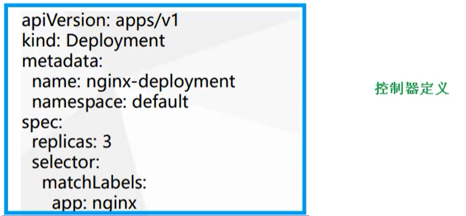
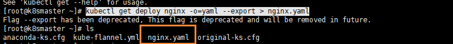

# 4. K8s集群YAML文件详解
[[toc]]
k8s 集群中对资源管理和资源对象编排部署都可以**通过声明样式（YAML）文件来解决**，也就是可以把需要对资源对象操作编辑到YAML 格式文件中，我们把这种文件叫做**资源清单文件**，通过kubectl 命令直接使用资源清单文件就可以实现对大量的资源对象进行编排部署了。一般在我们开发的时候，都是通过配置YAML文件来部署集群的。

**YAML文件：就是资源清单文件，用于资源编排**

- 服务发现: 某服务的具体状态, 以及他们的主机名, 访问端点都做到统一管理等
- 可伸缩和高可用: 根据流量自动调节, 创建系统冗余, 故障转移等等
- 资源管理: 调节各个服务的负载均衡, 控制其可访问的系统资源上限, 分配端口这类
- 监控

总之资源编排是一个让容器有机组合, 协调其运行情况, 保证高可用性, 完成具体业务的一系列工作的总和. 这些事情在 Docker 之前其实也是要干的, 只是以前是物理机和虚拟机, 现在是容器

## 4.1 YAML文件介绍

### 4.1.1 YAML概述

YAML ：仍是一种标记语言。为了强调这种语言以数据做为中心，而不是以标记语言为重点。

YAML 是一个可读性高，用来表达数据序列的格式。

### 4.1.2 YAML 基本语法

* 使用空格做为缩进
* 缩进的空格数目不重要，只要相同层级的元素左侧对齐即可
* 低版本缩进时不允许使用Tab 键，只允许使用空格
* 使用#标识注释，从这个字符一直到行尾，都会被解释器忽略
* 使用 --- 表示新的yaml文件开始

### 4.1.3 YAML 支持的数据结构

#### 对象

键值对的集合，又称为映射(mapping) / 哈希（hashes） / 字典（dictionary）

```yaml
# 对象类型：对象的一组键值对，使用冒号结构表示
name: Tom
age: 18

# yaml 也允许另一种写法，将所有键值对写成一个行内对象
hash: {name: Tom, age: 18}
```

#### 数组

```bash
# 数组类型：一组连词线开头的行，构成一个数组
People
- Tom
- Jack

# 数组也可以采用行内表示法
People: [Tom, Jack]
```


## 4.2 YAML文件组成部分

主要分为了两部分，一个是控制器的定义 和 被控制的对象

### 4.2.1 控制器的定义




### 4.2.2 被控制的对象

包含一些 镜像，版本、端口等


### 4.2.3 属性说明

在一个YAML文件的控制器定义中，有很多属性名称

|  属性名称  |    介绍    |
| :--------: | :--------: |
| apiVersion |  API版本   |
|    kind    |  资源类型  |
|  metadata  | 资源元数据 |
|    spec    |  资源规格  |
|  replicas  |  副本数量  |
|  selector  | 标签选择器 |
|  template  |  Pod模板   |
|  metadata  | Pod元数据  |
|    spec    |  Pod规格   |
| containers |  容器配置  |


## 4.3 如何快速编写YAML文件

一般来说，我们很少自己手写YAML文件，因为这里面涉及到了很多内容，我们一般都会借助工具来创建

### 4.3.1 使用kubectl create命令

这种方式一般用于资源没有部署的时候，我们可以直接创建一个YAML配置文件

```bash
# 尝试运行,并不会真正的创建镜像
kubectl create deployment web --image=nginx -o yaml --dry-run
```

或者我们可以输出到一个文件中

```bash
kubectl create deployment web --image=nginx -o yaml --dry-run > hello.yaml
```

然后我们就在文件中直接修改即可

### 4.3.2 使用kubectl get命令导出yaml文件

可以首先查看一个目前已经部署的镜像

```bash
kubectl get deploy
```


然后我们导出 nginx的配置

```bash
kubectl get deploy nginx -o=yaml --export > nginx.yaml
```

然后会生成一个 `nginx.yaml` 的配置文件



