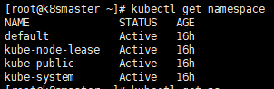
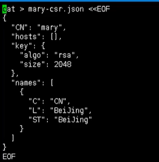

# 10. K8s集群安全机制

## 10.1 概述

当我们访问K8S集群时，需要经过三个步骤完成具体操作

- 认证
- 鉴权【授权】
- 准入控制

进行访问的时候，都需要经过 apiserver， apiserver做统一协调，比如门卫

- 访问过程中，需要证书、token、或者用户名和密码
- 如果访问pod需要serviceAccount


### 10.1.1认证

对外不暴露8080端口，只能内部访问，对外使用的端口6443

客户端身份认证常用方式

- https证书认证，基于ca证书
- http token认证，通过token来识别用户
- http基本认证，用户名 + 密码认证

### 10.1.2 鉴权

基于RBAC进行鉴权操作

基于角色访问控制

### 10.1.3 准入控制

就是准入控制器的列表，如果列表有请求内容就通过，没有的话 就拒绝

## 10.2 RBAC介绍

基于角色的访问控制，为某个角色设置访问内容，然后用户分配该角色后，就拥有该角色的访问权限


k8s中有默认的几个角色

- role：特定命名空间访问权限
- ClusterRole：所有命名空间的访问权限

角色绑定

- roleBinding：角色绑定到主体
- ClusterRoleBinding：集群角色绑定到主体

主体

- user：用户
- group：用户组
- serviceAccount：服务账号

## 10.3 RBAC实现鉴权

- 创建命名空间


### 10.3.1 创建命名空间

我们可以首先查看已经存在的命名空间

```bash
kubectl get namespace
```



然后我们创建一个自己的命名空间  roledemo

```bash
kubectl create ns roledemo
```

### 10.3.2 命名空间创建Pod

为什么要创建命名空间？因为如果不创建命名空间的话，默认是在default下

```bash
kubectl run nginx --image=nginx -n roledemo
```

### 10.3.3 创建角色

- 我们通过 rbac-role.yaml进行创建


--------------

```yml

kind: Role
apiVersion: rbac.authorization.k8s.io/v1
metadata:
  namespace: roledemo
  name: pod-reader
rules:
- apiGroups: [""] # "" indicates the core API group
  resources: ["pods"]
  verbs: ["get", "watch", "list"]

```
<font color='red'>注意：这个角色只对pod 有 get、list权限</font>

- 然后通过 yaml创建我们的role

```bash
# 创建
kubectl apply -f rbac-role.yaml
# 查看
kubectl get role -n roledemo
```


### 10.3.4 创建角色绑定

- 我们还是通过 role-rolebinding.yaml 的方式，来创建我们的角色绑定


```yml
kind: RoleBinding
apiVersion: rbac.authorization.k8s.io/v1
metadata:
  name: read-pods
  namespace: roledemo
subjects:
- kind: User
  name: lucy # Name is case sensitive
  apiGroup: rbac.authorization.k8s.io
roleRef:
  kind: Role #this must be Role or ClusterRole
  name: pod-reader # this must match the name of the Role or ClusterRole you wish to bind to
  apiGroup: rbac.authorization.k8s.io


```

- 然后创建我们的角色绑定

```bash
# 创建角色绑定
kubectl apply -f role-rolebinding.yaml
# 查看角色绑定
kubectl get role, rolebinding -n roledemo

[root@k8smaster ~]# kubectl get role,rolebinding -n roledemo
NAME                                        CREATED AT
role.rbac.authorization.k8s.io/pod-reader   2021-12-18T01:00:08Z

NAME                                              ROLE              AGE
rolebinding.rbac.authorization.k8s.io/read-pods   Role/pod-reader   52s
```


### 10.3.5 使用证书识别身份

- 我们首先得有一个 rbac-user.sh 证书脚本
```bash
cat > lucy-csr.json <<EOF
{
  "CN": "lucy",
  "hosts": [],
  "key": {
    "algo": "rsa",
    "size": 2048
  },
  "names": [
    {
      "C": "CN",
      "L": "BeiJing",
      "ST": "BeiJing"
    }
  ]
}
EOF

cfssl gencert -ca=ca.pem -ca-key=ca-key.pem -config=ca-config.json -profile=kubernetes lucy-csr.json | cfssljson -bare lucy

kubectl config set-cluster kubernetes \
  --certificate-authority=ca.pem \
  --embed-certs=true \
  --server=https://192.168.222.3:6443 \
  --kubeconfig=lucy-kubeconfig

kubectl config set-credentials lucy \
  --client-key=lucy-key.pem \
  --client-certificate=lucy.pem \
  --embed-certs=true \
  --kubeconfig=lucy-kubeconfig

kubectl config set-context default \
  --cluster=kubernetes \
  --user=lucy \
  --kubeconfig=lucy-kubeconfig

kubectl config use-context default --kubeconfig=lucy-kubeconfig

```




- 这里包含了很多证书文件，在TSL目录下，需要复制过来

- 通过下面命令执行我们的脚本

```bash
./rbac-user.sh


[root@k8smaster ~]# sh ./rabc-user.sh 
2021/12/18 10:44:40 [INFO] generate received request
2021/12/18 10:44:40 [INFO] received CSR
2021/12/18 10:44:40 [INFO] generating key: rsa-2048
2021/12/18 10:44:40 [INFO] encoded CSR
2021/12/18 10:44:40 [INFO] signed certificate with serial number 529125001104742287716320459724556362696326314889
2021/12/18 10:44:40 [WARNING] This certificate lacks a "hosts" field. This makes it unsuitable for
websites. For more information see the Baseline Requirements for the Issuance and Management
of Publicly-Trusted Certificates, v.1.1.6, from the CA/Browser Forum (https://cabforum.org);
specifically, section 10.2.3 ("Information Requirements").
Cluster "kubernetes" set.
User "lucy" set.
Context "default" modified.
Switched to context "default".
```

- 最后我们进行测试

```bash
# 用get命令查看 pod 【有权限】
kubectl get pods -n roledemo
# 用get命令查看svc 【没权限】
kubectl get svc -n roledmeo


[root@k8smaster ~]# kubectl get pods -n roledemo
NAME    READY   STATUS    RESTARTS   AGE
nginx   1/1     Running   0          107m
[root@k8smaster ~]# kubectl get svc -n roledemo
No resources found in roledemo namespace.

```


### 10.3.6 遇见的问题
```log
[root@k8smaster ~]# ./rbac-user.sh
-bash: ./rbac-user.sh: 没有那个文件或目录
[root@k8smaster ~]# sh ./rabc-user.sh 
./rabc-user.sh:行19: cfssl: 未找到命令
./rabc-user.sh:行19: cfssljson: 未找到命令
error: could not read certificate-authority data from ca.pem: open ca.pem: no such file or directory
error: error reading client-certificate data from lucy.pem: open lucy.pem: no such file or directory
Context "default" created.
Switched to context "default".
```

- 安装cfssl证书生成工具
wget https://pkg.cfssl.org/R1.2/cfssl_linux-amd64
```bash
wget https://pkg.cfssl.org/R1.2/cfssl_linux-amd64

wget https://pkg.cfssl.org/R1.2/cfssljson_linux-amd64

wget https://pkg.cfssl.org/R1.2/cfssl-certinfo_linux-amd64

chmod +x cfssl_linux-amd64 cfssljson_linux-amd64 cfssl-certinfo_linux-amd64

mv cfssl_linux-amd64 /usr/local/bin/cfssl

mv cfssljson_linux-amd64 /usr/local/bin/cfssljson

mv cfssl-certinfo_linux-amd64 /usr/bin/cfssl-certinfo
```

- 生成ca证书和私钥

**lucy-csr.json**
```json
{
  "CN": "lucy",
  "hosts": [],
  "key": {
    "algo": "rsa",
    "size": 2048
  },
  "names": [
    {
      "C": "CN",
      "L": "BeiJing",
      "ST": "BeiJing"
    }
  ]
}
```

```bash
cfssl gencert -initca lucy-csr.json | cfssljson -bare ca - 
```

```log
-rw-r--r--  1 root root  177 12月 18 10:44 lucy-csr.json
-rw-r--r--  1 root root 1294 12月 18 10:44 lucy.pem
-rw-------  1 root root 1679 12月 18 10:44 lucy-key.pem
-rw-r--r--  1 root root  952 12月 18 10:44 lucy.csr
-rw-------  1 root root 5981 12月 18 10:44 lucy-kubeconfig
```
**ca.csr ca.pem(ca公钥) ca-key.pem(ca私钥,妥善保管)**