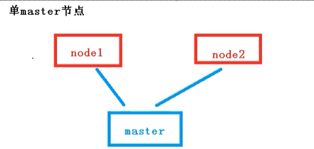
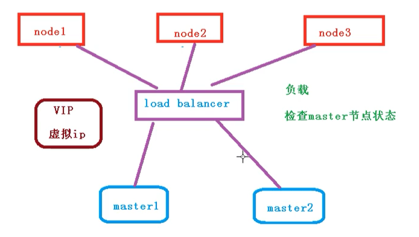
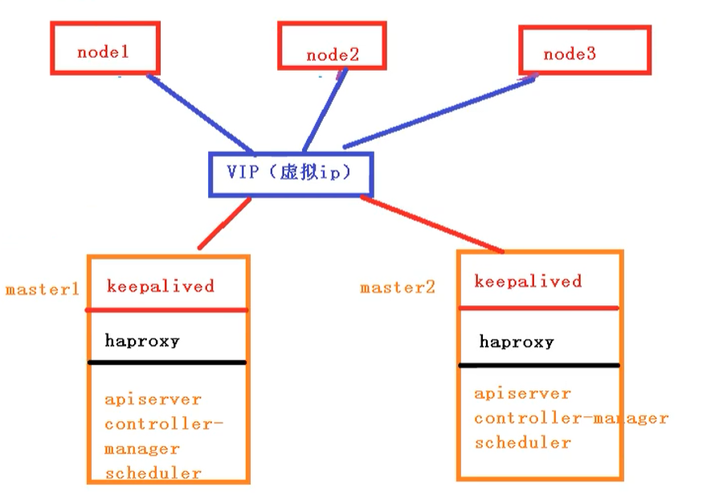
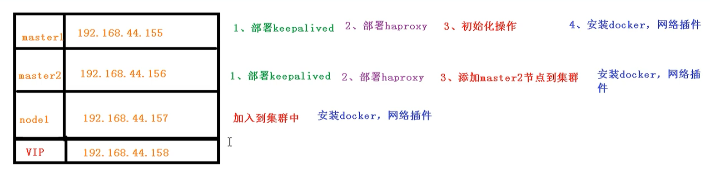
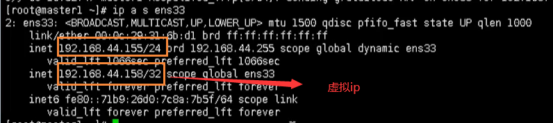

# 15. K8s高可用集群搭建

## 15.1 前言

之前我们搭建的集群，只有一个master节点，当master节点宕机的时候，通过node将无法继续访问，而master主要是管理作用，所以整个集群将无法提供服务



## 15.2 高可用集群

下面我们就需要搭建一个多master节点的高可用集群，不会存在单点故障问题

但是在node 和 master节点之间，需要存在一个 LoadBalancer组件，作用如下：

- 负载
- 检查master节点的状态



对外有一个统一的VIP：虚拟ip来对外进行访问

## 15.3 高可用集群技术细节

高可用集群技术细节如下所示：



- keepalived：配置虚拟ip，检查节点的状态
- haproxy：负载均衡服务【类似于nginx】
- apiserver：
- controller：
- manager：
- scheduler：

## 15.4 高可用集群步骤

我们采用2个master节点，一个node节点来搭建高可用集群，下面给出了每个节点需要做的事情



## 15.5 初始化操作

我们需要在这三个节点上进行操作

```bash
# 关闭防火墙
systemctl stop firewalld
systemctl disable firewalld

# 关闭selinux
# 永久关闭
sed -i 's/enforcing/disabled/' /etc/selinux/config  
# 临时关闭
setenforce 0  

# 关闭swap
# 临时
swapoff -a 
# 永久关闭
sed -ri 's/.*swap.*/#&/' /etc/fstab

# 根据规划设置主机名【master1节点上操作】
hostnamectl set-hostname master1
# 根据规划设置主机名【master2节点上操作】
hostnamectl set-hostname master2
# 根据规划设置主机名【node1节点操作】
hostnamectl set-hostname node1

# r添加hosts
cat >> /etc/hosts << EOF
192.168.222.12 master.k8s.io   k8s-vip
192.168.222.10 master01.k8s.io master1
192.168.222.11 master02.k8s.io master2
192.168.222.13 node01.k8s.io node1
EOF


# 将桥接的IPv4流量传递到iptables的链【3个节点上都执行】
cat > /etc/sysctl.d/k8s.conf << EOF
net.bridge.bridge-nf-call-ip6tables = 1
net.bridge.bridge-nf-call-iptables = 1
EOF

# 生效
sysctl --system  

# 时间同步
yum install ntpdate -y
ntpdate time.windows.com
```

## 15.6 部署keepAlived

下面我们需要在所有的master节点【master1和master2】上部署keepAlive

### 15.6.1 安装相关包

```bash
# 安装相关工具
yum install -y conntrack-tools libseccomp libtool-ltdl
# 安装keepalived
yum install -y keepalived
```

### 15.6.2 配置master节点

添加master1的配置

```bash
cat > /etc/keepalived/keepalived.conf <<EOF 
! Configuration File for keepalived

global_defs {
   router_id k8s
}

vrrp_script check_haproxy {
    script "killall -0 haproxy"
    interval 3
    weight -2
    fall 10
    rise 2
}

vrrp_instance VI_1 {
    state MASTER 
    interface ens33 
    virtual_router_id 51
    priority 250
    advert_int 1
    authentication {
        auth_type PASS
        auth_pass ceb1b3ec013d66163d6ab
    }
    virtual_ipaddress {
        192.168.222.12
    }
    track_script {
        check_haproxy
    }

}
EOF
```

添加master2的配置

```bash
cat > /etc/keepalived/keepalived.conf <<EOF 
! Configuration File for keepalived

global_defs {
   router_id k8s
}

vrrp_script check_haproxy {
    script "killall -0 haproxy"
    interval 3
    weight -2
    fall 10
    rise 2
}

vrrp_instance VI_1 {
    state BACKUP 
    interface ens33 
    virtual_router_id 51
    priority 200
    advert_int 1
    authentication {
        auth_type PASS
        auth_pass ceb1b3ec013d66163d6ab
    }
    virtual_ipaddress {
        192.168.222.12
    }
    track_script {
        check_haproxy
    }

}
EOF
```

### 15.6.3 启动和检查

在两台master节点都执行

```bash
# 启动keepalived
systemctl start keepalived.service
# 设置开机启动
systemctl enable keepalived.service
# 查看启动状态
systemctl status keepalived.service
```

启动后查看master的网卡信息

```bash
ip a s ens33
```




## 15.7 部署haproxy

haproxy主要做负载的作用，将我们的请求分担到不同的node节点上

### 15.7.1 安装

在**两个master节点**安装 haproxy

```bash
# 安装haproxy
yum install -y haproxy
```

### 15.7.2 配置

两台master节点的配置均相同，配置中声明了后端代理的两个master节点服务器，指定了haproxy运行的端口为16443等，因此16443端口为集群的入口

```bash
cat > /etc/haproxy/haproxy.cfg << EOF
#---------------------------------------------------------------------
# Global settings
#---------------------------------------------------------------------
global
    # to have these messages end up in /var/log/haproxy.log you will
    # need to:
    # 1) configure syslog to accept network log events.  This is done
    #    by adding the '-r' option to the SYSLOGD_OPTIONS in
    #    /etc/sysconfig/syslog
    # 2) configure local2 events to go to the /var/log/haproxy.log
    #   file. A line like the following can be added to
    #   /etc/sysconfig/syslog
    #
    #    local2.*                       /var/log/haproxy.log
    #
    log         127.0.0.1 local2
    
    chroot      /var/lib/haproxy
    pidfile     /var/run/haproxy.pid
    maxconn     4000
    user        haproxy
    group       haproxy
    daemon 
       
    # turn on stats unix socket
    stats socket /var/lib/haproxy/stats
#---------------------------------------------------------------------
# common defaults that all the 'listen' and 'backend' sections will
# use if not designated in their block
#---------------------------------------------------------------------  
defaults
    mode                    http
    log                     global
    option                  httplog
    option                  dontlognull
    option http-server-close
    option forwardfor       except 127.0.0.0/8
    option                  redispatch
    retries                 3
    timeout http-request    10s
    timeout queue           1m
    timeout connect         10s
    timeout client          1m
    timeout server          1m
    timeout http-keep-alive 10s
    timeout check           10s
    maxconn                 3000
#---------------------------------------------------------------------
# kubernetes apiserver frontend which proxys to the backends
#--------------------------------------------------------------------- 
frontend kubernetes-apiserver
    mode                 tcp
    bind                 *:16443
    option               tcplog
    default_backend      kubernetes-apiserver    
#---------------------------------------------------------------------
# round robin balancing between the various backends
#---------------------------------------------------------------------
backend kubernetes-apiserver
    mode        tcp
    balance     roundrobin
    server      master01.k8s.io   192.168.222.10:6443 check
    server      master02.k8s.io   192.168.222.11:6443 check
#---------------------------------------------------------------------
# collection haproxy statistics message
#---------------------------------------------------------------------
listen stats
    bind                 *:1080
    stats auth           admin:awesomePassword
    stats refresh        5s
    stats realm          HAProxy\ Statistics
    stats uri            /admin?stats
EOF
```

```bash
# 启动 haproxy
systemctl start haproxy
# 重新加载
systemctl reload haproxy.service
# 开启自启
systemctl enable haproxy
```
- 启动后，我们查看对应的端口是否包含 16443

```bash
netstat -tunlp | grep haproxy
```


## 15.8 安装Docker/Kubeadm/kubectl

**所有节点**安装Docker/kubeadm/kubelet ，Kubernetes默认CRI（容器运行时）为Docker，因此先安装Docker

### 15.8.1 安装Docker

首先配置一下Docker的阿里yum源

```bash
cat >/etc/yum.repos.d/docker.repo<<EOF
[docker-ce-edge]
name=Docker CE Edge - \$basearch
baseurl=https://mirrors.aliyun.com/docker-ce/linux/centos/7/\$basearch/edge
enabled=1
gpgcheck=1
gpgkey=https://mirrors.aliyun.com/docker-ce/linux/centos/gpg
EOF
```

然后yum方式安装docker

```bash
# yum安装
yum -y install docker-ce

# 查看docker版本
docker --version  

# 启动docker
systemctl enable docker
systemctl start docker
```

配置docker的镜像源

```bash
cat >> /etc/docker/daemon.json << EOF
{
  "registry-mirrors": ["https://b9pmyelo.mirror.aliyuncs.com"]
}
EOF
```

然后重启docker

```bash
systemctl restart docker
```

### 15.8.2 添加kubernetes软件源

然后我们还需要配置一下yum的k8s软件源

```bash
cat > /etc/yum.repos.d/kubernetes.repo << EOF
[kubernetes]
name=Kubernetes
baseurl=https://mirrors.aliyun.com/kubernetes/yum/repos/kubernetes-el7-x86_64
enabled=1
gpgcheck=0
repo_gpgcheck=0
gpgkey=https://mirrors.aliyun.com/kubernetes/yum/doc/yum-key.gpg https://mirrors.aliyun.com/kubernetes/yum/doc/rpm-package-key.gpg
EOF
```

### 15.8.3 安装kubeadm/kubelet/kubectl

由于版本更新频繁，这里指定版本号部署：

```bash
# 安装kubelet、kubeadm、kubectl，同时指定版本
yum install -y kubelet-1.18.0 kubeadm-1.18.0 kubectl-1.18.0
# 设置开机启动
systemctl enable kubelet
```

## 15.9 部署K8s Master【master节点】

### 15.9.1 创建kubeadm配置文件

**在具有vip的master上进行初始化操作，这里为master1**

```bash
# 创建文件夹
mkdir /usr/local/kubernetes/manifests -p
# 到manifests目录
cd /usr/local/kubernetes/manifests/
# 新建yaml文件
vi kubeadm-config.yaml
```

yaml内容如下所示：

```bash
apiServer:
  certSANs:
    - master1
    - master2
    - master.k8s.io
    - 192.168.222.10
    - 192.168.222.11
    - 192.168.222.12
    - 127.0.0.1
  extraArgs:
    authorization-mode: Node,RBAC
  timeoutForControlPlane: 4m0s
apiVersion: kubeadm.k8s.io/v1beta1
certificatesDir: /etc/kubernetes/pki
clusterName: kubernetes
controlPlaneEndpoint: "master.k8s.io:16443"
controllerManager: {}
dns: 
  type: CoreDNS
etcd:
  local:    
    dataDir: /var/lib/etcd
imageRepository: registry.aliyuncs.com/google_containers
kind: ClusterConfiguration
kubernetesVersion: v1.18.0
networking: 
  dnsDomain: cluster.local  
  podSubnet: 10.244.0.0/16
  serviceSubnet: 10.1.0.0/16
scheduler: {}
```

- 然后我们在 master1 节点执行

```bash
kubeadm init --config kubeadm-config.yaml
```

- 执行完成后，就会在拉取我们的进行了【需要等待...】

```log

Your Kubernetes control-plane has initialized successfully!

To start using your cluster, you need to run the following as a regular user:

  mkdir -p $HOME/.kube
  sudo cp -i /etc/kubernetes/admin.conf $HOME/.kube/config
  sudo chown $(id -u):$(id -g) $HOME/.kube/config

You should now deploy a pod network to the cluster.
Run "kubectl apply -f [podnetwork].yaml" with one of the options listed at:
  https://kubernetes.io/docs/concepts/cluster-administration/addons/

You can now join any number of control-plane nodes by copying certificate authorities
and service account keys on each node and then running the following as root:

  kubeadm join master.k8s.io:16443 --token h0374k.7bfmnkt7fgibm8vs \
    --discovery-token-ca-cert-hash sha256:3bce51eef41c2e22f0f76689876a6dfc5bb8c7c0e0af036815a78dfbe51a8095 \
    --control-plane 

Then you can join any number of worker nodes by running the following on each as root:

kubeadm join master.k8s.io:16443 --token h0374k.7bfmnkt7fgibm8vs \
    --discovery-token-ca-cert-hash sha256:3bce51eef41c2e22f0f76689876a6dfc5bb8c7c0e0af036815a78dfbe51a8095 

```

- 按照提示配置环境变量，使用kubectl工具

```bash
# 执行下方命令
mkdir -p $HOME/.kube
sudo cp -i /etc/kubernetes/admin.conf $HOME/.kube/config
sudo chown $(id -u):$(id -g) $HOME/.kube/config
# 查看节点
kubectl get nodes
# 查看pod
kubectl get pods -n kube-system
```

**按照提示保存以下内容，一会要使用：**

```bash
kubeadm join master.k8s.io:16443 --token h0374k.7bfmnkt7fgibm8vs \
    --discovery-token-ca-cert-hash sha256:3bce51eef41c2e22f0f76689876a6dfc5bb8c7c0e0af036815a78dfbe51a8095 

```

> --control-plane ： 只有在添加master节点的时候才有

- 查看集群状态

```bash
# 查看集群状态
kubectl get cs
# 查看pod
kubectl get pods -n kube-system

#--------------------------------------------------
[root@master1 manifests]# kubectl get nodes
NAME      STATUS     ROLES    AGE    VERSION
master1   NotReady   master   102s   v1.18.0
[root@master1 manifests]# kubectl get pods -n kube-system
NAME                              READY   STATUS    RESTARTS   AGE
coredns-7ff77c879f-858zr          0/1     Pending   0          91s
coredns-7ff77c879f-x5wm8          0/1     Pending   0          91s
etcd-master1                      1/1     Running   0          107s
kube-apiserver-master1            1/1     Running   0          106s
kube-controller-manager-master1   1/1     Running   0          106s
kube-proxy-f9bq8                  1/1     Running   0          91s
kube-scheduler-master1            1/1     Running   0          106s
[root@master1 manifests]# kubectl get cs
NAME                 STATUS    MESSAGE             ERROR
scheduler            Healthy   ok                  
controller-manager   Healthy   ok                  
etcd-0               Healthy   {"health":"true"}  
```

## 15.10 安装集群网络

从官方地址获取到flannel的yaml，**在master1上执行**

```bash
# 创建文件夹
mkdir flannel
cd flannel
# 下载yaml文件
wget -c https://raw.githubusercontent.com/coreos/flannel/master/Documentation/kube-flannel.yml
```

- 安装flannel网络

```bash
kubectl apply -f kube-flannel.yml 
```

- 检查

```bash
kubectl get pods -n kube-system
```

## 15.11 master2节点加入集群

### 15.11.1 复制密钥及相关文件

从master1复制密钥及相关文件到master2

```bash
# ssh root@192.168.222.11 mkdir -p /etc/kubernetes/pki/etcd

# scp /etc/kubernetes/admin.conf root@192.168.222.11:/etc/kubernetes
   
# scp /etc/kubernetes/pki/{ca.*,sa.*,front-proxy-ca.*} root@192.168.222.11:/etc/kubernetes/pki
   
# scp /etc/kubernetes/pki/etcd/ca.* root@192.168.222.11:/etc/kubernetes/pki/etcd
```

```bash
[root@master1 ~]# ssh root@192.168.222.11 mkdir -p /etc/kubernetes/pki/etcd
The authenticity of host '192.168.222.11 (192.168.222.11)' can't be established.
ECDSA key fingerprint is SHA256:iq94y4+nr8TkjgstjxmwikeqeBupiEAxz0FVY8eIAbk.
ECDSA key fingerprint is MD5:be:63:31:6b:c9:9d:9d:f7:2b:3b:8a:ab:f8:2b:0a:ff.
Are you sure you want to continue connecting (yes/no)? yes
Warning: Permanently added '192.168.222.11' (ECDSA) to the list of known hosts.
root@192.168.222.11's password: 
[root@master1 ~]# scp /etc/kubernetes/admin.conf root@192.168.222.11:/etc/kubernetes
root@192.168.222.11's password: 
admin.conf  100% 5450   175.4KB/s   00:00    

[root@master1 ~]# scp /etc/kubernetes/pki/{ca.*,sa.*,front-proxy-ca.*} root@192.168.222.11:/etc/kubernetes/pki
root@192.168.222.11's password: 
ca.crt                         100% 1025   975.3KB/s   00:00    
ca.key                         100% 1675   771.7KB/s   00:00    
sa.key                         100% 1679   786.1KB/s   00:00    
sa.pub                         100%  451   325.5KB/s   00:00    
front-proxy-ca.crt             100% 1038   762.8KB/s   00:00    
front-proxy-ca.key             100% 1679    16.9KB/s   00:00    
[root@master1 ~]# scp /etc/kubernetes/pki/etcd/ca.* root@192.168.222.11:/etc/kubernetes/pki/etcd
root@192.168.222.11's password: 
ca.crt         100% 1017   885.5KB/s   00:00    
ca.key         100% 1675    21.0KB/s   00:00 
```

###  15.11.2 master2加入集群

执行在master1上init后输出的join命令,需要带上参数`--control-plane`表示把master控制节点加入集群

```bash
kubeadm join master.k8s.io:16443 --token ckf7bs.30576l0okocepg8b     --discovery-token-ca-cert-hash sha256:19afac8b11182f61073e254fb57b9f19ab4d798b70501036fc69ebef46094aba --control-plane
```

```log
[etcd] Announced new etcd member joining to the existing etcd cluster
[etcd] Creating static Pod manifest for "etcd"
[etcd] Waiting for the new etcd member to join the cluster. This can take up to 40s
{"level":"warn","ts":"2021-12-20T09:17:14.598+0800","caller":"clientv3/retry_interceptor.go:61","msg":"retrying of unary invoker failed","target":"passthrough:///https://192.168.222.11:2379","attempt":0,"error":"rpc error: code = DeadlineExceeded desc = context deadline exceeded"}
[upload-config] Storing the configuration used in ConfigMap "kubeadm-config" in the "kube-system" Namespace
[mark-control-plane] Marking the node master2 as control-plane by adding the label "node-role.kubernetes.io/master=''"
[mark-control-plane] Marking the node master2 as control-plane by adding the taints [node-role.kubernetes.io/master:NoSchedule]

This node has joined the cluster and a new control plane instance was created:

* Certificate signing request was sent to apiserver and approval was received.
* The Kubelet was informed of the new secure connection details.
* Control plane (master) label and taint were applied to the new node.
* The Kubernetes control plane instances scaled up.
* A new etcd member was added to the local/stacked etcd cluster.

To start administering your cluster from this node, you need to run the following as a regular user:

	mkdir -p $HOME/.kube
	sudo cp -i /etc/kubernetes/admin.conf $HOME/.kube/config
	sudo chown $(id -u):$(id -g) $HOME/.kube/config

Run 'kubectl get nodes' to see this node join the cluster.

[root@master2 ~]# kubectl describe configmaps kubeadm-config -n kube-system
error: Missing or incomplete configuration info.  Please point to an existing, complete config file:

  1. Via the command-line flag --kubeconfig
  2. Via the KUBECONFIG environment variable
  3. In your home directory as ~/.kube/config

To view or setup config directly use the 'config' command.
```

- 检查状态

```bash
kubectl get node

kubectl get pods --all-namespaces

#---------------------------------------------------
[root@master1 flannel]# kubectl get node
NAME      STATUS   ROLES    AGE     VERSION
master1   Ready    master   22m     v1.18.0
master2   Ready    master   9m16s   v1.18.0
[root@master1 flannel]# 
[root@master1 flannel]# kubectl get pods --all-namespaces
NAMESPACE     NAME                              READY   STATUS    RESTARTS   AGE
kube-system   coredns-7ff77c879f-858zr          1/1     Running   0          22m
kube-system   coredns-7ff77c879f-x5wm8          1/1     Running   0          22m
kube-system   etcd-master1                      1/1     Running   0          22m
kube-system   etcd-master2                      1/1     Running   0          9m18s
kube-system   kube-apiserver-master1            1/1     Running   0          22m
kube-system   kube-apiserver-master2            1/1     Running   0          9m18s
kube-system   kube-controller-manager-master1   1/1     Running   1          22m
kube-system   kube-controller-manager-master2   1/1     Running   0          9m19s
kube-system   kube-flannel-ds-5bctn             1/1     Running   0          9m20s
kube-system   kube-flannel-ds-llmtj             1/1     Running   0          16m
kube-system   kube-proxy-f9bq8                  1/1     Running   0          22m
kube-system   kube-proxy-t7nsq                  1/1     Running   0          9m20s
kube-system   kube-scheduler-master1            1/1     Running   1          22m
kube-system   kube-scheduler-master2            1/1     Running   0          9m19s

```

## 15.12 加入K8s Node

在node1上执行

向集群添加新节点，执行在kubeadm init输出的kubeadm join命令：

```bash
kubeadm join master.k8s.io:16443 --token ckf7bs.30576l0okocepg8b     --discovery-token-ca-cert-hash sha256:19afac8b11182f61073e254fb57b9f19ab4d798b70501036fc69ebef46094aba
```
- 日志
```log
[root@localhost ~]# kubeadm join master.k8s.io:16443 --token hlm12p.elt3266geztclp9m --discovery-token-ca-cert-hash sha256:d7b1ccdef42101f8297bef50d6668a139bbbe86d3148716129e12cb6767989e8
W1220 09:32:12.188534   25826 join.go:346] [preflight] WARNING: JoinControlPane.controlPlane settings will be ignored when control-plane flag is not set.
[preflight] Running pre-flight checks
	[WARNING IsDockerSystemdCheck]: detected "cgroupfs" as the Docker cgroup driver. The recommended driver is "systemd". Please follow the guide at https://kubernetes.io/docs/setup/cri/
[preflight] Reading configuration from the cluster...
[preflight] FYI: You can look at this config file with 'kubectl -n kube-system get cm kubeadm-config -oyaml'
[kubelet-start] Downloading configuration for the kubelet from the "kubelet-config-1.18" ConfigMap in the kube-system namespace
[kubelet-start] Writing kubelet configuration to file "/var/lib/kubelet/config.yaml"
[kubelet-start] Writing kubelet environment file with flags to file "/var/lib/kubelet/kubeadm-flags.env"
[kubelet-start] Starting the kubelet
[kubelet-start] Waiting for the kubelet to perform the TLS Bootstrap...

This node has joined the cluster:
* Certificate signing request was sent to apiserver and a response was received.
* The Kubelet was informed of the new secure connection details.

Run 'kubectl get nodes' on the control-plane to see this node join the cluster.
```

```log
[root@master1 flannel]# kubectl get node
NAME      STATUS     ROLES    AGE   VERSION
master1   Ready      master   29m   v1.18.0
master2   Ready      master   16m   v1.18.0
node1     NotReady   <none>   43s   v1.18.0
[root@master1 flannel]# kubectl get pods --all-namespaces
NAMESPACE     NAME                              READY   STATUS     RESTARTS   AGE
kube-system   coredns-7ff77c879f-858zr          1/1     Running    0          29m
kube-system   coredns-7ff77c879f-x5wm8          1/1     Running    0          29m
kube-system   etcd-master1                      1/1     Running    0          29m
kube-system   etcd-master2                      1/1     Running    0          16m
kube-system   kube-apiserver-master1            1/1     Running    0          29m
kube-system   kube-apiserver-master2            1/1     Running    0          16m
kube-system   kube-controller-manager-master1   1/1     Running    1          29m
kube-system   kube-controller-manager-master2   1/1     Running    0          16m
kube-system   kube-flannel-ds-2ppq7             0/1     Init:1/2   0          47s
kube-system   kube-flannel-ds-5bctn             1/1     Running    0          16m
kube-system   kube-flannel-ds-llmtj             1/1     Running    0          23m
kube-system   kube-proxy-crjr6                  1/1     Running    0          47s
kube-system   kube-proxy-f9bq8                  1/1     Running    0          29m
kube-system   kube-proxy-t7nsq                  1/1     Running    0          16m
kube-system   kube-scheduler-master1            1/1     Running    1          29m
kube-system   kube-scheduler-master2            1/1     Running    0          16m
```
-------------------------------

**集群网络重新安装，因为添加了新的node节点**
```bash
# master节点执行
kubectl delete -f kube-flannel.yml 
kubectl apply -f kube-flannel.yml 
```

- 检查状态

```bash
kubectl get node
kubectl get pods --all-namespaces

# 实际操作日志---------------------
[root@master1 flannel]# kubectl get node
NAME      STATUS   ROLES    AGE     VERSION
master1   Ready    master   32m     v1.18.0
master2   Ready    master   19m     v1.18.0
node1     Ready    <none>   4m17s   v1.18.0
[root@master1 flannel]# kubectl get pods --all-namespaces
NAMESPACE     NAME                              READY   STATUS    RESTARTS   AGE
kube-system   coredns-7ff77c879f-858zr          1/1     Running   0          32m
kube-system   coredns-7ff77c879f-x5wm8          1/1     Running   0          32m
kube-system   etcd-master1                      1/1     Running   0          32m
kube-system   etcd-master2                      1/1     Running   0          19m
kube-system   kube-apiserver-master1            1/1     Running   0          32m
kube-system   kube-apiserver-master2            1/1     Running   0          19m
kube-system   kube-controller-manager-master1   1/1     Running   1          32m
kube-system   kube-controller-manager-master2   1/1     Running   0          19m
kube-system   kube-flannel-ds-59djg             1/1     Running   0          23s
kube-system   kube-flannel-ds-cp22q             1/1     Running   0          23s
kube-system   kube-flannel-ds-vltjq             1/1     Running   0          23s
kube-system   kube-proxy-crjr6                  1/1     Running   0          4m23s
kube-system   kube-proxy-f9bq8                  1/1     Running   0          32m
kube-system   kube-proxy-t7nsq                  1/1     Running   0          19m
kube-system   kube-scheduler-master1            1/1     Running   1          32m
kube-system   kube-scheduler-master2            1/1     Running   0          19m

```

## 15.13 测试kubernetes集群

在Kubernetes集群中创建一个pod，验证是否正常运行：

```bash
# 创建nginx deployment 
kubectl create deployment nginx --image=nginx
# 暴露端口
kubectl expose deployment nginx --port=80 --type=NodePort
# 查看状态
kubectl get pod,svc
```

- 然后我们通过任何一个节点，都能够访问我们的nginx页面
```bash
[root@master1 flannel]# kubectl get pod,svc
NAME                        READY   STATUS    RESTARTS   AGE
pod/nginx-f89759699-c24zc   1/1     Running   0          18s

NAME                 TYPE        CLUSTER-IP     EXTERNAL-IP   PORT(S)        AGE
service/kubernetes   ClusterIP   10.1.0.1       <none>        443/TCP        36m
service/nginx        NodePort    10.1.101.161   <none>        80:30974/TCP   7s
```

访问地址：http://NodeIP:Port 

[http://192.168.222.10:30974/]
[http://192.168.222.11:30974/]
[http://192.168.222.12:30974/]
[http://192.168.222.13:30974/]

http://192.168.222.13:30974/

### 问题

```log
[root@localhost haproxy]# systemctl status haproxy
● haproxy.service - HAProxy Load Balancer
   Loaded: loaded (/usr/lib/systemd/system/haproxy.service; disabled; vendor preset: disabled)
   Active: failed (Result: exit-code) since 日 2021-12-19 18:24:13 CST; 1s ago
  Process: 27689 ExecStart=/usr/sbin/haproxy-systemd-wrapper -f /etc/haproxy/haproxy.cfg -p /run/haproxy.pid $OPTIONS (code=exited, status=1/FAILURE)
 Main PID: 27689 (code=exited, status=1/FAILURE)

12月 19 18:24:13 master2 systemd[1]: Started HAProxy Load Balancer.
12月 19 18:24:13 master2 haproxy-systemd-wrapper[27689]: haproxy-systemd-wrapper: executing /usr/sbin/haproxy -f /etc/haproxy/haproxy.cfg -p /run/haproxy.pid -Ds
12月 19 18:24:13 master2 haproxy-systemd-wrapper[27689]: [WARNING] 352/182413 (27690) : config : 'option forwardfor' ignored for frontend 'kubernetes-apiserver' as it requires HTTP mode.
12月 19 18:24:13 master2 haproxy-systemd-wrapper[27689]: [WARNING] 352/182413 (27690) : config : 'option forwardfor' ignored for backend 'kubernetes-apiserver' as it requires HTTP mode.
12月 19 18:24:13 master2 haproxy-systemd-wrapper[27689]: [ALERT] 352/182413 (27690) : Starting frontend kubernetes-apiserver: cannot bind socket [0.0.0.0:16443]
12月 19 18:24:13 master2 haproxy-systemd-wrapper[27689]: [ALERT] 352/182413 (27690) : Starting proxy stats: cannot bind socket [0.0.0.0:1080]
12月 19 18:24:13 master2 haproxy-systemd-wrapper[27689]: haproxy-systemd-wrapper: exit, haproxy RC=1
12月 19 18:24:13 master2 systemd[1]: haproxy.service: main process exited, code=exited, status=1/FAILURE
12月 19 18:24:13 master2 systemd[1]: Unit haproxy.service entered failed state.
12月 19 18:24:13 master2 systemd[1]: haproxy.service failed.
-------------------------------
● haproxy.service - HAProxy Load Balancer
   Loaded: loaded (/usr/lib/systemd/system/haproxy.service; disabled; vendor preset: disabled)
   Active: failed (Result: exit-code) since 日 2021-12-19 18:36:28 CST; 2s ago
  Process: 27858 ExecStart=/usr/sbin/haproxy-systemd-wrapper -f /etc/haproxy/haproxy.cfg -p /run/haproxy.pid $OPTIONS (code=exited, status=1/FAILURE)
 Main PID: 27858 (code=exited, status=1/FAILURE)

12月 19 18:36:28 master2 systemd[1]: Started HAProxy Load Balancer.
12月 19 18:36:28 master2 haproxy-systemd-wrapper[27858]: haproxy-systemd-wrapper: executing /usr/sbin/haproxy -f /etc/haproxy/haproxy.cfg -p /run/haproxy.pid -Ds
12月 19 18:36:28 master2 haproxy-systemd-wrapper[27858]: [ALERT] 352/183628 (27859) : Starting frontend kubernetes-apiserver: cannot bind socket [0.0.0.0:16443]
12月 19 18:36:28 master2 haproxy-systemd-wrapper[27858]: [ALERT] 352/183628 (27859) : Starting proxy stats: cannot bind socket [0.0.0.0:1080]
```

 config : 'option forwardfor' ignored for backend 'kubernetes-apiserver' as it requires HTTP mode

 直接把#   option forwardfor       except 127.0.0.0/8  
注释掉重启就行。

setsebool -P haproxy_connect_any=1

要不把selinux干掉也行