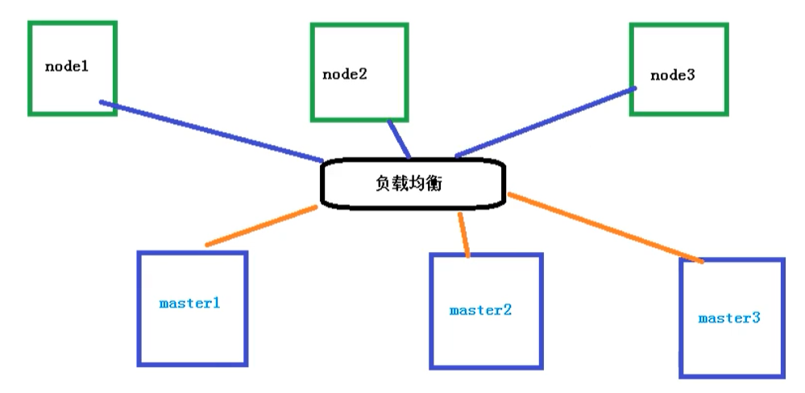
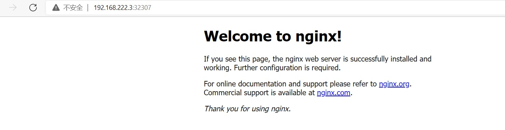

# 2. kubeadm方式搭建K8S集群
[[toc]]
## 2.1 搭建k8s环境平台规划

### 2.1.1单master集群

单个master节点，然后管理多个node节点


### 2.1.2 多master集群

多个master节点，管理多个node节点，同时中间多了一个负载均衡的过程



## 2.2 服务器硬件配置要求

### 2.2.1 测试环境

master：2核  4G  20G

node：   4核  8G  40G

### 2.2.2 生产环境

master：8核  16G  100G

node：   16核  64G  200G

目前生产部署Kubernetes集群主要有两种方式

### 2.2.3 kubeadm

kubeadm是一个K8S部署工具，提供kubeadm init 和 kubeadm join，用于快速部署Kubernetes集群

官网地址：[点我传送](https://kubernetes.io/zh/docs/setup/production-environment/tools/kubeadm/install-kubeadm/)

### 2.2.4 二进制包

从github下载发行版的二进制包，手动部署每个组件，组成Kubernetes集群。

Kubeadm降低部署门槛，但屏蔽了很多细节，遇到问题很难排查。如果想更容易可控，推荐使用二进制包部署Kubernetes集群，虽然手动部署麻烦点，期间可以学习很多工作原理，也利于后期维护。

-----------------------------------------

## 2.3 Kubeadm部署集群

kubeadm 是官方社区推出的一个用于快速部署kubernetes 集群的工具，这个工具能通过两条指令完成一个kubernetes 集群的部署：

- 创建一个Master 节点kubeadm init
- 将Node 节点加入到当前集群中$ kubeadm join <Master 节点的IP 和端口>

kubeadm是官方社区推出的一个用于快速部署kubernetes集群的工具。

这个工具能通过两条指令完成一个kubernetes集群的部署：
```bash
# 创建一个 Master 节点
kubeadm init

# 将一个 Node 节点加入到当前集群中
kubeadm join <Master节点的IP和端口 >
```

### 2.3.1 安装要求

在开始之前，部署Kubernetes集群机器需要满足以下几个条件

- 一台或多台机器，操作系统为Centos7.X
- 硬件配置：2GB或更多GAM，2个CPU或更多CPU，硬盘30G
- 集群中所有机器之间网络互通
- 可以访问外网，需要拉取镜像
- 禁止swap分区


| 角色   | IP              |
| ------ | --------------- |
| master | 192.168.222.3 |
| node1  | 192.168.222.4 |
| node2  | 192.168.222.5 |

### 2.3.2 Kubeadm搭建K8S集群
:::tip 使用kubeadm方式搭建K8s集群主要分为以下几步

- 准备三台虚拟机，同时安装操作系统CentOS 7.x

- 对三个安装之后的操作系统进行初始化操作

- 在三个节点安装 docker kubelet kubeadm kubectl

- 在master节点执行kubeadm init命令初始化

- 在node节点上执行 kubeadm join命令，把node节点添加到当前集群

- 配置CNI网络插件，用于节点之间的连通【失败了可以多试几次】

- 通过拉取一个nginx进行测试，能否进行外网测试
:::


### 2.3.3 系统参数调整
然后开始在每台机器上执行下面的命令
```sh
# 关闭防火墙
systemctl stop firewalld
systemctl disable firewalld

# 关闭selinux
# 永久关闭
sed -i 's/enforcing/disabled/' /etc/selinux/config  
# 临时关闭
setenforce 0  

# 关闭swap
# 临时
swapoff -a 
# 永久关闭
sed -ri 's/.*swap.*/#&/' /etc/fstab

# 根据规划设置主机名【master节点上操作】
hostnamectl set-hostname k8smaster
# 根据规划设置主机名【node1节点操作】
hostnamectl set-hostname k8snode1
# 根据规划设置主机名【node2节点操作】
hostnamectl set-hostname k8snode2

# 在master添加hosts
cat >> /etc/hosts << EOF
192.168.222.3 k8smaster
192.168.222.4 k8snode1
192.168.222.5 k8snode2
EOF


# 将桥接的IPv4流量传递到iptables的链
cat > /etc/sysctl.d/k8s.conf << EOF
net.bridge.bridge-nf-call-ip6tables = 1
net.bridge.bridge-nf-call-iptables = 1
EOF
# 生效
sysctl --system  

# 时间同步
yum install ntpdate -y
ntpdate time.windows.com
```

#### 所有节点安装Docker/kubeadm/kubelet ，Kubernetes默认CRI（容器运行时）为Docker，因此先安装Docker

- 以下三步每台服务器都要执行

### 2.3.4 安装Docker

```sh
cat >/etc/yum.repos.d/docker.repo<<EOF
[docker-ce-edge]
name=Docker CE Edge - \$basearch
baseurl=https://mirrors.aliyun.com/docker-ce/linux/centos/7/\$basearch/edge
enabled=1
gpgcheck=1
gpgkey=https://mirrors.aliyun.com/docker-ce/linux/centos/gpg
EOF
```
- 然后yum方式安装docker
```sh
# yum安装
yum -y install docker-ce

# 查看docker版本
docker --version  

# 启动docker
systemctl enable docker
systemctl start docker
```
- 配置docker的镜像源
```bash
cat >> /etc/docker/daemon.json << EOF
{
  "registry-mirrors": ["https://b9pmyelo.mirror.aliyuncs.com"]
}
EOF
```
- 然后重启docker

```
systemctl restart docker
```

### 2.3.5 添加kubernetes软件源

然后我们还需要配置一下yum的k8s软件源
```bash
cat > /etc/yum.repos.d/kubernetes.repo << EOF
[kubernetes]
name=Kubernetes
baseurl=https://mirrors.aliyun.com/kubernetes/yum/repos/kubernetes-el7-x86_64
enabled=1
gpgcheck=0
repo_gpgcheck=0
gpgkey=https://mirrors.aliyun.com/kubernetes/yum/doc/yum-key.gpg https://mirrors.aliyun.com/kubernetes/yum/doc/rpm-package-key.gpg
EOF
```

### 2.3.6 安装kubeadm/kubelet/kubectl
由于版本更新频繁，这里指定版本号部署：
```bash
# 安装kubelet、kubeadm、kubectl，同时指定版本
yum install -y kubelet-1.18.0 kubeadm-1.18.0 kubectl-1.18.0
# 设置开机启动
systemctl enable kubelet
```

____________________________________

### 2.3.6 部署K8s Master[master节点]

- 在   192.168.222.3  执行，也就是master节点
```shell
kubeadm init --apiserver-advertise-address=192.168.222.3 --image-repository registry.aliyuncs.com/google_containers --kubernetes-version v1.18.0 --service-cidr=10.96.0.0/12  --pod-network-cidr=10.244.0.0/16
```

- 由于默认拉取镜像地址k8s.gcr.io国内无法访问，这里指定阿里云镜像仓库地址，【执行上述命令会比较慢，因为后台其实已经在拉取镜像了】，我们 docker images 命令即可查看已经拉取的镜像

```bash
[root@k8smaster ~]# docker images
REPOSITORY                                                        TAG                 IMAGE ID            CREATED             SIZE
registry.aliyuncs.com/google_containers/kube-proxy                v1.18.0             43940c34f24f        21 months ago       117MB
registry.aliyuncs.com/google_containers/kube-apiserver            v1.18.0             74060cea7f70        21 months ago       173MB
registry.aliyuncs.com/google_containers/kube-controller-manager   v1.18.0             d3e55153f52f        21 months ago       162MB
registry.aliyuncs.com/google_containers/kube-scheduler            v1.18.0             a31f78c7c8ce        21 months ago       95.3MB
registry.aliyuncs.com/google_containers/pause                     3.2                 80d28bedfe5d        22 months ago       683kB
registry.aliyuncs.com/google_containers/coredns                   1.6.7               67da37a9a360        22 months ago       43.8MB
registry.aliyuncs.com/google_containers/etcd                      3.4.3-0             303ce5db0e90        2 years ago         288MB

```

- 当我们出现下面的情况时，表示kubernetes的镜像已经安装成功
```log
[kubelet-finalize] Updating "/etc/kubernetes/kubelet.conf" to point to a rotatable kubelet client certificate and key
[addons] Applied essential addon: CoreDNS
[addons] Applied essential addon: kube-proxy

Your Kubernetes control-plane has initialized successfully!

To start using your cluster, you need to run the following as a regular user:

  mkdir -p $HOME/.kube
  sudo cp -i /etc/kubernetes/admin.conf $HOME/.kube/config
  sudo chown $(id -u):$(id -g) $HOME/.kube/config

You should now deploy a pod network to the cluster.
Run "kubectl apply -f [podnetwork].yaml" with one of the options listed at:
  https://kubernetes.io/docs/concepts/cluster-administration/addons/

Then you can join any number of worker nodes by running the following on each as root:

kubeadm join 192.168.222.3:6443 --token xcl63i.8ucjiwg0js5dsln2 \
    --discovery-token-ca-cert-hash sha256:7edd0241a5af6d3dec25e674018d95191f66afd6ecda2ef5ce02b2d328665ab5 

```

- 使用kubectl工具 【master节点操作】
```bash
mkdir -p $HOME/.kube
sudo cp -i /etc/kubernetes/admin.conf $HOME/.kube/config
sudo chown $(id -u):$(id -g) $HOME/.kube/config
```
- 执行完成后，我们使用下面命令，查看我们正在运行的节点

```bash
[root@k8smaster ~]# kubectl get nodes
NAME        STATUS     ROLES    AGE   VERSION
k8smaster   NotReady   master   37m   v1.18.0

```

能够看到，目前有一个master节点已经运行了，但是还处于未准备状态

下面我们还需要在Node节点执行其它的命令，将node1和node2加入到我们的master节点上

### 2.3.7 加入K8s Node[Slave节点]

下面我们需要到 node1 和 node2服务器，执行下面的代码向集群添加新节点

- 执行在kubeadm init输出的kubeadm join命令：

```bash
kubeadm join 192.168.222.3:6443 --token xcl63i.8ucjiwg0js5dsln2 \
    --discovery-token-ca-cert-hash sha256:7edd0241a5af6d3dec25e674018d95191f66afd6ecda2ef5ce02b2d328665ab5 
```

**注意，以下的命令是在master初始化完成后，每个人的都不一样！！！需要复制自己生成的**

- 默认token有效期为24小时，当过期之后，该token就不可用了。这时就需要重新创建token，操作如下：
```bash
#主节点执行
kubeadm token create --print-join-command
```

- 当我们把两个节点都加入进来后，我们就可以去Master节点 执行下面命令查看情况
```shell
[root@k8smaster ~]# kubectl get nodes
NAME        STATUS     ROLES    AGE   VERSION
k8s-node1   NotReady   <none>   10m   v1.18.0
k8smaster   NotReady   master   37m   v1.18.0

```


### 2.3.7 部署CNI网络插件[Master]

- 上面的状态还是NotReady，下面我们需要网络插件，来进行联网访问
```bash
# 下载网络插件配置
[root@k8smaster ~]# wget https://raw.githubusercontent.com/coreos/flannel/master/Documentation/kube-flannel.yml
--2021-12-17 10:02:31--  https://raw.githubusercontent.com/coreos/flannel/master/Documentation/kube-flannel.yml
正在解析主机 raw.githubusercontent.com (raw.githubusercontent.com)... 185.199.109.133, 185.199.110.133, 185.199.111.133, ...
正在连接 raw.githubusercontent.com (raw.githubusercontent.com)|185.199.109.133|:443... 已连接。
无法建立 SSL 连接。
```
- 默认镜像地址无法访问，sed命令修改为docker hub镜像仓库。

```bash
# 添加
kubectl apply -f https://raw.githubusercontent.com/coreos/flannel/master/Documentation/kube-flannel.yml

##①首先下载v0.13.1-rc2-amd64 镜像
##参考博客：https://www.cnblogs.com/pyxuexi/p/14288591.html
##② 导入镜像，命令，，特别提示，3个机器都需要导入，3个机器都需要导入，3个机器都需要导入，3个机器都需要导入，重要的事情说3遍。不然抱错。如果没有操作，报错后，需要删除节点，重置，在导入镜像，重新加入才行。本地就是这样操作成功的！
docker load < flanneld-v0.13.1-rc2-amd64.docker
#####下载本地，替换将image: quay.io/coreos/flannel:v0.13.1-rc2 替换为 image: quay.io/coreos/flannel:v0.13.1-rc2-amd64
[root@k8s-node1 ~]# docker load < flanneld-v0.13.1-rc2-amd64.docker
-bash: flanneld-v0.13.1-rc2-amd64.docker: 没有那个文件或目录

```
- 查看状态 【kube-system是k8s中的最小单元】
```bash
# 查看状态 【kube-system是k8s中的最小单元】
[root@k8smaster ~]# kubectl get pods -n kube-system
NAME                                READY   STATUS    RESTARTS   AGE
coredns-7ff77c879f-qxvdq            1/1     Running   0          107m
coredns-7ff77c879f-xjdns            1/1     Running   0          107m
etcd-k8smaster                      1/1     Running   0          108m
kube-apiserver-k8smaster            1/1     Running   0          108m
kube-controller-manager-k8smaster   1/1     Running   0          108m
kube-flannel-ds-jjvlz               1/1     Running   0          43m
kube-flannel-ds-rvjwz               1/1     Running   0          43m
kube-flannel-ds-v85kl               1/1     Running   0          43m
kube-proxy-7bcgd                    1/1     Running   0          56m
kube-proxy-rph7z                    1/1     Running   1          81m
kube-proxy-wrs8q                    1/1     Running   0          107m
kube-scheduler-k8smaster            1/1     Running   0          108m

[root@k8smaster ~]# kubectl get node
NAME        STATUS   ROLES    AGE    VERSION
k8s-node1   Ready    <none>   82m    v1.18.0
k8s-node2   Ready    <none>   56m    v1.18.0
k8smaster   Ready    master   108m   v1.18.0

```

- 如果上述操作完成后，还存在某个节点处于NotReady状态，可以在Master将该节点删除
```bash
# master节点将该节点删除

##20210223 yan 查阅资料添加###kubectl drain k8snode1 --delete-local-data --force --ignore-daemonsets

kubectl delete node k8snode1
 
# 然后到k8snode1节点进行重置
 kubeadm reset
# 重置完后在加入
kubeadm join 192.168.222.3:6443 --token xcl63i.8ucjiwg0js5dsln2 \
    --discovery-token-ca-cert-hash sha256:7edd0241a5af6d3dec25e674018d95191f66afd6ecda2ef5ce02b2d328665ab5 
```


### 2.3.8 测试kubernetes集群[Master]

我们都知道K8S是容器化技术，它可以联网去下载镜像，用容器的方式进行启动

- 在Kubernetes集群中创建一个pod，验证是否正常运行：

```bash
# 下载nginx 【会联网拉取nginx镜像】
kubectl create deployment nginx --image=nginx
# 查看状态
kubectl get pod
```
- 如果我们出现Running状态的时候，表示已经成功运行了

```bash
[root@k8smaster ~]# kubectl get pod
NAME                    READY   STATUS    RESTARTS   AGE
nginx-f89759699-xffhv   1/1     Running   0          17m

```
- 下面我们就需要将端口暴露出去，让其它外界能够访问

```bash
# 暴露端口
kubectl expose deployment nginx --port=80 --type=NodePort
# 查看一下对外的端口
kubectl get pod,svc
[root@k8smaster ~]# kubectl get pod,svc
NAME                        READY   STATUS    RESTARTS   AGE
pod/nginx-f89759699-xffhv   1/1     Running   0          18m

NAME                 TYPE        CLUSTER-IP      EXTERNAL-IP   PORT(S)        AGE
service/kubernetes   ClusterIP   10.96.0.1       <none>        443/TCP        112m
service/nginx        NodePort    10.104.215.38   <none>        80:32307/TCP   17m

```
- 我们到我们的宿主机浏览器上，访问如下地址
[http://192.168.222.3:32307/]

<a data-fancybox title="K8s 设计架构" href="./images/k8s06.jpg"></a>

_____________________________________________________________________________________________________________


## 2.4 安装部署错误汇总

### 错误一

在执行Kubernetes  init方法的时候，出现这个问题

```bash
error execution phase preflight: [preflight] Some fatal errors occurred:
	[ERROR NumCPU]: the number of available CPUs 1 is less than the required 2
```

是因为VMware设置的核数为1，而K8S需要的最低核数应该是2，调整核数重启系统即可

### 错误二

我们在给node1节点使用 kubernetes join命令的时候，出现以下错误

```bash
error execution phase preflight: [preflight] Some fatal errors occurred:
	[ERROR Swap]: running with swap on is not supported. Please disable swap
```

错误原因是我们需要关闭swap

```bash
# 关闭swap
# 临时
swapoff -a 
# 临时
sed -ri 's/.*swap.*/#&/' /etc/fstab
```

### 错误三

在给node1节点使用 kubernetes join命令的时候，出现以下错误

```bash
The HTTP call equal to 'curl -sSL http://localhost:10248/healthz' failed with error: Get http://localhost:10248/healthz: dial tcp [::1]:10248: connect: connection refused
```

解决方法，首先需要到 master 节点，创建一个文件

```bash
# 创建文件夹
mkdir /etc/systemd/system/kubelet.service.d

# 创建文件
vim /etc/systemd/system/kubelet.service.d/10-kubeadm.conf

# 添加如下内容
Environment="KUBELET_SYSTEM_PODS_ARGS=--pod-manifest-path=/etc/kubernetes/manifests --allow-privileged=true --fail-swap-on=false"

# 重置
kubeadm reset
```

然后删除刚刚创建的配置目录

```bash
rm -rf $HOME/.kube
```

然后 在master重新初始化

```bash
kubeadm init --apiserver-advertise-address=202.193.57.11 --image-repository registry.aliyuncs.com/google_containers --kubernetes-version v1.18.0 --service-cidr=10.96.0.0/12  --pod-network-cidr=10.244.0.0/16
```

初始完成后，我们再到 node1节点，执行 kubeadm join命令，加入到master

```bash
kubeadm join 202.193.57.11:6443 --token c7a7ou.z00fzlb01d76r37s \
    --discovery-token-ca-cert-hash sha256:9c3f3cc3f726c6ff8bdff14e46b1a856e3b8a4cbbe30cab185f6c5ee453aeea5
```

添加完成后，我们使用下面命令，查看节点是否成功添加

```bash
kubectl get nodes
```

### 错误四

我们再执行查看节点的时候，  kubectl get nodes 会出现问题

```bash
Unable to connect to the server: x509: certificate signed by unknown authority (possibly because of "crypto/rsa: verification error" while trying to verify candidate authority certificate "kubernetes")
```

这是因为我们之前创建的配置文件还存在，也就是这些配置

```bash
mkdir -p $HOME/.kube
sudo cp -i /etc/kubernetes/admin.conf $HOME/.kube/config
sudo chown $(id -u):$(id -g) $HOME/.kube/config
```

我们需要做的就是把配置文件删除，然后重新执行一下

```bash
rm -rf $HOME/.kube
```

然后再次创建一下即可

```bash
mkdir -p $HOME/.kube
sudo cp -i /etc/kubernetes/admin.conf $HOME/.kube/config
sudo chown $(id -u):$(id -g) $HOME/.kube/config
```

这个问题主要是因为我们在执行 kubeadm reset 的时候，没有把 $HOME/.kube 给移除掉，再次创建时就会出现问题了

### 错误五

安装的时候，出现以下错误

```bash
Another app is currently holding the yum lock; waiting for it to exit...
```

是因为yum上锁占用，解决方法

```bash
yum -y install docker-ce
```

### 错误六

在使用下面命令，添加node节点到集群上的时候

```bash
kubeadm join 192.168.222.3:6443 --token jkcz0t.3c40t0bqqz5g8wsb  --discovery-token-ca-cert-hash sha256:bc494eeab6b7bac64c0861da16084504626e5a95ba7ede7b9c2dc7571ca4c9e5
```

然后出现了这个错误

```bash
[root@k8smaster ~]# kubeadm join 192.168.222.3:6443 --token jkcz0t.3c40t0bqqz5g8wsb     --discovery-token-ca-cert-hash sha256:bc494eeab6b7bac64c0861da16084504626e5a95ba7ede7b9c2dc7571ca4c9e5
W1117 06:55:11.220907   11230 join.go:346] [preflight] WARNING: JoinControlPane.controlPlane settings will be ignored when control-plane flag is not set.
[preflight] Running pre-flight checks
	[WARNING IsDockerSystemdCheck]: detected "cgroupfs" as the Docker cgroup driver. The recommended driver is "systemd". Please follow the guide at https://kubernetes.io/docs/setup/cri/
error execution phase preflight: [preflight] Some fatal errors occurred:
	[ERROR FileContent--proc-sys-net-ipv4-ip_forward]: /proc/sys/net/ipv4/ip_forward contents are not set to 1
[preflight] If you know what you are doing, you can make a check non-fatal with `--ignore-preflight-errors=...`
To see the stack trace of this error execute with --v=5 or higher
```

出于安全考虑，Linux系统**默认是禁止数据包转发**的。所谓**转发即当主机拥有多于一块的网卡时，其中一块收到数据包，根据数据包的目的ip地址将包发往本机另一网卡，该网卡根据路由表继续发送数据包**。这通常就是路由器所要实现的功能。也就是说  **/proc/sys/net/ipv4/ip_forward** 文件的值不支持转发

- 0：禁止
- 1：转发

所以我们需要将值修改成1即可

```bash
echo '1' > /proc/sys/net/ipv4/ip_forward
```

修改完成后，重新执行命令即可


### 错误七

使用kubeadm部署K8S的时候出现了这样的问题，因为使用的是虚拟机复制，Node是Master的复制，
kubeadm 默认使用主机名作为节点名，当您从主服务器克隆工作程序时，它们具有相同的主机名。
解决方案：
1.给node一个新的hostname通过hostnamectl或其他工具
2.在集群加入Node时使用–node-name来标识一下

```
error execution phase kubelet-start: a Node with name "k8smaster" and status "Ready" already exists in the cluster. You must delete the existing Node or change the name of this new joining Node


[root@k8smaster ~]# hostnamectl set-hostname k8s-node1
[root@k8smaster ~]# kubeadm reset
```