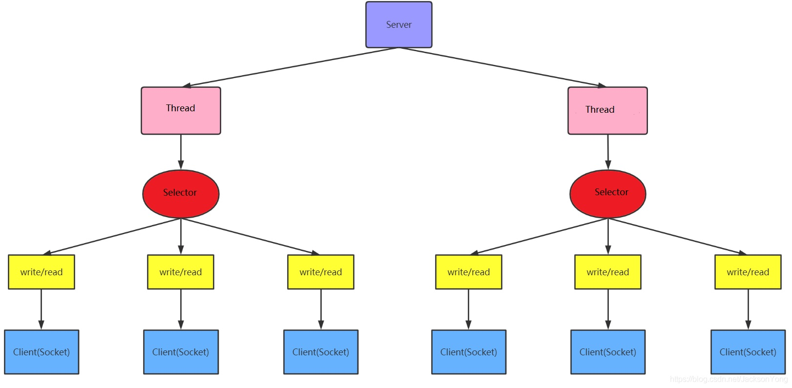
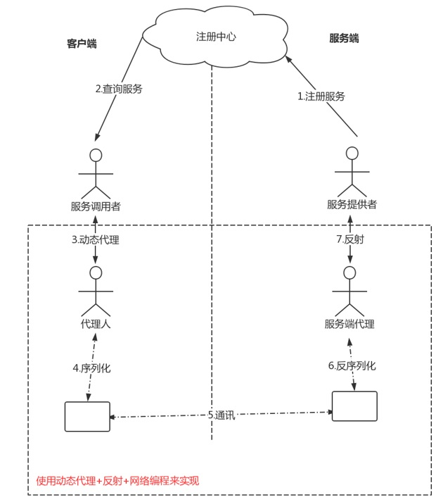

# 2. 原生JDK网络编程 BIO

:::tip I/O 模型
I/O 模型简单的理解：就是用什么样的通道进行数据的发送和接收，很大程度上决定了程序通信的性能。   
Java 共支持 3 种网络编程模型 I/O 模式：BIO、NIO、AIO。  
Java BIO：同步并阻塞（传统阻塞型），服务器实现模式为一个连接一个线程，即客户端有连接请求时服务器端就需要启动一个线程进行处理，如果这个连接不做任何事情会造成不必要的线程开销  
:::

**【BIO简单示意图】**
<a data-fancybox title="BIO简单示意图" href="./image/bio01.jpg"></a>

**Java NIO：同步非阻塞**，服务器实现模式为一个线程处理多个请求（连接），即客户端发送的连接请求都会注册到**多路复用器**上，**多路复用器轮询到连接有 I/O 请求**就进行处理

<a data-fancybox title="NIO简单示意图" href="./image/nio04.jpg"></a>

## 2.1 Java BIO 基本介绍
1. Java BIO 就是传统的 Java I/O 编程，其相关的类和接口在 java.io。
2. BIO(BlockingI/O)：同步阻塞，服务器实现模式为一个连接一个线程，即客户端有连接请求时服务器端就需要启动一个线程进行处理，如果这个连接不做任何事情会造成不必要的线程开销，可以通过线程池机制改善（实现多个客户连接服务器）。【后有应用实例】
3. BIO 方式适用于连接数目比较小且固定的架构，这种方式对服务器资源要求比较高，并发局限于应用中，JDK1.4 以前的唯一选择，程序简单易理解。


服务端提供 IP 和监听端口，客户端通过连接操作想服务端监听的地址发起 连接请求，通过三次握手连接，如果连接成功建立，双方就可以通过套接字进行通信。

传统的同步阻塞模型开发中，**ServerSocket 负责绑定 IP 地址，启动监听端口**；**Socket 负责发起连接操作**  连接成功后，双方通过输入和输出流进行同步阻塞式通信。

传统 BIO 通信模型：采用 BIO 通信模型的服务端，通常由一个独立的 Acceptor 线程负责监听客户端的连接，它接收到客户端连接请求之后为每个客户端创建一 个新的线程进行链路处理没处理完成后，通过输出流返回应答给客户端，线程销 毁。即典型的一请求一应答模型。 

该模型最大的问题就是缺乏弹性伸缩能力，当客户端并发访问量增加后，服务端的线程个数和客户端并发访问数呈 1:1 的正比关系，Java 中的线程也是比较 宝贵的系统资源，线程数量快速膨胀后，系统的性能将急剧下降，随着访问量的 继续增大，系统最终就死-掉-了。 

为了改进这种一连接一线程的模型，我们可以使用线程池来管理这些线程， 实现1个或多个线程处理N个客户端的模型（但是底层还是使用的同步阻塞I/O）， 通常被称为“伪异步 I/O 模型“。 我们知道，如果使用 CachedThreadPool 线程池（不限制线程数量，如果不 清楚请参考文首提供的文章），其实除了能自动帮我们管理线程（复用），看起 来也就像是 1:1 的客户端：线程数模型，而使用 FixedThreadPool 我们就有效的控 制了线程的最大数量，保证了系统有限的资源的控制，实现了 N:M 的伪异步 I/O 模型。 

但是正因为限制了线程数量，如果发生读取数据较慢时（比如数据量 大、网络传输慢等），大量并发的情况下,其他接入的消息只能一直等待，这就是最大的弊端。

--------------------
## 2.2 Java BIO 工作机制

<a data-fancybox title="BIO 工作机制" href="./image/bio02.jpg"></a>

<a data-fancybox title="BIO 工作机制" href="./image/bio03.jpg"></a>

:::tip BIO编程流程
1. 服务器端启动一个 ServerSocket。
2. 客户端启动 Socket 对服务器进行通信，默认情况下服务器端需要对每个客户建立一个线程与之通讯。
3. 客户端发出请求后，先咨询服务器是否有线程响应，如果没有则会等待，或者被拒绝。
4. 如果有响应，客户端线程会等待请求结束后，再继续执行
:::

## 2.3 Java BIO 应用实例

### 2.3.1 服务端多线程方式

#### 客户端
```java
package com.tqk.bio.client;

import java.io.IOException;
import java.io.ObjectInputStream;
import java.io.ObjectOutputStream;
import java.net.InetSocketAddress;
import java.net.Socket;

/**
 *类说明：Bio通信的客户端
 */
public class Client {

    public static void main(String[] args) throws IOException {
        //客户端启动必备
        Socket socket = null;
        //实例化与服务端通信的输入输出流
        ObjectOutputStream output = null;
        ObjectInputStream input = null;
        //服务器的通信地址
        InetSocketAddress addr
                = new InetSocketAddress("127.0.0.1",10001);

        try{
            socket = new Socket();
            /*连接服务器*/
            socket.connect(addr);

            output = new ObjectOutputStream(socket.getOutputStream());
            input = new ObjectInputStream(socket.getInputStream());

            /*向服务器输出请求*/
            output.writeUTF("tianqikai");
            output.flush();

            //接收服务器的输出
            System.out.println(input.readUTF());
        }finally{
            if (socket!=null) {
                socket.close();
            }
            if (output!=null) {
                output.close();
            }
            if (input!=null) {
                input.close();
            }

        }
    }

}

```
-------------------

#### 服务端
```java
package com.tqk.bio.server;

import java.io.IOException;
import java.io.ObjectInputStream;
import java.io.ObjectOutputStream;
import java.net.InetSocketAddress;
import java.net.ServerSocket;
import java.net.Socket;

/**
 *类说明：Bio通信的服务端
 */
public class Server {

    public static void main(String[] args) throws IOException {
        /*服务器必备*/
        ServerSocket serverSocket = new ServerSocket();
        /*绑定监听端口*/
        serverSocket.bind(new InetSocketAddress(10001));
        System.out.println("Server start.......");

        while(true){
           new Thread(new ServerTask(serverSocket.accept())).start();
        }
    }

    private static class ServerTask implements Runnable{

        private Socket socket = null;

        public ServerTask(Socket socket) {
            this.socket = socket;
        }

        @Override
        public void run() {
            /*拿和客户端通讯的输入输出流*/
            try(ObjectInputStream inputStream
                        = new ObjectInputStream(socket.getInputStream());
                ObjectOutputStream outputStream
             = new ObjectOutputStream(socket.getOutputStream())){

                /*服务器的输入*/
                String userName = inputStream.readUTF();
                System.out.println("Accept clinet message:"+userName);

                outputStream.writeUTF("Hello,"+userName);
                outputStream.flush();


            }catch (Exception e){
                e.printStackTrace();
            }
            finally {
                try {
                    socket.close();
                } catch (IOException e) {
                    e.printStackTrace();
                }
            }

        }
    }

}
```

----------------

### 2.3.2 服务端--线程池方式

```java
package com.tqk.bio.server;

import java.io.IOException;
import java.io.ObjectInputStream;
import java.io.ObjectOutputStream;
import java.net.InetSocketAddress;
import java.net.ServerSocket;
import java.net.Socket;
import java.util.concurrent.ExecutorService;
import java.util.concurrent.Executors;

/**
 *
 *类说明：Bio通信的服务端--线程池方式
 */
public class ServerPool {

    private static ExecutorService executorService = Executors.newFixedThreadPool(Runtime.getRuntime().availableProcessors());

    public static void main(String[] args) throws IOException {
        //服务端启动必备
        ServerSocket serverSocket = new ServerSocket();
        //表示服务端在哪个端口上监听
        serverSocket.bind(new InetSocketAddress(10001));
        System.out.println("Start Server ....");
        try{
            while(true){
                executorService.execute(new ServerTask(serverSocket.accept()));
            }
        }finally {
            serverSocket.close();
        }
    }

    //每个和客户端的通信都会打包成一个任务，交个一个线程来执行
    private static class ServerTask implements Runnable{

        private Socket socket = null;
        public ServerTask(Socket socket){
            this.socket = socket;
        }

        @Override
        public void run() {
            //实例化与客户端通信的输入输出流
            try(ObjectInputStream inputStream =
                    new ObjectInputStream(socket.getInputStream());
                ObjectOutputStream outputStream =
                    new ObjectOutputStream(socket.getOutputStream())){

                //接收客户端的输出，也就是服务器的输入
                String userName = inputStream.readUTF();
                System.out.println("Accept client message:"+userName);

                //服务器的输出，也就是客户端的输入
                outputStream.writeUTF("Hello,"+userName);
                outputStream.flush();
            }catch(Exception e){
                e.printStackTrace();
            }finally {
                try {
                    socket.close();
                } catch (IOException e) {
                    e.printStackTrace();
                }
            }
        }
    }

}

```

## 2.4  BIO 实现-RPC 框架

### 2.4.1 为什么要有 RPC？ 
我们最开始开发的时候，一个应用一台机器，将所有功能都写在一起，比如 说比较常见的电商场景。 随着我们业务的发展，我们需要提示性能了，
我们会怎么做？将不同的业务 功能放到线程里来实现异步和提升性能

<a data-fancybox title="RPC框架" href="./image/rpc02.jpg"></a>

但是业务越来越复杂，业务量越来越大，单个应用或者一台机器的资源是肯 定背负不起的，这个时候，我们会怎么做？将核心业务抽取出来，作为独立的服务，放到其他服务器上或者形成集群。这个时候就会请出 RPC，系统变为分布式的架构。
为什么说千万级流量分布式、微服务架构必备的 RPC 框架？和 LocalCall 的代码进行比较，**因为引入rpc 框架对我们现有的代码影响最小**，同时又可以帮我们实现架构上的扩展。现在的开源 rpc 框架，有什么？dubbo，grpc 等等 

当服务越来越多，各种 rpc 之间的调用会越来越复杂，这个时候我们会引入 中间件，比如说 MQ、缓存，同时架构上整体往微服务去迁移，引入了各种比如 容器技术 docker，DevOps 等等。最终会变为如图所示来应付千万级流量，但是不管怎样，rpc 总是会占有一席之地。

<!-- <a data-fancybox title="RPC框架" href="./image/rpc02.jpg"></a> -->

RPC（Remote Procedure Call ——远程过程调用），它是一种通过网络从远程计算机程序上请求服务，而不需要了解底层网络的技术。

**内部服务间调用常用rpc框架，供外部服务使用常用restful风格，或者openapi模式**

<a data-fancybox title="RPC 框架 " href="./image/rpc01.jpg"></a>

:::tip 一次完整的RPC同步调用流程： 
1. 服务消费方（client）以本地调用方式调用客户端存根； 
2. 什么叫客户端存根？就是远程方法在本地的模拟对象，一样的也有方法名，也有方法参数，client stub 接收到调用后负责将方法名、方法的参数等包装， 并将包装后的信息通过网络发送到服务端； 
3. 服务端收到消息后，交给代理存根在服务器的部分后进行解码为实际的方法名和参数 
4. server stub 根据解码结果调用服务器上本地的实际服务； 
5. 本地服务执行并将结果返回给 server stub； 
6. server stub 将返回结果打包成消息并发送至消费方； 
7. client stub 接收到消息，并进行解码； 
8. 服务消费方得到最终结果。 RPC 框架的目标就是要中间步骤都封装起来，让我们进行远程方法调用的时候感觉到就像在本地调用一样。
:::

### 2.4.2 源代码实现查看github

<a data-fancybox title="RPC 框架" href="./image/rpc03.jpg"></a>

#### 客户端
略
#### 注册中心
略
#### 服务端
略
-------------------
<a data-fancybox title="源代码实现查看github" href="./image/rpc01.jpg"></a>

