# 3. 原生 JDK 网络编程- NIO
## 3.1 Java NIO 基本介绍

1. Java NIO 全称 Java non-blocking IO，是指 JDK 提供的新 API。从 JDK1.4 开始，Java 提供了一系列改进的输入/输出的新特性，被统称为 NIO（即 NewIO），是同步非阻塞的。

2. NIO 相关类都被放在 java.nio 包及子包下，并且对原 java.io 包中的很多类进行改写。【基本案例】

3. NIO 有三大核心部分：<font color="#f58220">**Channel（通道）、Buffer（缓冲区）、Selector（选择器）**</font> 。

4. NIO <font color="#f58220">**是面向缓冲区，或者面向块编程的**</font>。数据读取到一个它稍后处理的缓冲区，需要时可在缓冲区中前后移动，这就增加了处理过程中的灵活性，使用它可以提供非阻塞式的高伸缩性网络。

5. Java NIO 的**非阻塞模式**，使一个线程从某通道发送请求或者读取数据，但是它仅能得到目前可用的数据，如果目前没有数据可用时，就什么都不会获取，而不是保持线程阻塞，所以直至数据变的可以读取之前，该线程可以继续做其他的事情。非阻塞写也是如此，一个线程请求写入一些数据到某通道，但不需要等待它完全写入，这个线程同时可以去做别的事情。【后面有案例说明】

6. 通俗理解：NIO 是可以做到用一个线程来处理多个操作的。假设有 10000 个请求过来,根据实际情况，可以分配 50 或者 100 个线程来处理。不像之前的阻塞 IO 那样非得分配 10000 个。

7. HTTP 2.0 使用了多路复用的技术，做到同一个连接并发处理多个请求，而且并发请求的数量比 HTTP 1.1 大了好几个数量级。

<a data-fancybox title="网络编程- NIO" href="./image/nio04.jpg">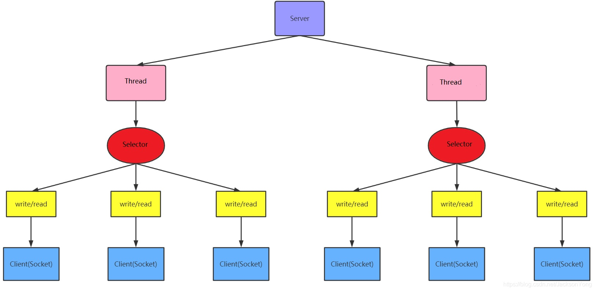</a>

<font color="#8552a1"><strong>适用于</strong></font>: <font color="#f58220">连接数量多而且连接比较短的架构，比如聊天服务器、弹幕系统和服务器之间的通信等</font>

## 3.2 NIO 和 BIO 的比较
:::tip NIO和BIO区别
1. BIO 以流的方式处理数据，而 NIO 以块的方式处理数据，**块 I/O 的效率比流 I/O 高很多**。
2. BIO 是阻塞的，NIO 则是非阻塞的。
3. BIO 基于字节流和字符流进行操作，而 NIO 基于 Channel（通道）和 Buffer（缓冲区）进行操作，数据总是从通道读取到缓冲区中，或者从缓冲区写入到通道中。Selector（选择器）用于监听多个通道的事件（比如：连接请求，数据到达等），因此使用单个线程就可以监听多个客户端通道。
4. Buffer和Channel之间的数据流向是双向的
:::


## 3.3 NIO 三大核心原理

<font color="#f58220">**NIO 主要有三个核心部分组成： buffer 缓冲区、Channel 管道、Selector 选择器**</font>

<a data-fancybox title="网络编程- NIO" href="./image/nio05.jpg">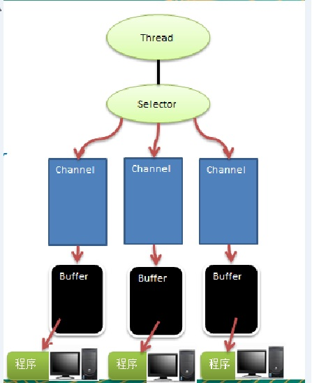</a>

1. 每个 Channel 都会对应一个 Buffer。

2. Selector 对应一个线程，一个线程对应多个 Channel（连接）。

3. 该图反应了有三个 Channel 注册到该 Selector 

4. 程序切换到哪个 Channel 是由事件决定的，Event 就是一个重要的概念。

5. Selector 会根据不同的事件，在各个通道上切换。

6. Buffer 就是一个内存块，底层是有一个数组。

7. 数据的读取写入是通过 Buffer，这个和 BIO是不同的，**BIO 中要么是输入流，或者是输出流，不能双向**，但是 NIO 的 Buffer 是可以读也可以写，**需要 flip 方法切换 Channel 是双向的**，可以返回底层操作系统的情况，比如 Linux，底层的操作系统通道就是双向的

## 3.4 Buffer

<a data-fancybox title="Buffer" href="./image/buffer01.jpg">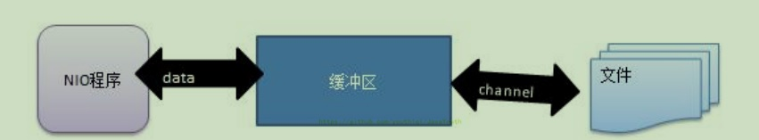</a>

### 3.4.1 Buffer 类及其子类
在 NIO 中，Buffer 是一个顶层父类，它是一个抽象类, 类的层级关系图:

:::tip 常用Buffer子类一览
1. ByteBuffer，存储字节数据到缓冲区
2. ShortBuffer，存储字符串数据到缓冲区
3. CharBuffer，存储字符数据到缓冲区
4. IntBuffer，存储整数数据到缓冲区
5. LongBuffer，存储长整型数据到缓冲区
6. DoubleBuffer，存储小数到缓冲区
7. FloatBuffer，存储小数到缓冲区
:::

<font color="#f58220">Buffer类定义了所有的缓冲区都具有的四个属性来提供关于其所包含的数据元素的信息:</font>

```java
// Invariants: mark <= position <= limit <= capacity
    private int mark = -1;
    private int position = 0;
    private int limit;
    private int capacity;
```
### 3.4.2 示例
```java
package com.tqk.nio.buffer;

import java.nio.IntBuffer;

public class BasicBuffer {
    public static void main(String[] args) {
        //创建一个Buffer，大小为5，既可以存放5个int
        IntBuffer allocate = IntBuffer.allocate(5);

        // 向Buffer存放数据
        for (int i=0;i< allocate.capacity();i++){
            allocate.put(i*3);
        }
//        for (int i=0;i< allocate.capacity();i++){
//            System.out.println(allocate.get(i));
//        }
        /**
         *     从buffer读取数据。需要使用flip进行读写切换
         *     public final Buffer flip() {
         *         limit = position;读取数据不能超过五个
         *         position = 0;
         *         mark = -1;
         *         return this;
         *     }
         */
        allocate.flip();
        allocate.position(1);
        allocate.limit(4);
        while(allocate.hasRemaining()){
            System.out.println(allocate.get());
        }
    }
}
```
<a data-fancybox title="Buffer" href="./image/buffer02.jpg">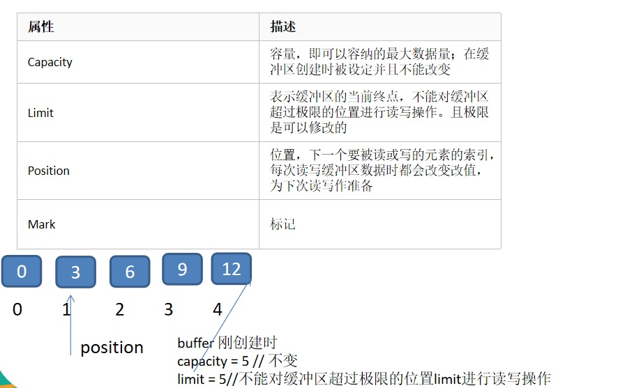</a>

<a data-fancybox title="Buffer" href="./image/buffer03.jpg">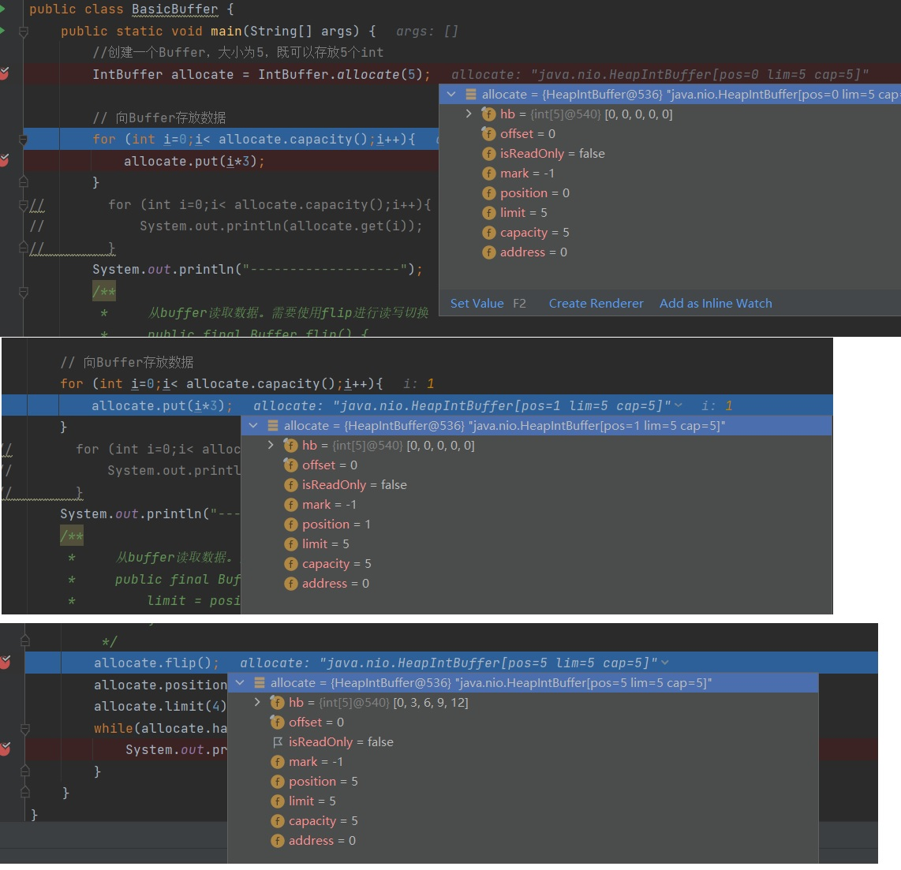</a>

### 3.4.3 Buffer类相关方法一览

:::tip 
public abstract class Buffer {  
    **//JDK1.4时，引入的api**  
    <font color="#f58220">public final int capacity( )//返回此缓冲区的容量</font>  
    <font color="#f58220">public final int position( )//返回此缓冲区的位置</font>  
    <font color="#f58220">public final Buffer position (int newPositio)//设置此缓冲区的位置</font>  
    <font color="#f58220">public final int limit( )//返回此缓冲区的限制</font>  
    <font color="#f58220">public final Buffer limit (int newLimit)//设置此缓冲区的限制</font>  
    public final Buffer mark( )//在此缓冲区的位置设置标记  
    public final Buffer reset( )//将此缓冲区的位置重置为以前标记的位置  
    <font color="red">public final Buffer clear( )//清除此缓冲区, 即将各个标记恢复到初始状态，但是数据并没有真正擦除, 后面操作会覆盖</font>    
    <font color="red">public final Buffer flip( )//反转此缓冲区</font>    
    public final Buffer rewind( )//重绕此缓冲区  
    public final int remaining( )//返回当前位置与限制之间的元素数  
    <font color="red">public final boolean hasRemaining( )//告知在当前位置和限制之间是否有元素</font>    
    <font color="red">public abstract boolean isReadOnly( );//告知此缓冲区是否为只读缓冲区</font>    
    **//JDK1.6时引入的api**  
    <font color="red">public abstract boolean hasArray();//告知此缓冲区是否具有可访问的底层实现数组</font>    
    <font color="red">public abstract Object array();//返回此缓冲区的底层实现数组</font>    
    public abstract int arrayOffset();//返回此缓冲区的底层实现数组中第一个缓冲区元素的偏移量  
    public abstract boolean isDirect();//告知此缓冲区是否为直接缓冲区  
}  
:::

### 3.4.4 ByteBuffer
从前面可以看出对于 Java 中的基本数据类型(boolean除外)，都有一个 Buffer 类型与之相对应，最常用的自然是ByteBuffer 类（二进制数据）

:::tip 该类的主要方法如下：
public abstract class ByteBuffer {  
    **//缓冲区创建相关api**  
    <font color="#f58220">public static ByteBuffer allocateDirect(int capacity)//创建直接缓冲区 </font>   
    <font color="#f58220">public static ByteBuffer allocate(int capacity)//设置缓冲区的初始容量</font>    
    public static ByteBuffer wrap(byte[] array)//把一个数组放到缓冲区中使用  
    //构造初始化位置offset和上界length的缓冲区  
    public static ByteBuffer wrap(byte[] array,int offset, int length)  
    **//缓存区存取相关API**  
    <font color="#f58220">public abstract byte get( );//从当前位置position上get，get之后，position会自动+1</font>    
    <font color="#f58220">public abstract byte get (int index);//从绝对位置get</font>    
    <font color="#f58220">public abstract ByteBuffer put (byte b);//从当前位置上添加，put之后，position会自动+1</font>    
    <font color="#f58220">public abstract ByteBuffer put (int index, byte b);//从绝对位置上put</font>    
 }

:::


## 3.5 Channels 

:::tip 基本介绍
1. NIO的通道类似于流，但有些区别如下：
```  
    A. 通道可以同时进行读写，而流只能读或者只能写  
    B. 通道可以实现异步读写数据  
    C. 通道可以从缓冲读数据，也可以写数据到缓冲 
``` 
<a data-fancybox title="Channels" href="./image/channel.jpg"></a>

2. BIO 中的 stream 是单向的，例如 FileInputStream 对象只能进行读取数据的操作，而 NIO 中的通道(Channel)是双向的，可以读操作，也可以写操作。

3. Channel在NIO中是一个接口<font color="#f58220"><strong>public interface Channel extends Closeable{}</strong></font> 

4. 常用的 Channel 类有：FileChannel、DatagramChannel、ServerSocketChannel 和 SocketChannel。<font color="#f58220"><strong>【ServerSocketChannel 类似 ServerSocket , SocketChannel 类似 Socket】</strong></font>  

5. FileChannel 用于文件的数据读写，DatagramChannel 用于 **UDP** 的数据读写，ServerSocketChannel 和 SocketChannel 用于 **TCP** 的数据读写。

:::
 
### 3.5.1 FileChannel 类

FileChannel主要用来对本地文件进行 IO 操作，常见的方法有  
<font color="#b22c46"><strong>public int read(ByteBuffer dst)</strong></font> ，从通道读取数据并放到缓冲区中  
<font color="#b22c46"><strong>public int write(ByteBuffer src)</strong></font> ，把缓冲区的数据写到通道中  
<font color="#b22c46"><strong>public long transferFrom(ReadableByteChannel src, long position, long count)</strong></font>，从目标通道中复制数据到当前通道  
<font color="#b22c46"><strong>public long transferTo(long position, long count, WritableByteChannel target)</strong></font>，把数据从当前通道复制给目标通道  

### 3.5.2 本地文件写数据


<a data-fancybox title="Channels" href="./image/channel01.jpg">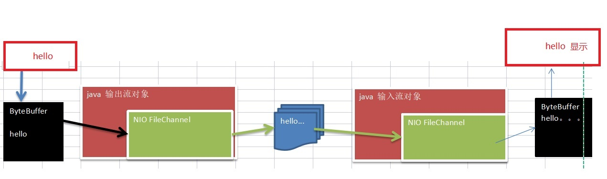</a>

```java
package com.tqk.nio.channel;

import java.io.FileOutputStream;
import java.nio.ByteBuffer;
import java.nio.channels.FileChannel;
import java.nio.charset.StandardCharsets;

/**
 * 使用channels将buffer-》file
 */
public class NIOFileChannel01 {
    public static void main(String[] args) throws Exception {
        String str="hello，world";
        //创建一个输出流->channel
        FileOutputStream fileOutputStream = new FileOutputStream("FileChannel01.txt");
        //通过 fileOutputStream 获取 对应的 FileChannel
        //这个 fileChannel 真实 类型是  FileChannelImpl
        FileChannel channel = fileOutputStream.getChannel();
        //创建一个缓冲区 ByteBuffer
        ByteBuffer buffer = ByteBuffer.allocate(1024);
        //将 str 放入 byteBuffer
        buffer.put(str.getBytes(StandardCharsets.UTF_8));
        //对byteBuffer 进行flip
        buffer.flip();
        //将byteBuffer 数据写入到 fileChannel
        channel.write(buffer);
        channel.close();
        fileOutputStream.close();
    }
}
```

### 3.5.3 本地文件读数据

```java
package com.tqk.nio.channel;

import java.io.File;
import java.io.FileInputStream;
import java.io.IOException;
import java.nio.ByteBuffer;
import java.nio.channels.FileChannel;

/**
 * 本地文件读数据
 * @author tianqikai
 */
public class NioFileChannel02 {
    public static void main(String[] args) throws IOException {

        File file=new File("FileChannel01.txt");
        //创建文件的输入流
        FileInputStream fileInputStream = new FileInputStream("FileChannel01.txt");
        //通过fileInputStream 获取对应的FileChannel -> 实际类型  FileChannelImpl
        FileChannel fileInputStreamChannel = fileInputStream.getChannel();
        //创建缓冲区
        ByteBuffer byteBuffer = ByteBuffer.allocate((int) file.length());
        //将 通道的数据读入到Buffer
        fileInputStreamChannel.read(byteBuffer);
        String s = new String(byteBuffer.array());
        //将byteBuffer 的 字节数据 转成String
        System.out.println(s);
       fileInputStreamChannel.close();
        fileInputStream.close();
    }
}
```
### 3.5.4 使用一个Buffer完成文件读取

```java
package com.tqk.nio.channel;

import java.io.File;
import java.io.FileInputStream;
import java.io.FileNotFoundException;
import java.io.FileOutputStream;
import java.nio.ByteBuffer;
import java.nio.channels.FileChannel;

/**
 * 使用 FileChannel(通道) 和 方法  read , write，完成文件的拷贝
 * @author tianqikai
 */
public class NioFileChannel03 {
    public static void main(String[] args) throws Exception {
        File file=new File("FileChannel01.txt");
        //创建文件的输入流
        FileInputStream fileInputStream = new FileInputStream("FileChannel01.txt");
        //通过fileInputStream 获取对应的FileChannel -> 实际类型  FileChannelImpl
        FileChannel fileInputStreamChannel = fileInputStream.getChannel();
        //创建缓冲区
        ByteBuffer byteBuffer = ByteBuffer.allocate((int) file.length());
        //将 通道的数据读入到Buffer   read == -1//表示读完
        int read = fileInputStreamChannel.read(byteBuffer);

        //创建文件的输出流
        FileOutputStream fileOutputStream = new FileOutputStream("FileChannel02.txt");
        //通过fileOutputStream 获取对应的FileChannel -> 实际类型  FileChannelImpl
        FileChannel fileChannel = fileOutputStream.getChannel();
        byteBuffer.flip();
        fileChannel.write(byteBuffer);

        //关闭相关的流
        fileInputStreamChannel.close();
        fileChannel.close();
        fileOutputStream.close();
        fileInputStream.close();
    }
}
```
### 3.5.5 拷贝文件transferFrom 方法

```java
package com.tqk.nio.channel;

import java.io.FileInputStream;
import java.io.FileOutputStream;
import java.io.IOException;
import java.nio.channels.FileChannel;

/**
 * 使用 FileChannel(通道) 和 方法  transferFrom ，完成文件的拷贝
 * @author tianqikai
 */
public class NioFileChannel04 {
    public static void main(String[] args) throws IOException {
        //创建相关流
        FileInputStream fileInputStream = new FileInputStream("bio02.jpg");
        FileOutputStream fileOutputStream = new FileOutputStream("bio03.jpg");

        //获取各个流对应的filechannel
        FileChannel sourceCh = fileInputStream.getChannel();
        FileChannel destCh = fileOutputStream.getChannel();

        destCh.transferFrom(sourceCh,0,sourceCh.size());
        //关闭相关通道和流
        sourceCh.close();
        destCh.close();
        fileInputStream.close();
        fileOutputStream.close();
    }
}
```

### 3.5.6 关于Buffer 和 Channel的注意事项和细节

1. ByteBuffer 支持类型化的put 和 get, put 放入的是什么数据类型，get就应该使用相应的数据类型来取出，否则可能有 BufferUnderflowException 异常。

```java
package com.tqk.nio.channel;

import java.nio.ByteBuffer;

public class NIOByteBufferPutGet {
    public static void main(String[] args) {
        //创建一个Buffer
        ByteBuffer buffer = ByteBuffer.allocate(64);
        //类型化方式放入数据
        buffer.putInt(100);
        buffer.putLong(9);
        buffer.putChar('尚');
        buffer.putShort((short) 4);

        //取出
        buffer.flip();
        System.out.println("---------------");
        System.out.println(buffer.getInt());
        System.out.println(buffer.getLong());
        System.out.println(buffer.getChar());
        System.out.println(buffer.getShort());
    }
}
```

2. 可以将一个普通Buffer 转成只读Buffer

```java
import java.nio.ByteBuffer;

/**
 * 可以将一个普通Buffer 转成只读Buffer
 * @author tianqikai
 */
public class ReadOnlyBuffer {
    public static void main(String[] args) {

        //创建一个buffer
        ByteBuffer buffer = ByteBuffer.allocate(64);

        for(int i = 0; i < 10; i++) {
            buffer.put((byte)i);
        }
        //读取
        buffer.flip();
        //得到一个只读的Buffer
        ByteBuffer readOnlyBuffer = buffer.asReadOnlyBuffer();
        System.out.println(readOnlyBuffer.getClass());

        //读取
        while (readOnlyBuffer.hasRemaining()) {
            System.out.println(readOnlyBuffer.get());
        }

        readOnlyBuffer.put((byte)100); //报错 ReadOnlyBufferException
    }
}
```

3. NIO 还提供了 MappedByteBuffer， 可以让文件直接在内存（堆外的内存）中进行修改， 而如何同步到文件由NIO 来完成. 

```java
package com.tqk.nio.channel;

import java.io.RandomAccessFile;
import java.nio.MappedByteBuffer;
import java.nio.channels.FileChannel;

/*
说明
1. MappedByteBuffer 可让文件直接在内存(堆外内存)修改, 操作系统不需要拷贝一次
 */
public class MappedByteBufferTest {
    public static void main(String[] args) throws Exception {

        RandomAccessFile randomAccessFile = new RandomAccessFile("1.txt", "rw");
        //获取对应的通道
        FileChannel channel = randomAccessFile.getChannel();

        /**
         * 参数1: FileChannel.MapMode.READ_WRITE 使用的读写模式
         * 参数2： 0 ： 可以直接修改的起始位置
         * 参数3:  5: 是映射到内存的大小(不是索引位置) ,即将 1.txt 的多少个字节映射到内存
         * 可以直接修改的范围就是 0-5
         * 实际类型 DirectByteBuffer
         */
        MappedByteBuffer mappedByteBuffer = channel.map(FileChannel.MapMode.READ_WRITE, 0, 5);

        mappedByteBuffer.put(0, (byte) 'H');
        mappedByteBuffer.put(3, (byte) '9');
//        mappedByteBuffer.put(5, (byte) 'Y');//IndexOutOfBoundsException

        randomAccessFile.close();
        System.out.println("修改成功~~");
    }
}
```

4. 前面我们讲的读写操作，都是通过一个Buffer 完成的，NIO 还支持 通过多个Buffer (即 Buffer 数组) 完成读写操作，即 Scattering 和 Gathering 
 **Scattering：将数据写入到buffer时，可以采用buffer数组，依次写入  [分散]**  
 **Gathering: 从buffer读取数据时，可以采用buffer数组，依次读 [聚合]**
```java
package com.tqk.nio.channel;

import java.net.InetSocketAddress;
import java.nio.ByteBuffer;
import java.nio.channels.ServerSocketChannel;
import java.nio.channels.SocketChannel;
import java.util.Arrays;

/**
 * Scattering：将数据写入到buffer时，可以采用buffer数组，依次写入  [分散]
 * Gathering: 从buffer读取数据时，可以采用buffer数组，依次读 [聚合]
 */
public class ScatteringAndGatheringTest {
    public static void main(String[] args) throws Exception {

        //使用 ServerSocketChannel 和 SocketChannel 网络

        ServerSocketChannel serverSocketChannel = ServerSocketChannel.open();
        InetSocketAddress inetSocketAddress = new InetSocketAddress(7000);

        //绑定端口到socket ，并启动
        serverSocketChannel.socket().bind(inetSocketAddress);

        //创建buffer数组
        ByteBuffer[] byteBuffers = new ByteBuffer[2];
        byteBuffers[0] = ByteBuffer.allocate(5);
        byteBuffers[1] = ByteBuffer.allocate(3);

        //等客户端连接(telnet)
        SocketChannel socketChannel = serverSocketChannel.accept();
        int messageLength = 8;   //假定从客户端接收8个字节
        //循环的读取
        while (true) {

            int byteRead = 0;

            while (byteRead < messageLength ) {
                long l = socketChannel.read(byteBuffers);
                byteRead += l; //累计读取的字节数
                System.out.println("byteRead=" + byteRead);
                //使用流打印, 看看当前的这个buffer的position 和 limit
                Arrays.asList(byteBuffers).stream().map(buffer -> "postion=" + buffer.position() + ", limit=" + buffer.limit()).forEach(System.out::println);
            }

            //将所有的buffer进行flip
            Arrays.asList(byteBuffers).forEach(buffer -> buffer.flip());

            //将数据读出显示到客户端
            long byteWirte = 0;
            while (byteWirte < messageLength) {
                long l = socketChannel.write(byteBuffers); //
                byteWirte += l;
            }

            //将所有的buffer 进行clear
            Arrays.asList(byteBuffers).forEach(buffer-> {
                buffer.clear();
            });

            System.out.println("byteRead:=" + byteRead + " byteWrite=" + byteWirte + ", messagelength" + messageLength);
        }
    }
}

```


## 3.6 Selector
Selector 的英文含义是“选择器”，也可以称为为“轮询代理器”、“事件订阅器”、 “channel 容器管理机”都行。 

应用程序将向 Selector 对象注册需要它关注的 Channel，以及具体的某一个 Channel 会对哪些 IO 事件感兴趣。Selector 中也会维护一个“已经注册的 Channel” 的容器。

### 3.6.1 基本介绍
:::tip 基本介绍
1. Java 的 NIO，用非阻塞的 IO 方式。可以用一个线程，处理多个的客户端连接，就会使用到Selector(选择器)
2. Selector 能够检测多个注册的通道上是否有事件发生(注意:多个Channel以事件的方式可以注册到同一个Selector)，如果有事件发生，便获取事件然后针对每个事件进行相应的处理。这样就可以只用一个单线程去管理多个通道，也就是管理多个连接和请求。
3. 只有在连接/通道 真正有读写事件发生时，才会进行读写，就大大地减少了系统开销，并且不必为每个连接都创建一个线程，不用去维护多个线程
4. 避免了多线程之间的上下文切换导致的开销
:::
<a data-fancybox title="Selector" href="./image/Selector01.jpg">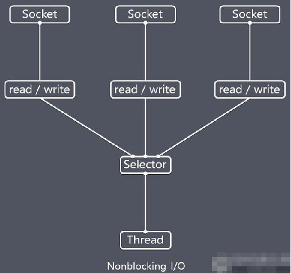</a>

:::tip 特点说明
1. Netty 的 IO 线程 NioEventLoop 聚合了 Selector(选择器，也叫多路复用器)，可以同时并发处理成百上千个客户端连接。
2. 当线程从某客户端 Socket 通道进行读写数据时，若没有数据可用时，该线程可以进行其他任务。
3. 线程通常将非阻塞 IO 的空闲时间用于在其他通道上执行 IO 操作，所以单独的线程可以管理多个输入和输出通道。
4. 由于读写操作都是非阻塞的，这就可以充分提升 IO 线程的运行效率，避免由于频繁 I/O 阻塞导致的线程挂起。
5. 一个 I/O 线程可以并发处理 N 个客户端连接和读写操作，这从根本上解决了传统同步阻塞 I/O 一连接一线程模型，架构的性能、弹性伸缩能力和可靠性都得到了极大的提升。
:::

### 3.6.2 Selector类相关方法

:::tip 常用方法

```java
    public abstract class Selector implements Closeable { 

        //得到一个选择器对象
        public static Selector open();

        //监控所有注册的通道，当其中有 IO 操作可以进行时，将对应的 SelectionKey 加入到内部集合中并返回，参数用来设置超时时间
        public int select(long timeout);

        //从内部集合中得到所有的 SelectionKey	
        public Set<SelectionKey> selectedKeys();
    }
```
:::
<a data-fancybox title="Selector" href="./image/selector02.jpg">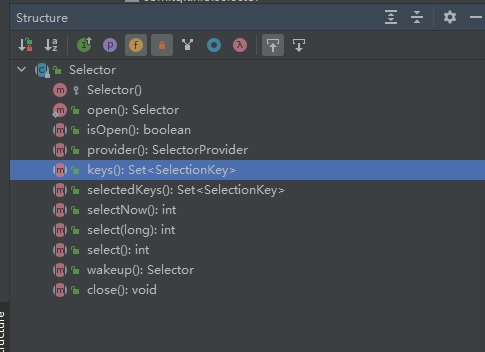</a>


### 3.6.2 NIO非阻塞网络编程原理分析图

<a data-fancybox title="Selector" href="./image/selector03.jpg">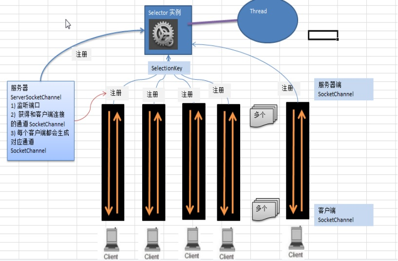</a>

:::tip 说明
1. 当客户端连接时，会通过ServerSocketChannel 得到 SocketChannel
2. Selector 进行监听  select 方法, 返回有事件发生的通道的个数.
3. 将socketChannel注册到Selector上, **register(Selector sel, int ops)**, 一个selector上可以注册多个SocketChannel
4. 注册后返回一个 **SelectionKey**, 会和该Selector 关联(集合)
5. 进一步得到各个 SelectionKey (有事件发生)
6. 在通过 SelectionKey  反向获取 SocketChannel , 方法 channel()
7. 可以通过得到的 channel  , 完成业务处理
:::


:::tip 注意事项

NIO中的 ServerSocketChannel功能类似ServerSocket，SocketChannel功能类似Socket

----------- 

selector 相关方法说明  
selector.select()//阻塞  
selector.select(1000);//阻塞1000毫秒，在1000毫秒后返回  
selector.wakeup();//唤醒selector  
selector.selectNow();//不阻塞，立马返还  
:::
### 3.6.3  NIO--客户端

```java
package com.tqk.nio.selector;

import java.net.InetSocketAddress;
import java.nio.ByteBuffer;
import java.nio.channels.SocketChannel;

public class NIOClient {
    public static void main(String[] args) throws Exception{

        //得到一个网络通道
        SocketChannel socketChannel = SocketChannel.open();
        //设置非阻塞
        socketChannel.configureBlocking(false);
        //提供服务器端的ip 和 端口
        InetSocketAddress inetSocketAddress = new InetSocketAddress("127.0.0.1", 6666);
        //连接服务器
        if (!socketChannel.connect(inetSocketAddress)) {

            while (!socketChannel.finishConnect()) {
                System.out.println("因为连接需要时间，客户端不会阻塞，可以做其它工作..");
            }
        }

        //...如果连接成功，就发送数据
        String str = "hello, tianqikai~";
        //Wraps a byte array into a buffer
        ByteBuffer buffer = ByteBuffer.wrap(str.getBytes());
        //发送数据，将 buffer 数据写入 channel
        socketChannel.write(buffer);
        System.in.read();

    }
}

```

### 3.6.4  NIO--服务端

```java
package com.tqk.nio.selector;

import java.io.IOException;
import java.net.InetSocketAddress;
import java.nio.ByteBuffer;
import java.nio.channels.*;
import java.util.Iterator;
import java.util.Set;

/**
 * @author tianqikai
 */
public class NIOserver {
    public static void main(String[] args) throws IOException {
        //创建ServerSocketChannel -> ServerSocket
        ServerSocketChannel serverSocketChannel = ServerSocketChannel.open();

        //得到一个Selecor对象
        Selector selector = Selector.open();

        //绑定一个端口6666, 在服务器端监听
        serverSocketChannel.socket().bind(new InetSocketAddress(6666));

        //设置为非阻塞
        serverSocketChannel.configureBlocking(false);

        //把 serverSocketChannel 注册到  selector 关心 事件为 OP_ACCEPT
        serverSocketChannel.register(selector, SelectionKey.OP_ACCEPT);
        System.out.println("注册后的selectionkey 数量=" + selector.keys().size()); // 1

        //循环等待客户端连接

        while(true){
            //这里我们等待1秒，如果没有事件发生, 返回
            if(selector.select(1000) == 0){
                //没有事件发生
                System.out.println("服务器等待了1秒，无连接");
                continue;
            }
            //如果返回的>0, 就获取到相关的 selectionKey集合
            //1.如果返回的>0， 表示已经获取到关注的事件
            //2. selector.selectedKeys() 返回关注事件的集合
            //   通过 selectionKeys 反向获取通道
            Set<SelectionKey> selectionKeys = selector.selectedKeys();
            System.out.println("selectionKeys 数量 = " + selectionKeys.size());

            //遍历 Set<SelectionKey>, 使用迭代器遍历

            Iterator<SelectionKey> keyIterator = selectionKeys.iterator();

            while(keyIterator.hasNext()){
                //获取到SelectionKey
                SelectionKey key = keyIterator.next();
                //根据key 对应的通道发生的事件做相应处理
                if(key.isAcceptable()){//如果是 OP_ACCEPT, 有新的客户端连接
                    //该客户端生成一个 SocketChannel
                    SocketChannel socketChannel = serverSocketChannel.accept();
                    System.out.println("客户端连接成功 生成了一个 socketChannel " + socketChannel.hashCode());
                    //将  SocketChannel 设置为非阻塞
                    socketChannel.configureBlocking(false);
                    //关联一个Buffer
                    socketChannel.register(selector, SelectionKey.OP_READ, ByteBuffer.allocate(1024));

                    System.out.println("客户端连接后 ，注册的selectionkey 数量=" + selector.keys().size()); //2,3,4..
                }

                if(key.isReadable()) {  //发生 OP_READ

                    //通过key 反向获取到对应channel
                    SocketChannel channel = (SocketChannel)key.channel();
                    //获取到该channel关联的buffer
                    ByteBuffer buffer = (ByteBuffer)key.attachment();

                    channel.read(buffer);
                    System.out.println("form 客户端 " + new String(buffer.array()));
                }
                //手动从集合中移动当前的selectionKey, 防止重复操作
                keyIterator.remove();
            }
        }
    }
}

```
------------------------------------

### 3.6.5  NIO网络编程实例

```java
package com.tqk.nio.client;

import java.util.Scanner;

import static com.tqk.nio.server.NioServer.DEFAULT_PORT;
import static com.tqk.nio.server.NioServer.DEFAULT_SERVER_IP;

/**
 *
 * @author tianqikai
 */
public class NioClient {
    private static NioClientHandle nioClientHandle;

    public static void start(){
        if(nioClientHandle !=null) {
            nioClientHandle.stop();
        }
        nioClientHandle = new NioClientHandle(DEFAULT_SERVER_IP,DEFAULT_PORT);
        new Thread(nioClientHandle,"Server").start();
    }
    //向服务器发送消息
    public static boolean sendMsg(String msg) throws Exception{
        nioClientHandle.sendMsg(msg);
        return true;
    }
    public static void main(String[] args) throws Exception {
        start();
        Scanner scanner = new Scanner(System.in);
        while(NioClient.sendMsg(scanner.next())) {
            ;
        }

    }
}
```

```java
package com.tqk.nio.client;

import java.io.IOException;
import java.net.InetSocketAddress;
import java.nio.ByteBuffer;
import java.nio.channels.SelectionKey;
import java.nio.channels.Selector;
import java.nio.channels.SocketChannel;
import java.util.Iterator;
import java.util.Set;

/**
 * @author tianqikai
 */
public class NioClientHandle implements  Runnable{
    private String host;
    private int port;
    private volatile boolean started;
    private Selector selector;
    private SocketChannel socketChannel;

    public NioClientHandle(String host, int port) {
        this.host = host;
        this.port = port;
        try {
            /*创建选择器*/
            this.selector = Selector.open();
            /*打开监听通道*/
            socketChannel = SocketChannel.open();
            /*如果为 true，则此通道将被置于阻塞模式；
             * 如果为 false，则此通道将被置于非阻塞模式
             * 缺省为true*/
            socketChannel.configureBlocking(false);
            started = true;
        } catch (IOException e) {
            e.printStackTrace();
            System.exit(-1);
        }
    }

    /**
     *
     */
    public void stop(){
        started = false;
    }
    @Override
    public void run() {
        //连接服务器
        try {
            doConnect();
        } catch (IOException e) {
            e.printStackTrace();
            System.exit(-1);
        }
        /*循环遍历selector*/
        while(started){
            try {
                /*阻塞方法,当至少一个注册的事件发生的时候就会继续*/
                selector.select();
                /*获取当前有哪些事件可以使用*/
                Set<SelectionKey> keys = selector.selectedKeys();
                /*转换为迭代器*/
                Iterator<SelectionKey> it = keys.iterator();
                SelectionKey key = null;
                while(it.hasNext()){
                    key = it.next();
                    /*我们必须首先将处理过的 SelectionKey 从选定的键集合中删除。
                    如果我们没有删除处理过的键，那么它仍然会在事件集合中以一个激活
                    的键出现，这会导致我们尝试再次处理它。*/
                    it.remove();
                    try {
                        handleInput(key);
                    } catch (Exception e) {
                        if(key!=null){
                            key.cancel();
                            if(key.channel()!=null){
                                key.channel().close();
                            }
                        }
                    }
                }

            } catch (IOException e) {
                e.printStackTrace();
                System.exit(-1);
            }
        }

        if(selector!=null){
            try {
                selector.close();
            } catch (IOException e) {
                e.printStackTrace();
            }
        }
    }

    /**
     * 具体的事件处理方法
     * @param key
     * @throws IOException
     */
    private void handleInput(SelectionKey key) throws IOException {
        if(key.isValid()){
            /*获得关心当前事件的channel*/
            SocketChannel sc =(SocketChannel)key.channel();
            /*处理连接就绪事件
             * 但是三次握手未必就成功了，所以需要等待握手完成和判断握手是否成功*/
            if(key.isConnectable()){
                /*finishConnect的主要作用就是确认通道连接已建立，
                方便后续IO操作（读写）不会因连接没建立而
                导致NotYetConnectedException异常。*/
                if(sc.finishConnect()){
                    /*连接既然已经建立，当然就需要注册读事件，
                    写事件一般是不需要注册的。*/
                    socketChannel.register(selector,SelectionKey.OP_READ);
                }else {
                    System.exit(-1);
                }
            }

            /*处理读事件，也就是当前有数据可读*/
            if(key.isReadable()){
                /*创建ByteBuffer，并开辟一个1k的缓冲区*/
                ByteBuffer buffer = ByteBuffer.allocate(1024);
                /*将通道的数据读取到缓冲区，read方法返回读取到的字节数*/
                int readBytes = sc.read(buffer);
                if(readBytes>0){
                    buffer.flip();
                    byte[] bytes = new byte[buffer.remaining()];
                    buffer.get(bytes);
                    String result = new String(bytes,"UTF-8");
                    System.out.println("客户端收到消息："+result);
                }
                /*链路已经关闭，释放资源*/
                else if(readBytes<0){
                    key.cancel();
                    sc.close();
                }

            }
        }
    }

    /**
     * 建立连接
     * @throws IOException
     */
    private void doConnect() throws IOException {
        /*如果此通道处于非阻塞模式，则调用此方法将启动非阻塞连接操作。
        如果连接马上建立成功，则此方法返回true。
        否则，此方法返回false，
        因此我们必须关注连接就绪事件，
        并通过调用finishConnect方法完成连接操作。*/
        if(socketChannel.connect(new InetSocketAddress(host,port))){
            /*连接成功，关注读事件*/
            socketChannel.register(selector, SelectionKey.OP_READ);
        }
        else{
            socketChannel.register(selector,SelectionKey.OP_CONNECT);
        }
    }

    /**
     * 写数据对外暴露的API
     * @param msg
     * @throws IOException
     */
    public void sendMsg(String msg) throws IOException {
        doWrite(socketChannel,msg);
    }

    /**
     * 写数据
     * @param sc
     * @param request
     * @throws IOException
     */
    private void doWrite(SocketChannel sc,String request) throws IOException {
        byte[] bytes = request.getBytes();
        ByteBuffer writeBuffer = ByteBuffer.allocate(bytes.length);
        writeBuffer.put(bytes);
        writeBuffer.flip();
        sc.write(writeBuffer);
    }
}

```

#### 服务端

```java
package com.tqk.nio.server;


/**
 * @author
 * 类说明：nio通信服务端
 */
public class NioServerWritable {

    public static int DEFAULT_PORT = 12345;
    public static String DEFAULT_SERVER_IP = "127.0.0.1";
    public static String response(String msg){
        return "Hello,"+msg+",Now is "+new java.util.Date(
                System.currentTimeMillis()).toString() ;
    }

    private static NioServerHandleWriteable nioServerHandle;

    public static void start(){
        if(nioServerHandle !=null) {
            nioServerHandle.stop();
        }
        nioServerHandle = new NioServerHandleWriteable(DEFAULT_PORT);
        new Thread(nioServerHandle,"Server").start();
    }
    public static void main(String[] args){
        start();
    }

}

```
----------------

```java
package com.tqk.nio.server;

import java.io.IOException;
import java.net.InetSocketAddress;
import java.nio.ByteBuffer;
import java.nio.channels.SelectionKey;
import java.nio.channels.Selector;
import java.nio.channels.ServerSocketChannel;
import java.nio.channels.SocketChannel;
import java.util.Iterator;
import java.util.Set;

import static com.tqk.nio.server.NioServerWritable.response;

/**
 * @author 
 * 类说明：nio通信服务端处理器
 */
public class NioServerHandleWriteable implements Runnable{
    private Selector selector;
    private ServerSocketChannel serverChannel;
    private volatile boolean started;
    /**
     * 构造方法
     * @param port 指定要监听的端口号
     */
    public NioServerHandleWriteable(int port) {
        try{
            //创建选择器
            selector = Selector.open();
            //打开监听通道
            serverChannel = ServerSocketChannel.open();
            //如果为 true，则此通道将被置于阻塞模式；
            // 如果为 false，则此通道将被置于非阻塞模式
            serverChannel.configureBlocking(false);//开启非阻塞模式
            serverChannel.socket().bind(new InetSocketAddress(port));
            serverChannel.register(selector,SelectionKey.OP_ACCEPT);

            //标记服务器已开启
            started = true;
            System.out.println("服务器已启动，端口号：" + port);
        }catch(IOException e){
            e.printStackTrace();
            System.exit(1);
        }
    }
    public void stop(){
        started = false;
    }
    @Override
    public void run() {
        //循环遍历selector
        while(started){
            try{
                //阻塞,只有当至少一个注册的事件发生的时候才会继续.
				selector.select();
                Set<SelectionKey> keys = selector.selectedKeys();
                Iterator<SelectionKey> it = keys.iterator();
                SelectionKey key = null;
                while(it.hasNext()){
                    key = it.next();
                    it.remove();
                    try{
                        handleInput(key);
                    }catch(Exception e){
                        if(key != null){
                            key.cancel();
                            if(key.channel() != null){
                                key.channel().close();
                            }
                        }
                    }
                }
            }catch(Throwable t){
                t.printStackTrace();
            }
        }
        //selector关闭后会自动释放里面管理的资源
        if(selector != null) {
            try{
                selector.close();
            }catch (Exception e) {
                e.printStackTrace();
            }
        }
    }
    private void handleInput(SelectionKey key) throws IOException{
        if(key.isValid()){
            //处理新接入的请求消息
            if(key.isAcceptable()){
                ServerSocketChannel ssc = (ServerSocketChannel)key.channel();
                SocketChannel sc = ssc.accept();
                System.out.println("=======建立连接===");
                sc.configureBlocking(false);
                sc.register(selector,SelectionKey.OP_READ);
            }

            //读消息
            if(key.isReadable()){
                System.out.println("======socket channel 数据准备完成，" +
                        "可以去读==读取=======");
                SocketChannel sc = (SocketChannel) key.channel();
                //创建ByteBuffer，并开辟一个1M的缓冲区
                ByteBuffer buffer = ByteBuffer.allocate(1024);
                //读取请求码流，返回读取到的字节数
                int readBytes = sc.read(buffer);
                //读取到字节，对字节进行编解码
                if(readBytes>0){
                    //将缓冲区当前的limit设置为position,position=0，
                    // 用于后续对缓冲区的读取操作
                    buffer.flip();
                    //根据缓冲区可读字节数创建字节数组
                    byte[] bytes = new byte[buffer.remaining()];
                    //将缓冲区可读字节数组复制到新建的数组中
                    buffer.get(bytes);
                    String message = new String(bytes,"UTF-8");
                    System.out.println("服务器收到消息：" + message);
                    //处理数据
                    String result = response(message) ;
                    //发送应答消息
                    doWrite(sc,result);
                }
                //链路已经关闭，释放资源
                else if(readBytes<0){
                    key.cancel();
                    sc.close();
                }
            }

            if(key.isWritable()){
                System.out.println("writeable.....");
                SocketChannel sc = (SocketChannel) key.channel();
                ByteBuffer att = (ByteBuffer)key.attachment();
                if(att.hasRemaining()){
                    int count = sc.write(att);
                    System.out.println("write:"+count+ "byte ,hasR:"
                            +att.hasRemaining());
                }else{
                    key.interestOps(SelectionKey.OP_READ);
                }
            }
        }
    }
    //发送应答消息
    private void doWrite(SocketChannel channel,String response)
            throws IOException {
        //将消息编码为字节数组
        byte[] bytes = response.getBytes();
        //根据数组容量创建ByteBuffer
        ByteBuffer writeBuffer = ByteBuffer.allocate(bytes.length);
        //将字节数组复制到缓冲区
        writeBuffer.put(bytes);
        //flip操作
        writeBuffer.flip();
        channel.register(selector,SelectionKey.OP_WRITE|SelectionKey.OP_READ,
                writeBuffer);
    }

}
```

## 3.7 零拷贝

### 3.7.1 DMA 技术


什么是 DMA 技术？也就是直接内存访问（Direct Memory Access） 技术。 简单理解就是在进行 I/O 设备和内存的数据传输的时候，数据搬运的工作全部交给 DMA 控制器，而 CPU 不再参与任何与数据搬运相关的事情，这样 CPU 就可以去处理别的事务。

那使用 DMA 控制器进行数据传输的过程究竟是什么样的呢？下面我们来具体看看

<a data-fancybox title="DMA 技术" href="./image/DMA.jpg">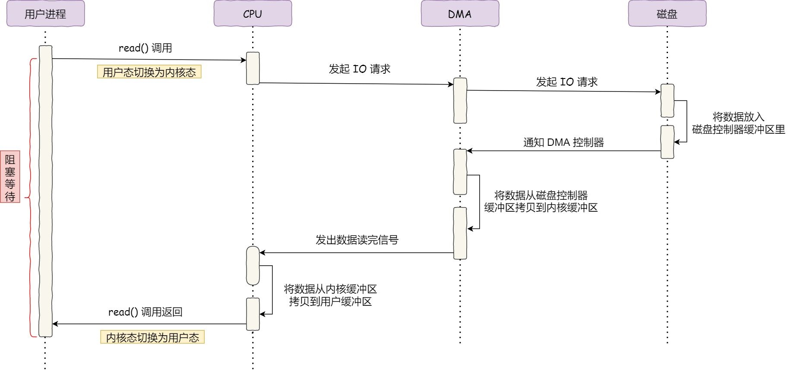</a>

:::tip 具体过程：
1. 用户进程调用 read 方法，向操作系统发出 I/O 请求，请求读取数据到自己的内存缓冲区中，进程进入阻塞状态；

2. 操作系统收到请求后，进一步将 I/O 请求发送 DMA，然后让 CPU 执行其他任务；

3. DMA 进一步将 I/O 请求发送给磁盘；

4. 磁盘收到 DMA 的 I/O 请求，把数据从磁盘读取到磁盘控制器的缓冲区中，当磁盘控制器的缓冲区被读满后，向 DMA 发起中断信号，告知自己缓冲区已满；

5. DMA 收到磁盘的信号，将磁盘控制器缓冲区中的数据拷贝到内核缓冲区中，此时不占用 CPU，CPU 可以执行其他任务；

6. 当 DMA 读取了足够多的数据，就会发送中断信号给 CPU；

7. CPU 收到 DMA 的信号，知道数据已经准备好，于是将数据从内核拷贝到用户空间，系统调用返回；

8. 可以看到， 整个数据传输的过程，CPU 不再参与数据搬运的工作，而是全程由 DMA 完成，但是 CPU 在这个过程中也是必不可少的，因为传输什么数据，从哪里传输到哪里，都需要 CPU 来告诉 DMA 控制器。
:::

### 3.7.2 传统 I/O 的工作方式

数据读取和写入是从用户空间到内核空间来回复制，而内核空间的数据是通过操作系统层面的 I/O 接口从磁盘读取或写入。

代码通常如下，一般会需要两个系统调用：

```cpp
read(file, tmp_buf, len);
write(socket, tmp_buf, len);
```

代码很简单，虽然就两行代码，但是这里面发生了不少的事情。
<a data-fancybox title="传统 I/O 的工作方式" href="./image/zerocopy01.jpg">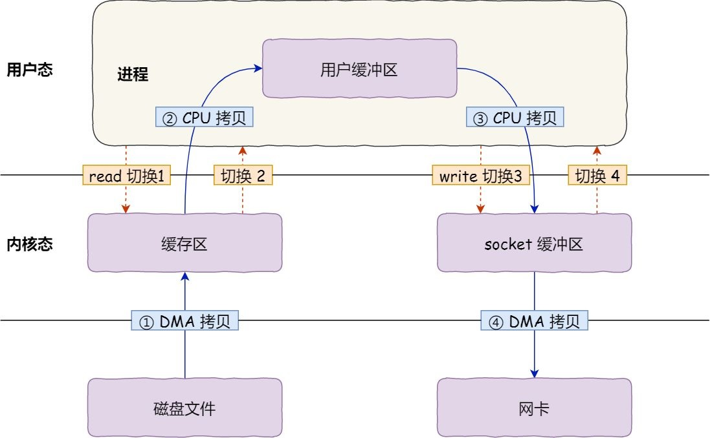</a>
首先，期间共发生了 **4次用户态与内核态的上下文切换**，因为发生了两次系统调用，一次是 read() ，一次是 write()，每次系统调用都得先从用户态切换到内核态，等内核完成任务后，再从内核态切换回用户态。

上下文切换到成本并不小，一次切换需要耗时几十纳秒到几微秒，虽然时间看上去很短，但是在高并发的场景下，这类时间容易被累积和放大，从而影响系统的性能。

其次，还发生了 **4次数据拷贝**，其中两次是 **DMA的拷贝**，另外两次则是通过 **CPU拷贝的**

:::tip 整体过程
1. 第一次拷贝，把磁盘上的数据拷贝到操作系统内核的缓冲区里，这个拷贝的过程是通过 DMA 搬运的。
2. 第二次拷贝，把内核缓冲区的数据拷贝到用户的缓冲区里，于是我们应用程序就可以使用这部分数据了，这个拷贝到过程是由 CPU 完成的。
3. 第三次拷贝，把刚才拷贝到用户的缓冲区里的数据，再拷贝到内核的 socket 的缓冲区里，这个过程依然还是由 CPU 搬运的。
4. 第四次拷贝，把内核的 socket 缓冲区里的数据，拷贝到网卡的缓冲区里，这个过程又是由 DMA 搬运的
:::  

### 3.7.3 如何实现零拷贝？

:::tip 零拷贝技术实现的方式
mmap + write  
sendfile  
:::

### 3.7.4 mmap + write

```cpp
buf = mmap(file, len);
write(sockfd, buf, len);
```
mmap() 系统调用函数会直接把内核缓冲区里的数据「**映射**」到用户空间，这样操作系统内核与用户空间就不需要再进行任何的数据拷贝操作

<a data-fancybox title="mmap + write" href="./image/mmap.jpg">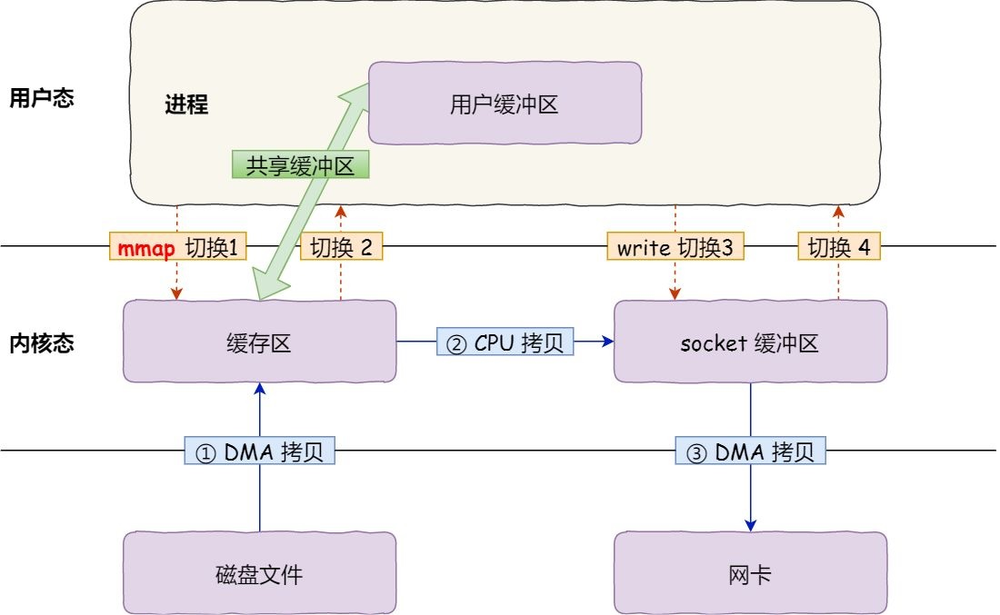</a>

:::tip 具体过程如下：
1. 应用进程调用了 mmap() 后，DMA 会把磁盘的数据拷贝到内核的缓冲区里。接着，应用进程跟操作系统内核「共享」这个缓冲区；
2. 应用进程再调用 write()，操作系统直接将内核缓冲区的数据拷贝到 socket 缓冲区中，这一切都发生在内核态，由 CPU 来搬运数据；
3. 最后，把内核的 socket 缓冲区里的数据，拷贝到网卡的缓冲区里，这个过程是由 DMA 搬运的。
:::

我们可以得知，通过使用 mmap() 来代替 read()， 可以减少一次数据拷贝的过程。  
但这还不是最理想的零拷贝，因为仍然需要通过 CPU 把内核缓冲区的数据拷贝到 socket 缓冲区里，而且仍然需要 4 次上下文切换，因为系统调用还是 2 次

### 3.7.5 sendfile

在 Linux 内核版本 2.1 中，提供了一个专门发送文件的系统调用函数 sendfile()，函数形式如下：
```cpp
#include <sys/socket.h>
ssize_t sendfile(int out_fd, int in_fd, off_t *offset, size_t count);
```
它的前两个参数分别是目的端和源端的文件描述符，后面两个参数是源端的偏移量和复制数据的长度，返回值是实际复制数据的长度。

首先，它可以替代前面的 **read() 和 write()** 这两个系统调用，这样就可以减少一次系统调用，也就**减少了 2 次上下文切换的开销**。

其次，该系统调用可以直接把内核缓冲区里的数据拷贝到 socket 缓冲区里，不再拷贝到用户态，这样就**只有 2 次上下文切换，和 3 次数据拷贝**。如下图：
<a data-fancybox title="sendfile" href="./image/sendfile.jpg">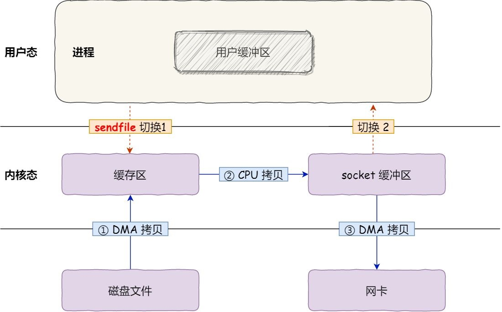</a>


-------------------------

但是这还不是真正的零拷贝技术，如果网卡支持 SG-DMA（The Scatter-Gather Direct Memory Access）技术（和普通的 DMA 有所不同），我们可以进一步减少通过 CPU 把内核缓冲区里的数据拷贝到 socket 缓冲区的过程。

你可以在你的 Linux 系统通过下面这个命令，查看网卡是否支持 scatter-gather 特性：

```sh
$ ethtool -k eth0 | grep scatter-gather
scatter-gather: on
```

于是，从 Linux 内核 2.4 版本开始起，对于支持网卡支持 SG-DMA 技术的情况下， sendfile() 系统调用的过程发生了点变化，

:::tip 具体过程如下：
1. 第一步，通过 DMA 将磁盘上的数据拷贝到内核缓冲区里；
2. 第二步，缓冲区描述符和数据长度传到 socket 缓冲区，这样网卡的 SG-DMA 控制器就可以直接将**内核缓存中的数据拷贝到网卡的缓冲区里**，此过程不需要将数据从操作系统内核缓冲区拷贝到 socket 缓冲区中，这样就减少了一次数据拷贝；
:::

<a data-fancybox title="sendfile" href="./image/sendfile01.jpg">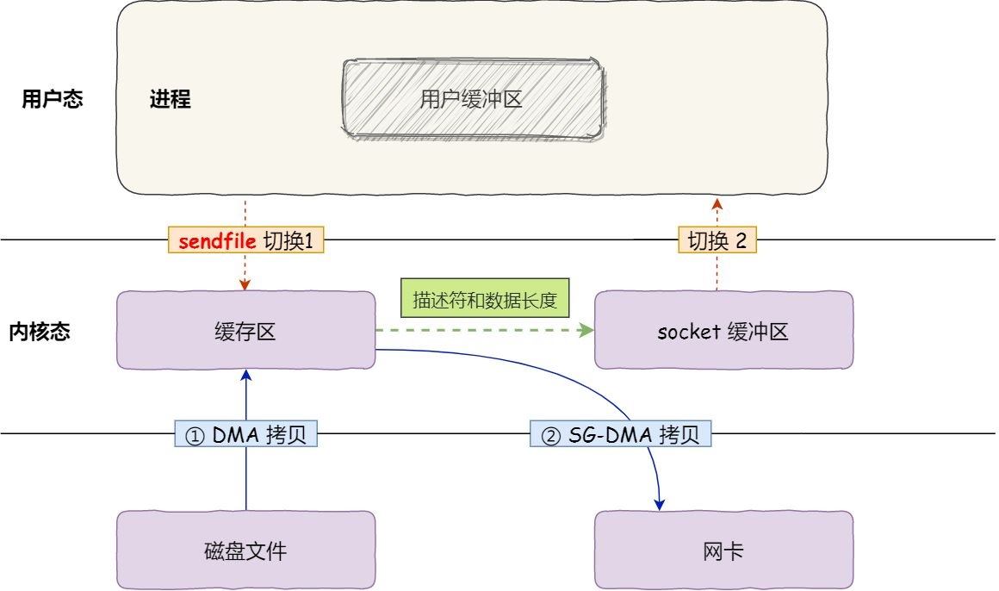</a>

这就是所谓的零拷贝（Zero-copy）技术，因为我们没有在内存层面去拷贝数据，也就是说全程没有通过 CPU 来搬运数据，所有的数据都是通过 DMA 来进行传输的。

零拷贝技术的文件传输方式相比传统文件传输的方式，**减少了 2 次上下文切换和数据拷贝次数，只需要 2 次上下文切换和数据拷贝次数，就可以完成文件的传输**，而且 2 次的数据拷贝过程，都不需要通过 CPU，2 次都是由 DMA 来搬运。

所以，总体来看零拷贝技术可以把文件传输的性能提高至少一倍以上。

### 3.7.6 NIO 零拷贝案例

#### 零拷贝方式
```java

package com.tqk.nio.zerocopy;

import java.io.FileInputStream;
import java.net.InetSocketAddress;
import java.nio.channels.FileChannel;
import java.nio.channels.SocketChannel;

public class NewIOClient {
    public static void main(String[] args) throws Exception {

        SocketChannel socketChannel = SocketChannel.open();
        socketChannel.connect(new InetSocketAddress("localhost", 7001));
        String filename = "protoc-3.6.1-win32.zip";

        //得到一个文件channel
        FileChannel fileChannel = new FileInputStream(filename).getChannel();

        //准备发送
        long startTime = System.currentTimeMillis();

        //在linux下一个transferTo 方法就可以完成传输
        //在windows 下 一次调用 transferTo 只能发送8m , 就需要分段传输文件, 而且要主要
        //传输时的位置 =》 课后思考...
        //transferTo 底层使用到零拷贝
        long transferCount = fileChannel.transferTo(0, fileChannel.size(), socketChannel);

        System.out.println("发送的总的字节数 =" + transferCount + " 耗时:" + (System.currentTimeMillis() - startTime));
        //关闭
        fileChannel.close();

    }
}
```

```java
package com.tqk.nio.zerocopy;

import java.net.InetSocketAddress;
import java.net.ServerSocket;
import java.nio.ByteBuffer;
import java.nio.channels.ServerSocketChannel;
import java.nio.channels.SocketChannel;

/**
 * //服务器
 * @author tianqikai
 */
public class NewIOServer {
    public static void main(String[] args) throws Exception {

        InetSocketAddress address = new InetSocketAddress(7001);

        ServerSocketChannel serverSocketChannel = ServerSocketChannel.open();

        ServerSocket serverSocket = serverSocketChannel.socket();

        serverSocket.bind(address);

        //创建buffer
        ByteBuffer byteBuffer = ByteBuffer.allocate(4096);

        while (true) {
            SocketChannel socketChannel = serverSocketChannel.accept();

            int readcount = 0;
            while (-1 != readcount) {
                try {

                    readcount = socketChannel.read(byteBuffer);

                }catch (Exception ex) {
                   // ex.printStackTrace();
                    break;
                }
                //
                byteBuffer.rewind(); //倒带 position = 0 mark 作废
            }
        }
    }
}

```
```bash
发送总字节数： 1007473, 耗时： 3
```
#### 非零拷贝方式
```java
package com.tqk.nio.zerocopy;

import java.io.DataOutputStream;
import java.io.FileInputStream;
import java.io.InputStream;
import java.net.Socket;

public class OldIOClient {

    public static void main(String[] args) throws Exception {
        Socket socket = new Socket("localhost", 7002);

        String fileName = "protoc-3.6.1-win32.zip";
        InputStream inputStream = new FileInputStream(fileName);

        DataOutputStream dataOutputStream = new DataOutputStream(socket.getOutputStream());

        byte[] buffer = new byte[4096];
        long readCount;
        long total = 0;

        long startTime = System.currentTimeMillis();

        while ((readCount = inputStream.read(buffer)) >= 0) {
            total += readCount;
            dataOutputStream.write(buffer);
        }

        System.out.println("发送总字节数： " + total + ", 耗时： " + (System.currentTimeMillis() - startTime));

        dataOutputStream.close();
        socket.close();
        inputStream.close();
    }
}

```

```java
package com.tqk.nio.zerocopy;

import java.io.DataInputStream;
import java.net.ServerSocket;
import java.net.Socket;

//java IO 的服务器
public class OldIOServer {

    public static void main(String[] args) throws Exception {
        ServerSocket serverSocket = new ServerSocket(7002);

        while (true) {
            Socket socket = serverSocket.accept();
            DataInputStream dataInputStream = new DataInputStream(socket.getInputStream());

            try {
                byte[] byteArray = new byte[4096];

                while (true) {
                    int readCount = dataInputStream.read(byteArray, 0, byteArray.length);

                    if (-1 == readCount) {
                        break;
                    }
                }
            } catch (Exception ex) {
                ex.printStackTrace();
            }
        }
    }
}
```
```bash
发送总字节数： 1007473, 耗时： 9
```

## 3.8  原生NIO存在的问题
:::tip 原生NIO存在的问题
1. NIO 的类库和 API 繁杂，使用麻烦：需要熟练掌握 Selector、ServerSocketChannel、SocketChannel、ByteBuffer 等。
2. 需要具备其他的额外技能：要熟悉 Java 多线程编程，因为 NIO 编程涉及到 Reactor 模式，你必须对多线程和网络编程非常熟悉，才能编写出高质量的 NIO 程序。
3. 开发工作量和难度都非常大：例如客户端面临断连重连、网络闪断、半包读写、失败缓存、网络拥塞和异常流的处理等等。
4. JDK NIO 的 Bug：例如臭名昭著的 Epoll Bug，它会导致 Selector 空轮询，最终导致 CPU 100%。直到 JDK 1.7 版本该问题仍旧存在，没有被根本解决。
:::

## 3.9 NIO-Reactor 模式

不同的线程模式，对程序的性能有很大影响，为了搞清Netty 线程模式，我们来系统的讲解下 各个线程模式， 最后看看Netty 线程模型有什么优越性.

:::tip 目前存在的线程模型有：
1. <font color='red'>传统阻塞 I/O 服务模型</font>  
2. <font color='red'>Reactor 模式</font>  
:::


根据 Reactor 的数量和处理资源池线程的数量不同，有 3 种典型的实现
:::tip Reactor模式
1. **单 Reactor 单线程**
2. **单 Reactor 多线程**
3. **主从 Reactor 多线程** 
:::

**Netty 线程模式(Netty 主要基于主从 Reactor 多线程模型做了一定的改进，其中主从 Reactor 多线程模型有多个 Reactor)**

### 3.9.1 传统阻塞 I/O 服务模型

<a data-fancybox title="传统阻塞 I/O 服务模型" href="./image/io.jpg">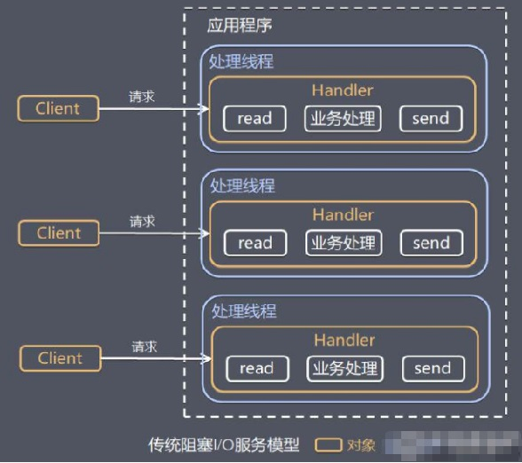</a>

#### 工作原理图
黄色的框表示对象， 蓝色的框表示线程
白色的框表示方法(API)
#### 模型特点
1. 采用阻塞IO模式获取输入的数据
2. 每个连接都需要独立的线程完成数据的输入，业务处理,数据返回
#### 问题分析
1. 当并发数很大，就会创建大量的线程，占用很大系统资源
2. 连接创建后，如果当前线程暂时没有数据可读，该线程会阻塞在read 操作，造成线程资源浪费

### 3.9.2 Reactor模式简介

**针对传统阻塞 I/O 服务模型的 2 个缺点，解决方案：** 

1. 基于 I/O 复用模型：多个连接共用一个阻塞对象，应用程序只需要在一个阻塞对象等待，无需阻塞等待所有连接。当某个连接有新的数据可以处理时，操作系统通知应用程序，线程从阻塞状态返回，开始进行业务处理

:::tip Reactor 对应的叫法: 
1. 反应器模式 
2. 分发者模式(Dispatcher) 
3. 通知者模式(notifier)
:::
三种叫法都可以

2. 基于线程池复用线程资源：不必再为每个连接创建线程，将连接完成后的业务处理任务分配给线程进行处理，一个线程可以处理多个连接的业务。

<a data-fancybox title="Reactor" href="./image/Reactor01.jpg">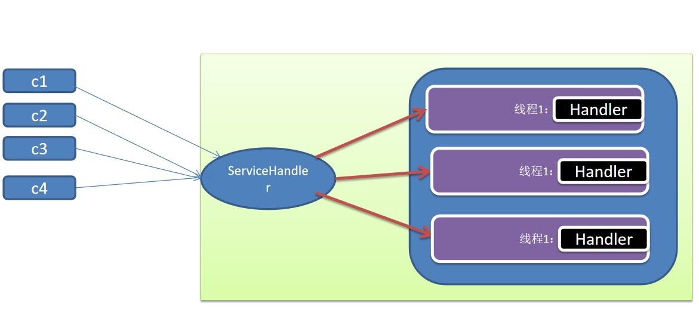</a>

**I/O 复用结合线程池，就是 Reactor 模式基本设计思想，如图：**
<a data-fancybox title="Reactor" href="./image/Reactor02.jpg">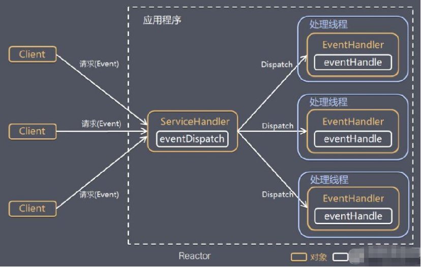</a>

:::tip 说明:
1. Reactor 模式，通过一个或多个输入同时传递给服务处理器的模式(基于事件驱动)
2. 服务器端程序处理传入的多个请求,并将它们同步分派到相应的处理线程， 因此Reactor模式也叫 Dispatcher模式
3. Reactor 模式使用IO复用监听事件, 收到事件后，分发给某个线程(进程), 这点就是网络服务器高并发处理关键
:::

### 3.9.3 Reactor核心组成和分类

1. <font color='#f15b6c'><strong>Reactor</strong></font>：Reactor 在一个单独的线程中运行，负责监听和分发事件，分发给适当的处理程序来对 IO 事件做出反应。 它就像公司的电话接线员，它接听来自客户的电话并将线路转移到适当的联系人；

2. <font color='#f15b6c'><strong>Handlers</strong></font>：处理程序执行 I/O 事件要完成的实际事件，类似于客户想要与之交谈的公司中的实际官员。Reactor 通过调度适当的处理程序来响应 I/O 事件，处理程序执行非阻塞操作。

----------------

**根据 Reactor 的数量和处理资源池线程的数量不同，有3种典型的实现**

:::tip Reactor模式分类
1. **单 Reactor 单线程**
2. **单 Reactor 多线程**
3. **主从 Reactor 多线程**
:::

### 3.9.4 单Reactor单线程

<a data-fancybox title="Reactor" href="./image/Reactor03.jpg">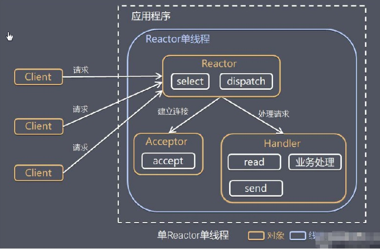</a>

:::tip 方案说明：
1. Select 是前面 I/O 复用模型介绍的标准网络编程 API，可以实现应用程序通过一个阻塞对象监听多路连接请求
2. Reactor 对象通过 Select 监控客户端请求事件，收到事件后通过 Dispatch 进行分发
3. 如果是建立连接请求事件，则由 Acceptor 通过 Accept 处理连接请求，然后创建一个 Handler 对象处理连接完成后的后续业务处理
4. 如果不是建立连接事件，则 Reactor 会分发调用连接对应的 Handler 来响应
5. Handler 会完成 Read→业务处理→Send 的完整业务流程
:::

结合实例：服务器端用一个线程通过多路复用搞定所有的 IO 操作（包括连接，读、写等），编码简单，清晰明了，但是如果客户端连接数量较多，将无法支撑，前面的 NIO 案例就属于这种模型。

::: warning 方案优缺点分析：
1. 优点：模型简单，没有多线程、进程通信、竞争的问题，全部都在一个线程中完成
2. 缺点：性能问题，只有一个线程，无法完全发挥多核 CPU 的性能。Handler 在处理某个连接上的业务时，整个进程无法处理其他连接事件，很容易导致性能瓶颈
3. 缺点：可靠性问题，线程意外终止，或者进入死循环，会导致整个系统通信模块不可用，不能接收和处理外部消息，造成节点故障
4. 使用场景：客户端的数量有限，业务处理非常快速，比如 **Redis在业务处理的时间复杂度 O(1) 的情况**
:::

### 3.9.4 单Reactor多线程

**作原理示意图：**
<a data-fancybox title="Reactor" href="./image/Reactor04.jpg">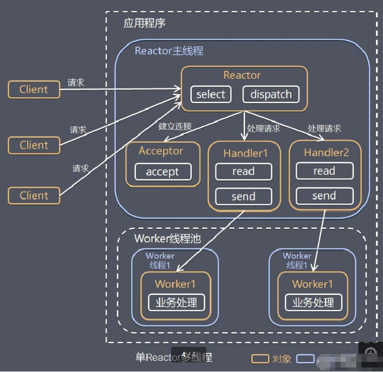</a>

:::tip 方案说明
1. Reactor 对象通过select 监控客户端请求事件, 收到事件后，通过dispatch进行分发
2. 如果建立连接请求, 则右Acceptor 通过accept 处理连接请求, 然后创建一个Handler对象处理完成连接后的各种事件
3. 如果不是连接请求，则由reactor分发调用连接对应的handler 来处理
4. handler 只负责响应事件，不做具体的业务处理, 通过read 读取数据后，会分发给后面的worker线程池的某个线程处理业务
5. worker 线程池会分配独立线程完成真正的业务，并将结果返回给handler
6. handler收到响应后，通过send 将结果返回给client
:::

:::warning 方案优缺点分析：
1. 优点：可以充分的利用多核cpu 的处理能力
2. 缺点：多线程数据共享和访问比较复杂， reactor 处理所有的事件的监听和响应，在单线程运行， 在高并发场景容易出现性能瓶颈.
::: 

### 3.9.5 主从 Reactor 多线程

**工作原理示意图：**
针对单 Reactor 多线程模型中，Reactor 在单线程中运行，高并发场景下容易成为性能瓶颈，可以让 Reactor 在多线程中运行

<a data-fancybox title="Reactor" href="./image/Reactor05.jpg">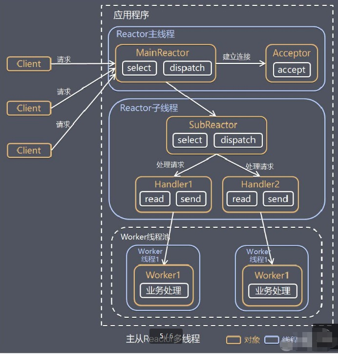</a>

:::tip 方案说明
1. Reactor主线程 MainReactor 对象通过select 监听连接事件, 收到事件后，通过Acceptor 处理连接事件
2. 当 Acceptor  处理连接事件后，MainReactor 将连接分配给SubReactor 
3. subreactor 将连接加入到连接队列进行监听,并创建handler进行各种事件处理
4. 当有新事件发生时， subreactor 就会调用对应的handler处理
5. handler 通过read 读取数据，分发给后面的worker 线程处理
6. worker 线程池分配独立的worker 线程进行业务处理，并返回结果
7. handler 收到响应的结果后，再通过send 将结果返回给client
8. Reactor 主线程可以对应多个Reactor 子线程, 即MainRecator 可以关联多个SubReactor
:::

<a data-fancybox title="Reactor" href="./image/Reactor06.jpg">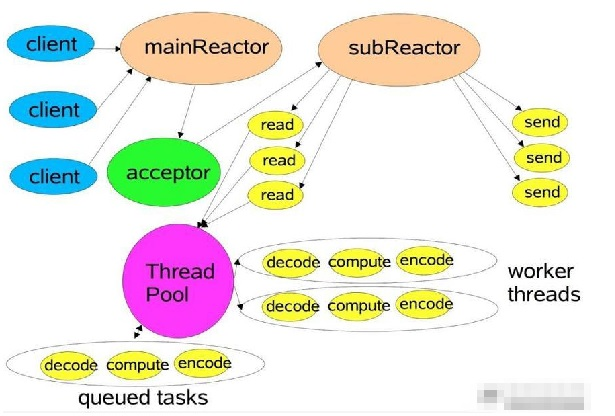</a>

:::tip 方案优缺点说明：
1. 优点：父线程与子线程的数据交互简单职责明确，父线程只需要接收新连接，子线程完成后续的业务处理。
2. 优点：父线程与子线程的数据交互简单，Reactor 主线程只需要把新连接传给子线程，子线程无需返回数据。
3. 缺点：编程复杂度较高
4.结合实例：这种模型在许多项目中广泛使用，包括 Nginx 主从 Reactor 多进程模型，Memcached 主从多线程，Netty 主从多线程模型的支持
:::