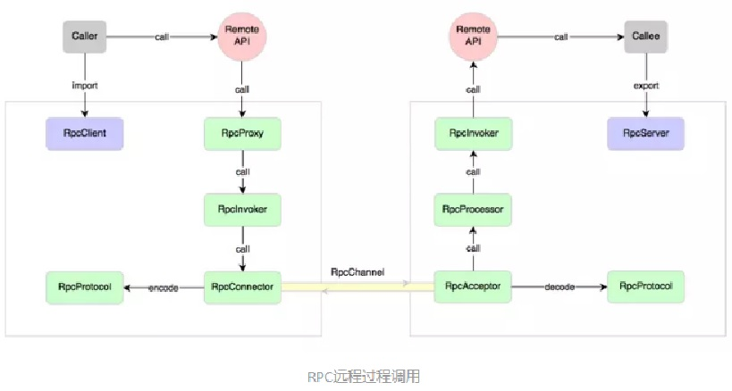
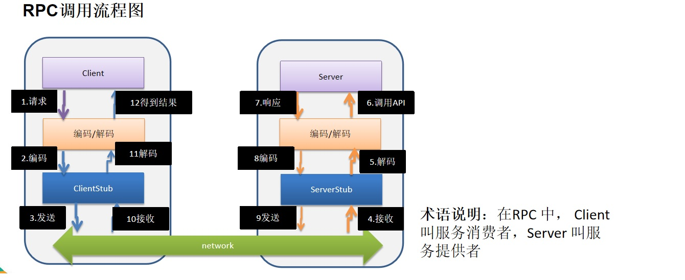

# 14. Netty-RPC简单框架

## 14.1 RPC基本介绍

RPC（Remote Procedure Call）— 远程过程调用，是一个计算机通信协议。该协议允许运行于一台计算机的程序调用另一台计算机的子程序，而程序员无需额外地为这个交互作用编程

两个或多个应用程序都分布在不同的服务器上，它们之间的调用都像是本地方法调用一样(如图)

<a data-fancybox title="RPC基本介绍" href="./image/RPC-netty.jpg"></a>

<a data-fancybox title="RPC基本介绍" href="./image/RPC.jpg"></a>

## 14.2 客户端
### 14.2.1 NettyRpcClient
```java
package com.tqk.nettty.dubbo.client;

import io.netty.bootstrap.Bootstrap;
import io.netty.channel.ChannelOption;
import io.netty.channel.nio.NioEventLoopGroup;
import io.netty.channel.socket.nio.NioSocketChannel;

import java.lang.reflect.InvocationHandler;
import java.lang.reflect.Method;
import java.lang.reflect.Proxy;
import java.util.concurrent.ExecutorService;
import java.util.concurrent.Executors;

public class NettyRpcClient {
    //创建线程池
    private static ExecutorService executor = Executors.newFixedThreadPool(Runtime.getRuntime().availableProcessors());

    private static NettyRpcClientHandler client;
    private int count = 0;

    public Object getBean(final Class<?> serviceClass, final String providerName){
        return Proxy.newProxyInstance(Thread.currentThread().getContextClassLoader(), new Class<?>[]{serviceClass}, new InvocationHandler() {
            @Override
            public Object invoke(Object proxy, Method method, Object[] args) throws Throwable {
                System.out.println("(proxy, method, args) 进入...." + (++count) + " 次");
                //{}  部分的代码，客户端每调用一次 hello, 就会进入到该代码
                if (client == null) {
                    initClient();
                }

                //设置要发给服务器端的信息
                //providerName 协议头 args[0] 就是客户端调用api hello(???), 参数
                client.setPara(providerName + args[0]);

                //使用ExecutorService执行Callable类型的任务，并返回结果
                return executor.submit(client).get();
            }
        });
    }
    /**
     * 初始化netty客户端
     */
    public static void initClient(){
        client=new NettyRpcClientHandler();
        NioEventLoopGroup eventLoopGroup = new NioEventLoopGroup();
        Bootstrap bootstrap = new Bootstrap();
        bootstrap.group(eventLoopGroup)
                .channel(NioSocketChannel.class)
                .option(ChannelOption.TCP_NODELAY,true)
                .handler(new MyChannelInitializer(client));
        try {
            bootstrap.connect("127.0.0.1",7000).sync();
        } catch (InterruptedException e) {
            e.printStackTrace();
        }

    }

    public static void main(String[] args) {

    }
}

```

### 14.2.2 NettyRpcClientHandler
```java
package com.tqk.nettty.dubbo.client;

import io.netty.channel.ChannelHandlerContext;
import io.netty.channel.ChannelInboundHandlerAdapter;

import java.util.concurrent.Callable;

public class NettyRpcClientHandler extends ChannelInboundHandlerAdapter implements Callable {
    //上下文
    private ChannelHandlerContext context;
    //返回的结果
    private String result;
    //客户端调用方法时，传入的参数
    private String para;

    /**
     * 与服务器的连接创建后，就会被调用, 这个方法是第一个被调用(1)
     * @param ctx
     * @throws Exception
     */
    @Override
    public void channelActive(ChannelHandlerContext ctx) throws Exception {
        System.out.println(" channelActive 被调用  ");
        //因为我们在其它方法会使用到 ctx
        context = ctx;
    }

    /**
     * 收到服务器的数据后，调用方法 (4)
     * @param ctx
     * @param msg
     * @throws Exception
     */
    @Override
    public synchronized void channelRead(ChannelHandlerContext ctx, Object msg) throws Exception {
        System.out.println(" channelRead 被调用  ");
        result = msg.toString();
        notify(); //唤醒等待的线程
    }

    @Override
    public void exceptionCaught(ChannelHandlerContext ctx, Throwable cause) throws Exception {
        ctx.close();
    }

    /**
     * 被代理对象调用, 发送数据给服务器，-> wait -> 等待被唤醒(channelRead) -> 返回结果 (3)-》5
     * @return
     * @throws Exception
     */
    @Override
    public synchronized Object call() throws Exception {
        System.out.println(" call1 被调用  ");
        context.writeAndFlush(para);
        //进行wait
        wait(); //等待channelRead 方法获取到服务器的结果后，唤醒
        System.out.println(" call2 被调用  ");
        //服务方返回的结果
        return  result;

    }
    /**
     * (2)
     * @param para
     */
    void setPara(String para) {
        System.out.println(" setPara : "+para);
        this.para = para;
    }
}

```

### 14.2.3  MyChannelInitializer
```java
package com.tqk.nettty.dubbo.client;

import io.netty.channel.Channel;
import io.netty.channel.ChannelInitializer;
import io.netty.channel.ChannelPipeline;
import io.netty.handler.codec.string.StringDecoder;
import io.netty.handler.codec.string.StringEncoder;

/**
 * @author tianqikai
 */
public class MyChannelInitializer extends ChannelInitializer {
    private  NettyRpcClientHandler client;

    public MyChannelInitializer(NettyRpcClientHandler client) {
        this.client=client;
    }
    public MyChannelInitializer() {

    }
    @Override
    protected void initChannel(Channel ch) throws Exception {
        ChannelPipeline pipeline = ch.pipeline();
        //编码解码
        pipeline.addLast(new StringDecoder());
        pipeline.addLast(new StringEncoder());
        pipeline.addLast(client);

    }
}

```

### 14.2.4  MessageProtocol
```java
package com.tqk.nettty.dubbo.client;

//协议包
public class MessageProtocol {
    private int len; //关键
    private byte[] content;

    public int getLen() {
        return len;
    }

    public void setLen(int len) {
        this.len = len;
    }

    public byte[] getContent() {
        return content;
    }

    public void setContent(byte[] content) {
        this.content = content;
    }
}
```

### 14.2.5  HelloService
```java
package com.tqk.nettty.dubbo.service;

//这个是接口，是服务提供方和 服务消费方都需要
public interface HelloService {

    String hello(String mes);
}

```
### 14.2.6 ClientBootstrap
```java
package com.tqk.nettty.dubbo.client;


import com.tqk.nettty.dubbo.service.HelloService;

public class ClientBootstrap {


    //这里定义协议头
    public static final String providerName = "HelloService#hello#";

    public static void main(String[] args) throws  Exception{

        //创建一个消费者
        NettyRpcClient customer = new NettyRpcClient();

        //创建代理对象
        HelloService service = (HelloService) customer.getBean(HelloService.class, providerName);

        for (;; ) {
            Thread.sleep(2 * 1000);
            //通过代理对象调用服务提供者的方法(服务)
            String res = service.hello("你好 dubbo~");
            System.out.println("调用的结果 res= " + res);
        }
    }
}

```
## 14.3 服务端

### 14.3.1 NettyServer

```java
package com.tqk.nettty.dubbo.server;


import io.netty.bootstrap.ServerBootstrap;
import io.netty.channel.ChannelFuture;
import io.netty.channel.ChannelInitializer;
import io.netty.channel.ChannelPipeline;
import io.netty.channel.EventLoopGroup;
import io.netty.channel.nio.NioEventLoopGroup;
import io.netty.channel.socket.SocketChannel;
import io.netty.channel.socket.nio.NioServerSocketChannel;
import io.netty.handler.codec.string.StringDecoder;
import io.netty.handler.codec.string.StringEncoder;

public class NettyServer {


    public static void startServer(String hostName, int port) {
        startServer0(hostName,port);
    }

    //编写一个方法，完成对NettyServer的初始化和启动

    private static void startServer0(String hostname, int port) {

        EventLoopGroup bossGroup = new NioEventLoopGroup(1);
        EventLoopGroup workerGroup = new NioEventLoopGroup();

        try {

            ServerBootstrap serverBootstrap = new ServerBootstrap();

            serverBootstrap.group(bossGroup,workerGroup)
                    .channel(NioServerSocketChannel.class)
                    .childHandler(new ChannelInitializer<SocketChannel>() {
                                      @Override
                                      protected void initChannel(SocketChannel ch) throws Exception {
                                          ChannelPipeline pipeline = ch.pipeline();
                                          pipeline.addLast(new StringDecoder());
                                          pipeline.addLast(new StringEncoder());
                                          pipeline.addLast(new NettyServerHandler()); //业务处理器

                                      }
                                  }

                    );

            ChannelFuture channelFuture = serverBootstrap.bind(hostname, port).sync();
            System.out.println("服务提供方开始提供服务~~");
            channelFuture.channel().closeFuture().sync();

        }catch (Exception e) {
            e.printStackTrace();
        }
        finally {
            bossGroup.shutdownGracefully();
            workerGroup.shutdownGracefully();
        }

    }
}

```
### 14.3.2 NettyServerHandler 

```java
package com.tqk.nettty.dubbo.server;

import com.tqk.nettty.dubbo.client.ClientBootstrap;
import com.tqk.nettty.dubbo.service.HelloServiceImpl;
import io.netty.channel.ChannelHandlerContext;
import io.netty.channel.ChannelInboundHandlerAdapter;

//服务器这边handler比较简单
public class NettyServerHandler extends ChannelInboundHandlerAdapter {

    @Override
    public void channelRead(ChannelHandlerContext ctx, Object msg) throws Exception {
        //获取客户端发送的消息，并调用服务
        System.out.println("msg=" + msg);
        //客户端在调用服务器的api 时，我们需要定义一个协议
        //比如我们要求 每次发消息是都必须以某个字符串开头 "HelloService#hello#你好"
        if(msg.toString().startsWith(ClientBootstrap.providerName)) {

            String result = new HelloServiceImpl().hello(msg.toString().substring(msg.toString().lastIndexOf("#") + 1));
            ctx.writeAndFlush(result);
        }
    }

    @Override
    public void exceptionCaught(ChannelHandlerContext ctx, Throwable cause) throws Exception {
        ctx.close();
    }
}

```
### 14.3.3 HelloService 

```java
package com.tqk.nettty.dubbo.service;

//这个是接口，是服务提供方和 服务消费方都需要
public interface HelloService {

    String hello(String mes);
}

```
### 14.3.4 HelloServiceImpl

```java
package com.tqk.nettty.dubbo.service;


public class HelloServiceImpl implements HelloService{

    private static int count = 0;
    //当有消费方调用该方法时， 就返回一个结果
    @Override
    public String hello(String mes) {
        System.out.println("收到客户端消息=" + mes);
        //根据mes 返回不同的结果
        if(mes != null) {
            return "你好客户端, 我已经收到你的消息 [" + mes + "] 第" + (++count) + " 次";
        } else {
            return "你好客户端, 我已经收到你的消息 ";
        }
    }
}

```
### 14.3.5 ServerBootstrap

```java
package com.tqk.nettty.dubbo.service;

import com.tqk.nettty.dubbo.server.NettyServer;

//ServerBootstrap 会启动一个服务提供者，就是 NettyServer
public class ServerBootstrap {
    public static void main(String[] args) {

        //代码代填..
        NettyServer.startServer("127.0.0.1", 7000);
    }
}

```

## 14.4 含有注册中心的RPC见项目工程