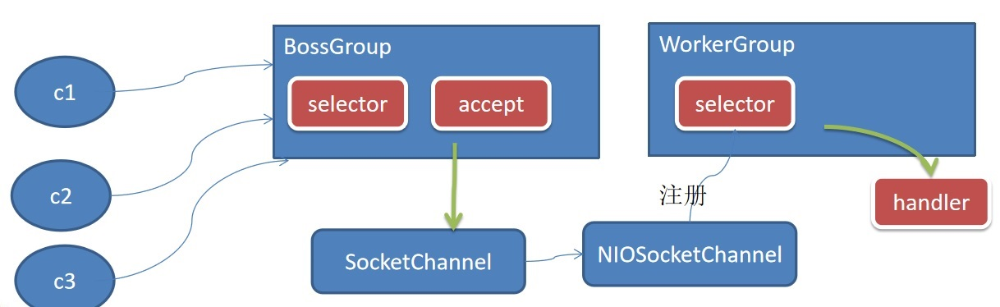
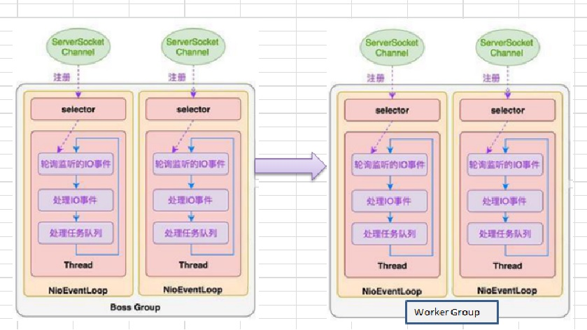
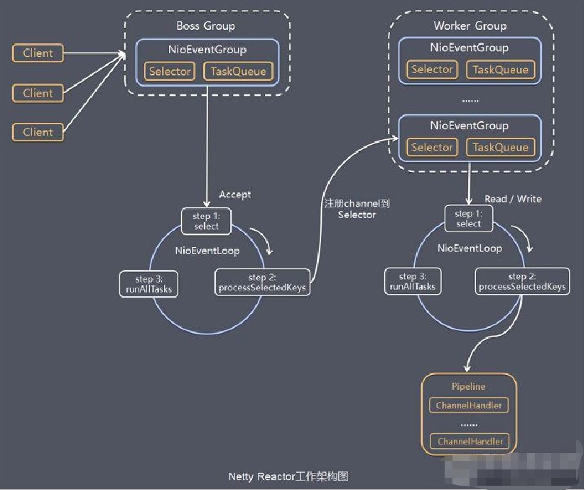
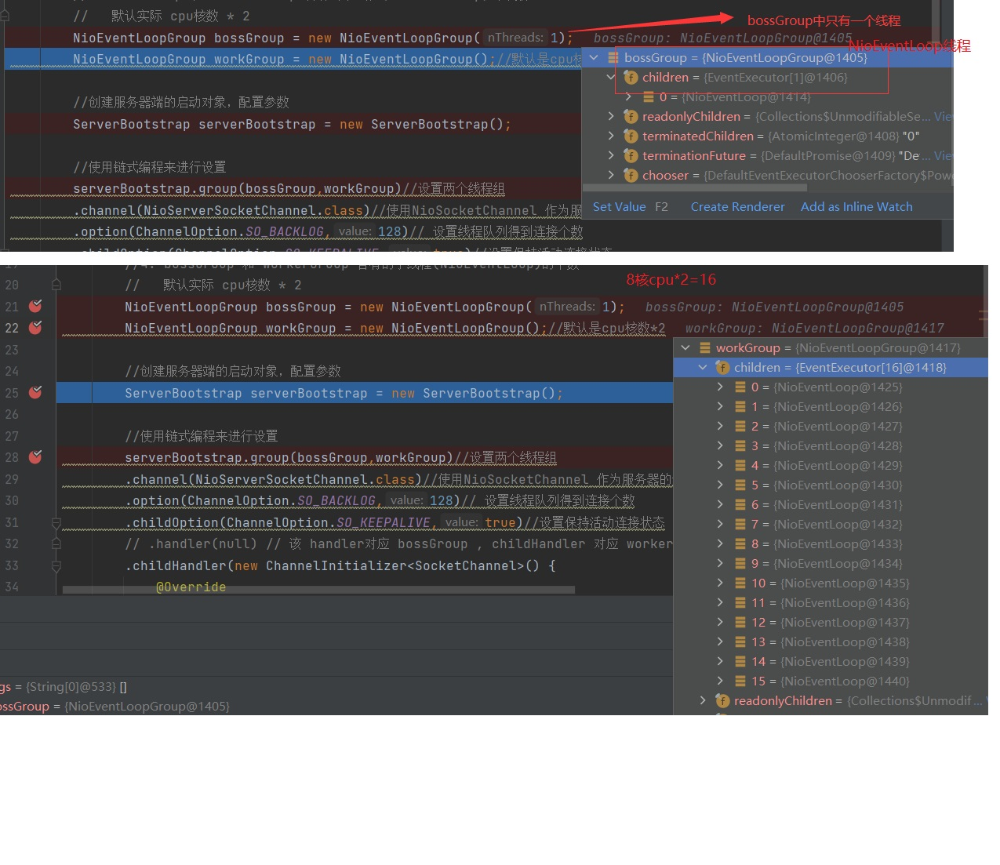
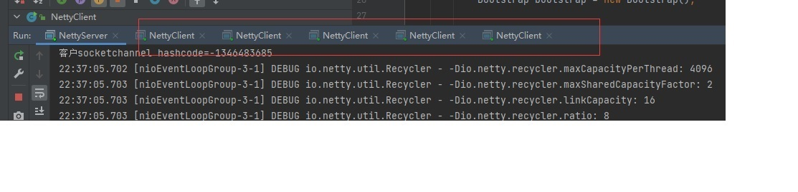
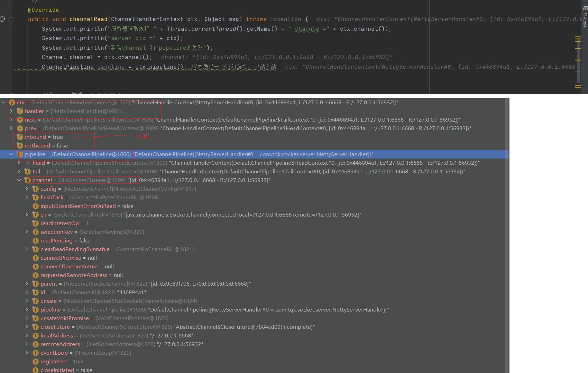

# 4. Netty基础介绍

**Netty 是目前最流行的 NIO 框架，Netty 在互联网领域、大数据分布式计算领域、游戏行业、通信行业等获得了广泛的应用，知名的 Elasticsearch 、Dubbo 框架内部都采用了 Netty**

## 4.1 为什么要用 Netty

1. 虽然 JAVA NIO 框架提供了 **多路复用 IO**的支持，但是并没有提供上层“信息格式”的良好封装。例如前两者并没有提供针对 Protocol Buffer、JSON 这些信 息格式的封装，但是 Netty 框架提供了这些数据格式封装（<font color='red'>基于责任链模式的编码和解码功能</font>）； 

3. **NIO 的类库和API相当复杂**，使用它来开发需要非常熟练地掌握 Selector、 ByteBuffer、ServerSocketChannel、SocketChannel 等，需要很多额外的编程技能 来辅助使用 NIO,例如，因为 NIO 涉及了 Reactor 线程模型，所以必须必须对多线 程和网络编程非常熟悉才能写出高质量的 NIO 程序 

3. 要编写一个可靠的、易维护的、高性能的 NIO 服务器应用。除了框架本身要兼容实现各类操作系统的实现外。更重要的是它应该还要处理很多上层特有服务，例如：客户端的权限、还有上面提到的信息格式封装、简单的数据读取， <font color='red'>**断连重连，半包读写，心跳等等，这些 Netty 框架都提供了响应的支持**</font>。 

4. **JAVA NIO 框架存在一个 poll/epoll bug：Selector doesn’t block on Selector.select(timeout)，不能 block 意味着 CPU 的使用率会变成 100%**（这是底 层 JNI 的问题，上层要处理这个异常实际上也好办）。当然这个 bug 只有在 Linux 内核上才能重现。 

这个问题在 JDK 1.7 版本中还没有被完全解决，但是 Netty 已经将这个 bug 进行了处理。 这个 Bug 与操作系统机制有关系的，JDK 虽然仅仅是一个兼容各个操作系统 平台的软件，但在 JDK5 和 JDK6 最初的版本中（严格意义上来将，JDK 部分版本 都是），这个问题并没有解决，而将这个帽子抛给了操作系统方，这也就是这个 bug 最终一直到 2013 年才最终修复的原因(JDK7 和 JDK8 之间)。

## 4.1.1 为什么 Netty 使用 NIO 而不是 AIO？

1. **Netty 不看重 Windows 上的使用，在 Linux 系统上，AIO 的底层实现仍使用 EPOLL，没有很好实现 AIO**，因此在性能上没有明显的优势，而且被 JDK 封装了 一层不容易深度优化。 

3. AIO 还有个缺点是**接收数据需要预先分配缓存**, 而不是 NIO 那种需要接收时才需要分配缓存, 所以对连接数量非常大但流量小的情况, 内存浪费很多。 
据说  <font color='red'>**Linux 上 AIO 不够成熟，处理回调结果速度跟不上处理需求**</font>，有点像外 卖员太少，顾客太多，供不应求，造成处理速度有瓶颈

## 4.2 Netty模型

Netty 主要基于主从 Reactors 多线程模型（如图）做了一定的改进，其中主从 Reactor 多线程模型有多个 Reactor

### 4.2.1 工作原理示意图1-简单版
<a data-fancybox title="Netty模型" href="./image/netty01.jpg"></a>

:::tip 工作原理说明
1. BossGroup 线程维护Selector , 只关注Accecpt
2. 当接收到Accept事件，获取到对应的SocketChannel, 封装成 NIOScoketChannel并注册到Worker 线程(事件循环), 并进行维护
3. 当Worker线程监听到selector 中通道发生自己感兴趣的事件后，就进行处理(就由handler)， 注意handler 已经加入到通道
:::

### 4.2.2 工作原理示意图2-进阶版
Netty 主要基于主从 Reactors 多线程模型（如图）做了一定的改进，其中主从 Reactor 多线程模型有多个 Reactor

<a data-fancybox title="Netty模型" href="./image/netty02.jpg"></a>

### 4.2.3 工作原理示意图-详细版

<a data-fancybox title="Netty模型" href="./image/netty03.jpg"></a>

:::tip 工作流程说明
1. Netty抽象出两组线程池 BossGroup 专门负责接收客户端的连接, WorkerGroup 专门负责网络的读写
2. **BossGroup 和 WorkerGroup 类型都是 NioEventLoopGroup**
3. NioEventLoopGroup 相当于一个事件循环组, 这个组中含有多个事件循环 ，每一个事件循环是 **NioEventLoop**
4. NioEventLoop 表示一个不断循环的执行处理任务的线程， 每个NioEventLoop 都有一个selector , 用于监听绑定在其上的socket的网络通讯
5. NioEventLoopGroup 可以有多个线程, 即可以含有多个NioEventLoop
6. 每个Boss NioEventLoop 循环执行的步骤有3步
```
    a. 轮询accept 事件
    b. 处理accept 事件 , 与client建立连接 , 生成NioScocketChannel , 并将其注册到某个worker NIOEventLoop 上的 selector 
    c. 处理任务队列的任务 ， 即 runAllTasks
```
7. 每个 Worker NIOEventLoop 循环执行的步骤 
```
    a. 轮询read, write 事件  
    b. 处理i/o事件， 即read , write 事件，在对应NioScocketChannel 处理  
    c. 处理任务队列的任务 ， 即 runAllTasks  
```
8. 每个Worker NIOEventLoop  处理业务时，会使用pipeline(管道), pipeline 中包含了 channel , 即通过pipeline 可以获取到对应通道, 管道中维护了很多的 处理器
:::

## 4.3 Netty 快速入门实例 - TCP 服务

### 4.3.1  NettyServer

```java
package com.tqk.socket.client;

import io.netty.buffer.ByteBuf;
import io.netty.buffer.Unpooled;
import io.netty.channel.ChannelHandlerContext;
import io.netty.channel.ChannelInboundHandlerAdapter;
import io.netty.util.CharsetUtil;

/**
 * @author tianqikai
 */
public class NettyClientHandler extends ChannelInboundHandlerAdapter {
    /**
     *
     * @param ctx
     * @throws Exception
     */
    @Override
    public void channelActive(ChannelHandlerContext ctx) throws Exception {
        System.out.println("client " + ctx);
        ctx.writeAndFlush(Unpooled.copiedBuffer("hello, server: (>^ω^<)喵", CharsetUtil.UTF_8));
    }

    @Override
    public void channelRead(ChannelHandlerContext ctx, Object msg) throws Exception {
        ByteBuf buf = (ByteBuf) msg;
        System.out.println("客户端接收到返回信息: "+buf.toString(CharsetUtil.UTF_8));
        System.out.println("服务器的地址： "+ ctx.channel().remoteAddress());
    }

    /**
     * 异常处理
     * @param ctx
     * @param cause
     * @throws Exception
     */
    @Override
    public void exceptionCaught(ChannelHandlerContext ctx, Throwable cause) throws Exception {
        cause.printStackTrace();
        ctx.close();
    }
    /**
     * 心跳重连机制
     * @param ctx
     * @param evt
     * @throws Exception
     */
    @Override
    public void userEventTriggered(ChannelHandlerContext ctx, Object evt) throws Exception {
        super.userEventTriggered(ctx, evt);
    }
    // 数据读取完毕的处理
    @Override
    public void channelReadComplete(ChannelHandlerContext ctx) throws Exception {
        System.err.println("客户端读取数据完毕");
        ctx.close();
    }
}

```
### 4.3.2  NettyServerHandler

```java
package com.tqk.socket.client;

import io.netty.buffer.ByteBuf;
import io.netty.buffer.Unpooled;
import io.netty.channel.ChannelHandlerContext;
import io.netty.channel.ChannelInboundHandlerAdapter;
import io.netty.util.CharsetUtil;

/**
 * @author tianqikai
 */
public class NettyClientHandler extends ChannelInboundHandlerAdapter {
    /**
     *
     * @param ctx
     * @throws Exception
     */
    @Override
    public void channelActive(ChannelHandlerContext ctx) throws Exception {
        System.out.println("client " + ctx);
        ctx.writeAndFlush(Unpooled.copiedBuffer("hello, server: (>^ω^<)喵", CharsetUtil.UTF_8));
    }

    @Override
    public void channelRead(ChannelHandlerContext ctx, Object msg) throws Exception {
        ByteBuf buf = (ByteBuf) msg;
        System.out.println("客户端接收到返回信息: "+buf.toString(CharsetUtil.UTF_8));
        System.out.println("服务器的地址： "+ ctx.channel().remoteAddress());
    }

    /**
     * 异常处理
     * @param ctx
     * @param cause
     * @throws Exception
     */
    @Override
    public void exceptionCaught(ChannelHandlerContext ctx, Throwable cause) throws Exception {
        cause.printStackTrace();
        ctx.close();
    }
    /**
     * 心跳重连机制
     * @param ctx
     * @param evt
     * @throws Exception
     */
    @Override
    public void userEventTriggered(ChannelHandlerContext ctx, Object evt) throws Exception {
        super.userEventTriggered(ctx, evt);
    }
    // 数据读取完毕的处理
    @Override
    public void channelReadComplete(ChannelHandlerContext ctx) throws Exception {
        System.err.println("客户端读取数据完毕");
        //断开连接
        ctx.close();
    }
}

```
### 4.3.3  NettyClient


```java
package com.tqk.socket.server;

import io.netty.bootstrap.ServerBootstrap;
import io.netty.channel.Channel;
import io.netty.channel.ChannelFuture;
import io.netty.channel.ChannelInitializer;
import io.netty.channel.ChannelOption;
import io.netty.channel.nio.NioEventLoopGroup;
import io.netty.channel.socket.SocketChannel;
import io.netty.channel.socket.nio.NioServerSocketChannel;

public class NettyServer {
    public static void main(String[] args) throws InterruptedException {
        //创建BossGroup 和 WorkerGroup
        //说明
        //1. 创建两个线程组 bossGroup 和 workerGroup
        //2. bossGroup 只是处理连接请求 , 真正的和客户端业务处理，会交给 workerGroup完成
        //3. 两个都是无限循环
        //4. bossGroup 和 workerGroup 含有的子线程(NioEventLoop)的个数
        //   默认实际 cpu核数 * 2
        NioEventLoopGroup bossGroup = new NioEventLoopGroup(1);
        NioEventLoopGroup workGroup = new NioEventLoopGroup();//默认是cpu核数*2

        //创建服务器端的启动对象，配置参数
        ServerBootstrap serverBootstrap = new ServerBootstrap();

        //使用链式编程来进行设置
        serverBootstrap.group(bossGroup,workGroup)//设置两个线程组
        .channel(NioServerSocketChannel.class)//使用NioSocketChannel 作为服务器的通道实现
        .option(ChannelOption.SO_BACKLOG,128)// 设置线程队列得到连接个数
        .childOption(ChannelOption.SO_KEEPALIVE,true)//设置保持活动连接状态
        // .handler(null) // 该 handler对应 bossGroup , childHandler 对应 workerGroup
        .childHandler(new ChannelInitializer<SocketChannel>() {
            @Override
            protected void initChannel(SocketChannel ch) throws Exception {
                System.out.println("客户socketchannel hashcode=" + ch.hashCode()); //可以使用一个集合管理 SocketChannel， 再推送消息时，可以将业务加入到各个channel 对应的 NIOEventLoop 的 taskQueue 或者 scheduleTaskQueue
                ch.pipeline().addLast(new NettyServerHandler());
            }
        });// 给我们的workerGroup 的 EventLoop 对应的管道设置处理器
        System.out.println(".....服务器 is ready...");

        //绑定一个端口并且同步, 生成了一个 ChannelFuture 对象
        //启动服务器(并绑定端口)
        ChannelFuture channelFuture = serverBootstrap.bind(6668).sync();

        //对关闭通道进行监听
        channelFuture.channel().closeFuture().sync();
    }
}

```
### 4.3.4  NettyClientHandler

```java
package com.tqk.socket.server;

import io.netty.buffer.ByteBuf;
import io.netty.buffer.Unpooled;
import io.netty.channel.Channel;
import io.netty.channel.ChannelHandlerContext;
import io.netty.channel.ChannelInboundHandlerAdapter;
import io.netty.channel.ChannelPipeline;
import io.netty.util.CharsetUtil;

/**
 * @author tianqikai
 * 说明
 * 1. 我们自定义一个Handler 需要继续netty 规定好的某个HandlerAdapter(规范)
 * 2. 这时我们自定义一个Handler , 才能称为一个handler
 */
public class NettyServerHandler extends ChannelInboundHandlerAdapter {
    /**
     *     读取数据实际(这里我们可以读取客户端发送的消息)
     *     1. ChannelHandlerContext ctx:上下文对象, 含有 管道pipeline , 通道channel, 地址
     *     2. Object msg: 就是客户端发送的数据 默认Object
     * @param ctx
     * @param msg
     * @throws Exception
     */
    @Override
    public void channelRead(ChannelHandlerContext ctx, Object msg) throws Exception {
        System.out.println("服务器读取线程 " + Thread.currentThread().getName() + " channle =" + ctx.channel());
        System.out.println("server ctx =" + ctx);
        System.out.println("看看channel 和 pipeline的关系");
        Channel channel = ctx.channel();
        ChannelPipeline pipeline = ctx.pipeline(); //本质是一个双向链接, 出站入站


        //将 msg 转成一个 ByteBuf
        //ByteBuf 是 Netty 提供的，不是 NIO 的 ByteBuffer.
        ByteBuf buf = (ByteBuf) msg;
        System.out.println("客户端发送消息是:" + buf.toString(CharsetUtil.UTF_8));
        System.out.println("客户端地址:" + channel.remoteAddress());
    }
    /**
     * 服务端读取完成网络数据后的处理
     * @param ctx
     * @throws Exception
     */
    @Override
    public void channelReadComplete(ChannelHandlerContext ctx) throws Exception {

        //writeAndFlush 是 write + flush
        //将数据写入到缓存，并刷新
        //一般讲，我们对这个发送的数据进行编码
        ctx.writeAndFlush(Unpooled.copiedBuffer("hello, 客户端~(>^ω^<)喵1", CharsetUtil.UTF_8));
    }

    /**
     * 发生异常后的处理
     * 发生异常后, 一般是需要关闭通道
     * @param ctx
     * @param cause
     * @throws Exception
     */
    @Override
    public void exceptionCaught(ChannelHandlerContext ctx, Throwable cause) throws Exception {
        cause.printStackTrace();
        ctx.close();
    }
}

```

### 4.3.5 结合代码Netty模型再说明

1. Netty 抽象出两组线程池，BossGroup 专门负责接收客户端连接，WorkerGroup 专门负责网络读写操作。
```java
   NioEventLoopGroup bossGroup = new NioEventLoopGroup(1);
   NioEventLoopGroup workGroup = new NioEventLoopGroup();//默认是cpu核数*2
```
<a data-fancybox title="bossgroup" href="./image/bossgroup.jpg"></a>

2. NioEventLoop 表示一个不断循环执行处理任务的线程，每个 NioEventLoop 都有一个 Selector，用于监听绑定在其上的 socket网络通道。

<a data-fancybox title="nioEventLoopGroup" href="./image/nioEventLoopGroup.jpg"></a>

**开启五个客户端连接 有五个 nioEventLoopGroup进行了连接处理事件**
```java
服务器读取线程 nioEventLoopGroup-3-1 channle =[id: 0x21ddbbc8, L:/127.0.0.1:6668 - R:/127.0.0.1:56197]
server ctx =ChannelHandlerContext(NettyServerHandler#0, [id: 0x21ddbbc8, L:/127.0.0.1:6668 - R:/127.0.0.1:56197])
看看channel 和 pipeline的关系
客户端发送消息是:hello, server: (>^ω^<)喵我是客户端请求tianqikai
客户端地址:/127.0.0.1:56197
客户socketchannel hashcode=-1183760075
服务器读取线程 nioEventLoopGroup-3-2 channle =[id: 0x7e1e4ff6, L:/127.0.0.1:6668 - R:/127.0.0.1:56243]
server ctx =ChannelHandlerContext(NettyServerHandler#0, [id: 0x7e1e4ff6, L:/127.0.0.1:6668 - R:/127.0.0.1:56243])
看看channel 和 pipeline的关系
客户端发送消息是:hello, server: (>^ω^<)喵
客户端地址:/127.0.0.1:56243
服务器读取线程 nioEventLoopGroup-3-2 channle =[id: 0x7e1e4ff6, L:/127.0.0.1:6668 - R:/127.0.0.1:56243]
server ctx =ChannelHandlerContext(NettyServerHandler#0, [id: 0x7e1e4ff6, L:/127.0.0.1:6668 - R:/127.0.0.1:56243])
看看channel 和 pipeline的关系
客户端发送消息是:我是客户端请求tianqikai
客户端地址:/127.0.0.1:56243
客户socketchannel hashcode=554856802
服务器读取线程 nioEventLoopGroup-3-3 channle =[id: 0x280e29ee, L:/127.0.0.1:6668 - R:/127.0.0.1:56281]
server ctx =ChannelHandlerContext(NettyServerHandler#0, [id: 0x280e29ee, L:/127.0.0.1:6668 - R:/127.0.0.1:56281])
看看channel 和 pipeline的关系
客户端发送消息是:hello, server: (>^ω^<)喵
客户端地址:/127.0.0.1:56281
服务器读取线程 nioEventLoopGroup-3-3 channle =[id: 0x280e29ee, L:/127.0.0.1:6668 - R:/127.0.0.1:56281]
server ctx =ChannelHandlerContext(NettyServerHandler#0, [id: 0x280e29ee, L:/127.0.0.1:6668 - R:/127.0.0.1:56281])
看看channel 和 pipeline的关系
客户端发送消息是:我是客户端请求tianqikai
客户端地址:/127.0.0.1:56281
客户socketchannel hashcode=141773037
服务器读取线程 nioEventLoopGroup-3-4 channle =[id: 0x2e2ad851, L:/127.0.0.1:6668 - R:/127.0.0.1:56325]
server ctx =ChannelHandlerContext(NettyServerHandler#0, [id: 0x2e2ad851, L:/127.0.0.1:6668 - R:/127.0.0.1:56325])
看看channel 和 pipeline的关系
客户端发送消息是:hello, server: (>^ω^<)喵
客户端地址:/127.0.0.1:56325
服务器读取线程 nioEventLoopGroup-3-4 channle =[id: 0x2e2ad851, L:/127.0.0.1:6668 - R:/127.0.0.1:56325]
server ctx =ChannelHandlerContext(NettyServerHandler#0, [id: 0x2e2ad851, L:/127.0.0.1:6668 - R:/127.0.0.1:56325])
看看channel 和 pipeline的关系
客户端发送消息是:我是客户端请求tianqikai
客户端地址:/127.0.0.1:56325
客户socketchannel hashcode=-1936542787
服务器读取线程 nioEventLoopGroup-3-5 channle =[id: 0xc544f379, L:/127.0.0.1:6668 - R:/127.0.0.1:56366]
server ctx =ChannelHandlerContext(NettyServerHandler#0, [id: 0xc544f379, L:/127.0.0.1:6668 - R:/127.0.0.1:56366])
看看channel 和 pipeline的关系
客户端发送消息是:hello, server: (>^ω^<)喵
客户端地址:/127.0.0.1:56366
服务器读取线程 nioEventLoopGroup-3-5 channle =[id: 0xc544f379, L:/127.0.0.1:6668 - R:/127.0.0.1:56366]
server ctx =ChannelHandlerContext(NettyServerHandler#0, [id: 0xc544f379, L:/127.0.0.1:6668 - R:/127.0.0.1:56366])
看看channel 和 pipeline的关系
客户端发送消息是:我是客户端请求tianqikai
客户端地址:/127.0.0.1:56366
```

3. NioEventLoop 内部采用串行化设计，从消息的 读取->解码->处理->编码->发送，始终由 IO 线程 NioEventLoop 负责

<a data-fancybox title="ChannelHandlerContext" href="./image/ChannelHandlerContext.jpg"></a>

```
1. NioEventLoopGroup 下包含多个 NioEventLoop

5. 每个 NioEventLoop 中包含有一个 Selector，一个 taskQueue

6. 每个 NioEventLoop 的 Selector 上可以注册监听多个 NioChannel

7. 每个 NioChannel 只会绑定在唯一的 NioEventLoop 上

8. 每个 NioChannel 都绑定有一个自己的 ChannelPipeline
```

### 4.3.6 taskQueue

#### 1.用户程序自定义的普通任务 [举例说明]

```java
// 比如这里我们有一个非常耗时长的业务-> 异步执行 -> 提交该channel 对应的
        // NIOEventLoop 的 taskQueue中,

        // 解决方案1 用户程序自定义的普通任务

        ctx.channel().eventLoop().execute(new Runnable() {
            @Override
            public void run() {

                try {
                    Thread.sleep(5 * 1000);
                    ctx.writeAndFlush(Unpooled.copiedBuffer("hello, 客户端~(>^ω^<)喵2", CharsetUtil.UTF_8));
                    System.out.println("channel code=" + ctx.channel().hashCode());
                } catch (Exception ex) {
                    System.out.println("发生异常" + ex.getMessage());
                }
            }
        });
```

```
客户端接收到返回信息: hello, 客户端~(>^ω^<)喵1
服务器的地址： /127.0.0.1:6668
客户端读取数据完毕
客户端接收到返回信息: hello, 客户端~(>^ω^<)喵2
服务器的地址： /127.0.0.1:6668
客户端读取数据完毕
```

#### 2.用户自定义定时任务

```java
//解决方案2 : 用户自定义定时任务 -》 该任务是提交到 scheduleTaskQueue中

        ctx.channel().eventLoop().schedule(new Runnable() {
            @Override
            public void run() {

                try {
                    Thread.sleep(5 * 1000);
                    ctx.writeAndFlush(Unpooled.copiedBuffer("hello, 客户端~(>^ω^<)喵4", CharsetUtil.UTF_8));
                    System.out.println("channel code=" + ctx.channel().hashCode());
                } catch (Exception ex) {
                    System.out.println("发生异常" + ex.getMessage());
                }
            }
        }, 5, TimeUnit.SECONDS);
```
#### 3.非当前 Reactor 线程调用 Channel 的各种方法例如在推送系统的业务线程里面，根据用户的标识，找到对应的 Channel 引用，然后调用 Write 类方法向该用户推送消息，就会进入到这种场景。最终的 Write 会提交到任务队列中后被异步消费

#### 完整代码

```java
import io.netty.buffer.Unpooled;
import io.netty.channel.ChannelHandlerContext;
import io.netty.channel.ChannelInboundHandlerAdapter;
import io.netty.util.CharsetUtil;

import java.util.concurrent.TimeUnit;

/**
 * 说明
 * 1. 我们自定义一个Handler 需要继续netty 规定好的某个HandlerAdapter(规范)
 * 2. 这时我们自定义一个Handler , 才能称为一个handler
 */
public class NettyServerHandler extends ChannelInboundHandlerAdapter {

    //读取数据实际(这里我们可以读取客户端发送的消息)

    /**
     * 1. ChannelHandlerContext ctx:上下文对象, 含有 管道pipeline , 通道channel, 地址
     * 2. Object msg: 就是客户端发送的数据 默认Object
     */
    @Override
    public void channelRead(ChannelHandlerContext ctx, Object msg) throws Exception {

        // 比如这里我们有一个非常耗时长的业务-> 异步执行 -> 提交该channel 对应的
        // NIOEventLoop 的 taskQueue中,

        // 解决方案1 用户程序自定义的普通任务

        ctx.channel().eventLoop().execute(new Runnable() {
            @Override
            public void run() {

                try {
                    Thread.sleep(5 * 1000);
                    ctx.writeAndFlush(Unpooled.copiedBuffer("hello, 客户端~(>^ω^<)喵2", CharsetUtil.UTF_8));
                    System.out.println("channel code=" + ctx.channel().hashCode());
                } catch (Exception ex) {
                    System.out.println("发生异常" + ex.getMessage());
                }
            }
        });

        ctx.channel().eventLoop().execute(new Runnable() {
            @Override
            public void run() {

                try {
                    Thread.sleep(10 * 1000);//时间累加 上一次5+这次的5=10
                    ctx.writeAndFlush(Unpooled.copiedBuffer("hello, 客户端~(>^ω^<)喵3", CharsetUtil.UTF_8));
                    System.out.println("channel code=" + ctx.channel().hashCode());
                } catch (Exception ex) {
                    System.out.println("发生异常" + ex.getMessage());
                }
            }
        });

        //解决方案2 : 用户自定义定时任务 -》 该任务是提交到 scheduleTaskQueue中

        ctx.channel().eventLoop().schedule(new Runnable() {
            @Override
            public void run() {

                try {
                    Thread.sleep(5 * 1000);
                    ctx.writeAndFlush(Unpooled.copiedBuffer("hello, 客户端~(>^ω^<)喵4", CharsetUtil.UTF_8));
                    System.out.println("channel code=" + ctx.channel().hashCode());
                } catch (Exception ex) {
                    System.out.println("发生异常" + ex.getMessage());
                }
            }
        }, 5, TimeUnit.SECONDS);

        System.out.println("go on ...");

//        System.out.println("服务器读取线程 " + Thread.currentThread().getName() + " channle =" + ctx.channel());
//        System.out.println("server ctx =" + ctx);
//        System.out.println("看看channel 和 pipeline的关系");
//        Channel channel = ctx.channel();
//        ChannelPipeline pipeline = ctx.pipeline(); //本质是一个双向链接, 出站入站
//        
//        //将 msg 转成一个 ByteBuf
//        //ByteBuf 是 Netty 提供的，不是 NIO 的 ByteBuffer.
//        ByteBuf buf = (ByteBuf) msg;
//        System.out.println("客户端发送消息是:" + buf.toString(CharsetUtil.UTF_8));
//        System.out.println("客户端地址:" + channel.remoteAddress());
    }

    //数据读取完毕
    @Override
    public void channelReadComplete(ChannelHandlerContext ctx) throws Exception {
        //writeAndFlush 是 write + flush
        //将数据写入到缓存，并刷新
        //一般讲，我们对这个发送的数据进行编码
        ctx.writeAndFlush(Unpooled.copiedBuffer("hello, 客户端~(>^ω^<)喵1", CharsetUtil.UTF_8));
    }

    //处理异常, 一般是需要关闭通道
    @Override
    public void exceptionCaught(ChannelHandlerContext ctx, Throwable cause) throws Exception {
        ctx.close();
    }
}

```


## 4.100 第一个 Netty 程序

### 4.100.1 Channel 
Channel 是 Java NIO 的一个基本构造。 它代表一个到实体（如一个硬件设备、一个文件、一个网络套接字或者一个能够执行一个或者多个不同的 I/O 操作的程序组件）的开放连接，如读操作和写操作目前，可以把 Channel 看作是传入（入站）或者传出（出站）数据的载体。 因此它可以被打开或者被关闭，连接或者断开连接。

### 4.100.2 回调和 Future 

一个回调其实就是一个方法，一个指向已经被提供给另外一个方法的方法的 引用。这使得后者可以在适当的时候调用前者。回调在广泛的编程场景中都有应用，而且也是在操作完成后通知相关方最常见的方式之一。 

Netty 在内部使用了回调来处理事件；当一个回调被触发时，相关的事件可 以被一个 interface-ChannelHandler 的实现处理。 

Future 提供了另一种在操作完成时通知应用程序的方式。这个对象可以看 作是一个异步操作的结果的占位符；它将在未来的某个时刻完成，并提供对其结 果的访问。 

JDK 预置了 interface java.util.concurrent.Future，但是其所提供的实现，只允许手动检查对应的操作是否已经完成，或者一直阻塞直到它完成。这是非常繁琐 的，所以 Netty 提供了它自己的实现——ChannelFuture，用于在执行异步操作的 时候使用。

ChannelFuture 提供了几种额外的方法，这些方法使得我们能够注册一个或者多个 ChannelFutureListener 实例。监听器的回调方法 operationComplete()，将 会在对应的操作完成时被调用。然后监听器可以判断该操作是成功地完成了还是 出错了。如果是后者，我们可以检索产生的 Throwable。简而言之，由 ChannelFutureListener 提供的通知机制消除了手动检查对应的操作是否完成的必 要。每个 Netty 的出站 I/O 操作都将返回一个 ChannelFuture。

### 4.100.3 事件和 ChannelHandler 

Netty 使用不同的事件来通知我们状态的改变或者是操作的状态。这使得我们能够基于已经发生的事件来触发适当的动作。  
Netty 事件是按照它们与入站或出站数据流的相关性进行分类的。   

:::tip 可能由入站数据或者相关的状态更改而触发的事件包括：   
连接已被激活或者连接失活；   
数据读取；   
用户事件；  
错误事件;  
:::

:::tip 出站事件是未来将会触发的某个动作的操作结果，这些动作包括：   
打开或者关闭到远程节点的连接；   
将数据写到或者冲刷到套接字。   
:::

每个事件都可以被分发给 ChannelHandler 类中的某个用户实现的方法。 可以认为每个 ChannelHandler 的实例都类似于一种为了响应特定事件而被执行的回调。   

Netty 提供了大量预定义的可以开箱即用的 ChannelHandler 实现，包括用于 各种协议（如 HTTP 和 SSL/TLS）的 ChannelHandler。

### 4.100.4 netty客户端
```java
package com.tqk.netty.basic;

import io.netty.bootstrap.Bootstrap;
import io.netty.channel.ChannelFuture;
import io.netty.channel.nio.NioEventLoopGroup;
import io.netty.channel.socket.nio.NioSocketChannel;

import java.net.InetSocketAddress;

/**
 * @author tianqikai
 */
public class NettyClient {
    private final int port;
    private final String host;

    public NettyClient(int port, String host) {
        this.port = port;
        this.host = host;
    }
    public void start() throws InterruptedException {
        //线程组
        NioEventLoopGroup eventExecutors = new NioEventLoopGroup();
        try {
            //客户端启动必备
            Bootstrap bootstrap = new Bootstrap();
            bootstrap.group(eventExecutors)/*把线程组传入*/
                    /*指定使用NIO进行网络传输*/
                    .channel(NioSocketChannel.class)
                    .remoteAddress(new InetSocketAddress(host,port))
                    .handler(new NettyClientHandle());
            /*连接到远程节点，阻塞直到连接完成*/
            ChannelFuture future = bootstrap.connect().sync();
            /*阻塞程序，直到Channel发生了关闭*/
            future.channel().closeFuture().sync();
        } catch (InterruptedException e) {
            e.printStackTrace();
        }finally {
            eventExecutors.shutdownGracefully().sync();
        }

    }
    public static void main(String[] args) throws InterruptedException {
        new NettyClient(9999,"127.0.0.1").start();
//        Channel
    }
}

```
```java
package com.tqk.netty.basic;

import io.netty.buffer.ByteBuf;
import io.netty.buffer.Unpooled;
import io.netty.channel.ChannelHandlerContext;
import io.netty.channel.SimpleChannelInboundHandler;
import io.netty.util.CharsetUtil;


public class NettyClientHandle extends SimpleChannelInboundHandler<ByteBuf> {
    /**
     * 客户端读到数据以后，就会执行
     * @param channelHandlerContext
     * @param byteBuf
     * @throws Exception
     */
    @Override
    protected void channelRead0(ChannelHandlerContext channelHandlerContext, ByteBuf byteBuf) throws Exception {
        System.out.println("客户端接收到返回信息: "+byteBuf.toString(CharsetUtil.UTF_8));
    }

    /**
     * 连接建立以后
     * @param ctx
     * @throws Exception
     */
    @Override
    public void channelActive(ChannelHandlerContext ctx) throws Exception {
        ctx.writeAndFlush(Unpooled.copiedBuffer("Hello Netty tqk!", CharsetUtil.UTF_8));
//        ctx.fireChannelActive();
    }

    /**
     * 异常处理
     * @param ctx
     * @param cause
     * @throws Exception
     */
    @Override
    public void exceptionCaught(ChannelHandlerContext ctx, Throwable cause) throws Exception {
        cause.printStackTrace();
        ctx.close();
    }

    /**
     * 心跳重连机制
     * @param ctx
     * @param evt
     * @throws Exception
     */
    @Override
    public void userEventTriggered(ChannelHandlerContext ctx, Object evt) throws Exception {
        super.userEventTriggered(ctx, evt);
    }
}

```
### 4.100.5 netty服务端
```java
package com.tqk.netty.basic;

import io.netty.bootstrap.ServerBootstrap;
import io.netty.channel.ChannelFuture;
import io.netty.channel.ChannelInitializer;
import io.netty.channel.EventLoopGroup;
import io.netty.channel.nio.NioEventLoopGroup;
import io.netty.channel.socket.SocketChannel;
import io.netty.channel.socket.nio.NioServerSocketChannel;

import java.net.InetSocketAddress;

/**
 * @author tianqikai
 */
public class NettyServer {
    private final int port;

    public NettyServer(int port) {
        this.port = port;
    }

    public static void main(String[] args) throws InterruptedException {
        int port = 9999;
        NettyServer echoServer = new NettyServer(port);
        System.out.println("服务器即将启动");
        echoServer.start();
        System.out.println("服务器关闭");
    }
    public void start() throws InterruptedException {
        NettyServerHandler nettyServerHandler = new NettyServerHandler();
        /*线程组*/
        EventLoopGroup group = new NioEventLoopGroup();
        try{
            /*服务端启动必须*/
            ServerBootstrap serverBootstrap = new ServerBootstrap();

            serverBootstrap.group(group).channel(NioServerSocketChannel.class)/*指定使用NIO进行网络传输*/
                    .localAddress(new InetSocketAddress(port))/*指定服务器监听端口*/
                    /*服务端每接收到一个连接请求，就会新启一个socket通信，也就是channel，
    所以下面这段代码的作用就是为这个子channel增加handle*/
                    .childHandler(new ChannelInitializer<SocketChannel>() {
                        @Override
                        protected void initChannel(SocketChannel socketChannel) throws Exception {
                            /*添加到该子channel的pipeline的尾部*/
                            socketChannel.pipeline().addLast(nettyServerHandler);
                        }
                    });
            /*异步绑定到服务器，sync()会阻塞直到完成*/
            ChannelFuture f = serverBootstrap.bind().sync();
            /*阻塞直到服务器的channel关闭*/
            f.channel().closeFuture().sync();
        }finally {
            group.shutdownGracefully().sync();/*优雅关闭线程组*/
        }
    }
}


```
```java
package com.tqk.netty.basic;

import io.netty.buffer.ByteBuf;
import io.netty.buffer.Unpooled;
import io.netty.channel.ChannelFutureListener;
import io.netty.channel.ChannelHandler;
import io.netty.channel.ChannelHandlerContext;
import io.netty.channel.ChannelInboundHandlerAdapter;
import io.netty.util.CharsetUtil;

/**
 * 类说明：自己的业务处理
 * @author tianqikai
 */
@ChannelHandler.Sharable

/**
 * 不加这个注解那么在增加到childHandler时就必须new出来
 *添加一个StatusHandler，目的为了记录同时在线的设备数量
 *private StatusHandler statusHandler = new StatusHandler();
**/
public class NettyServerHandler extends ChannelInboundHandlerAdapter {

    /**
     * 服务端收到数据以后，就会执行
     * @param ctx
     * @param msg
     * @throws Exception
     */
    @Override
    public void channelRead(ChannelHandlerContext ctx, Object msg) throws Exception {
        ByteBuf in = (ByteBuf)msg;
        System.out.println("Server accept"+in.toString(CharsetUtil.UTF_8));
        ctx.write(in);

    }

    /**
     * 服务端读取完成网络数据后的处理
     * @param ctx
     * @throws Exception
     */
    @Override
    public void channelReadComplete(ChannelHandlerContext ctx) throws Exception {
        ctx.writeAndFlush(Unpooled.EMPTY_BUFFER)
                .addListener(ChannelFutureListener.CLOSE);
    }

    /**
     * 发生异常后的处理
     * @param ctx
     * @param cause
     * @throws Exception
     */
    @Override
    public void exceptionCaught(ChannelHandlerContext ctx, Throwable cause)
            throws Exception {
        cause.printStackTrace();
        ctx.close();
    }
}

```