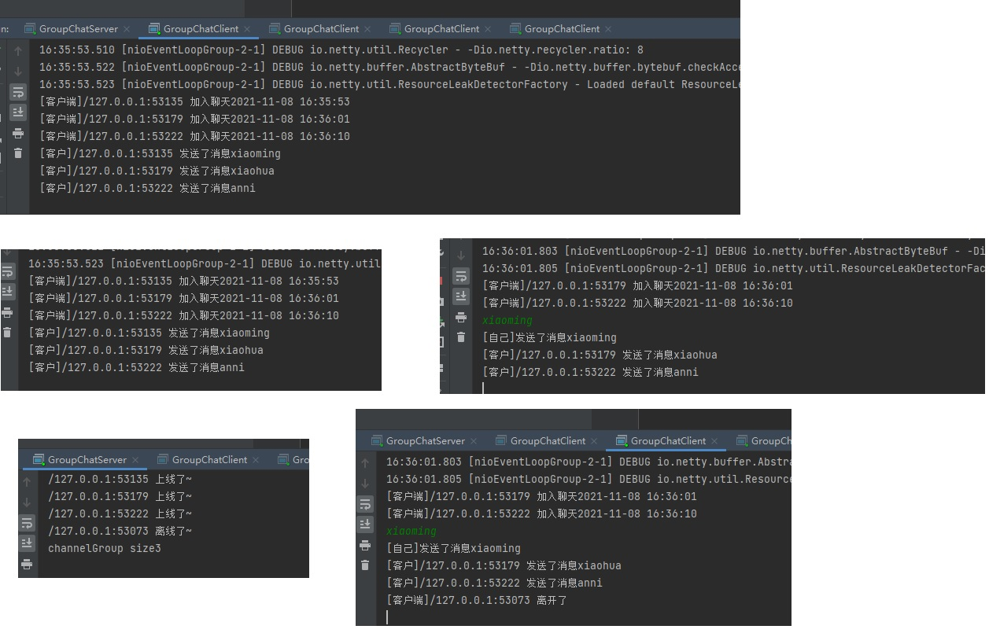

# 7. Netty实现群聊系统

:::tip 实例要求
1. 编写一个 Netty 群聊系统，实现服务器端和客户端之间的数据简单通讯（非阻塞）
2. 实现多人群聊
3. 服务器端：可以监测用户上线，离线，并实现消息转发功能
4. 客户端：通过 channel 可以无阻塞发送消息给其它所有用户，同时可以接受其它用户发送的消息（有服务器转发得到）
5. 目的：进一步理解 Netty 非阻塞网络编程机制
:::

## 7.1 服务端

### 7.1.1 GroupChatServer

```java
package com.tqk.netty.groupchat.server;

import io.netty.bootstrap.ServerBootstrap;
import io.netty.channel.ChannelFuture;
import io.netty.channel.ChannelInitializer;
import io.netty.channel.ChannelOption;
import io.netty.channel.ChannelPipeline;
import io.netty.channel.nio.NioEventLoopGroup;
import io.netty.channel.socket.SocketChannel;
import io.netty.channel.socket.nio.NioServerSocketChannel;
import io.netty.handler.codec.string.StringDecoder;
import io.netty.handler.codec.string.StringEncoder;

/**
 * 群聊服务端
 * @author tianqikai
 */
public class GroupChatServer {

    private int port; //监听端口


    public GroupChatServer(int port) {
        this.port = port;
    }
    public void run() throws InterruptedException {
        NioEventLoopGroup bossNioEventLoopGroup = new NioEventLoopGroup(1);
        NioEventLoopGroup workNioEventLoopGroup = new NioEventLoopGroup(8);

        try {
            ServerBootstrap serverBootstrap = new ServerBootstrap();

            serverBootstrap.group(bossNioEventLoopGroup,workNioEventLoopGroup)
                    .channel(NioServerSocketChannel.class)
                    .option(ChannelOption.SO_BACKLOG,128)
                    .childOption(ChannelOption.SO_KEEPALIVE,true)
                    .childHandler(new ChannelInitializer<SocketChannel>() {
                        @Override
                        protected void initChannel(SocketChannel ch) throws Exception {
                            //获取到pipeline
                            ChannelPipeline pipeline = ch.pipeline();
                            //向pipeline加入解码器
                            pipeline.addLast("decoder",new StringDecoder());
                            //向pipeline加入编码器
                            pipeline.addLast("encoder",new StringEncoder());
                            //加入自己的业务处理handler
                            pipeline.addLast(new GroupChatServerHandler());

                        }
                    });
            System.out.println("netty 服务器启动");
            ChannelFuture channelFuture = serverBootstrap.bind(port).sync();

            //监听关闭
            channelFuture.channel().closeFuture().sync();
        } finally {
            bossNioEventLoopGroup.shutdownGracefully();
            workNioEventLoopGroup.shutdownGracefully();
        }
    }
    public static void main(String[] args) throws InterruptedException {
        new GroupChatServer(12345).run();
    }
}

```
### 7.1.2 GroupChatServerHandler

```java
package com.tqk.netty.groupchat.server;

import io.netty.channel.Channel;
import io.netty.channel.ChannelHandlerContext;
import io.netty.channel.SimpleChannelInboundHandler;
import io.netty.channel.group.ChannelGroup;
import io.netty.channel.group.DefaultChannelGroup;
import io.netty.util.concurrent.GlobalEventExecutor;

import java.text.SimpleDateFormat;

public class GroupChatServerHandler extends SimpleChannelInboundHandler<String> {
    //定义一个channle 组，管理所有的channel
    //GlobalEventExecutor.INSTANCE) 是全局的事件执行器，是一个单例
    private static ChannelGroup channelGroup = new DefaultChannelGroup(GlobalEventExecutor.INSTANCE);
    SimpleDateFormat sdf = new SimpleDateFormat("yyyy-MM-dd HH:mm:ss");

    @Override
    protected void channelRead0(ChannelHandlerContext ctx, String msg) throws Exception {
        //获取到当前channel
        Channel channel = ctx.channel();
        //这时我们遍历channelGroup, 根据不同的情况，回送不同的消息
        channelGroup.forEach(channel1 -> {
            if(channel1!=channel){
                //不是当前的channel,转发消息
                channel1.writeAndFlush("[客户]" + channel.remoteAddress() + " 发送了消息" + msg + "\n");
            }else{
                //回显自己发送的消息给自己
                channel1.writeAndFlush("[自己]发送了消息" + msg + "\n");
            }
        });
    }

    /**
     * handlerAdded 表示连接建立，一旦连接，第一个被执行
     * 将当前channel 加入到  channelGroup
     * @param ctx
     */
    @Override
    public void handlerAdded(ChannelHandlerContext ctx ){
        //将该客户加入聊天的信息推送给其它在线的客户端
        Channel channel = ctx.channel();
        // 该方法会将 channelGroup 中所有的channel遍历，并发送消息，我们不需要自己遍历
        channelGroup.writeAndFlush("[客户端]" + channel.remoteAddress() + " 加入聊天" + sdf.format(new java.util.Date()) + " \n");
        channelGroup.add(channel);
    }

    /**
     * 断开连接, 将xx客户离开信息推送给当前在线的客户
     * @param ctx
     * @throws Exception
     */
    @Override
    public void handlerRemoved(ChannelHandlerContext ctx) throws Exception {
        Channel channel = ctx.channel();
        channelGroup.writeAndFlush("[客户端]" + channel.remoteAddress() + " 离开了\n");
        System.out.println("channelGroup size" + channelGroup.size());
    }

    /**
     * 表示channel 处于活动状态, 提示 xx上线
     * @param ctx
     * @throws Exception
     */
    @Override
    public void channelActive(ChannelHandlerContext ctx) throws Exception {
        System.out.println(ctx.channel().remoteAddress() + " 上线了~");
    }

    /**
     * 表示channel 处于不活动状态, 提示 xx离线了
     * @param ctx
     * @throws Exception
     */
    @Override
    public void channelInactive(ChannelHandlerContext ctx) throws Exception {
        System.out.println(ctx.channel().remoteAddress() + " 离线了~");
    }

    @Override
    public void exceptionCaught(ChannelHandlerContext ctx, Throwable cause) throws Exception {
        //关闭通道
        ctx.close();
    }
}

```
## 7.2 客户端

### 7.2.1 GroupChatClient

```java
package com.tqk.netty.groupchat.client;

import io.netty.bootstrap.Bootstrap;
import io.netty.channel.*;
import io.netty.channel.nio.NioEventLoopGroup;
import io.netty.channel.socket.SocketChannel;
import io.netty.channel.socket.nio.NioSocketChannel;
import io.netty.handler.codec.string.StringDecoder;
import io.netty.handler.codec.string.StringEncoder;

import java.util.Scanner;


/**
 * @author tianqikai
 */
public class GroupChatClient {

    //属性
    private final String host;
    private final int port;

    public GroupChatClient(String host, int port) {
        this.host = host;
        this.port = port;
    }

    public void run() throws Exception{
        EventLoopGroup group = new NioEventLoopGroup();

        try {


            Bootstrap bootstrap = new Bootstrap()
                    .group(group)
                    .channel(NioSocketChannel.class)
                    .handler(new ChannelInitializer<SocketChannel>() {

                        @Override
                        protected void initChannel(SocketChannel ch) throws Exception {

                            //得到pipeline
                            ChannelPipeline pipeline = ch.pipeline();
                            //加入相关handler
                            pipeline.addLast("decoder", new StringDecoder());
                            pipeline.addLast("encoder", new StringEncoder());
                            //加入自定义的handler
                            pipeline.addLast(new GroupChatClientHandler());
                        }
                    });

            ChannelFuture channelFuture = bootstrap.connect(host, port).sync();
            //得到channel
            Channel channel = channelFuture.channel();
            System.out.println("-------" + channel.localAddress()+ "--------");
            //客户端需要输入信息，创建一个扫描器
            Scanner scanner = new Scanner(System.in);
            while (scanner.hasNextLine()) {
                String msg = scanner.nextLine();
                //通过channel 发送到服务器端
                channel.writeAndFlush(msg + "\r\n");
            }
        }finally {
            group.shutdownGracefully();
        }
    }

    public static void main(String[] args) throws Exception {
        new GroupChatClient("127.0.0.1", 12345).run();
    }
}

```

### 7.2.2 GroupChatClientHandler

```java
package com.tqk.netty.groupchat.client;

import io.netty.channel.ChannelHandlerContext;
import io.netty.channel.SimpleChannelInboundHandler;

/**
 * @author tianqikai
 */
public class GroupChatClientHandler extends SimpleChannelInboundHandler<String> {

    @Override
    protected void channelRead0(ChannelHandlerContext ctx, String msg) throws Exception {

        System.out.println(msg.trim());
    }
}

```
### 7.1.5 实例演示结果
<a data-fancybox title="groupchat" href="./image/groupchat.jpg"></a>
