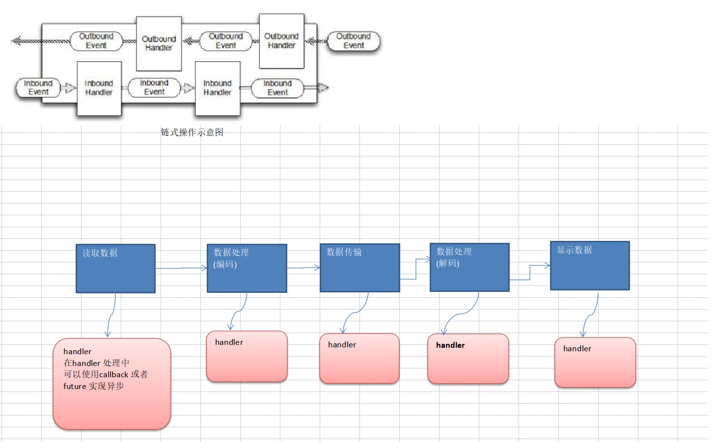

# 5. Netty异步模型与HTTP服务

:::tip 基本介绍
1. 异步的概念和同步相对。当一个异步过程调用发出后，调用者不能立刻得到结果。实际处理这个调用的组件在完成后，通过状态、通知和回调来通知调用者。

2. Netty 中的 I/O 操作是异步的，包括 Bind、Write、Connect 等操作会简单的返回一个 ChannelFuture。

3. 调用者并不能立刻获得结果，而是通过 Future-Listener 机制，用户可以方便的主动获取或者通过通知机制获得 IO 操作结果

4. Netty 的异步模型是建立在 future 和 callback 的之上的。callback 就是回调。重点说 Future，它的核心思想是：假设一个方法 fun，计算过程可能非常耗时，等待 fun返回显然不合适。那么可以在调用 fun 的时候，立马返回一个 Future，后续可以通过 Future去监控方法 fun 的处理过程(即 ： Future-Listener 机制)
:::


## 5.1 Future 说明

表示异步的执行结果, 可以通过它提供的方法来检测执行是否完成，比如检索计算等等.  

**ChannelFuture 是一个接口:**

```java
public interface ChannelFuture extends Future<Void>
```
我们可以添加监听器，当监听的事件发生时，就会通知到监听器. 案例说明

**工作原理示意图**
<a data-fancybox title="Future" href="./image/Future.jpg"></a>

说明:
在使用 Netty 进行编程时，拦截操作和转换出入站数据只需要您提供 callback 或利用future 即可。这使得链式操作简单、高效, 并有利于编写可重用的、通用的代码。
Netty 框架的目标就是让你的业务逻辑从网络基础应用编码中分离出来、解脱出来


## 5.2 Future-Listener 机制

当 Future 对象刚刚创建时，处于非完成状态，调用者可以通过返回的 ChannelFuture 来获取操作执行的状态，注册监听函数来执行完成后的操作。

:::tip 常见有如下操作
1. 通过 isDone 方法来判断当前操作是否完成；
2. 通过 isSuccess 方法来判断已完成的当前操作是否成功；
3. 通过 getCause 方法来获取已完成的当前操作失败的原因；
4. 通过 isCancelled 方法来判断已完成的当前操作是否被取消；
5. 通过 addListener 方法来注册监听器，当操作已完成(isDone 方法返回完成)，将会通知指定的监听器；如果 Future 对象已完成，则通知指定的监听器
:::

## 5.3 举例说明
**演示：绑定端口是异步操作，当绑定操作处理完，将会调用相应的监听器处理逻辑**

```java
        //给channelFuture 注册监听器，监控我们关心的事件
        channelFuture.addListener(new ChannelFutureListener() {
            @Override
            public void operationComplete(ChannelFuture future) throws Exception {
                if (channelFuture.isSuccess()) {
                    System.out.println("监听端口 6668 成功");
                } else {
                    System.out.println("监听端口 6668 失败");
                }
            }
        });
```
----------------

**完整示例代码**
```java
package com.tqk.socket.server;

import io.netty.bootstrap.ServerBootstrap;
import io.netty.channel.*;
import io.netty.channel.nio.NioEventLoopGroup;
import io.netty.channel.socket.SocketChannel;
import io.netty.channel.socket.nio.NioServerSocketChannel;

public class NettyServer {
    public static void main(String[] args) throws InterruptedException {
        //创建BossGroup 和 WorkerGroup
        //说明
        //1. 创建两个线程组 bossGroup 和 workerGroup
        //2. bossGroup 只是处理连接请求 , 真正的和客户端业务处理，会交给 workerGroup完成
        //3. 两个都是无限循环
        //4. bossGroup 和 workerGroup 含有的子线程(NioEventLoop)的个数
        //   默认实际 cpu核数 * 2
        NioEventLoopGroup bossGroup = new NioEventLoopGroup(1);
        NioEventLoopGroup workGroup = new NioEventLoopGroup();//默认是cpu核数*2

        //创建服务器端的启动对象，配置参数
        ServerBootstrap serverBootstrap = new ServerBootstrap();

        //使用链式编程来进行设置
        serverBootstrap.group(bossGroup,workGroup)//设置两个线程组
        .channel(NioServerSocketChannel.class)//使用NioSocketChannel 作为服务器的通道实现
        .option(ChannelOption.SO_BACKLOG,128)// 设置线程队列得到连接个数
        .childOption(ChannelOption.SO_KEEPALIVE,true)//设置保持活动连接状态
        // .handler(null) // 该 handler对应 bossGroup , childHandler 对应 workerGroup
        .childHandler(new ChannelInitializer<SocketChannel>() {
            @Override
            protected void initChannel(SocketChannel ch) throws Exception {
                System.out.println("客户socketchannel hashcode=" + ch.hashCode()); //可以使用一个集合管理 SocketChannel， 再推送消息时，可以将业务加入到各个channel 对应的 NIOEventLoop 的 taskQueue 或者 scheduleTaskQueue
                ch.pipeline().addLast(new NettyServerHandler());
            }
        });// 给我们的workerGroup 的 EventLoop 对应的管道设置处理器
        System.out.println(".....服务器 is ready...");

        //绑定一个端口并且同步, 生成了一个 ChannelFuture 对象
        //启动服务器(并绑定端口)
        ChannelFuture channelFuture = serverBootstrap.bind(6668).sync();
        //给channelFuture 注册监听器，监控我们关心的事件
        channelFuture.addListener(new ChannelFutureListener() {
            @Override
            public void operationComplete(ChannelFuture future) throws Exception {
                if (channelFuture.isSuccess()) {
                    System.out.println("监听端口 6668 成功");
                } else {
                    System.out.println("监听端口 6668 失败");
                }
            }
        });
        //对关闭通道进行监听
        channelFuture.channel().closeFuture().sync();
    }
}
```

```java
23:57:13.457 [main] DEBUG io.netty.buffer.ByteBufUtil - -Dio.netty.maxThreadLocalCharBufferSize: 16384
监听端口 6668 成功
```

**小结：**相比传统阻塞 I/O，执行 I/O 操作后线程会被阻塞住, 直到操作完成；异步处理的好处是不会造成线程阻塞，线程在 I/O 操作期间可以执行别的程序，在高并发情形下会更稳定和更高的吞吐量


## 5.4 HTTP服务

### 5.4.1 HttpServer

```java
package com.tqk.netty.server;

import io.netty.bootstrap.ServerBootstrap;
import io.netty.channel.ChannelFuture;
import io.netty.channel.EventLoopGroup;
import io.netty.channel.nio.NioEventLoopGroup;
import io.netty.channel.socket.nio.NioServerSocketChannel;

public class HttpServer {
    public static void main(String[] args) throws Exception {

        EventLoopGroup bossGroup = new NioEventLoopGroup(1);
        EventLoopGroup workerGroup = new NioEventLoopGroup();

        try {
            ServerBootstrap serverBootstrap = new ServerBootstrap();

            serverBootstrap.group(bossGroup, workerGroup).channel(NioServerSocketChannel.class).childHandler(new HttpServerInitializer());

            ChannelFuture channelFuture = serverBootstrap.bind(6668).sync();
            
            channelFuture.channel().closeFuture().sync();

        }finally {
            bossGroup.shutdownGracefully();
            workerGroup.shutdownGracefully();
        }
    }
}
```

### 5.4.2 HttpServerHandler

```java
package com.tqk.netty.server;

import io.netty.buffer.ByteBuf;
import io.netty.buffer.Unpooled;
import io.netty.channel.ChannelHandlerContext;
import io.netty.channel.SimpleChannelInboundHandler;
import io.netty.handler.codec.http.*;
import io.netty.util.CharsetUtil;

import java.net.URI;

/*
说明
1. SimpleChannelInboundHandler 是 ChannelInboundHandlerAdapter
2. HttpObject 客户端和服务器端相互通讯的数据被封装成 HttpObject
 */
public class HttpServerHandler extends SimpleChannelInboundHandler<HttpObject> {


    //channelRead0 读取客户端数据
    @Override
    protected void channelRead0(ChannelHandlerContext ctx, HttpObject msg) throws Exception {


        System.out.println("对应的channel=" + ctx.channel() + " pipeline=" + ctx
        .pipeline() + " 通过pipeline获取channel" + ctx.pipeline().channel());

        System.out.println("当前ctx的handler=" + ctx.handler());

        //判断 msg 是不是 httprequest请求
        if(msg instanceof HttpRequest) {

            System.out.println("ctx 类型="+ctx.getClass());

            System.out.println("pipeline hashcode" + ctx.pipeline().hashCode() + " TestHttpServerHandler hash=" + this.hashCode());

            System.out.println("msg 类型=" + msg.getClass());
            System.out.println("客户端地址" + ctx.channel().remoteAddress());

            //获取到
            HttpRequest httpRequest = (HttpRequest) msg;
            //获取uri, 过滤指定的资源
            URI uri = new URI(httpRequest.uri());
            if("/favicon.ico".equals(uri.getPath())) {
                System.out.println("请求了 favicon.ico, 不做响应");
                return;
            }
            //回复信息给浏览器 [http协议]

            ByteBuf content = Unpooled.copiedBuffer("hello, 我是服务器", CharsetUtil.UTF_8);

            //构造一个http的相应，即 httpresponse
            FullHttpResponse response = new DefaultFullHttpResponse(HttpVersion.HTTP_1_1, HttpResponseStatus.OK, content);

            response.headers().set(HttpHeaderNames.CONTENT_TYPE, "text/plain");
            response.headers().set(HttpHeaderNames.CONTENT_LENGTH, content.readableBytes());

            //将构建好 response返回
            ctx.writeAndFlush(response);

        }
    }


}

```
### 5.4.3 HttpServerInitializer

```java
package com.tqk.netty.server;
import io.netty.channel.ChannelInitializer;
import io.netty.channel.ChannelPipeline;
import io.netty.channel.socket.SocketChannel;
import io.netty.handler.codec.http.HttpServerCodec;


public class HttpServerInitializer extends ChannelInitializer<SocketChannel> {

    @Override
    protected void initChannel(SocketChannel ch) throws Exception {

        //向管道加入处理器

        //得到管道
        ChannelPipeline pipeline = ch.pipeline();

        //加入一个netty 提供的httpServerCodec codec =>[coder - decoder]
        //HttpServerCodec 说明
        //1. HttpServerCodec 是netty 提供的处理http的 编-解码器
        pipeline.addLast("MyHttpServerCodec",new HttpServerCodec());
        //2. 增加一个自定义的handler
        pipeline.addLast("MyTestHttpServerHandler", new HttpServerHandler());

        System.out.println("ok~~~~");

    }
}

```