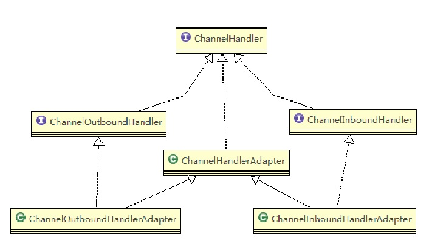
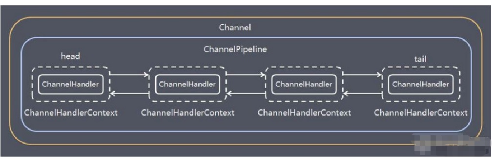
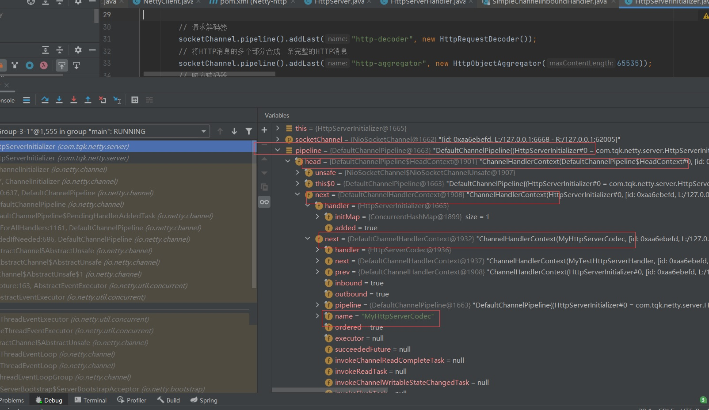
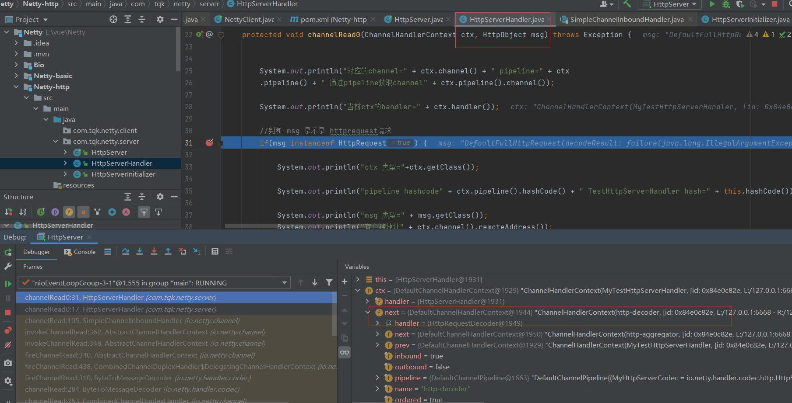
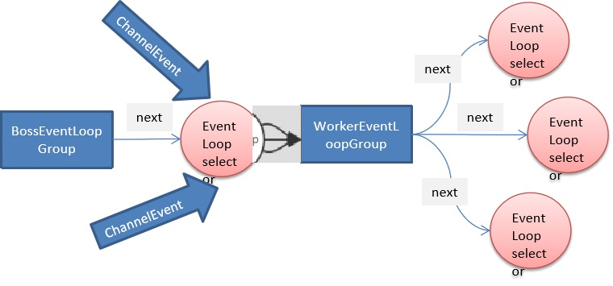

# 6. Netty核心模块

## 6.1 Bootstrap、ServerBootstrap

Bootstrap 意思是引导，一个 Netty 应用通常由一个 Bootstrap 开始，主要作用是配置整个 Netty 程序，串联各个组件，Netty 中 Bootstrap 类是客户端程序的启动引导类，ServerBootstrap 是服务端启动引导类

:::tip 常见的方法有
1. 该方法用于服务器端，用来设置两个 EventLoop
```java
public ServerBootstrap group(EventLoopGroup parentGroup, EventLoopGroup childGroup)
```
2. 该方法用于客户端，用来设置一个 EventLoop
```java
public B group(EventLoopGroup group) 
```
3. 该方法用来设置一个服务器端的通道实现
```java
public B channel(Class<? extends C> channelClass)
```
4. 用来给 ServerChannel 添加配置
```java
public <T> B option(ChannelOption<T> option, T value)
//例如
    .option(ChannelOption.SO_BACKLOG,128)// 设置线程队列得到连接个数
```
5. 用来给接收到的通道添加配置
```java
public <T> ServerBootstrap childOption(ChannelOption<T> childOption, T value)
//例如
    .childOption(ChannelOption.SO_KEEPALIVE,true)//设置保持活动连接状态
```
6. 该方法用来设置业务处理类（自定义的 handler）
```java
public ServerBootstrap childHandler(ChannelHandler childHandler)
```
7. 该方法用于服务器端，用来设置占用的端口号
```java
public ChannelFuture bind(int inetPort) 
```
8. 该方法用于客户端，用来连接服务器端
```java
public ChannelFuture connect(String inetHost, int inetPort) 
```
:::

## 6.2 Future、ChannelFuture

Netty 中所有的 IO 操作都是异步的，不能立刻得知消息是否被正确处理。但是可以过一会等它执行完成或者直接注册一个监听，具体的实现就是通过 Future 和 ChannelFutures，他们可以注册一个监听，当操作执行成功或失败时监听会自动触发注册的监听事件

:::tip 常见的方法
1. Channel channel()，返回当前正在进行 IO 操作的通道

2. ChannelFuture sync()，等待异步操作执行完毕
:::

## 6.3 Channel

1. Netty 网络通信的组件，能够用于执行网络 I/O 操作。
2. 通过Channel 可获得当前网络连接的通道的状态
3. 通过Channel 可获得 网络连接的配置参数 （例如接收缓冲区大小）
4. Channel 提供异步的网络 I/O 操作(如建立连接，读写，绑定端口)，异步调用意味着任何 I/O 调用都将立即返回，并且不保证在调用结束时所请求的 I/O 操作已完成
5. 调用立即返回一个 ChannelFuture 实例，通过注册监听器到 ChannelFuture 上，可以 I/O 操作成功、失败或取消时回调通知调用方
6. 支持关联 I/O 操作与对应的处理程序
7. 不同协议、不同的阻塞类型的连接都有不同的 Channel 类型与之对应，

:::tip 常用的 Channel 类型:
1. <font color='#d71345'><strong>NioSocketChannel</strong></font>，异步的客户端 TCP Socket 连接。  
2. <font color='#d71345'><strong>NioServerSocketChannel</strong></font>，异步的服务器端 TCP Socket 连接。
3. <font color='#d71345'><strong>NioDatagramChannel</strong></font>，异步的 UDP 连接。
4. <font color='#d71345'><strong>NioSctpChannel</strong></font>，异步的客户端 Sctp 连接。
5. <font color='#d71345'><strong>NioSctpServerChannel</strong></font>，异步的 Sctp 服务器端连接，这些通道涵盖了 UDP 和 TCP 网络 IO 以及文件 IO。
:::

## 6.4 Selector
1. Netty 基于 Selector 对象实现 I/O 多路复用，通过 Selector 一个线程可以监听多个连接的 Channel 事件。
2. 当向一个 Selector 中注册 Channel 后，Selector 内部的机制就可以自动不断地查询(Select) 这些注册的 Channel 是否有已就绪的 I/O 事件（例如可读，可写，网络连接完成等），这样程序就可以很简单地使用一个线程高效地管理多个 Channel 

## 6.5 ChannelHandler 及其实现类

ChannelHandler 是一个接口，处理 I/O 事件或拦截 I/O 操作，并将其转发到其 ChannelPipeline(业务处理链)中的下一个处理程序。
ChannelHandler 本身并没有提供很多方法，因为这个接口有许多的方法需要实现，方便使用期间，可以继承它的子类
ChannelHandler 及其实现类一览图(后)

<a data-fancybox title="ChannelHandler" href="./image/ChannelHandler.jpg"></a>
:::warning 说明

1. ChannelInboundHandler 用于处理入站 I/O 事件。
2. ChannelOutboundHandler 用于处理出站 I/O 操作。  

//适配器
3. ChannelInboundHandlerAdapter 用于处理入站 I/O 事件。
4. ChannelOutboundHandlerAdapter 用于处理出站 I/O 操作。
5. ChannelDuplexHandler 用于处理入站和出站事件。
:::

我们经常需要自定义一个 Handler 类去继承 ChannelInboundHandlerAdapter，然后通过重写相应方法实现业务逻辑，我们接下来看看一般都需要重写哪些方法

```java
public class ChannelInboundHandlerAdapter extends ChannelHandlerAdapter implements ChannelInboundHandler {
     //通道就绪事件
    public void channelActive(ChannelHandlerContext ctx) throws Exception {
        ctx.fireChannelActive();   
    }
    //通道读取数据事件  
    public void channelRead(ChannelHandlerContext ctx, Object msg) throws Exception {
        ctx.fireChannelRead(msg);
           
    }   
    //数据读取完毕事件    
    public void channelReadComplete(ChannelHandlerContext ctx) throws Exception {
        ctx.fireChannelReadComplete();    
    }
}
```
## 6.6 Pipeline 和 ChannelPipeline

**ChannelPipeline 是一个重点**

1. ChannelPipeline 是一个 Handler 的集合，它负责处理和拦截 inbound 或者 outbound 的事件和操作，相当于一个贯穿 Netty 的链。（也可以这样理解：ChannelPipeline 是保存 ChannelHandler 的 List，用于处理或拦截 Channel 的入站事件和出站操作）

2. ChannelPipeline 实现了一种高级形式的拦截过滤器模式，使用户可以完全控制事件的处理方式，以及 Channel 中各个的 ChannelHandler 如何相互交互

3. 在 Netty 中每个 Channel 都有且仅有一个 ChannelPipeline 与之对应，它们的组成关系如下
<a data-fancybox title="ChannelPipeline" href="./image/ChannelPipeline.jpg"></a>
    :::tip  ChannelPipeline说明
    1. 一个 Channel 包含了一个 ChannelPipeline，而 ChannelPipeline 中又维护了一个由 ChannelHandlerContext 组成的双向链表，并且每个 ChannelHandlerContext 中又关联着一个 ChannelHandler
    2. 入站事件和出站事件在一个双向链表中，<font color='#d71345'><strong>入站事件会从链表 head 往后传递到最后一个入站的 handler;</strong></font>
    <font color='#d71999'><strong>出站事件会从链表 tail 往前传递到最前一个出站的 handler</strong></font>，两种类型的 handler 互不干扰
    :::


4. 常用方法 

```java
ChannelPipeline addFirst(ChannelHandler... handlers)，把一个业务处理类（handler）添加到链中的第一个位置
ChannelPipeline addLast(ChannelHandler... handlers)，把一个业务处理类（handler）添加到链中的最后一个位置
```

<a data-fancybox title="ChannelPipeline" href="./image/ChannelPipeline1.jpg"></a>
HttpServerInitializer和HttpServerCodec这些东西本身也是handler
一般来说事件从客户端往服务器走我们称为出站，反之则是入站。

## 6.7 ChannelHandlerContext

1. 保存 Channel 相关的所有上下文信息，同时关联一个 ChannelHandler 对象
2. 即 ChannelHandlerContext 中包含一个具体的事件处理器 ChannelHandler，同时 ChannelHandlerContext 中也绑定了对应的 pipeline 和 Channel 的信息，方便对 ChannelHandler 进行调用。

<a data-fancybox title="ChannelHandlerContext" href="./image/ChannelHandlerContext1.jpg"></a>

:::tip 常用方法
1. ChannelFuture close()，关闭通道
2. ChannelOutboundInvoker flush()，刷新
3. ChannelFuture writeAndFlush(Object msg)，将数据写到
4. ChannelPipeline 中当前 ChannelHandler 的下一个 ChannelHandler 开始处理（出站）
:::

## 6.8 ChannelOption

Netty 在创建 Channel 实例后,一般都需要设置 ChannelOption 参数。

:::tip ChannelOption 参数如下:
1. <font color='#d71345'><strong>ChannelOption.SO_BACKLOG</strong></font>  

对应 TCP/IP 协议 listen 函数中的 backlog 参数，用来初始化服务器可连接队列大小。服
务端处理客户端连接请求是顺序处理的，所以同一时间只能处理一个客户端连接。多个客户
端来的时候，服务端将不能处理的客户端连接请求放在队列中等待处理，backlog 参数指定
了队列的大小。

2. <font color='#d71345'><strong>ChannelOption.SO_KEEPALIVE</strong></font> 

一直保持连接活动状态
:::

## 6.9 EventLoopGroup 和其实现类 NioEventLoopGroup

1. EventLoopGroup 是一组 EventLoop 的抽象，Netty 为了更好的利用多核 CPU 资源，一般会有多个 EventLoop 同时工作，每个 EventLoop 维护着一个 Selector 实例。

2. EventLoopGroup 提供 next 接口，可以从组里面按照一定规则获取其中一个 EventLoop来处理任务。在 Netty 服务器端编程中，我们一般都需要提供两个 EventLoopGroup，例如：BossEventLoopGroup 和 WorkerEventLoopGroup。

3. 通常一个服务端口即一个 ServerSocketChannel对应一个Selector 和一个EventLoop线程。BossEventLoop 负责接收客户端的连接并将 SocketChannel 交给 WorkerEventLoopGroup 来进行 IO 处理，如下图所示
<a data-fancybox title="EventLoopGroup" href="./image/EventLoopGroup.jpg"></a>

```
1. BossEventLoopGroup 通常是一个单线程的 EventLoop，
EventLoop 维护着一个注册了ServerSocketChannel 
的 Selector 实例BossEventLoop 不断轮询 Selector 将连接事件分离出来

2. 通常是 OP_ACCEPT 事件，然后将接收到的 SocketChannel 交给 WorkerEventLoopGroup

3. WorkerEventLoopGroup 会由 next 选择其中一个 EventLoop来将这个 SocketChannel 
注册到其维护的 Selector 并对其后续的 IO 事件进行处理
```
:::tip 常用方法
1. public NioEventLoopGroup()，构造方法
2. public Future<?> shutdownGracefully()，断开连接，关闭线程
:::

## 6.10 Unpooled 类

1. Netty 提供一个专门用来操作缓冲区(即Netty的数据容器)的工具类
2. 常用方法如下所示

```java
//通过给定的数据和字符编码返回一个 ByteBuf 对象（类似于 NIO 中的 ByteBuffer 但有区别）
public static ByteBuf copiedBuffer(CharSequence string, Charset charset)

// 发送客户端的请求
channelFuture.channel().writeAndFlush(Unpooled.copiedBuffer("hello world".getBytes(CharsetUtil.UTF_8)));
```
3. 举例说明Unpooled 获取 Netty的数据容器ByteBuf 的基本使用


```java
package com.tqk.netty.buf;

import io.netty.buffer.ByteBuf;
import io.netty.buffer.Unpooled;

public class NettyByteBuf01 {

    public static void main(String[] args) {
        
        //创建一个ByteBuf
        //说明
        //1. 创建 对象，该对象包含一个数组arr , 是一个byte[10]
        //2. 在netty 的buffer中，不需要使用flip 进行反转
        //   底层维护了 readerindex 和 writerIndex
        //3. 通过 readerindex 和  writerIndex 和  capacity， 将buffer分成三个区域
        // 0---readerindex 已经读取的区域
        // readerindex---writerIndex ， 可读的区域
        // writerIndex -- capacity, 可写的区域
        ByteBuf buffer = Unpooled.buffer(10);

        for (int i = 0; i < 10; i++) {
            buffer.writeByte(i);
        }

        System.out.println("capacity=" + buffer.capacity());//10
        //输出
//        for(int i = 0; i<buffer.capacity(); i++) {
              //这个方法readerindex不会变
//            System.out.println(buffer.getByte(i));
//        }
        for (int i = 0; i < buffer.capacity(); i++) {
            //这个方法readerindex会变
            System.out.println(buffer.readByte());
        }
        System.out.println("执行完毕");
    }
}

```

```java
package com.tqk.netty.buf;

import io.netty.buffer.ByteBuf;
import io.netty.buffer.Unpooled;

import java.nio.charset.Charset;

public class NettyByteBuf02 {
    
    public static void main(String[] args) {

        //创建ByteBuf
        ByteBuf byteBuf = Unpooled.copiedBuffer("hello,world!", Charset.forName("utf-8"));

        //使用相关的方法
        if (byteBuf.hasArray()) { // true

            byte[] content = byteBuf.array();

            //将 content 转成字符串
            System.out.println(new String(content, Charset.forName("utf-8")));

            System.out.println("byteBuf=" + byteBuf);

            System.out.println(byteBuf.arrayOffset()); // 0
            System.out.println(byteBuf.readerIndex()); // 0
            System.out.println(byteBuf.writerIndex()); // 12
            System.out.println(byteBuf.capacity()); // 36

            //System.out.println(byteBuf.readByte()); //
            System.out.println(byteBuf.getByte(0)); // 104

            int len = byteBuf.readableBytes(); //可读的字节数  12
            System.out.println("len=" + len);

            //使用for取出各个字节
            for (int i = 0; i < len; i++) {
                System.out.println((char) byteBuf.getByte(i));
            }

            //按照某个范围读取
            System.out.println(byteBuf.getCharSequence(0, 4, Charset.forName("utf-8")));
            System.out.println(byteBuf.getCharSequence(4, 6, Charset.forName("utf-8")));
        }
    }
}

```


