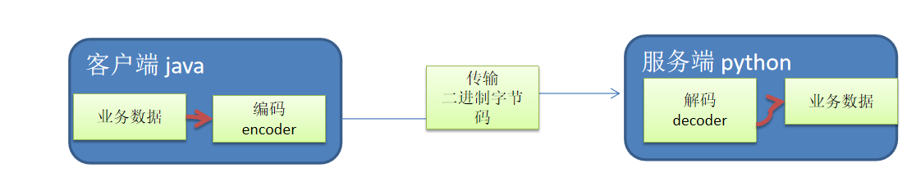
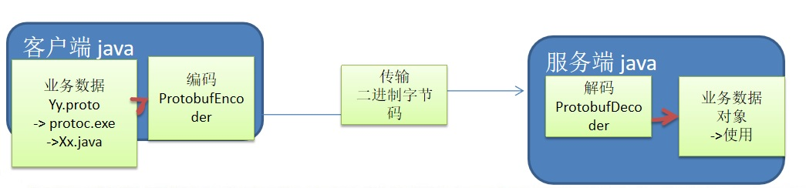

# 10. Netty编解码

##  10.1 编码和解码的基本介绍

1. 编写网络应用程序时，因为数据在网络中传输的都是二进制字节码数据，在发送数据时就需要编码，接收数据时就需要解码[示意图]
<a data-fancybox title="编码和解码" href="./image/encoderdecoder.jpg"></a>

2. codec（编解码器）的组成部分有两个：<font color='#f47920'>decoder</font>（解码器）和 <font color='#f47920'>encoder</font>（编码器）。encoder 负责把业务数据转换成字节码数据，decoder 负责把字节码数据转换成业务数据

## 10.2 Netty 本身的编码解码的机制和问题分析

Netty 内置了对 JBoss Marshalling 和 Protocol Buffers 的支持 Protocol Buffers 序列化机制代码参见模块 netty-basic 下的包 cn.enjoyedu.nettybasic.serializable.protobuf

1. Netty 提供的编码器  
StringEncoder，对字符串数据进行编码  
ObjectEncoder，对 Java 对象进行编码  

2. Netty 提供的解码器  
StringDecoder, 对字符串数据进行解码  
ObjectDecoder，对 Java 对象进行解码  

3. Netty 本身自带的 ObjectDecoder 和 ObjectEncoder 可以用来实现 POJO 对象或各种业务对象的编码和解码，**底层使用的仍是 Java 序列化技术** , 而Java 序列化技术本身效率就不高，存在如下问题

```
1. 无法跨语言
2. 序列化后的体积太大，是二进制编码的 5 倍多。
3. 序列化性能太低
4. => 引出 新的解决方案 [Google 的 Protobuf]
```

## 10.3 Protobuf

### 10.3.1 Protobuf基本介绍和使用示意图

1. Protobuf 是 Google 发布的开源项目，全称 Google Protocol Buffers，是一种轻便高效的结构化数据存储格式，可以用于结构化数据串行化，或者说序列化。它很适合做**数据存储或 RPC[远程过程调用  remote procedure call ]**数据交换格式 。目前很多公司 http+json -> tcp+protobuf

2. 参考文档 : https://developers.google.com/protocol-buffers/docs/proto   语言指南
3. Protobuf 是以 message 的方式来管理数据的.

4. 支持跨平台、跨语言，即[客户端和服务器端可以是不同的语言编写的] （支持目前绝大多数语言，例如 C++、C#、Java、python 等）
5. 高性能，高可靠性

------------------------

6. 使用 protobuf 编译器能自动生成代码，Protobuf 是将类的定义使用.proto 文件进行描述。说明，在idea 中编写 .proto 文件时，会自动提示是否下载 .ptotot 编写插件. 可以让语法高亮。
7. 然后通过 protoc.exe 编译器根据.proto 自动生成.java 文件
8. protobuf 使用示意图

<a data-fancybox title="Protobuf" href="./image/Protobuf.jpg"></a>


