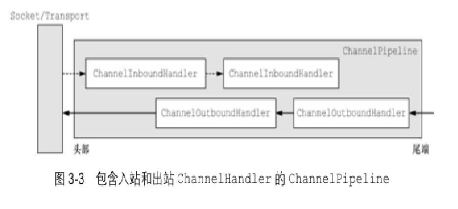
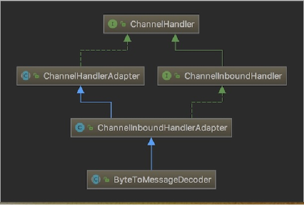

# 10. Netty编解码

##  10.1 基本说明
1. Netty 的组件设计：Netty 的主要组件有 <font color='#f47920'>Channel、EventLoop、ChannelFuture、ChannelHandler、ChannelPipe</font> 等

2. <font color='#f47920'>ChannelHandler</font> 充当了处理入站和出站数据的应用程序逻辑的容器。例如，实现 <font color='#f47920'>ChannelInboundHandler</font> 接口（或 <font color='#f47920'>ChannelInboundHandlerAdapter</font>），你就可以接收入站事件和数据，这些数据会被业务逻辑处理。当要给客户端发送响应时，也可以从 <font color='#f47920'>ChannelInboundHandler</font> 冲刷数据。业务逻辑通常写在一个或者多个 <font color='#f47920'>ChannelInboundHandler</font> 中。<font color='#f47920'>ChannelOutboundHandler</font> 原理一样，只不过它是用来处理出站数据的

<a data-fancybox title="ChannelInboundHandler" href="./image/ChannelInboundHandler.jpg"></a>

3. <font color='#f47920'>ChannelPipeline</font> 提供了 <font color='#f47920'>ChannelHandler</font> 链的容器。以客户端应用程序为例，如果事件的运动方向是从客户端到服务端的，那么我们称这些事件为出站的，即客户端发送给服务端的数据会通过 pipeline 中的一系列<font color='#f47920'> ChannelOutboundHandler</font>，并被这些 Handler 处理，反之则称为入站的

##  10.2 编码解码器

1. 当 Netty 发送或者接受一个消息的时候，就将会发生一次数据转换。入站消息会被解码：从字节转换为另一种格式（比如 java 对象）；如果是出站消息，它会被编码成字节。

2. Netty 提供一系列实用的编解码器，他们都实现了 <font color='#f47920'>ChannelInboundHadnler</font> 或者 <font color='#f47920'>ChannelOutboundHandler</font> 接口。在这些类中，channelRead 方法已经被重写了。以入站为例，对于每个从入站 Channel 读取的消息，这个方法会被调用。随后，它将调用由解码器所提供的 decode() 方法进行解码，并将已经解码的字节转发给 <font color='#f47920'>ChannelPipeline</font> 中的下一个 <font color='#f47920'>ChannelInboundHandler</font>

### 10.2.1 解码器-ByteToMessageDecoder

关系继承图

<a data-fancybox title="ByteToMessageDecoder" href="./image/ByteToMessageDecoder.jpg"></a>

由于不可能知道远程节点是否会一次性发送一个完整的信息，tcp有可能出现粘包拆包的问题，这个类会对入站数据进行缓冲，直到它准备好被处理


一个关于ByteToMessageDecoder实例分析
```java
public class ToIntegerDecoder extends ByteToMessageDecoder {
    @Override
    protected void decode(ChannelHandlerContext ctx, ByteBuf in, List<Object> out) throws Exception {
        if (in.readableBytes() >= 4) {
            out.add(in.readInt());
        }
    }
}
```
说明：
这个例子，每次入站从ByteBuf中读取4字节，将其解码为一个int，然后将它添加到下一个List中。当没有更多元素可以被添加到该List中时，它的内容将会被发送给下一个ChannelInboundHandler。int在被添加到List中时，会被自动装箱为Integer。在调用readInt()方法前必须验证所输入的ByteBuf是否具有足够的数据
decode 执行分析图 [示意图]


