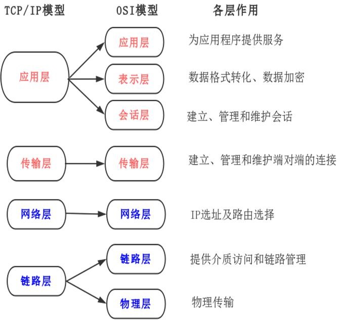
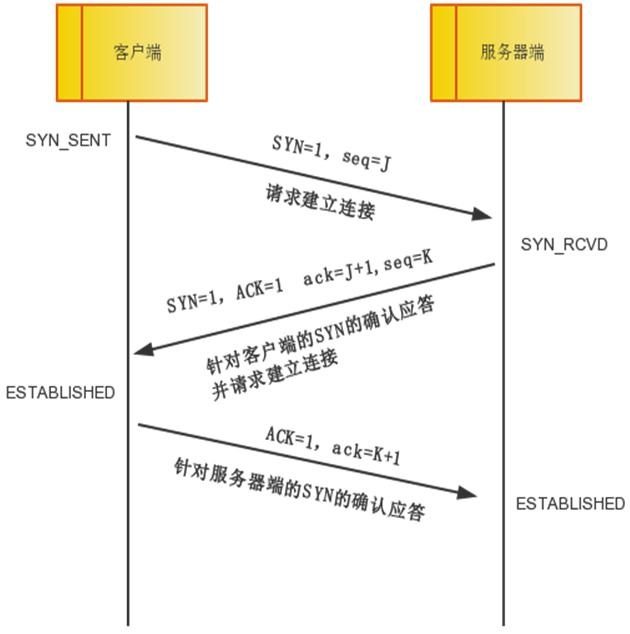
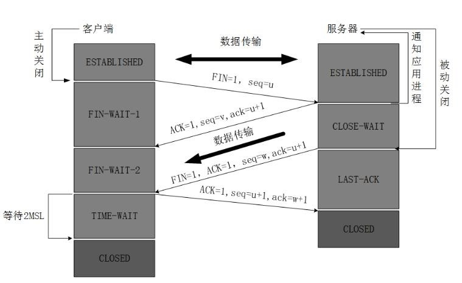
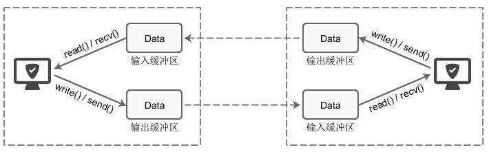
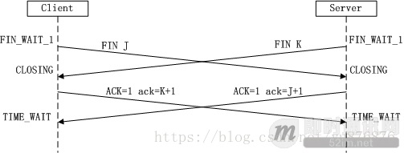

# 1. 网络协议与网络编程
<!-- 自动生成目录 -->
[[toc]]

## 1.1 计算机网络体系结构
### 1.1.1 OSI 七层模型 
开放系统互连参考模型 (Open System Interconnect 简称 OSI）是国际标准化 组织(ISO)和国际电报电话咨询委员会(CCITT)联合制定的开放系统互连参考模型， 为开放式互连信息系统提供了一种功能结构的框架。其目的是为异种计算机互连 提供一个共同的基础和标准框架，并为保持相关标准的一致性和兼容性提供共同 的参考。这里所说的开放系统，实质上指的是遵循 OSI 参考模型和相关协议能够 实现互连的具有各种应用目的的计算机系统。 
OSI 采用了分层的结构化技术，共分七层，**物理层、数据链路层、网络层、 传输层、会话层、表示层、应用层**。

### 1.1.2 TCP/IP 模型 

OSI 模型比较复杂且学术化，所以我们实际使用的 TCP/IP 模型，共分 4 层， **链路层、网络层、传输层、应用层**

## 1.2 TCP/IP

TCP 是面向连接的通信协议，通过三次握手建立连接，通讯完成时要拆除连接，由于 TCP 是面向连接的所以只能用于端到端的通讯。 

TCP 提供的是一种可靠的数据流服务，采用“带重传的肯定确认”技术来实现 传输的可靠性。TCP 还采用一种称为“滑动窗口”的方式进行流量控制，所谓窗口 实际表示接收能力，用以限制发送方的发送速度。 

如果 IP 数据包中有已经封好的 TCP 数据包，那么 IP 将把它们向‘上’传送到 TCP 层。TCP 将包排序并进行错误检查，同时实现虚电路间的连接。TCP 数据包 中包括序号和确认，所以未按照顺序收到的包可以被排序，而损坏的包可以被重传。

TCP将它的信息送到更高层的应用程序，例如 Telnet 的服务程序和客户程序。 应用程序轮流将信息送回 TCP 层，TCP 层便将它们向下传送到 IP 层，设备驱动程 序和物理介质，最后到接收方。 

面向连接的服务（例如 Telnet、FTP、rlogin、X Windows 和 SMTP）需要高度 的可靠性，所以它们使用了 TCP。DNS 在某些情况下使用 TCP（发送和接收域名 数据库），但使用 UDP 传送有关单个主机的信息。

### 1.2.1 TCP 三次握手

TCP 提供面向有连接的通信传输。面向有连接是指在数据通信开始之前先做 好两端之间的准备工作。 所谓三次握手是指建立一个 TCP 连接时需要客户端和服务器端总共发送三个包以确认连接的建立。
在 socket 编程中，这一过程由客户端执行 connect来触发。

:::tip 三次握手
**第一次握手：**客户端将标志位 SYN 置为 1，随机产生一个值 seq=J，并将该 数据包发送给服务器端，客户端进入 SYN_SENT 状态，等待服务器端确认。 

**第二次握手：**服务器端收到数据包后由标志位 SYN=1 知道客户端请求建立连 接，服务器端将标志位 SYN 和 ACK 都置为 1，ack=J+1，随机产生一个值 seq=K， 并将该数据包发送给客户端以确认连接请求，服务器端进入 SYN_RCVD 状态。 

**第三次握手：**客户端收到确认后，检查 ack 是否为 J+1，ACK 是否为 1，如果 正确则将标志位 ACK 置为 1，ack=K+1，并将该数据包发送给服务器端，服务器端检查 ack 是否为 K+1，ACK 是否为 1，如果正确则连接建立成功，客户端和服 务器端进入 ESTABLISHED 状态，完成三次握手，随后客户端与服务器端之间可以 开始传输数据了
:::

### 1.2.2 TCP 的三次握手的漏洞

但是在 TCP 三次握手中是有一个缺陷的，就是如果我们利用三次握手的缺陷 进行攻击。这个攻击就是 SYN 洪泛攻击。三次握手中有一个第二次握手，服务端 向客户端应道请求，应答请求是需要客户端 IP 的，服务端是需要知道客户端 IP 的，攻击者就伪造这个 IP，往服务器端狂发送第一次握手的内容，当然第一次握 手中的客户端 IP 地址是伪造的，从而服务端忙于进行第二次握手但是第二次握 手当然没有结果，所以导致服务器端被拖累死机。

面对这种攻击有以下的解决方案，最好的方案是防火墙

:::tip 策略
**无效连接监视释放**   
这种方法不停监视所有的连接，包括三次握手的，还有握手一次的，反正是所有的当达到一定(与)阈值时拆除这些连接，从而释放系统资源。这种方法对于所有的连接一视同仁，不管是正常的还是攻击的，所以这种方式不推荐。 

**延缓 TCB 分配方法**  
一般的做完第一次握手之后，服务器就需要为该请求分配一个 TCB（连接控 制资源），通常这个资源需要 200 多个字节。延迟 TCB 的分配，当正常连接建 立起来后再分配 TCB 则可以有效地减轻服务器资源的消耗。 

**使用防火墙**  
防火墙在确认了连接的有效性后，才向内部的服务器（Listener）发起 SYN 请求，

**1、限制每个源IP的连接数**

**2、对恶意连接的IP进行封禁**

**3、主动清除残余连接**
:::

### 1.2.3 TCP 四次挥手（分手）
四次挥手即终止 TCP 连接，就是指断开一个 TCP 连接时，需要客户端和服务 端总共发送 4 个包以确认连接的断开。在 socket 编程中，这一过程由客户端或 服务端任一方执行 **close**来触发。

由于 TCP 连接是全双工的，因此每个方向都必须要单独进行关闭，这一原则是当一方完成数据发送任务后，发送一个 FIN 来终止这一方向的连接，收到一 个 FIN 只是意味着这一方向上没有数据流动了，即不会再收到数据了，但是在这个TCP 连接上仍然能够发送数据，直到这一方向也发送了FIN。首先进行关闭的 一方将执行主动关闭，而另一方则执行被动关闭。

### 1.2.4 TCP 的通讯原理

#### Socket 套接字 
Socket 的原意是“插座”，在计算机通信领域，socket 被翻译为“套接字”， 它是计算机之间进行通信的一种约定或一种方式。通过 socket 这种约定，一台计算机可以接收其他计算机的数据，也可以向其他计算机发送数据。TCP 用主机 的 IP 地址加上主机上的端口号作为 TCP 连接的端点，这种端点就叫做套接字 （socket）。
#### TCP 缓冲区 
每个 TCP 的 Socket 的内核中都有一个发送缓冲区和一个接收缓冲区。现在 我们假设用 write()方法发送数据，使用 read()方法接收数据。

write()并不立即向网络中传输数据，而是先将数据写入缓冲区中，再由 TCP 协议将数据从缓冲区发送到目标机器。一旦将数据写入到缓冲区，函数就可以成 功返回，不管它们有没有到达目标机器，也不管它们何时被发送到网络，这些都 是 TCP 协议负责的事情。 

TCP 协议独立于 write()函数，数据有可能刚被写入缓冲区就发送到网络，也可能在缓冲区中不断积压，多次写入的数据被一次性发送到网络，这取决于当时的网络情况、当前线程是否空闲等诸多因素，不由程序员控制。 

read()也是如此，也从输入缓冲区中读取数据，而不是直接从网络中读取。 

总得来说，I/O 缓冲区在每个 TCP 套接字中单独存在；I/O 缓冲区在创建套 接字时自动生成；

### 1.2.5 TCP 面试题

#### 问题：为什么建立连接是三次握手，而关闭连接却是四次挥手呢？

##### 建立连接

两次握手无法建立可靠的连接  
通过三次握手确认双方收发功能都正常，四次也可以但是显得比较多余。  
因为服务端在LISTEN状态下，收到建立连接请求的SYN报文后，把ACK和SYN放在一个报文里发送给客户端。  
 
##### 关闭连接

当收到对方的FIN报文时，仅表示对方不再发送数据但还能接收收据，**我们也未必把全部数据都发给了对方**，所以我们可以立即close，也可以发送一些数据给对方后，再发送FIN报文给对方表示同意关闭连接。因此我们的**ACK和FIN一般会分开发送**。

上面是一方主动关闭，另一方被动关闭的情况，实际中还会出现同时发起主动关闭的情况，具体流程如下图

为什么需要TIME_WAIT状态
1. 可靠的终止TCP连接
2. **保证让迟来的TCP报文段有足够的时间被识别并丢弃**

----------

1. 为实现TCP这种全双工连接的可靠释放

这样可让TCP再次发送最后的ACK以防这个ACK丢失(另一端超时并重发最后的FIN)这种2MSL等待的另一个结果是这个TCP连接在2MSL等待期间，定义这个连接的插口(客户的IP地址和端口号，服务器的IP地址和端口号)不能再被使用。这个连接只能在2MSL结束后才能再被使用。

2. 为使旧的数据包在网络因过期而消失

每个具体TCP实现必须选择一个报文段最大生存时间MSL。它是任何报文段被丢弃前在网络内的最长时间。

## 1.3 HTTP

HTTP 协议是 Hyper Text Transfer Protocol（超文本传输协议）的缩写,是用于 从万维网（WWW:World Wide Web ）服务器传输超文本到本地浏览器的传送协议。

## 1.4 UDP

UDP 是面向无连接的通讯协议，UDP 数据包括目的端口号和源端口号信息， 由于通讯不需要连接，所以可以实现广播发送。 

UDP 通讯时不需要接收方确认，属于不可靠的传输，可能会出现丢包现象， 实际应用中要求程序员编程验证。

### UDP和TCP协议之间区别

1. TCP面向连接 （如打电话要先拨号建立连接）; UDP是无连接 的，即发送数据之前不需要建立连接
2. TCP提供可靠的服务。也就是说，通过TCP连接传送的数据，无差错，不丢失，不重复，且按序到达;UDP尽最大努力交付，即不保证可靠交付
   Tcp通过校验和，重传控制，序号标识，滑动窗口、确认应答实现可靠传输。如丢包时的重发控制，还可以对次序乱掉的分包进行顺序控制。
3. UDP具有较好的实时性，工作效率比TCP高，适用于对高速传输和实时性有较高的通信或广播通信。

4. 每一条TCP连接只能是点到点的;UDP支持一对一，一对多，多对一和多对多的交互通信

5. TCP对系统资源要求较多，UDP对系统资源要求较少。
