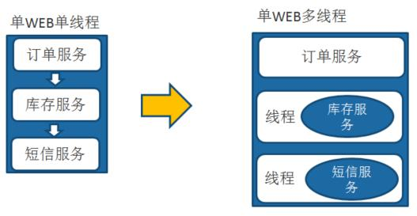

# 1. 网络协议与网络编程
<!-- 自动生成目录 -->
[[toc]]

## 1.1 计算机网络体系结构
### 1.1.1 OSI 七层模型 
开放系统互连参考模型 (Open System Interconnect 简称 OSI）是国际标准化 组织(ISO)和国际电报电话咨询委员会(CCITT)联合制定的开放系统互连参考模型， 为开放式互连信息系统提供了一种功能结构的框架。其目的是为异种计算机互连 提供一个共同的基础和标准框架，并为保持相关标准的一致性和兼容性提供共同 的参考。这里所说的开放系统，实质上指的是遵循 OSI 参考模型和相关协议能够 实现互连的具有各种应用目的的计算机系统。 
OSI 采用了分层的结构化技术，共分七层，**物理层、数据链路层、网络层、 传输层、会话层、表示层、应用层**。

### 1.1.2 TCP/IP 模型 

OSI 模型比较复杂且学术化，所以我们实际使用的 TCP/IP 模型，共分 4 层， **链路层、网络层、传输层、应用层**

<a data-fancybox title="TCP/IP 模型 " href="./image/tcpip.jpg"></a>

## 1.2 TCP/IP

TCP 是面向连接的通信协议，通过三次握手建立连接，通讯完成时要拆除连接，由于 TCP 是面向连接的所以只能用于端到端的通讯。 

TCP 提供的是一种可靠的数据流服务，采用“带重传的肯定确认”技术来实现 传输的可靠性。TCP 还采用一种称为“滑动窗口”的方式进行流量控制，所谓窗口 实际表示接收能力，用以限制发送方的发送速度。 

如果 IP 数据包中有已经封好的 TCP 数据包，那么 IP 将把它们向‘上’传送到 TCP 层。TCP 将包排序并进行错误检查，同时实现虚电路间的连接。TCP 数据包 中包括序号和确认，所以未按照顺序收到的包可以被排序，而损坏的包可以被重传。

TCP将它的信息送到更高层的应用程序，例如 Telnet 的服务程序和客户程序。 应用程序轮流将信息送回 TCP 层，TCP 层便将它们向下传送到 IP 层，设备驱动程 序和物理介质，最后到接收方。 

面向连接的服务（例如 Telnet、FTP、rlogin、X Windows 和 SMTP）需要高度 的可靠性，所以它们使用了 TCP。DNS 在某些情况下使用 TCP（发送和接收域名 数据库），但使用 UDP 传送有关单个主机的信息。

### 1.2.1 TCP 三次握手

TCP 提供面向有连接的通信传输。面向有连接是指在数据通信开始之前先做 好两端之间的准备工作。 所谓三次握手是指建立一个 TCP 连接时需要客户端和服务器端总共发送三个包以确认连接的建立。
在 socket 编程中，这一过程由客户端执行 connect来触发。

:::tip 三次握手
**第一次握手：**客户端将标志位 SYN 置为 1，随机产生一个值 seq=J，并将该 数据包发送给服务器端，客户端进入 SYN_SENT 状态，等待服务器端确认。 

**第二次握手：**服务器端收到数据包后由标志位 SYN=1 知道客户端请求建立连 接，服务器端将标志位 SYN 和 ACK 都置为 1，ack=J+1，随机产生一个值 seq=K， 并将该数据包发送给客户端以确认连接请求，服务器端进入 SYN_RCVD 状态。 

**第三次握手：**客户端收到确认后，检查 ack 是否为 J+1，ACK 是否为 1，如果 正确则将标志位 ACK 置为 1，ack=K+1，并将该数据包发送给服务器端，服务器端检查 ack 是否为 K+1，ACK 是否为 1，如果正确则连接建立成功，客户端和服 务器端进入 ESTABLISHED 状态，完成三次握手，随后客户端与服务器端之间可以 开始传输数据了
:::

<a data-fancybox title="TCP/IP 三次握手 " href="./image/tcp01.jpg"></a>


### 1.2.2 TCP 的三次握手的漏洞

但是在 TCP 三次握手中是有一个缺陷的，就是如果我们利用三次握手的缺陷 进行攻击。这个攻击就是 SYN 洪泛攻击。三次握手中有一个第二次握手，服务端 向客户端应道请求，应答请求是需要客户端 IP 的，服务端是需要知道客户端 IP 的，攻击者就伪造这个 IP，往服务器端狂发送第一次握手的内容，当然第一次握 手中的客户端 IP 地址是伪造的，从而服务端忙于进行第二次握手但是第二次握 手当然没有结果，所以导致服务器端被拖累死机。

面对这种攻击有以下的解决方案，最好的方案是防火墙

:::tip 策略
**无效连接监视释放**   
这种方法不停监视所有的连接，包括三次握手的，还有握手一次的，反正是所有的当达到一定(与)阈值时拆除这些连接，从而释放系统资源。这种方法对于所有的连接一视同仁，不管是正常的还是攻击的，所以这种方式不推荐。 

**延缓 TCB 分配方法**  
一般的做完第一次握手之后，服务器就需要为该请求分配一个 TCB（连接控 制资源），通常这个资源需要 200 多个字节。延迟 TCB 的分配，当正常连接建 立起来后再分配 TCB 则可以有效地减轻服务器资源的消耗。 

**使用防火墙**  
防火墙在确认了连接的有效性后，才向内部的服务器（Listener）发起 SYN 请求，

**1、限制每个源IP的连接数**

**2、对恶意连接的IP进行封禁**

**3、主动清除残余连接**
:::

### 1.2.3 TCP 四次挥手（分手）
四次挥手即终止 TCP 连接，就是指断开一个 TCP 连接时，需要客户端和服务 端总共发送 4 个包以确认连接的断开。在 socket 编程中，这一过程由客户端或 服务端任一方执行 **close**来触发。

由于 TCP 连接是全双工的，因此每个方向都必须要单独进行关闭，这一原则是当一方完成数据发送任务后，发送一个 FIN 来终止这一方向的连接，收到一 个 FIN 只是意味着这一方向上没有数据流动了，即不会再收到数据了，但是在这个TCP 连接上仍然能够发送数据，直到这一方向也发送了FIN。首先进行关闭的 一方将执行主动关闭，而另一方则执行被动关闭。

<a data-fancybox title="TCP 四次挥手（分手） " href="./image/tcp02.jpg"></a>

### 1.2.4 TCP 的通讯原理

#### Socket 套接字 
Socket 的原意是“插座”，在计算机通信领域，socket 被翻译为“套接字”， 它是计算机之间进行通信的一种约定或一种方式。通过 socket 这种约定，一台计算机可以接收其他计算机的数据，也可以向其他计算机发送数据。TCP 用主机 的 IP 地址加上主机上的端口号作为 TCP 连接的端点，这种端点就叫做套接字 （socket）。
#### TCP 缓冲区 
每个 TCP 的 Socket 的内核中都有一个发送缓冲区和一个接收缓冲区。现在 我们假设用 write()方法发送数据，使用 read()方法接收数据。
<a data-fancybox title="Socket 套接字 " href="./image/tcp04.jpg"></a>


write()并不立即向网络中传输数据，而是先将数据写入缓冲区中，再由 TCP 协议将数据从缓冲区发送到目标机器。一旦将数据写入到缓冲区，函数就可以成 功返回，不管它们有没有到达目标机器，也不管它们何时被发送到网络，这些都 是 TCP 协议负责的事情。 

TCP 协议独立于 write()函数，数据有可能刚被写入缓冲区就发送到网络，也可能在缓冲区中不断积压，多次写入的数据被一次性发送到网络，这取决于当时的网络情况、当前线程是否空闲等诸多因素，不由程序员控制。 

read()也是如此，也从输入缓冲区中读取数据，而不是直接从网络中读取。 

总得来说，I/O 缓冲区在每个 TCP 套接字中单独存在；I/O 缓冲区在创建套 接字时自动生成；

### 1.2.5 TCP 面试题

#### 问题：为什么建立连接是三次握手，而关闭连接却是四次挥手呢？

##### 建立连接

两次握手无法建立可靠的连接  
通过三次握手确认双方收发功能都正常，四次也可以但是显得比较多余。  
因为服务端在LISTEN状态下，收到建立连接请求的SYN报文后，把ACK和SYN放在一个报文里发送给客户端。  
 
##### 关闭连接

当收到对方的FIN报文时，仅表示对方不再发送数据但还能接收收据，**我们也未必把全部数据都发给了对方**，所以我们可以立即close，也可以发送一些数据给对方后，再发送FIN报文给对方表示同意关闭连接。因此我们的**ACK和FIN一般会分开发送**。

上面是一方主动关闭，另一方被动关闭的情况，实际中还会出现同时发起主动关闭的情况，具体流程如下图

<a data-fancybox title="TCP 四次挥手（分手） " href="./image/tcp03.jpg"></a>


为什么需要TIME_WAIT状态
1. 可靠的终止TCP连接
2. **保证让迟来的TCP报文段有足够的时间被识别并丢弃**

----------

1. 为实现TCP这种全双工连接的可靠释放

这样可让TCP再次发送最后的ACK以防这个ACK丢失(另一端超时并重发最后的FIN)这种2MSL等待的另一个结果是这个TCP连接在2MSL等待期间，定义这个连接的插口(客户的IP地址和端口号，服务器的IP地址和端口号)不能再被使用。这个连接只能在2MSL结束后才能再被使用。

2. 为使旧的数据包在网络因过期而消失

每个具体TCP实现必须选择一个报文段最大生存时间MSL。它是任何报文段被丢弃前在网络内的最长时间。

## 1.3 HTTP

HTTP 协议是 Hyper Text Transfer Protocol（超文本传输协议）的缩写,是用于 从万维网（WWW:World Wide Web ）服务器传输超文本到本地浏览器的传送协议。

## 1.4 UDP

UDP 是面向无连接的通讯协议，UDP 数据包括目的端口号和源端口号信息， 由于通讯不需要连接，所以可以实现广播发送。 

UDP 通讯时不需要接收方确认，属于不可靠的传输，可能会出现丢包现象， 实际应用中要求程序员编程验证。

### UDP和TCP协议之间区别

1. TCP面向连接 （如打电话要先拨号建立连接）; UDP是无连接 的，即发送数据之前不需要建立连接
2. TCP提供可靠的服务。也就是说，通过TCP连接传送的数据，无差错，不丢失，不重复，且按序到达;UDP尽最大努力交付，即不保证可靠交付
   Tcp通过校验和，重传控制，序号标识，滑动窗口、确认应答实现可靠传输。如丢包时的重发控制，还可以对次序乱掉的分包进行顺序控制。
3. UDP具有较好的实时性，工作效率比TCP高，适用于对高速传输和实时性有较高的通信或广播通信。

4. 每一条TCP连接只能是点到点的;UDP支持一对一，一对多，多对一和多对多的交互通信

5. TCP对系统资源要求较多，UDP对系统资源要求较少。

## 1.4 原生 JDK 网络编程 BIO


服务端提供 IP 和监听端口，客户端通过连接操作想服务端监听的地址发起 连接请求，通过三次握手连接，如果连接成功建立，双方就可以通过套接字进行通信。

传统的同步阻塞模型开发中，**ServerSocket 负责绑定 IP 地址，启动监听端口**； **Socket 负责发起连接操作**。连接成功后，双方通过输入和输出流进行同步阻塞式通信。

传统 BIO 通信模型：采用 BIO 通信模型的服务端，通常由一个独立的 Acceptor 线程负责监听客户端的连接，它接收到客户端连接请求之后为每个客户端创建一 个新的线程进行链路处理没处理完成后，通过输出流返回应答给客户端，线程销 毁。即典型的一请求一应答模型。 

该模型最大的问题就是缺乏弹性伸缩能力，当客户端并发访问量增加后，服务端的线程个数和客户端并发访问数呈 1:1 的正比关系，Java 中的线程也是比较 宝贵的系统资源，线程数量快速膨胀后，系统的性能将急剧下降，随着访问量的 继续增大，系统最终就死-掉-了。 

为了改进这种一连接一线程的模型，我们可以使用线程池来管理这些线程， 实现1个或多个线程处理N个客户端的模型（但是底层还是使用的同步阻塞I/O）， 通常被称为“伪异步 I/O 模型“。 我们知道，如果使用 CachedThreadPool 线程池（不限制线程数量，如果不 清楚请参考文首提供的文章），其实除了能自动帮我们管理线程（复用），看起 来也就像是 1:1 的客户端：线程数模型，而使用 FixedThreadPool 我们就有效的控 制了线程的最大数量，保证了系统有限的资源的控制，实现了 N:M 的伪异步 I/O 模型。 

但是正因为限制了线程数量，如果发生读取数据较慢时（比如数据量 大、网络传输慢等），大量并发的情况下,其他接入的消息只能一直等待，这就是最大的弊端。

--------------------

**客户端**
```java
package com.tqk.bio.client;

import java.io.IOException;
import java.io.ObjectInputStream;
import java.io.ObjectOutputStream;
import java.net.InetSocketAddress;
import java.net.Socket;

/**
 *类说明：Bio通信的客户端
 */
public class Client {

    public static void main(String[] args) throws IOException {
        //客户端启动必备
        Socket socket = null;
        //实例化与服务端通信的输入输出流
        ObjectOutputStream output = null;
        ObjectInputStream input = null;
        //服务器的通信地址
        InetSocketAddress addr
                = new InetSocketAddress("127.0.0.1",10001);

        try{
            socket = new Socket();
            /*连接服务器*/
            socket.connect(addr);

            output = new ObjectOutputStream(socket.getOutputStream());
            input = new ObjectInputStream(socket.getInputStream());

            /*向服务器输出请求*/
            output.writeUTF("tianqikai");
            output.flush();

            //接收服务器的输出
            System.out.println(input.readUTF());
        }finally{
            if (socket!=null) {
                socket.close();
            }
            if (output!=null) {
                output.close();
            }
            if (input!=null) {
                input.close();
            }

        }
    }

}

```

-------------------

**服务端**
```java
package com.tqk.bio.server;

import java.io.IOException;
import java.io.ObjectInputStream;
import java.io.ObjectOutputStream;
import java.net.InetSocketAddress;
import java.net.ServerSocket;
import java.net.Socket;

/**
 *类说明：Bio通信的服务端
 */
public class Server {

    public static void main(String[] args) throws IOException {
        /*服务器必备*/
        ServerSocket serverSocket = new ServerSocket();
        /*绑定监听端口*/
        serverSocket.bind(new InetSocketAddress(10001));
        System.out.println("Server start.......");

        while(true){
           new Thread(new ServerTask(serverSocket.accept())).start();
        }
    }

    private static class ServerTask implements Runnable{

        private Socket socket = null;

        public ServerTask(Socket socket) {
            this.socket = socket;
        }

        @Override
        public void run() {
            /*拿和客户端通讯的输入输出流*/
            try(ObjectInputStream inputStream
                        = new ObjectInputStream(socket.getInputStream());
                ObjectOutputStream outputStream
             = new ObjectOutputStream(socket.getOutputStream())){

                /*服务器的输入*/
                String userName = inputStream.readUTF();
                System.out.println("Accept clinet message:"+userName);

                outputStream.writeUTF("Hello,"+userName);
                outputStream.flush();


            }catch (Exception e){
                e.printStackTrace();
            }
            finally {
                try {
                    socket.close();
                } catch (IOException e) {
                    e.printStackTrace();
                }
            }

        }
    }

}
```

----------------

**服务端--线程池方式**
```java
package com.tqk.bio.server;

import java.io.IOException;
import java.io.ObjectInputStream;
import java.io.ObjectOutputStream;
import java.net.InetSocketAddress;
import java.net.ServerSocket;
import java.net.Socket;
import java.util.concurrent.ExecutorService;
import java.util.concurrent.Executors;

/**
 *
 *类说明：Bio通信的服务端--线程池方式
 */
public class ServerPool {

    private static ExecutorService executorService = Executors.newFixedThreadPool(Runtime.getRuntime().availableProcessors());

    public static void main(String[] args) throws IOException {
        //服务端启动必备
        ServerSocket serverSocket = new ServerSocket();
        //表示服务端在哪个端口上监听
        serverSocket.bind(new InetSocketAddress(10001));
        System.out.println("Start Server ....");
        try{
            while(true){
                executorService.execute(new ServerTask(serverSocket.accept()));
            }
        }finally {
            serverSocket.close();
        }
    }

    //每个和客户端的通信都会打包成一个任务，交个一个线程来执行
    private static class ServerTask implements Runnable{

        private Socket socket = null;
        public ServerTask(Socket socket){
            this.socket = socket;
        }

        @Override
        public void run() {
            //实例化与客户端通信的输入输出流
            try(ObjectInputStream inputStream =
                    new ObjectInputStream(socket.getInputStream());
                ObjectOutputStream outputStream =
                    new ObjectOutputStream(socket.getOutputStream())){

                //接收客户端的输出，也就是服务器的输入
                String userName = inputStream.readUTF();
                System.out.println("Accept client message:"+userName);

                //服务器的输出，也就是客户端的输入
                outputStream.writeUTF("Hello,"+userName);
                outputStream.flush();
            }catch(Exception e){
                e.printStackTrace();
            }finally {
                try {
                    socket.close();
                } catch (IOException e) {
                    e.printStackTrace();
                }
            }
        }
    }

}

```
## 1.5  BIO 实现-RPC 框架

### 1.5.1 为什么要有 RPC？ 
我们最开始开发的时候，一个应用一台机器，将所有功能都写在一起，比如 说比较常见的电商场景。 随着我们业务的发展，我们需要提示性能了，
我们会怎么做？将不同的业务 功能放到线程里来实现异步和提升性能

<a data-fancybox title="RPC框架" href="./image/rpc02.jpg"></a>

但是业务越来越复杂，业务量越来越大，单个应用或者一台机器的资源是肯 定背负不起的，这个时候，我们会怎么做？将核心业务抽取出来，作为独立的服务，放到其他服务器上或者形成集群。这个时候就会请出 RPC，系统变为分布式的架构。
为什么说千万级流量分布式、微服务架构必备的 RPC 框架？和 LocalCall 的代码进行比较，**因为引入rpc 框架对我们现有的代码影响最小**，同时又可以帮我们实现架构上的扩展。现在的开源 rpc 框架，有什么？dubbo，grpc 等等 

当服务越来越多，各种 rpc 之间的调用会越来越复杂，这个时候我们会引入 中间件，比如说 MQ、缓存，同时架构上整体往微服务去迁移，引入了各种比如 容器技术 docker，DevOps 等等。最终会变为如图所示来应付千万级流量，但是 不管怎样，rpc 总是会占有一席之地。

<a data-fancybox title="RPC框架" href="./image/rpc03.jpg"></a>

RPC（Remote Procedure Call ——远程过程调用），它是一种通过网络从远程计算机程序上请求服务，而不需要了解底层网络的技术。

**内部服务间调用常用rpc框架，供外部服务使用常用restful风格，或者openapi模式**

<a data-fancybox title="RPC 框架 " href="./image/rpc01.jpg"></a>

:::tip 一次完整的PC同步调用流程： 
1. 服务消费方（client）以本地调用方式调用客户端存根； 
2. 什么叫客户端存根？就是远程方法在本地的模拟对象，一样的也有方法名，也有方法参数，client stub 接收到调用后负责将方法名、方法的参数等包装， 并将包装后的信息通过网络发送到服务端； 
3. 服务端收到消息后，交给代理存根在服务器的部分后进行解码为实际的方法名和参数 
4. server stub 根据解码结果调用服务器上本地的实际服务； 
5. 本地服务执行并将结果返回给 server stub； 
6. server stub 将返回结果打包成消息并发送至消费方； 
7. client stub 接收到消息，并进行解码； 
8. 服务消费方得到最终结果。 RPC 框架的目标就是要中间步骤都封装起来，让我们进行远程方法调用的时候感觉到就像在本地调用一样。
:::

### 1.5.2 源代码实现查看github

#### 客户端

#### 注册中心

#### 服务端

-------------------
<a data-fancybox title="源代码实现查看github" href="./image/rpc01.jpg"></a>

## 1.6  原生 JDK 网络编程- NIO

<a data-fancybox title="网络编程- NIO" href="./image/nio01.jpg"></a>

### 1.6.1 和 BIO 的主要区别

#### 面向流与面向缓冲 
Java NIO 和 IO 之间第一个最大的区别是，IO 是面向流的，NIO 是面向缓冲 区的。 Java IO 面向流意味着每次从流中读一个或多个字节，直至读取所有字节， 它们没有被缓存在任何地方。此外，它不能前后移动流中的数据。如果需要前后 移动从流中读取的数据，需要先将它缓存到一个缓冲区。 Java NIO 的缓冲导向 方法略有不同。数据读取到一个它稍后处理的缓冲区，需要时可在缓冲区中前后移动。这就增加了处理过程中的灵活性。但是，还需要检查是否该缓冲区中包含 所有需要处理的数据。而且，需确保当更多的数据读入缓冲区时，不要覆盖缓冲 区里尚未处理的数据。 

#### 阻塞与非阻塞 

IO Java IO 的各种流是阻塞的。这意味着，当一个线程调用 read() 或 write()时， 该线程被阻塞，直到有一些数据被读取，或数据完全写入。该线程在此期间不能 再干任何事情了。 Java NIO 的非阻塞模式，使一个线程从某通道发送请求读取数据，但是它 仅能得到目前可用的数据，如果目前没有数据可用时，就什么都不会获取。而不 是保持线程阻塞，所以直至数据变的可以读取之前，该线程可以继续做其他的事 情。 非阻塞写也是如此。一个线程请求写入一些数据到某通道，但不需要等待 它完全写入，这个线程同时可以去做别的事情。 线程通常将非阻塞 IO 的空闲时 间用于在其它通道上执行 IO 操作，所以一个单独的线程现在可以管理多个输入 和输出通道（channel）

#### 选择器（Selectors） 

Java NIO 的选择器允许一个单独的线程来监视多个输入通道，你可以注册多 个通道使用一个选择器，然后使用一个单独的线程来“选择”通道：这些通道里 已经有可以处理的输入，或者选择已准备写入的通道。这种选择机制，使得一个 单独的线程很容易来管理多个通道。

**NIO 主要有三个核心部分组成： buffer 缓冲区、Channel 管道、Selector 选择器**

### 1.6.2 Selector
Selector 的英文含义是“选择器”，也可以称为为“轮询代理器”、“事件订阅器”、 “channel 容器管理机”都行。 

应用程序将向 Selector 对象注册需要它关注的 Channel，以及具体的某一个 Channel 会对哪些 IO 事件感兴趣。Selector 中也会维护一个“已经注册的 Channel” 的容器。


### 1.6.3 Channels 

通道，被建立的一个应用程序和操作系统交互事件、传递内容的渠道（注意 是连接到操作系统）。那么既然是和操作系统进行内容的传递，那么说明应用程 序可以通过通道读取数据，也可以通过通道向操作系统写数据，而且可以同时进行读写。 

◆ 所有被 Selector（选择器）注册的通道，只能是继承了 SelectableChannel 类的子类。   
◆ **ServerSocketChannel**：应用服务器程序的监听通道。只有通过这个通道， 应用程序才能向操作系统注册支持“多路复用 IO”的端口监听。同时支持 UDP 协议和 TCP 协议。   
◆ **ScoketChannel**：TCP Socket 套接字的监听通道，一个 Socket 套接字对应了 一个客户端 IP：端口 到 服务器 IP：端口的通信连接。 通道中的数据总是要先读到一个 Buffer，或者总是要从一个 Buffer 中写入。  

### 1.6.4 Buffer

### 1.6.5  NIO网络编程实例

```java
package com.tqk.nio.client;

import java.util.Scanner;

import static com.tqk.nio.server.NioServer.DEFAULT_PORT;
import static com.tqk.nio.server.NioServer.DEFAULT_SERVER_IP;

/**
 *
 * @author tianqikai
 */
public class NioClient {
    private static NioClientHandle nioClientHandle;

    public static void start(){
        if(nioClientHandle !=null) {
            nioClientHandle.stop();
        }
        nioClientHandle = new NioClientHandle(DEFAULT_SERVER_IP,DEFAULT_PORT);
        new Thread(nioClientHandle,"Server").start();
    }
    //向服务器发送消息
    public static boolean sendMsg(String msg) throws Exception{
        nioClientHandle.sendMsg(msg);
        return true;
    }
    public static void main(String[] args) throws Exception {
        start();
        Scanner scanner = new Scanner(System.in);
        while(NioClient.sendMsg(scanner.next())) {
            ;
        }

    }
}
```
```java
package com.tqk.nio.client;

import java.io.IOException;
import java.net.InetSocketAddress;
import java.nio.ByteBuffer;
import java.nio.channels.SelectionKey;
import java.nio.channels.Selector;
import java.nio.channels.SocketChannel;
import java.util.Iterator;
import java.util.Set;

/**
 * @author tianqikai
 */
public class NioClientHandle implements  Runnable{
    private String host;
    private int port;
    private volatile boolean started;
    private Selector selector;
    private SocketChannel socketChannel;

    public NioClientHandle(String host, int port) {
        this.host = host;
        this.port = port;
        try {
            /*创建选择器*/
            this.selector = Selector.open();
            /*打开监听通道*/
            socketChannel = SocketChannel.open();
            /*如果为 true，则此通道将被置于阻塞模式；
             * 如果为 false，则此通道将被置于非阻塞模式
             * 缺省为true*/
            socketChannel.configureBlocking(false);
            started = true;
        } catch (IOException e) {
            e.printStackTrace();
            System.exit(-1);
        }
    }

    /**
     *
     */
    public void stop(){
        started = false;
    }
    @Override
    public void run() {
        //连接服务器
        try {
            doConnect();
        } catch (IOException e) {
            e.printStackTrace();
            System.exit(-1);
        }
        /*循环遍历selector*/
        while(started){
            try {
                /*阻塞方法,当至少一个注册的事件发生的时候就会继续*/
                selector.select();
                /*获取当前有哪些事件可以使用*/
                Set<SelectionKey> keys = selector.selectedKeys();
                /*转换为迭代器*/
                Iterator<SelectionKey> it = keys.iterator();
                SelectionKey key = null;
                while(it.hasNext()){
                    key = it.next();
                    /*我们必须首先将处理过的 SelectionKey 从选定的键集合中删除。
                    如果我们没有删除处理过的键，那么它仍然会在事件集合中以一个激活
                    的键出现，这会导致我们尝试再次处理它。*/
                    it.remove();
                    try {
                        handleInput(key);
                    } catch (Exception e) {
                        if(key!=null){
                            key.cancel();
                            if(key.channel()!=null){
                                key.channel().close();
                            }
                        }
                    }
                }

            } catch (IOException e) {
                e.printStackTrace();
                System.exit(-1);
            }
        }

        if(selector!=null){
            try {
                selector.close();
            } catch (IOException e) {
                e.printStackTrace();
            }
        }
    }

    /**
     * 具体的事件处理方法
     * @param key
     * @throws IOException
     */
    private void handleInput(SelectionKey key) throws IOException {
        if(key.isValid()){
            /*获得关心当前事件的channel*/
            SocketChannel sc =(SocketChannel)key.channel();
            /*处理连接就绪事件
             * 但是三次握手未必就成功了，所以需要等待握手完成和判断握手是否成功*/
            if(key.isConnectable()){
                /*finishConnect的主要作用就是确认通道连接已建立，
                方便后续IO操作（读写）不会因连接没建立而
                导致NotYetConnectedException异常。*/
                if(sc.finishConnect()){
                    /*连接既然已经建立，当然就需要注册读事件，
                    写事件一般是不需要注册的。*/
                    socketChannel.register(selector,SelectionKey.OP_READ);
                }else {
                    System.exit(-1);
                }
            }

            /*处理读事件，也就是当前有数据可读*/
            if(key.isReadable()){
                /*创建ByteBuffer，并开辟一个1k的缓冲区*/
                ByteBuffer buffer = ByteBuffer.allocate(1024);
                /*将通道的数据读取到缓冲区，read方法返回读取到的字节数*/
                int readBytes = sc.read(buffer);
                if(readBytes>0){
                    buffer.flip();
                    byte[] bytes = new byte[buffer.remaining()];
                    buffer.get(bytes);
                    String result = new String(bytes,"UTF-8");
                    System.out.println("客户端收到消息："+result);
                }
                /*链路已经关闭，释放资源*/
                else if(readBytes<0){
                    key.cancel();
                    sc.close();
                }

            }
        }
    }

    /**
     * 建立连接
     * @throws IOException
     */
    private void doConnect() throws IOException {
        /*如果此通道处于非阻塞模式，则调用此方法将启动非阻塞连接操作。
        如果连接马上建立成功，则此方法返回true。
        否则，此方法返回false，
        因此我们必须关注连接就绪事件，
        并通过调用finishConnect方法完成连接操作。*/
        if(socketChannel.connect(new InetSocketAddress(host,port))){
            /*连接成功，关注读事件*/
            socketChannel.register(selector, SelectionKey.OP_READ);
        }
        else{
            socketChannel.register(selector,SelectionKey.OP_CONNECT);
        }
    }

    /**
     * 写数据对外暴露的API
     * @param msg
     * @throws IOException
     */
    public void sendMsg(String msg) throws IOException {
        doWrite(socketChannel,msg);
    }

    /**
     * 写数据
     * @param sc
     * @param request
     * @throws IOException
     */
    private void doWrite(SocketChannel sc,String request) throws IOException {
        byte[] bytes = request.getBytes();
        ByteBuffer writeBuffer = ByteBuffer.allocate(bytes.length);
        writeBuffer.put(bytes);
        writeBuffer.flip();
        sc.write(writeBuffer);
    }
}

```

#### 服务端

```java
package com.tqk.nio.server;


/**
 * @author
 * 类说明：nio通信服务端
 */
public class NioServerWritable {

    public static int DEFAULT_PORT = 12345;
    public static String DEFAULT_SERVER_IP = "127.0.0.1";
    public static String response(String msg){
        return "Hello,"+msg+",Now is "+new java.util.Date(
                System.currentTimeMillis()).toString() ;
    }

    private static NioServerHandleWriteable nioServerHandle;

    public static void start(){
        if(nioServerHandle !=null) {
            nioServerHandle.stop();
        }
        nioServerHandle = new NioServerHandleWriteable(DEFAULT_PORT);
        new Thread(nioServerHandle,"Server").start();
    }
    public static void main(String[] args){
        start();
    }

}

```
----------------

```java
package com.tqk.nio.server;

import java.io.IOException;
import java.net.InetSocketAddress;
import java.nio.ByteBuffer;
import java.nio.channels.SelectionKey;
import java.nio.channels.Selector;
import java.nio.channels.ServerSocketChannel;
import java.nio.channels.SocketChannel;
import java.util.Iterator;
import java.util.Set;

import static com.tqk.nio.server.NioServerWritable.response;

/**
 * @author 
 * 类说明：nio通信服务端处理器
 */
public class NioServerHandleWriteable implements Runnable{
    private Selector selector;
    private ServerSocketChannel serverChannel;
    private volatile boolean started;
    /**
     * 构造方法
     * @param port 指定要监听的端口号
     */
    public NioServerHandleWriteable(int port) {
        try{
            //创建选择器
            selector = Selector.open();
            //打开监听通道
            serverChannel = ServerSocketChannel.open();
            //如果为 true，则此通道将被置于阻塞模式；
            // 如果为 false，则此通道将被置于非阻塞模式
            serverChannel.configureBlocking(false);//开启非阻塞模式
            serverChannel.socket().bind(new InetSocketAddress(port));
            serverChannel.register(selector,SelectionKey.OP_ACCEPT);

            //标记服务器已开启
            started = true;
            System.out.println("服务器已启动，端口号：" + port);
        }catch(IOException e){
            e.printStackTrace();
            System.exit(1);
        }
    }
    public void stop(){
        started = false;
    }
    @Override
    public void run() {
        //循环遍历selector
        while(started){
            try{
                //阻塞,只有当至少一个注册的事件发生的时候才会继续.
				selector.select();
                Set<SelectionKey> keys = selector.selectedKeys();
                Iterator<SelectionKey> it = keys.iterator();
                SelectionKey key = null;
                while(it.hasNext()){
                    key = it.next();
                    it.remove();
                    try{
                        handleInput(key);
                    }catch(Exception e){
                        if(key != null){
                            key.cancel();
                            if(key.channel() != null){
                                key.channel().close();
                            }
                        }
                    }
                }
            }catch(Throwable t){
                t.printStackTrace();
            }
        }
        //selector关闭后会自动释放里面管理的资源
        if(selector != null) {
            try{
                selector.close();
            }catch (Exception e) {
                e.printStackTrace();
            }
        }
    }
    private void handleInput(SelectionKey key) throws IOException{
        if(key.isValid()){
            //处理新接入的请求消息
            if(key.isAcceptable()){
                ServerSocketChannel ssc = (ServerSocketChannel)key.channel();
                SocketChannel sc = ssc.accept();
                System.out.println("=======建立连接===");
                sc.configureBlocking(false);
                sc.register(selector,SelectionKey.OP_READ);
            }

            //读消息
            if(key.isReadable()){
                System.out.println("======socket channel 数据准备完成，" +
                        "可以去读==读取=======");
                SocketChannel sc = (SocketChannel) key.channel();
                //创建ByteBuffer，并开辟一个1M的缓冲区
                ByteBuffer buffer = ByteBuffer.allocate(1024);
                //读取请求码流，返回读取到的字节数
                int readBytes = sc.read(buffer);
                //读取到字节，对字节进行编解码
                if(readBytes>0){
                    //将缓冲区当前的limit设置为position,position=0，
                    // 用于后续对缓冲区的读取操作
                    buffer.flip();
                    //根据缓冲区可读字节数创建字节数组
                    byte[] bytes = new byte[buffer.remaining()];
                    //将缓冲区可读字节数组复制到新建的数组中
                    buffer.get(bytes);
                    String message = new String(bytes,"UTF-8");
                    System.out.println("服务器收到消息：" + message);
                    //处理数据
                    String result = response(message) ;
                    //发送应答消息
                    doWrite(sc,result);
                }
                //链路已经关闭，释放资源
                else if(readBytes<0){
                    key.cancel();
                    sc.close();
                }
            }

            if(key.isWritable()){
                System.out.println("writeable.....");
                SocketChannel sc = (SocketChannel) key.channel();
                ByteBuffer att = (ByteBuffer)key.attachment();
                if(att.hasRemaining()){
                    int count = sc.write(att);
                    System.out.println("write:"+count+ "byte ,hasR:"
                            +att.hasRemaining());
                }else{
                    key.interestOps(SelectionKey.OP_READ);
                }
            }
        }
    }
    //发送应答消息
    private void doWrite(SocketChannel channel,String response)
            throws IOException {
        //将消息编码为字节数组
        byte[] bytes = response.getBytes();
        //根据数组容量创建ByteBuffer
        ByteBuffer writeBuffer = ByteBuffer.allocate(bytes.length);
        //将字节数组复制到缓冲区
        writeBuffer.put(bytes);
        //flip操作
        writeBuffer.flip();
        channel.register(selector,SelectionKey.OP_WRITE|SelectionKey.OP_READ,
                writeBuffer);
    }

}
```

### 1.6.6 NIO 之 Reactor 模式