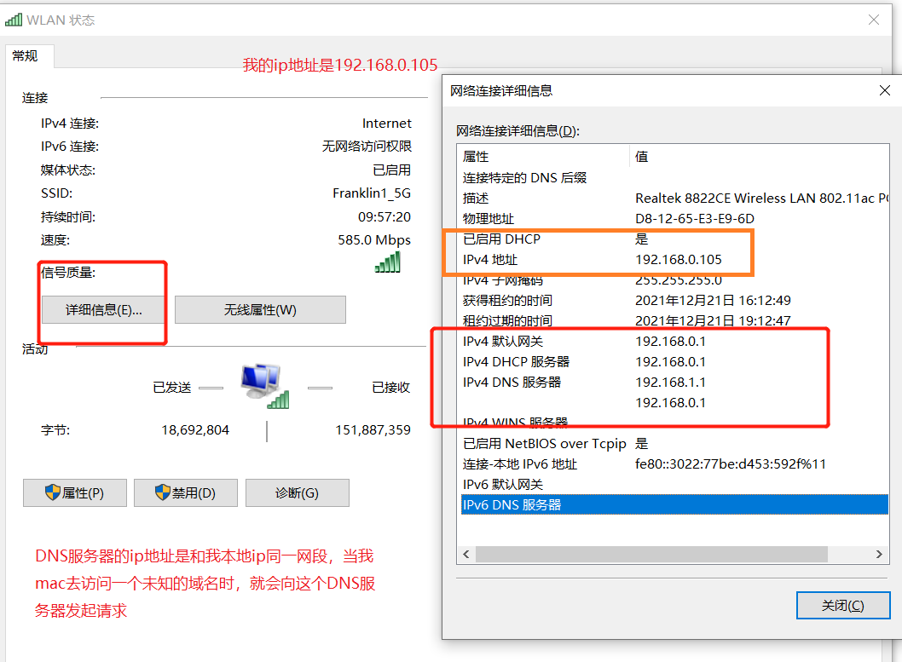

# 2. DNS（domain name system）域名管理
[[toc]]
## 2.2 DNS的作用

TCP/IP网络协议要求想要互联的机器要有唯一的IP地址，因为`TCP/IP`协议是基于`IP地址通信的`。

但是`ip地址`是一大长串数据，也不好记。所以就衍生出一个叫主机识别码的东西来。这个`主机识别码`和ip地址一样，都是唯一存在的。比如：`www.qq.com就是一个主机识别码`。

有`TCP/IP`这道坎，主机识别码就不能独立存在，我们需要一个机制，可以帮我们将`主机识别码转换成ip地址`，**DNS系统**扮演的就是这个角色。

## 2.3 域

域名是分层的

比如山东农业大学的域名是：`www.sdau.edu.cn`

其实cn后面还有个. 表示根域名服务器，但是都省略了

其中的cn表示中国，edu表示教育，sdau是山东农业大学的名字。这样大家看到这个域名时，即使不知道它具体是哪所高校，但是起码知道它代表一所学校。

sdau.edu.cn 还可以继续往下分，如www.sdau.edu.cn、paper.sdau.edu.cn  、family.sdau.edu.cn等等

## 2.4 DNS工作原理

一说DNS服务器大家都感觉云里雾里，感觉`DNS服务器`很高大上的样子。

:::tip DNS的查询顺序
1. 本地hosts文件
2. 本地DNS缓存
3. 本地DNS服务器
4. 发起迭代查询
:::

它确实是台服务器，确切的说是专门运行着有域名解析功能的某个软件的服务器（比如后文中的bind软件），既然是个软件，那软件启动后肯定得监听某个端口，这个端口

讲一下当我们在浏览器输入：`www.baidu.com`时，它时如何找到域名对应的ip地址的！

1. 首先浏览器会缓存域名、ip的对应关系。

2. 浏览器中没缓存，就会查找电脑本地的hosts文件，这里面会配置域名和ip的对应关系。

```bash
[root@VM_0_15_centos ~]# cat /etc/hosts
127.0.0.1 VM_0_15_centos VM_0_15_centos
127.0.0.1 localhost.localdomain localhost
127.0.0.1 localhost4.localdomain4 localhost4
122.51.144.197 tianqikai.club


::1 VM_0_15_centos VM_0_15_centos
::1 localhost.localdomain localhost
::1 localhost6.localdomain6 localhost6
```
3. 如果本地hosts文件中也没有域名对应的ip地址，我们的主机就会像它的dns服务器发起询问。wifi网络中然后点击高级，查看当前我的mac的DNS服务器地址

<a data-fancybox title="同一个局域网中不同主机的互联" href="./images/network12.png"></a>

> 在linux中都可以通过如下的命令查询dns服务器的位置

```bash
[root@VM_0_15_centos ~]# cat /etc/resolv.conf
options timeout:1 rotate
; generated by /usr/sbin/dhclient-script
nameserver 183.60.83.19
nameserver 183.60.82.98
```

> 在linux中都可以通过如下的命令对域名进行解析
```bash
# 会使用resolv.conf记录的dns服务器，对域名进行解析
~ % nslookup baidu.com
Server:  172.22.1.253
Address: 172.22.1.253#53

Name: baidu.com
Address: 220.181.38.148
Name: baidu.com
Address: 220.181.38.251
```

4. 免费的DNS服务器ip
```
ip	公司
8.8.8.8	谷歌
114.114.114.114	百度
```
5. DNS服务器接受到域名解析的请求后，就会查询该域名对应的ip是多少，而且他本身也存在缓存机制，如果它确定自己不能找到域名对应的ip地址的话，就会将这个dns解析请求转发给根DNS服务器，根域名域名服务器会告诉我们的DNS服务器说：我知道 com.域名服务器的位置，你去问他吧！

然后我们的DNS服务器找到com.域名服务器说：你知道www.baidu.com 对应的ip地址吗？ 然而com.服务器会说：我知道baidu.com.域名服务器在哪里，你去问他吧！

然后我们的DNS服务器找到baidu.com.域名服务器说：你知道www.baidu.cn 对应的ip地址吗？ baidu.com.服务器会说：www.com.com 的ip地址是 xxx.xxx.xxx.xxx

## 2.5 搭建DNS服务器

### 2.5.1 Bind
Bind是一款开源的DNS软件，全称：Berkeley Internet Name Domain 由美国加州大学伯克利分享开发、维护。

支持unix、window。BIND现在由互联网系统协会（Internet Systems Consortium）负责开发和维护。

那下文主要就是记录如何使用Bind软件搭建DNS服务以及搭建主从DNS服务。软件人家已经写好了，对使用者来说都很友好，只要改一改配置文件然后启动就OK（重点是理解那些参数都是啥意思）。

DNS域名解析会使用：udp/53

主从DNS服务之间的数据传输使用：tcp/53

其实如果你没有自建dns域名解析服务的需求，看到这里就可以结束了。如果以后可能会有这个记得收藏。

### 2.5.2 系统环境准备

- 调整yum源,安装
```bash
yum install epel-release -y
```

- 关闭SELinux、firewalld

```bash
# 关闭防火墙，注意一定要关闭防火墙
# 不然后面使用bind9自建dns时其他的服务器无法和自建的dns服务器通信～
# 不然etcd集群也没法搭建起来～
# 关闭防火墙
systemctl stop firewalld
systemctl disable firewalld

# 关闭selinux
# 永久关闭
sed -i 's/enforcing/disabled/' /etc/selinux/config  
# 临时关闭
setenforce 0  

# 关闭swap
# 临时
swapoff -a 
# 永久关闭
sed -ri 's/.*swap.*/#&/' /etc/fstab

# 根据规划设置主机名【dns01节点上操作】
hostnamectl set-hostname dns01

# 生效
sysctl --system  
```

- 安装必要的工具
```bash
yum install wget net-tools telnet tree nmap sysstat dos2unix bind-utils -y
```

### 2.5.3 安装bind

```bash
# 安装bind执行命令：

yum install bind -y
# 检测bind版本

rpm -qa bind
# 查看bind都有哪些文件

rpm -ql bind
# 了解配置文件

man 5 xxx.conf
```

### 2.5.4 查看bind的相关文件

- 通过如下命令可以找到Bind的主配置文件`named.conf`的位置

```bash
# 软件名叫bind，但是bin文件进程名称叫named
[root@localhost ~]# rpm -ql bind | grep etc
/etc/logrotate.d/named # 日志轮转的配置
/etc/named
/etc/named.conf # 主配置文件
/etc/named.iscdlv.key
/etc/named.rfc1912.zones # zone文件，用于定义域
/etc/named.root.key
/etc/rndc.conf
/etc/rndc.key
/etc/rwtab.d/named
```

- 查看程序常用bin文件位置

```bash
[root@localhost ~]# rpm -ql bind | grep sbin
/usr/sbin/named # 程序启动文件
/usr/sbin/named-checkconf # 检查配置文件语法（named.conf、named.rfc1912.zones）
/usr/sbin/named-checkzone # 检查区域文件语法的命令
```

- 查看服务的日志文件位置

```bash
[root@localhost ~]# rpm -ql bind | grep named.log
/var/log/named.log
```

- 其他动态文件的位置

```bash
[root@localhost ~]# rpm -ql bind | grep var
/var/log/named.log # 日志文件
/var/named
/var/named/data
/var/named/dynamic
/var/named/named.ca # 根域名服务器配置（所有DNS服务器都知道根域名服务器在哪里）
/var/named/named.empty 
/var/named/named.localhost # 正向解析区域文件的模版
/var/named/named.loopback # 反向解析区域文件的模版
/var/named/slaves # 从DNS服务器的下载文件的默认路径
```

### 2.5.5 查看bind的主配置文件

```bash
[root@localhost ~]# cat /etc/named.conf

options {
  /*
   监听方式，服务监听指定ip的53号端口
   服务器可能有多张网卡，any表示所有网卡监听53端口的DNS解析请求
   todo 可以个实验：1、ip指定为本机ip。2、ip指定为同网段随便的ip
  */
 listen-on port 53 { 127.0.0.1; any;}; /**/
 
 /*数据文件目录*/
 directory  "/var/named";
 
 /*DNS缓存位置*/
 dump-file  "/var/named/data/cache_dump.db";
 
 /*统计文件*/
 statistics-file "/var/named/data/named_stats.txt";
 
 /*内存统计文件*/
 memstatistics-file "/var/named/data/named_mem_stats.txt";
 recursing-file  "/var/named/data/named.recursing";
 secroots-file   "/var/named/data/named.secroots";
 
 /*
  允许哪些client来查询dns服务，默认是localhost。
  any表示所有人都能进行dns查询
 */
 allow-query     { localhost;any; };

 /*是否递归*/
 recursion yes;

 /*DNS安全扩展机制，默认开启，直接关闭即可*/
 dnssec-enable no;
 dnssec-validation no;

 /* Path to ISC DLV key */
 bindkeys-file "/etc/named.root.key";

 managed-keys-directory "/var/named/dynamic";

 pid-file "/run/named/named.pid";
 session-keyfile "/run/named/session.key";
};

logging {
        channel default_debug {
                file "data/named.run";
                severity dynamic;
        };
};

/*之所以全部DNS服务器都知道根域名服务器的位置，就是下面的配置在生效*/
zone "." IN {
 type hint;
 file "named.ca";
};

/*子配置文件*/
include "/etc/named.rfc1912.zones";
include "/etc/named.root.key";
```

- 修改完主配置文件后使用如下命令检验是否改错了

```bash
[root@localhost ~]# named-checkconf
```

### 2.5.6 查看域配置文件 - named.rfc1912.zones

```bash
[root@localhost ~]# cat /etc/named.rfc1912.zones

// 正向模版，从域名=>ip地址
// localhost.localdomain 为域名
// named.localhost为该域对应的配置文件，它位于/var/named/
// allow-update表示是否允许slave更新master的区域文件
zone "localhost.localdomain" IN { 
 type master;
 file "named.localhost";
 allow-update { none; }; 
};

// 反向模版，从ip地址=>域名
// 1.0.0.127 看着怪怪的，其实他是ip地址反过来写了。而且也要求反过来写
zone "1.0.0.127.in-addr.arpa" IN {
 type master;
 file "named.loopback";
 allow-update { none; };
};
```

### 2.5.7 查看某个具体的域的配置文件

```bash
[root@localhost ~]# ll /var/named/
总用量 16
drwxrwx--- 2 named named    6 4月  29 22:05 data
drwxrwx--- 2 named named    6 4月  29 22:05 dynamic
-rw-r----- 1 root  named 2253 4月   5 2018 named.ca
-rw-r----- 1 root  named  152 12月 15 2009 named.empty
-rw-r----- 1 root  named  152 6月  21 2007 named.localhost
-rw-r----- 1 root  named  168 12月 15 2009 named.loopback
drwxrwx--- 2 named named    6 4月  29 22:05 slaves
```

- 看一个正向解析的域的配置文件named.localhost
```bash
[root@localhost ~]# cat /var/named/named.localhost
$TTL 1D # 缓存的生命周期，默认1D表示1天
@ IN SOA @ rname.invalid. ( # ()中是slave相关配置
     0 ; serial # 更新序列号，当这个文件有变动时，需要将这个序列号+1，然后slave会向master同步数据
     1D ; refresh # slave从master中同步最新数据的时间间隔
     1H ; retry # slave从master中下载数据失败之后，隔多久的时间再重试
     1W ; expire # slave中区域文件的过期时间，w是周
     3H ) ; minimum # salve上缓存的最小有效时间
 NS @
 A 127.0.0.1
 AAAA ::1
 
# @：表示当前域，也就是 named.rfc1912.zones 中的zone的名称
# IN：表示Internet，互联网
# SOA：表示开始授权
# rname.invalid.  是邮箱地址，因为@符号有特殊含义，所以这里的邮箱使用.分隔
# NS： 全称NameServer 表示DNS服务器
# A：正向的Ipv4解析
# AAAA：IPv6
```

- 看一个反向解析的域的配置文件named.loopback

```bash
[root@localhost ~]# cat /var/named/named.loopback
$TTL 1D
@ IN SOA @ rname.invalid. (
     0 ; serial 
     1D ; refresh
     1H ; retry
     1W ; expire
     3H ) ; minimum
 NS @
 A 127.0.0.1
 AAAA ::1
 PTR localhost.

# 大部分参数和第一个文件相同
# PTR表示反向解析
```

### 2.5.8 实验前提前抛出一个问题

可以通过下面的方式配置网卡的dns服务器的地址
```bash
[root@localhost named]# cat >> /etc/sysconfig/network-scripts/ifcfg-eth0 << EOF
TYPE=Ethernet
BOOTPROTO=none
DEFROUTE=yes
NAME=eth0
DEVICE=eth0
ONBOOT=yes
IPADDR=192.168.222.20
NETMASK=255.255.255.0
GATEWAY=192.168.222.2
DNS1=192.168.222.2
EOF
```

比如网卡配置文件中指定的dns服务器地址是:192.168.222.2

- 另外系统上还运行着NetworkManager进程，它的作用之一将DHCP中获取的DNS信息写入/etc/resolv.conf
```bash
[root@localhost named]# ps -elf | grep NetworkManager
4 S root       6172      1  0  80   0 - 137970 poll_s 08:18 ?       00:00:00 /usr/sbin/NetworkManager --no-daemon
0 S root       7237   7080  0  80   0 - 28181 pipe_w 09:00 pts/0    00:00:00 grep --color=auto NetworkManager
```
也就是将我们设置的dns服务器地址，更新进下面的文件
```bash
[root@localhost named]# cat /etc/resolv.conf
nameserver 192.168.222.2
```

那么问题来了：

我们本机的ip是192.168.222.20，然后我们在本机自建的dns服务时又需要指定dns服务的ip地址，那既然本机就是dns服务器，那指定的dns服务的地址肯定是本机的ip地址192.168.222.20，那这和NetworkManager更新入/etc/resolv.conf的ip地址是不同的。

而且通过nslookup ${域名} 进行域名解析时，它会去使用/etc/resolv.conf里面的dns去解析域名，而不是我们自己在本机搭建的dns服务。

如果你非想用nsloopup验证我们自己的dns服务是否正常，可以使用如下命令
```bash
[root@localhost named]# echo nameserver 192.168.222.20 >  /etc/resolv.conf
```
---------------

### 2.5.9 实验：搭建DNS正向解析服务
实验目的：实现将www.tianqikai.com解析成192.168.222.3

1. 修改/etc/named.conf中的监听方式为全网监听、允许所有人访问dns服务、关闭安全验证机制

2. 修改子配置文件/etc/named.rfc1912.zones添加tianqikai.com域。注意这个tianqikai.com域也会往下分层，比如：www.tianqikai.com、wiki.tianqikai.com、family.tianqikai.com

```bash
[root@localhost etc]# vi /etc/named.rfc1912.zones

// 添加如下配置
zone "tianqikai.com" IN {
        type master;
        file "named.tianqikai.zone";
        allow-update { none; };
};
```

3. 创建named.tianqikai.zone配置文件，tianqikai.com域分层的详细逻辑就在这个named.tianqikai.zone配置文件中定义。
```bash
[root@localhost etc]# rpm -ql bind |  grep named.localhost
/usr/share/doc/bind-9.11.4/sample/var/named/named.localhost
/var/named/named.localhost
[root@localhost etc]# cp /var/named/named.localhost /var/named/named.tianqikai.zone

# 注意将named.tianqikai.zone文件的所属组改成named
# 否则会以为named无法使用root文件而导致DNS服务不能解析tianqikai.zone域
[root@localhost named]# chown -R root:named named.tianqikai.zone
[root@localhost etc]# vi /var/named/named.tianqikai.zone

```

```bash
# 按需修改配置文件

$TTL 1D
@       IN SOA tianqikai.com. rname.invalid. (
                                        0       ; serial
                                        1D      ; refresh
                                        1H      ; retry
                                        1W      ; expire
                                        3H )    ; minimum
# 下面这两行指定了dns服务器的nameServer是tianqikai.com、ip地址是192.168.222.20（它自己）
# dns1是自定义的dns服务的名称，叫啥都行
@       NS      dns1.tianqikai.com.
dns1    A       192.168.222.20
# 在tianqikai.com域中添加一个www主机，A记录表示是一个正向解析。解析结果为192.168.222.3
www   A    192.168.222.3 
```
4. 检查配置文件

```bash
[root@localhost ~]# cd /etc
[root@localhost etc]# rpm -ql bind | grep sbin/named
/usr/sbin/named
/usr/sbin/named-checkconf
/usr/sbin/named-checkzone
/usr/sbin/named-compilezone
/usr/sbin/named-journalprint

[root@localhost etc]# named-checkconf named.conf
[root@localhost etc]# named-checkconf named.rfc1912.zones
[root@localhost named]# named-checkzone named.tianqikai.zone named.tianqikai.zone
zone named.tianqikai.zone/IN: loaded serial 0
OK
```
5. 开启服务

```bash
cd 
[root@localhost named]# rpm -ql bind | grep named
/etc/logrotate.d/named
/etc/named
...
/usr/sbin/named
/usr/sbin/named-checkconf

[root@localhost sbin]# systemctl start named
[root@localhost sbin]# systemctl enable named
Created symlink from /etc/systemd/system/multi-user.target.wants/named.service to /usr/lib/systemd/system/named.service.
[root@localhost named]# netstat -luntp | grep 53
tcp        0      0 192.168.222.20:53       0.0.0.0:*               LISTEN      25916/named         
tcp        0      0 127.0.0.1:53            0.0.0.0:*               LISTEN      25916/named         
tcp        0      0 127.0.0.1:953           0.0.0.0:*               LISTEN      25916/named         
tcp6       0      0 ::1:53                  :::*                    LISTEN      25916/named         
tcp6       0      0 ::1:953                 :::*                    LISTEN      25916/named         
udp        0      0 192.168.222.20:53       0.0.0.0:*                           25916/named         
udp        0      0 127.0.0.1:53            0.0.0.0:*                           25916/named         
udp6       0      0 ::1:53                  :::*                                25916/named     
```

6. 查看或修改本机的dns服务器地址+验证实验效果

```bash
[root@localhost named]# nslookup www.tianqikai.com
Server:		192.168.222.20
Address:	192.168.222.20#53

Name:	www.tianqikai.com
Address: 192.168.222.3

[root@localhost named]# host www.tianqikai.com
www.tianqikai.com has address 192.168.222.3
```

- 通过dig命令验证

```bash
[root@localhost named]# dig @192.168.222.20 tianqikai.com

; <<>> DiG 9.11.4-P2-RedHat-9.11.4-26.P2.el7_9.8 <<>> @192.168.222.20 tianqikai.com
; (1 server found)
;; global options: +cmd
;; Got answer:
;; ->>HEADER<<- opcode: QUERY, status: NOERROR, id: 18264
;; flags: qr aa rd ra; QUERY: 1, ANSWER: 0, AUTHORITY: 1, ADDITIONAL: 1

;; OPT PSEUDOSECTION:
; EDNS: version: 0, flags:; udp: 4096
;; QUESTION SECTION:
;tianqikai.com.			IN	A

;; AUTHORITY SECTION:
tianqikai.com.		10800	IN	SOA	tianqikai.com. rname.invalid. 0 86400 3600 604800 10800

;; Query time: 0 msec
;; SERVER: 192.168.222.20#53(192.168.222.20)
;; WHEN: 二 12月 21 22:39:09 CST 2021
;; MSG SIZE  rcvd: 91
```

- 通过host命令查看

```bash
[root@localhost named]# host www.tianqikai.com
www.tianqikai.com has address 192.168.222.3

```

### 2.5.10 实验：搭建DNS反向解析服务

1. 修改/etc/named.conf中的监听方式为全网监听、允许所有人访问dns服务、关闭安全验证机制

2. 修改子配置文件/etc/named.rfc1912.zones添加tianqikai.com域反向解析
```bash
[root@localhost named]# vi /etc/named.rfc1912.zones
zone "222.168.192.in-addr.arpa" IN {
        type master;
        file "named.tianqikai.loopback";
        allow-update { none; };
};
```

3. 创建、编辑子配置文件named.tianqikai.loopback

```bash
[root@localhost named]# cp -p named.loopback named.tianqikai.loopback
[root@localhost named]# vi named.tianqikai.loopback
$TTL 1D
@       IN SOA  tianqikai.com. rname.invalid. (
                                        0       ; serial
                                        1D      ; refresh
                                        1H      ; retry
                                        1W      ; expire
                                        3H )    ; minimum
# 下面这两行也可以简写成一行：@       NS      dns1.tianqikai.com.
# 之所以能简写是因为dns1在正向解析配置中已经定义好了
@       NS      dns2.tianqikai.com.
dns2    A       192.168.222.20
3       PTR     www.tianqikai.com. # 3是222.168.192网段的最后一位，（192.168.222.2）
```

4. 重启服务
```bash
[root@localhost named]# systemctl  restart named
```
5. 验收
```bash
[root@localhost named]# dig -x 192.168.222.2 @192.168.222.20

; <<>> DiG 9.11.4-P2-RedHat-9.11.4-26.P2.el7_9.5 <<>> -x 192.168.222.2 @192.168.222.20
;; global options: +cmd
;; Got answer:
;; ->>HEADER<<- opcode: QUERY, status: NOERROR, id: 4572
;; flags: qr aa rd ra; QUERY: 1, ANSWER: 1, AUTHORITY: 1, ADDITIONAL: 1

;; OPT PSEUDOSECTION:
; EDNS: version: 0, flags:; udp: 4096
;; QUESTION SECTION:
;2.1.168.192.in-addr.arpa. IN PTR

;; ANSWER SECTION:
2.1.168.192.in-addr.arpa. 86400 IN PTR www.tianqikai.com.

;; AUTHORITY SECTION:
1.168.192.in-addr.arpa. 86400 IN NS dns2.tianqikai.com.

;; Query time: 0 msec
;; SERVER: 192.168.222.20#53(192.168.222.20)
;; WHEN: 四 8月 19 08:57:51 CST 2021
;; MSG SIZE  rcvd: 98
```
或者
```bash
[root@localhost named]# nslookup 192.168.222.2
2.1.168.192.in-addr.arpa name = www.tianqikai.com.

[root@localhost named]# host 192.168.222.2
2.1.168.192.in-addr.arpa domain name pointer www.tianqikai.com.
```

## 2.6 搭建主从DNS服务

主从DNS服务其实就是在多台相同环境机器上，都安装好Bind软件，再按照一定的规则修改主从的配置文件。

要求主从DNS服务器的时间要相同，关于时间如何同步，可以参考下面的ntp

### 2.6.1 搭建时间同步服务器-ntp

安装时间同步服务器

```bash
~]# yum install -y ntp
```
- 修改配置文件ntp.conf
```bash
~]# rpm -ql ntp | grep conf
/etc/ntp.conf
/etc/sysconfig/ntpd
/usr/share/man/man5/ntp.conf.5.gz
~]# vi /etc/ntp.conf
```
- 启动

```bash
[root@ntp-server ~]# rpm -ql ntp | grep bin
/usr/bin/ntpstat
/usr/sbin/ntp-keygen
/usr/sbin/ntpd
/usr/sbin/ntpdc
/usr/sbin/ntpq
/usr/sbin/ntptime
/usr/sbin/tickadj
[root@ntp-server ~]# systemctl start ntpd
[root@ntp-server ~]# systemctl enable ntpd
Created symlink from /etc/systemd/system/multi-user.target.wants/ntpd.service to /usr/lib/systemd/system/ntpd.service.

```
- 在客户端验证时间同步服务器是否正常启动

### 2.6.2 登陆10.4.7.0所在的其他网段的机器，验证如下

```bash
~]# ntpdate 10.4.7.9
20 Aug 08:37:47 ntpdate[8399]: adjust time server 10.4.7.9 offset -0.017571 sec
```

- 在主从机器上添加crontab定时任务同步时间

参考之前的笔记：https://www.cnblogs.com/ZhuChangwu/p/11519940.html

```bash
~]# crontab -e
*/2 * * * * ntpdate 10.4.7.9 &> /dev/null

[root@localhost ~]# crontab -l
*/2 * * * * ntpdate 10.4.7.9 &> /dev/null
```
### 2.6.3 开始搭建

```bash
dns-master：192.168.222.20

dns-slave: 192.168.222.21
```
### 2.6.4 在master上的操作
1. 设置允许哪些slave向自己同步数据
```bash
# 之前的配置如下
zone "tianqikai.com" IN {
        type master;
        file "named.tianqikai.zone";
        allow-update { none; };
};
```
# 可以将allow-update { none; };删掉
# 也可以改写成： allow-update { 192.168.222.21; };
2. 重启

### 2.6.5 在slave上的设置
1. 使用crontab时间同步服务器同步时间

2. 修改/etc/named.conf配置文件（同master）

3. 修改/etc/named.rfc1912.zones

```bash
# master的named.rfc1912.zones自定义正向zone配置如下

zone "tianqikai.com" IN {
        type master;
        file "named.tianqikai.zone";
        allow-update { none; };
};

# 响应的slave的追加配置如下
~]# vi /etc/named.rfc1912.zones

zone "tianqikai.com" IN {
        type slave;
        # 因为slave的zone文件是从master中拉取过来的
        # 所以slaves其实是个相对路径
        # 全路径是：/var/named/slaves/named.tianqikai.zone , /var/named在named.conf中有定义
        file "slaves/named.tianqikai.zone"; 
        # 指定master位置
        masters {192.168.222.20;};
};
```

4. 重启

### 2.6.6 客户端的设置
为客户端设置两个dns服务。

```bash
echo nameserver 192.168.222.20 > /etc/resolv.conf
echo nameserver 192.168.222.21 > /etc/resolv.conf
```
这样，当需要进行域名解析时，优先使用master。当master挂了后，客户端会使用备用的dns服务解析域名。
