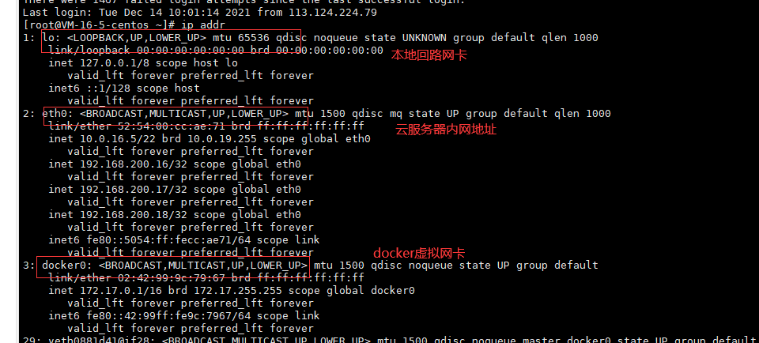
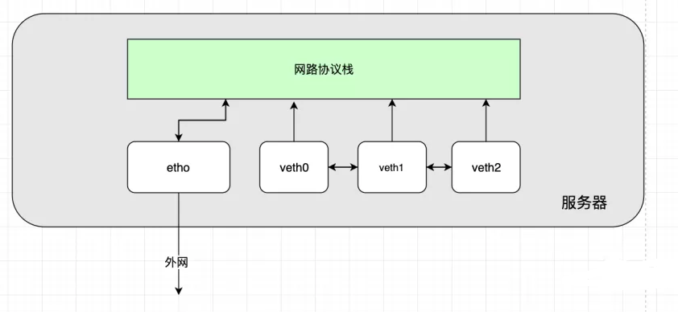
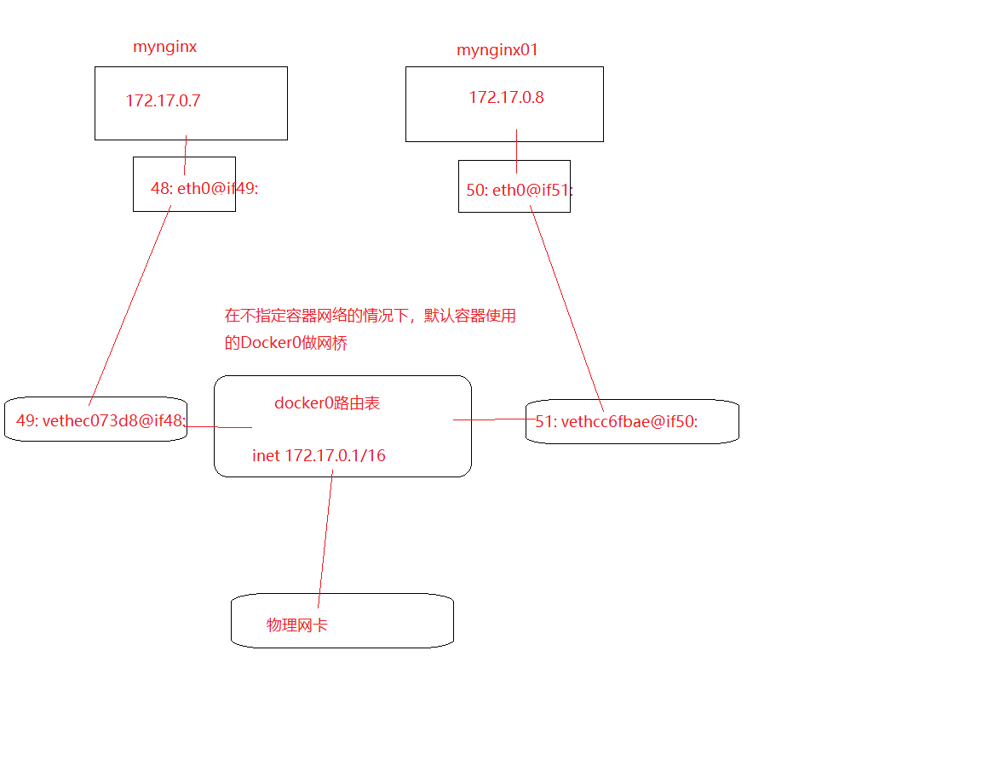
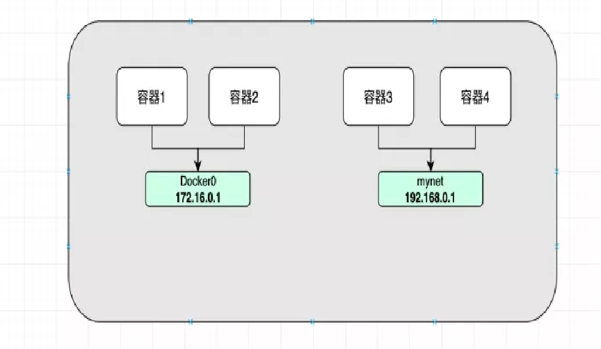
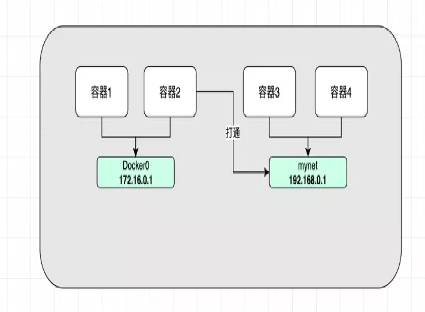

# 4. Docker网络入门

## 4.1 Docker0

Docker网络的核心是Docker0
通过`ip addr`可以看到服务器中如下几块网卡

```bash
[root@VM-16-5-centos ~]# ip addr
1: lo: <LOOPBACK,UP,LOWER_UP> mtu 65536 qdisc noqueue state UNKNOWN group default qlen 1000
    link/loopback 00:00:00:00:00:00 brd 00:00:00:00:00:00
    inet 127.0.0.1/8 scope host lo
       valid_lft forever preferred_lft forever
    inet6 ::1/128 scope host 
       valid_lft forever preferred_lft forever
2: eth0: <BROADCAST,MULTICAST,UP,LOWER_UP> mtu 1500 qdisc mq state UP group default qlen 1000
    link/ether 52:54:00:cc:ae:71 brd ff:ff:ff:ff:ff:ff
    inet 10.0.16.5/22 brd 10.0.19.255 scope global eth0
       valid_lft forever preferred_lft forever
    inet 192.168.200.16/32 scope global eth0
       valid_lft forever preferred_lft forever
    inet 192.168.200.17/32 scope global eth0
       valid_lft forever preferred_lft forever
    inet 192.168.200.18/32 scope global eth0
       valid_lft forever preferred_lft forever
    inet6 fe80::5054:ff:fecc:ae71/64 scope link 
       valid_lft forever preferred_lft forever
3: docker0: <BROADCAST,MULTICAST,UP,LOWER_UP> mtu 1500 qdisc noqueue state UP group default 
    link/ether 02:42:99:9c:79:67 brd ff:ff:ff:ff:ff:ff
    inet 172.17.0.1/16 brd 172.17.255.255 scope global docker0
       valid_lft forever preferred_lft forever
    inet6 fe80::42:99ff:fe9c:7967/64 scope link 
       valid_lft forever preferred_lft forever
```
<a data-fancybox title="Docker0" href="./images/network17.png"></a>

> 查看公网ip可以在控制台获取或者执行：curl cip.cc
```bash
[root@VM-16-5-centos ~]# curl cip.cc
IP	: 49.233.34.168
地址	: 中国  中国

数据二	: 北京市 | 腾讯云

数据三	: 中国北京北京 | 电信

URL	: http://www.cip.cc/49.233.34.168
```
> 容器中安装ip addr命令工具
```bash
apt update && apt install -y iproute2 && apt install -y net-tools && apt install -y iputils-ping
```

### 4.1.1 宿主机与docker容器进行访问

Docker中启动Nginx容器，问宿主机能通过容器的ip地址ping通它吗？

```bash
# 查看docker容器
[root@VM-16-5-centos ~]# docker ps
CONTAINER ID   IMAGE                 COMMAND                  CREATED        STATUS        PORTS                                            NAMES
91ca2b95e724   nginx                 "/docker-entrypoint.…"   4 hours ago    Up 4 hours    0.0.0.0:88->80/tcp                               mynginx
c2411dac6aa2   redis                 "docker-entrypoint.s…"   5 weeks ago    Up 5 weeks    0.0.0.0:6400->6379/tcp                           redis
8559b90888a5   mysql:5.7             "docker-entrypoint.s…"   5 weeks ago    Up 5 weeks    33060/tcp, 0.0.0.0:6699->3306/tcp                mysqlstudy5.7
a2d82a7d3653   mysql:5.7             "docker-entrypoint.s…"   3 months ago   Up 3 months   33060/tcp, 0.0.0.0:3366->3306/tcp                mysqlserver5.7
3408cea4fa40   kibana:7.4.2          "/usr/local/bin/dumb…"   3 months ago   Up 3 months   0.0.0.0:5601->5601/tcp                           kibana
375dd5df9373   elasticsearch:7.4.2   "/usr/local/bin/dock…"   3 months ago   Up 3 months   0.0.0.0:9200->9200/tcp, 0.0.0.0:9300->9300/tcp   elasticsearch
# 进入docker容器查看ip
[root@VM-16-5-centos ~]# docker inspect --format='{{.NetworkSettings.IPAddress}}' mynginx
172.17.0.7
# ping 172.17.0.7
[root@VM-16-5-centos ~]# ping 172.17.0.7
PING 172.17.0.7 (172.17.0.7) 56(84) bytes of data.
64 bytes from 172.17.0.7: icmp_seq=1 ttl=64 time=0.038 ms
64 bytes from 172.17.0.7: icmp_seq=2 ttl=64 time=0.040 ms
64 bytes from 172.17.0.7: icmp_seq=3 ttl=64 time=0.041 ms
^C
--- 172.17.0.7 ping statistics ---
3 packets transmitted, 3 received, 0% packet loss, time 1999ms
rtt min/avg/max/mdev = 0.038/0.039/0.041/0.007 ms

```
---------------------------------

**实验结果很明显：可以ping通！**

为什么能ping通呢？？？

查看容器和宿主机网卡的信息就知道了

宿主机中有一块叫Docker0的网卡如下，它的网络段172.17.0.1/16

```bash
3: docker0: <BROADCAST,MULTICAST,UP,LOWER_UP> mtu 1500 qdisc noqueue state UP group default 
    link/ether 02:42:99:9c:79:67 brd ff:ff:ff:ff:ff:ff
    inet 172.17.0.1/16 brd 172.17.255.255 scope global docker0
       valid_lft forever preferred_lft forever
    inet6 fe80::42:99ff:fe9c:7967/64 scope link 
       valid_lft forever preferred_lft forever
```

容器的网卡信息如下：

```bash
[root@VM-16-5-centos ~]# docker exec -it 91ca2b95e724 /bin/bash
root@91ca2b95e724:/# ip addr
1: lo: <LOOPBACK,UP,LOWER_UP> mtu 65536 qdisc noqueue state UNKNOWN group default qlen 1000
    link/loopback 00:00:00:00:00:00 brd 00:00:00:00:00:00
    inet 127.0.0.1/8 scope host lo
       valid_lft forever preferred_lft forever
48: eth0@if49: <BROADCAST,MULTICAST,UP,LOWER_UP> mtu 1500 qdisc noqueue state UP group default 
    link/ether 02:42:ac:11:00:07 brd ff:ff:ff:ff:ff:ff link-netnsid 0
    inet 172.17.0.7/16 brd 172.17.255.255 scope global eth0
       valid_lft forever preferred_lft forever
```
可以看到这宿主机和容器其实是在同一个网段的～，所以肯定能通！

### 4.1.2 docker容器间进行访问

这两个容器之间能通过彼此的ip的相互ping通吗？

```bash
[root@VM-16-5-centos ~]# docker ps
CONTAINER ID   IMAGE                 COMMAND                  CREATED         STATUS         PORTS                                            NAMES
3d39e0bef1a4   nginx                 "/docker-entrypoint.…"   8 seconds ago   Up 6 seconds   0.0.0.0:89->80/tcp                               mynginx01
91ca2b95e724   nginx                 "/docker-entrypoint.…"   4 hours ago     Up 4 hours     0.0.0.0:88->80/tcp                               mynginx

# 进入docker容器查看ip
[root@VM-16-5-centos ~]# docker inspect --format='{{.NetworkSettings.IPAddress}}' mynginx
172.17.0.7
[root@VM-16-5-centos ~]# docker inspect --format='{{.NetworkSettings.IPAddress}}' mynginx01
172.17.0.8
#进入容器，ping对方地址
root@91ca2b95e724:/# ping 172.17.0.8
PING 172.17.0.8 (172.17.0.8) 56(84) bytes of data.
64 bytes from 172.17.0.8: icmp_seq=1 ttl=64 time=0.079 ms
64 bytes from 172.17.0.8: icmp_seq=2 ttl=64 time=0.049 ms
64 bytes from 172.17.0.8: icmp_seq=3 ttl=64 time=0.040 ms

```


**结论很明显：彼此之间能ping通！**

那Docker是怎么做的呢？

<font color='red'>我们安装Docker后会带有一个默认的网卡叫做Docker0，它实际上是一个网桥，其中有一端连接在真实的互联网上，使用的的技术是veth-pair桥接技术</font>

此时我的Docker中已经运行了两个容器了，现在去看下宿主机和两个容器的网卡信息。

#### 宿主机
```bash
[root@VM-16-5-centos ~]# ip addr

49: vethec073d8@if48: <BROADCAST,MULTICAST,UP,LOWER_UP> mtu 1500 qdisc noqueue master docker0 state UP group default 
    link/ether 9a:3d:26:9a:9d:5b brd ff:ff:ff:ff:ff:ff link-netnsid 5
    inet6 fe80::983d:26ff:fe9a:9d5b/64 scope link 
       valid_lft forever preferred_lft forever
51: vethcc6fbae@if50: <BROADCAST,MULTICAST,UP,LOWER_UP> mtu 1500 qdisc noqueue master docker0 state UP group default 
    link/ether 46:c5:3e:e5:2c:cd brd ff:ff:ff:ff:ff:ff link-netnsid 6
    inet6 fe80::44c5:3eff:fee5:2ccd/64 scope link 
       valid_lft forever preferred_lft forever

```
#### mynginx
```bash
[root@VM-16-5-centos ~]# docker exec -it mynginx ip addr
1: lo: <LOOPBACK,UP,LOWER_UP> mtu 65536 qdisc noqueue state UNKNOWN group default qlen 1000
    link/loopback 00:00:00:00:00:00 brd 00:00:00:00:00:00
    inet 127.0.0.1/8 scope host lo
       valid_lft forever preferred_lft forever
48: eth0@if49: <BROADCAST,MULTICAST,UP,LOWER_UP> mtu 1500 qdisc noqueue state UP group default 
    link/ether 02:42:ac:11:00:07 brd ff:ff:ff:ff:ff:ff link-netnsid 0
    inet 172.17.0.7/16 brd 172.17.255.255 scope global eth0
       valid_lft forever preferred_lft forever

```
#### mynginx01
```bash
[root@VM-16-5-centos ~]# docker exec -it mynginx01 ip addr
1: lo: <LOOPBACK,UP,LOWER_UP> mtu 65536 qdisc noqueue state UNKNOWN group default qlen 1000
    link/loopback 00:00:00:00:00:00 brd 00:00:00:00:00:00
    inet 127.0.0.1/8 scope host lo
       valid_lft forever preferred_lft forever
50: eth0@if51: <BROADCAST,MULTICAST,UP,LOWER_UP> mtu 1500 qdisc noqueue state UP group default 
    link/ether 02:42:ac:11:00:08 brd ff:ff:ff:ff:ff:ff link-netnsid 0
    inet 172.17.0.8/16 brd 172.17.255.255 scope global eth0
       valid_lft forever preferred_lft forever
```

仔细看如上两图中多出来的网卡命名对应关系
```sh
# 宿主机多出来的：     49: vethec073d8@if48:
# 对应容器mynginx：    48: eth0@if49:

# 宿主机多出来的：     51: vethcc6fbae@if50:
# 对应容器mynginx01：   50: eth0@if51:
```

这种网卡成对对应的关系，就是借助**veth-pair技术**实现的

<font color='red'>veth-pair就是一对虚拟的网络接口，成对出现，一端连着协议，一端彼此相连。由它充当一个桥梁的作用，连接各个Docker 容器，实现网络数据交互</font>

<a data-fancybox title="Docker0" href="./images/docker01.png"></a>


<a data-fancybox title="Docker0" href="./images/docker02.png"></a>

-------------------

在不指定容器网络的情况下，默认容器使用的Docker0做网桥

```bash
[root@VM-16-5-centos ~]# docker network ls
NETWORK ID     NAME      DRIVER    SCOPE
a00188b894f8   bridge    bridge    local
f572f2267be8   host      host      local
60f9f999d553   none      null      local

```

通过下面的命令查看使用Docker0的所有Container

```bash
[root@VM-16-5-centos ~]# docker network inspect a00188b894f8
[
    {
        "Name": "bridge",
        "Id": "a00188b894f8de9cdc8edb9fa927d290f48e9884512b1e1be89ab04703efb831",
        "Created": "2021-09-05T10:45:01.453772212+08:00",
        "Scope": "local",
        #使用桥接方式
        "Driver": "bridge",
        "EnableIPv6": false,
        "IPAM": {
            "Driver": "default",
            "Options": null,
            "Config": [
                {
                    #子网网络网段
                    "Subnet": "172.17.0.0/16",
                    "Gateway": "172.17.0.1"
                }
            ]
        },
        "Internal": false,
        "Attachable": false,
        "Ingress": false,
        "ConfigFrom": {
            "Network": ""
        },
        "ConfigOnly": false,
        "Containers": {
            # 各个容器的分配ip信息
            "3408cea4fa4056aeebe373db3265f03bb5b500f7da3e826b50b69b5f548a4b0c": {
                "Name": "kibana",
                "EndpointID": "ec11fef4594d557f1ea85dd69a39303f090be01544eaa1dedf1f12b293f64413",
                "MacAddress": "02:42:ac:11:00:05",
                "IPv4Address": "172.17.0.5/16",
                "IPv6Address": ""
            },
            "375dd5df93738e01acfa73a0ba931f26afda477c11d5518e14c0f4c5e0ac016c": {
                "Name": "elasticsearch",
                "EndpointID": "3e4b4eafeb05285851c7d4b6657d71225a41ac1398d27521b2e2df2cee84eaec",
                "MacAddress": "02:42:ac:11:00:04",
                "IPv4Address": "172.17.0.4/16",
                "IPv6Address": ""
            },
            "3d39e0bef1a4fb7b215c75622eafb79d723632627c9fb55da7eeb2cf5118410c": {
                "Name": "mynginx01",
                "EndpointID": "5fb86c18bd8becd02731fc00eaba0dd6b98b17593a5733263cfebe8d7fe31b43",
                "MacAddress": "02:42:ac:11:00:08",
                "IPv4Address": "172.17.0.8/16",
                "IPv6Address": ""
            },
            "8559b90888a57eb5a6ec8ed2255f15533d7f6fe7f7b0dbe98ef90e3b58b9ff5f": {
                "Name": "mysqlstudy5.7",
                "EndpointID": "9365bd5f4012f277774f7e5fb319fc5f8089d72894959d582eb42b30e46c9373",
                "MacAddress": "02:42:ac:11:00:06",
                "IPv4Address": "172.17.0.6/16",
                "IPv6Address": ""
            },
            "91ca2b95e7241ef083cd257d0afdafcae9d127bae79229e1b06b2beb8f0df0e0": {
                "Name": "mynginx",
                "EndpointID": "049d8beefd0bd14a243ea5af4e68787eabfef35436f09827f9eb22a3968a4f53",
                "MacAddress": "02:42:ac:11:00:07",
                "IPv4Address": "172.17.0.7/16",
                "IPv6Address": ""
            },
            "a2d82a7d3653c992cd41846b47b786d23d669f186548ba625524f0c9672548d6": {
                "Name": "mysqlserver5.7",
                "EndpointID": "9cfa0caa32ecbac9ba9da5caa795de1c11d47ef2dcdef3d3ef319976cc052bfb",
                "MacAddress": "02:42:ac:11:00:03",
                "IPv4Address": "172.17.0.3/16",
                "IPv6Address": ""
            },
            "c2411dac6aa232978b3eb7332a766b98dfddf84b1ca89393082d9007e0db8934": {
                "Name": "redis",
                "EndpointID": "026a88d361bff0c1e5b39464d6da200ce81cbd427a7dab85f3dcaf39d70a8fcc",
                "MacAddress": "02:42:ac:11:00:02",
                "IPv4Address": "172.17.0.2/16",
                "IPv6Address": ""
            }
        },
        "Options": {
            "com.docker.network.bridge.default_bridge": "true",
            "com.docker.network.bridge.enable_icc": "true",
            "com.docker.network.bridge.enable_ip_masquerade": "true",
            "com.docker.network.bridge.host_binding_ipv4": "0.0.0.0",
            "com.docker.network.bridge.name": "docker0",
            "com.docker.network.driver.mtu": "1500"
        },
        "Labels": {}
    }
]
```
### 4.1.3 Docker网络--link

**--link 可以让我们让两个容器通过服务名直接ping通**
```bash
# 使用--link这个启动参数，连通不同的容器，实现通过服务名就ping通容器
[root@VM-16-5-centos ~]# docker run -d -P --name mynginx3 --link mynginx nginx
ca80e7527f99a1e36690a524ec8eb1ada51ed4067290031a75ed37f4d51462bd

# 检查容器是否正常启动了
[root@VM-16-5-centos ~]# docker ps
CONTAINER ID   IMAGE                 COMMAND                  CREATED          STATUS          PORTS                                            NAMES
ca80e7527f99   nginx                 "/docker-entrypoint.…"   4 minutes ago    Up 4 minutes    0.0.0.0:49153->80/tcp                            mynginx3
3d39e0bef1a4   nginx                 "/docker-entrypoint.…"   47 minutes ago   Up 47 minutes   0.0.0.0:89->80/tcp                               mynginx01
91ca2b95e724   nginx                 "/docker-entrypoint.…"   5 hours ago      Up 5 hours      0.0.0.0:88->80/tcp                               mynginx


# 使用mynginx3 ping通mynginx
[root@VM-16-5-centos ~]# docker exec -it mynginx3 ping mynginx
PING mynginx (172.17.0.7) 56(84) bytes of data.
64 bytes from mynginx (172.17.0.7): icmp_seq=1 ttl=64 time=0.112 ms
64 bytes from mynginx (172.17.0.7): icmp_seq=2 ttl=64 time=0.038 ms
^C
--- mynginx ping statistics ---
2 packets transmitted, 2 received, 0% packet loss, time 1002ms
rtt min/avg/max/mdev = 0.038/0.075/0.112/0.037 ms


# 反向使用mynginx2 ping mynginx3
[root@VM-16-5-centos ~]# docker exec -it mynginx ping mynginx3
ping: mynginx3: Name or service not known
```


原理：--link实际上是修改了mynginx3的host文件，如下
```bash
root@ca80e7527f99:/# cat /etc/hosts
127.0.0.1	localhost
::1	localhost ip6-localhost ip6-loopback
fe00::0	ip6-localnet
ff00::0	ip6-mcastprefix
ff02::1	ip6-allnodes
ff02::2	ip6-allrouters
## mynginx
172.17.0.7	mynginx 91ca2b95e724
172.17.0.9	ca80e7527f99

```

而mynginx01的host文件中没有这种别名，所以反向通过服务名不能ping通

## 4.2 自定义Docker网络

### 4.2.1 docker中的网络
- 查看docker所有的网络：
```bash
[root@VM-16-5-centos ~]# docker network ls
NETWORK ID     NAME      DRIVER    SCOPE
a00188b894f8   bridge    bridge    local
f572f2267be8   host      host      local
60f9f999d553   none      null      local
```
-----------------

:::tip docker中的网络参数
`briage`：桥接网络（也是默认的网络）。通过Docker0作为网桥，实现容器联网互通
`host`：和宿主机共享网络（使用同一块网卡）
`none`：不配置网络，形成一个全封闭的容器，无法和外网连接
`container`：让一个容器共享另一个容器网络相关的namespace，实现让几个容器内网络互通
:::

### 4.2.2 自定义网络

- 默认网络参数
```bash
# 启动容器时我们不添加网络相关启动参数，Docker会为我们补全成下面这样
# 而这里指定的 bridge 就是就是docker0
docker run -d -P --name xxx --net bridge imageId

# --net 指定当前容器启动后加入到哪个网络中
```


- 自定义

```bash
# 创建自定义网络
# --subnet 192.168.0.0/16 指定了子网网络，可以分配2的16次方-2个ip
# --gateway 192.168.0.1 网关路由器的ip地址
[root@VM-0-5-centos ~]# docker network create --driver bridge --subnet 192.168.0.0/16 --gateway 192.168.0.1 mynet
a8a84221d4a73a2e2eda9f692c74af75cdbdac440e8c7587b56847c61e1dde4c

# 查看是否创建成功了
[root@VM-0-5-centos ~]# docker network ls
NETWORK ID          NAME                DRIVER              SCOPE
a9ff308438a8        bridge              bridge              local
0d98ae518a10        host                host                local
a8a84221d4a7        mynet               bridge              local
cb71d8cdbbca        none                null                local
```

- 查看我们自定义的网络详情

```bash
[root@VM-16-5-centos ~]# docker network inspect mynet
[
    {
        "Name": "mynet",
        "Id": "b69cb98e4731728f09ed9b6d9a052c2fe543aafd19fa8453ab3293f1d5fcc408",
        "Created": "2021-12-24T17:24:43.472154302+08:00",
        "Scope": "local",
        "Driver": "bridge",
        "EnableIPv6": false,
        "IPAM": {
            "Driver": "default",
            "Options": {},
            "Config": [
                {
                    "Subnet": "192.168.0.0/16",
                    "Gateway": "192.168.0.1"
                }
            ]
        },
        "Internal": false,
        "Attachable": false,
        "Ingress": false,
        "ConfigFrom": {
            "Network": ""
        },
        "ConfigOnly": false,
        "Containers": {},
        "Options": {},
        "Labels": {}
    }
]

```
- 查看宿主机网卡信息：可以看到宿主机上多出来了一张虚拟网卡

```bash
54: br-b69cb98e4731: <NO-CARRIER,BROADCAST,MULTICAST,UP> mtu 1500 qdisc noqueue state DOWN group default 
    link/ether 02:42:dc:ed:d4:e8 brd ff:ff:ff:ff:ff:ff
    inet 192.168.0.1/16 brd 192.168.255.255 scope global br-b69cb98e4731
       valid_lft forever preferred_lft forever

```

在自定义的网络中的容器是可以直接通过对方的 容器名 ping通的

```bash
# --net mynet --ip 192.168.0.2
[root@VM-16-5-centos ~]# docker run --name=mynginx11   -d  --restart=always -p  91:80  --net mynet --ip 192.168.0.2  nginx
c0b07d1080d3a9041a5f13a28c1666cb0644801ce5238261490fbce5fb98c1a5
[root@VM-16-5-centos ~]# docker run --name=mynginx12   -d  --restart=always -p  92:80  --net mynet --ip 192.168.0.3  nginx
25555ad617472acfa49130ef799edbddb0fe3f4cba94dd14d70a240d0d9bd0b6

[root@VM-16-5-centos ~]# docker exec -it mynginx11 /bin/bash
root@c0b07d1080d3:/# ping mynginx12
PING mynginx12 (192.168.0.3) 56(84) bytes of data.
64 bytes from mynginx12.mynet (192.168.0.3): icmp_seq=1 ttl=64 time=0.055 ms
64 bytes from mynginx12.mynet (192.168.0.3): icmp_seq=2 ttl=64 time=0.051 ms
64 bytes from mynginx12.mynet (192.168.0.3): icmp_seq=3 ttl=64 time=0.038 ms
^C
--- mynginx12 ping statistics ---
3 packets transmitted, 3 received, 0% packet loss, time 2001ms
rtt min/avg/max/mdev = 0.038/0.048/0.055/0.007 ms
```

### 4.2.3 不同网络中的容器联通

**理论上容器1和容器2彼此互通，容器3容器4彼此互通，但是容器12和容器34之间时不互通的，因为他们都不在一个网段中**
<a data-fancybox title="Docker0" href="./images/docker-net60.png"></a>

**容器2想ping通容器3或者容器4，本质上是需要将容器2加入到mynet 的网络中**

<a data-fancybox title="Docker0" href="./images/docker61.png"></a>

```bash
# 使用connect命令，把一个容器连接到一个网络上

# 查看帮助文档
[root@VM-0-5-centos ~]# docker network --help

Usage: docker network COMMAND

Manage networks

Commands:
  connect     Connect a container to a network
  create      Create a network
  disconnect  Disconnect a container from a network
  inspect     Display detailed information on one or more networks
  ls          List networks
  prune       Remove all unused networks
  rm          Remove one or more networks

Run 'docker network COMMAND --help' for more information on a command.

# 查看connect帮助文档的使用
[root@VM-0-5-centos ~]# docker network connect --help

Usage: docker network connect [OPTIONS] NETWORK CONTAINER

Connect a container to a network

Options:
      --alias strings           Add network-scoped alias for the container
      --driver-opt strings      driver options for the network
      --ip string               IPv4 address (e.g., 172.30.100.104)
      --ip6 string              IPv6 address (e.g., 2001:db8::33)
      --link list               Add link to another container
      --link-local-ip strings   Add a link-local address for the container

# 将指定容器添加到指定网络
[root@VM-0-5-centos ~]# docker network connect mynet mynginx

# 检查是否添加成功
[root@VM-16-5-centos ~]# docker inspect mynet
[
    {
        "Name": "mynet",
        "Id": "b69cb98e4731728f09ed9b6d9a052c2fe543aafd19fa8453ab3293f1d5fcc408",
        "Created": "2021-12-24T17:24:43.472154302+08:00",
        "Scope": "local",
        "Driver": "bridge",
        "EnableIPv6": false,
        "IPAM": {
            "Driver": "default",
            "Options": {},
            "Config": [
                {
                    "Subnet": "192.168.0.0/16",
                    "Gateway": "192.168.0.1"
                }
            ]
        },
        "Internal": false,
        "Attachable": false,
        "Ingress": false,
        "ConfigFrom": {
            "Network": ""
        },
        "ConfigOnly": false,
        "Containers": {
            "25555ad617472acfa49130ef799edbddb0fe3f4cba94dd14d70a240d0d9bd0b6": {
                "Name": "mynginx12",
                "EndpointID": "ac08ffb8f26635e0544fe4f64d9d1b6977a796440304026f933dc3c65b1c430c",
                "MacAddress": "02:42:c0:a8:00:03",
                "IPv4Address": "192.168.0.3/16",
                "IPv6Address": ""
            },
            "91ca2b95e7241ef083cd257d0afdafcae9d127bae79229e1b06b2beb8f0df0e0": {
                "Name": "mynginx",
                "EndpointID": "10db07464ad98e3cbccf0d52d5c22d1fef02edfc7d0ea0d40969966c15caca25",
                "MacAddress": "02:42:c0:a8:00:04",
                "IPv4Address": "192.168.0.4/16",
                "IPv6Address": ""
            },
            "c0b07d1080d3a9041a5f13a28c1666cb0644801ce5238261490fbce5fb98c1a5": {
                "Name": "mynginx11",
                "EndpointID": "c320010edc494ef3ec262f52f4e4a4b9ec6fe59963a27ead743189d6b2456d1a",
                "MacAddress": "02:42:c0:a8:00:02",
                "IPv4Address": "192.168.0.2/16",
                "IPv6Address": ""
            }
        },
        "Options": {},
        "Labels": {}
    }
]

#mynginx网卡信息
[root@VM-16-5-centos ~]# docker exec -it mynginx /bin/bash
root@91ca2b95e724:/# ip addr
1: lo: <LOOPBACK,UP,LOWER_UP> mtu 65536 qdisc noqueue state UNKNOWN group default qlen 1000
    link/loopback 00:00:00:00:00:00 brd 00:00:00:00:00:00
    inet 127.0.0.1/8 scope host lo
       valid_lft forever preferred_lft forever
48: eth0@if49: <BROADCAST,MULTICAST,UP,LOWER_UP> mtu 1500 qdisc noqueue state UP group default 
    link/ether 02:42:ac:11:00:07 brd ff:ff:ff:ff:ff:ff link-netnsid 0
    inet 172.17.0.7/16 brd 172.17.255.255 scope global eth0
       valid_lft forever preferred_lft forever
62: eth1@if63: <BROADCAST,MULTICAST,UP,LOWER_UP> mtu 1500 qdisc noqueue state UP group default 
    link/ether 02:42:c0:a8:00:04 brd ff:ff:ff:ff:ff:ff link-netnsid 0
    inet 192.168.0.4/16 brd 192.168.255.255 scope global eth1
       valid_lft forever preferred_lft forever

```

