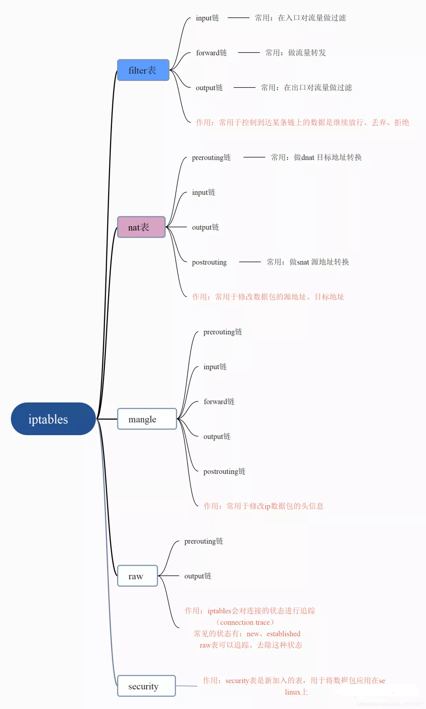
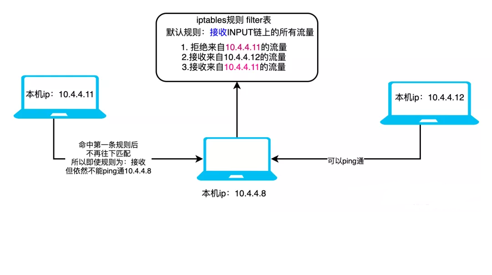
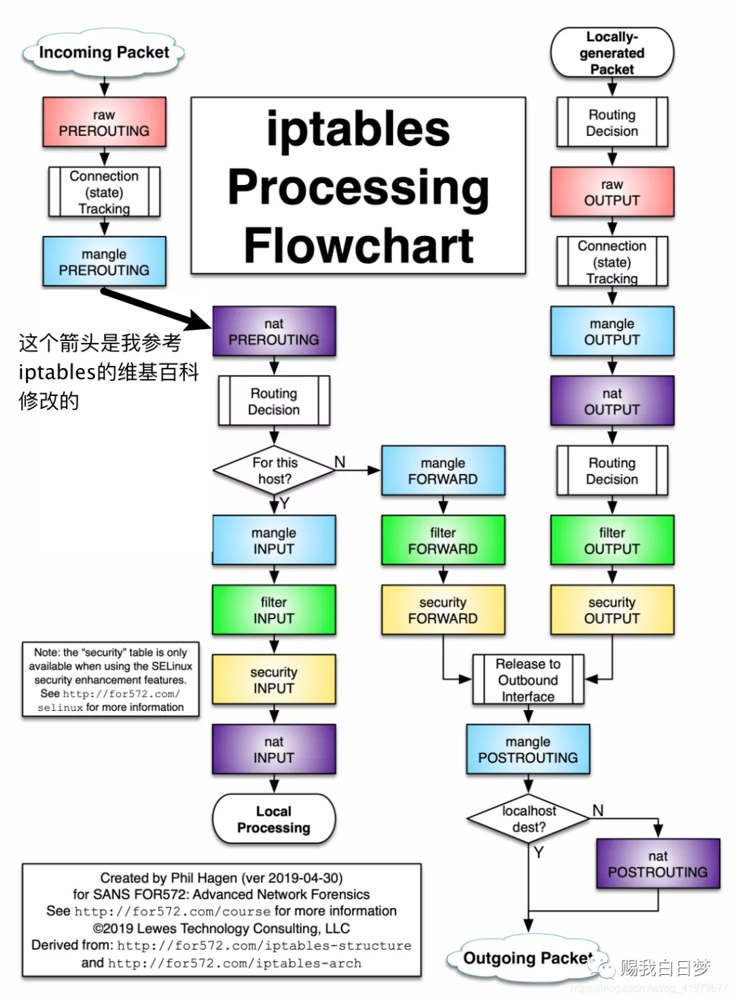
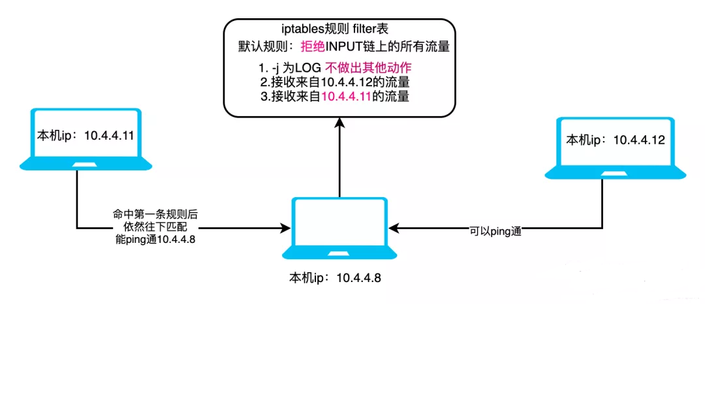
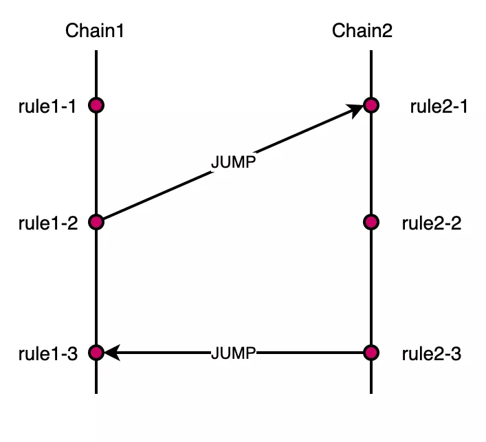
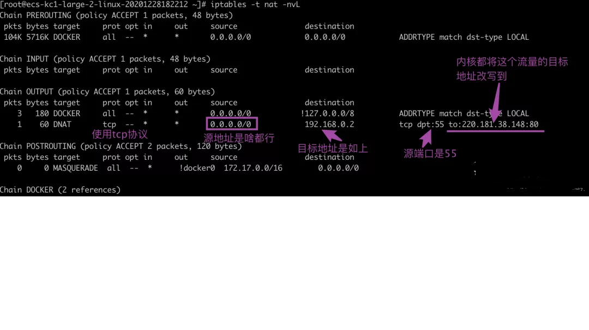

# 3. Iptables与防火墙
[[toc]]

Linux的网络控制模块在内核中，叫做`netfilter`。而`iptables`是位于用户空间的一个**命令行工具**;

`iptables`它作用在OIS7层网络模型中的第四层，**用来和内核的netfilter交互，配置netfilter进而实现对网络的控制、流量的转发**。

`Natfilter` 是集成到linux内核协议栈中的一套防火墙系统，用户可通过运行在用户空间的工具来把相关配置下发给Netfilter 。

`Netfilter` 提供了整个防火墙的框架，各个协议基于Netfilter 框架来自己实现自己的防火墙功能。每个协议都有自己独立的表来存储自己的配置信息，他们之间完全独立的进行配置和运行。
**毫不夸张的说，整个linux系统的网络安全就是基于netfilter构建起来的**。

如果你想搞懂docker或者是k8s的网络调度模型，或者是去你自己的机器上查看一下他们自动生成的转发规则，那么肯定要需要对iptables有一定的认知，不然学了半天docker或者是k8s真的是只会停留在使用的这个层面上。


## 3.1 iptables、防火墙之间有啥关系？
Iptables is an extremely flexible firewall utility built for Linux operating systems.

Whether you’re a novice Linux geek or a system administrator, there’s probably some way that iptables can be a great use to you. Read on as we show you how to configure the most versatile Linux firewall.

简单的说就是：**`iptables` 是一个简单、灵活、实用的命令行工具，可以用来配置、控制 linux 防火墙**。


## 3.2 iptables安装
- 安装、启动、查看、开启启动
```bash
 ~]# yum install -y iptables-services
 ~]# yum start|restart|reload|stop|status iptables
```

## 3.3 iptables的五表五链及流量走向

iptables中总共有4张表还有5条链，我们可以在链上加不同的规则。

五张表：filter表、nat表、mangle表、raw表、security表

五条链：prerouting、input、output、forward、postrouting

你可以通过`iptables -t ${表名} -nL`查看表上的链

```bash
[root@localhost named]# iptables -t filter -nL
Chain INPUT (policy ACCEPT)
target     prot opt source               destination         

Chain FORWARD (policy ACCEPT)
target     prot opt source               destination         

Chain OUTPUT (policy ACCEPT)
target     prot opt source               destination 
```

:::tip 规则表：
1. filter表——三个链：INPUT、FORWARD、OUTPUT
    - 作用：过滤数据包 内核模块：iptables_filter.
2. Nat表——三个链：PREROUTING、POSTROUTING、OUTPUT
    - 作用：用于网络地址转换（IP、端口） 内核模块：iptable_nat
3. Mangle表——五个链：PREROUTING、POSTROUTING、INPUT、OUTPUT、FORWARD
    - 作用：修改数据包的服务类型、TTL、并且可以配置路由实现QOS内核模块：iptable_mangle(别看这个表这么麻烦，咱们设置策略时几乎都不会用到它)
4. Raw表——两个链：OUTPUT、PREROUTING
    - 作用：决定数据包是否被状态跟踪机制处理 内核模块：iptable_raw
:::

> 规则表之间的优先顺序： **`Raw——mangle——nat——filter`**  

:::tip 规则链：

1. INPUT——`进来的数据包`应用此规则链中的策略
2. OUTPUT——`外出的数据包`应用此规则链中的策略
3. FORWARD——`转发数据包`时应用此规则链中的策略
4. PREROUTING——对数据包作路由选择前应用此链中的规则
   - 记住！所有的数据包进来的时侯都先由这个链处理
5. POSTROUTING——对数据包作路由选择后应用此链中的规则
   - 所有的数据包出来的时侯都先由这个链处理
:::

:::tip 规则链之间的优先顺序（分三种情况）：
第一种情况：入站数据流向  
   - 从外界到达防火墙的数据包，先被PREROUTING规则链处理（是否修改数据包地址等），之后会进行路由选择（判断该数据包应该发往何处），如果数据包 的目标主机是防火墙本机（比如说Internet用户访问防火墙主机中的web服务器的数据包），那么内核将其传给INPUT链进行处理（决定是否允许通 过等），通过以后再交给系统上层的应用程序（比如Apache服务器）进行响应。
第二冲情况：转发数据流向
   - 来自外界的数据包到达防火墙后，首先被PREROUTING规则链处理，之后会进行路由选择，如果数据包的目标地址是其它外部地址（比如局域网用户通过网 关访问QQ站点的数据包），则内核将其传递给FORWARD链进行处理（是否转发或拦截），然后再交给POSTROUTING规则链（是否修改数据包的地 址等）进行处理。
第三种情况：出站数据流向
   - 防火墙本机向外部地址发送的数据包（比如在防火墙主机中测试公网DNS服务器时），首先被OUTPUT规则链处理，之后进行路由选择，然后传递给POSTROUTING规则链（是否修改数据包的地址等）进行处理。
:::

**整理一下就得到了如下脑图：**

<a data-fancybox title="iptables的五表五链及流量走向" href="./images/iptables01.png"></a>


<!-- 先不着急使用`iptables命令`，大家可以先参考下面这张图，看看如下几种流量的走向。

来自本机流量经过了iptables的哪些节点，最终又可以流到哪里去？


来自互联网其他主机的流量，经过了本机iptables的哪些节点，最终又可以流到哪里去？

第一张：是摘自iptables的wiki百科中的图，如下：

图片
我知道很多人都看不懂，没关系，大家只要关注图中的蓝色部分：流量大走向如下：

`raw prerouting -> conntrack -> mangle prerouting -> nat prerouting - >decision 路由选择 -> 可能是input，也可能是output`。

> 记住：在wiki百科中的流量走向图中，mangle.prerouting和nat.prerouting之间没有任何判断逻辑就好了。路由选择判断发生在nat.prerouting之后。

**第二张：**摘自github上写的一篇文章：理解 kube-proxy 中 iptables 规则

这张图是一张更为精确的流量走向图，并且他区分好了：incoming packet、locally gennerated packge 这种来源不同的流量大走向，原图如下：

图片
但是我感觉他这个图稍微有点问题：你可以看下图左上角部分，mange-prerouting和 nat-prerouting之间多了一个 localhost source的判断。但是在iptables维基百科中给出的图中，它俩之间并没有这个判断。

如果你仔细看下，这个localhost source的判断和后面的for this host其实是挺重复的。而这个for this host判断正好对应着第一张图中的 bridge decsion判断。

所以，我总是感觉图应该修改成下面这样，它不一定对，但是起码能自圆其说。对整体理解的影响也不大。

而且图改成这个样子，肯定是方便会我们理解这个过程，而且错也错不了哪里去。

图片
稍微解析一下上图：

1、红、蓝、绿、紫分别代表上一小节中提到的iptables的四张表。如果你开启着SELinux，还会多出一个security表

2、上图左上角写的：incoming packet，表示这是从互联网其他设备中来的流量。它大概的走向是：先经过各个表的prerouting阶段，再经由routing decision（可以理解成查路由表，做路由选择）决定这些流量是应该交由本机处理，还是该通过其他网口forword转发走。

3、再看上图中的左上部分，incoming packet在做routing decision之前会先经过nat preroutings阶段，我们可以在这个阶段做dnat （目标地址改写），简单来说就是：比如这个数据包原来的dst ip是百度的，按理说经过routing decision之后会进入forward转发阶段，但是在这里你可以把目标地址改写成自己，让数据流入input通路，在本机截获这个数据包。

4、上图右上角写的：locally generated packet，表示这是本机自己生成的流量。它会一路经过各个表的output链，然后流到output interface（网卡）上。你注意下，流量在被打包成outgoing packet之前，会有个localhost dest的判断，如果它判断流量不是发往本机的话，流量会经过nat表的postrouting阶段。一般会在这里做DNAT源地址改写。

1、至于什么是DNAT、SNAT后文都会讲

2、大家看上图以及解析的时候，还是应该有一个存疑态度的哈。

3、我的理解不一定就对，只不过是在现阶段勉强还能自圆其说。

小结：思考这样一个问题

图片

所以经过对上图的简单分析，如果咱想自定义对流量进行控制，那该怎么办？

这并不复杂。但是在这想该怎么办之前，我们得先搞清楚，通常情况下我们会对流量做那些控制？无非如下：

丢弃来自xxx的流量
丢弃去往xxx的流量
只接收来自xxx的流量
在刚流量流入时，将目标地址改写成其他地址
在流量即将流出前，将源地址改写成其他地址
将发往A的数据包，转发给B
等等等等，如果你足够敏感，你就能发现，上面这六条干预策略，filter、nat这两张表已经完全能满足我们的需求了，我们只需要在这两张表的不同链上加自己的规则就行，如下：

丢弃来自xxx的流量（filter表INPUT链）
丢弃去往xxx的流量（filter表OUTPUT链）
只接收来自xxx的流量（filter表INPUT链）
在刚流量流入时，将目标地址改写成其他地址（nat表prerouting链）
在流量即将流出前，将源地址改写成其他地址（nat表postrouting链）
将发往A的数据包，转发给B（filter表forward链）
数据包在iptables中的走向还可以简化成下面这张图

图片
参考：https://zjj2wry.github.io/network/iptables/

参考：《Kubernetes网络权威指南》

推荐阅读：我在百度告诉你，当你访问百度时都发生了什么 -->

## 3.4 iptables commands

```bash
iptables -t ${表名}  ${Commands} ${链名}  ${链中的规则号} ${匹配条件} ${目标动作}
```
`表名：4张表，filter、nat、mangle、raw`

**Commands**：尾部追加-A、检查-C、删除-D、头部插入-I、替换-R、查看全部-L、清空-F、新建chain-N、默认规则-P(默认为ACCEPT)

**链名**：5条链，`PREROUTING、INPUT、FORWOARD、OUTPUT、POSTROUTING`

**匹配条件**：`-p`协议、`-4 、-6、-s 源地址、-d 目标地址、-i 网络接口名`

**目标动作**：拒绝访问`-j REJECT`、允许通过`-j ACCEPT`、丢弃`-j DROP`、记录日志 `-j LOG`、源地址转换`-j snat`、目标地址转换`-j dnat`、还有`RETURN、QUEUE`

可以通过像如下查看使用帮助文档。主要可以分如下三个部分
```bash
 ~]# iptables --help
 Usage:    # 使用案例
 Commands: # 命令选项
 Options:  # 其他可选项
```

参考：https://wiki.centos.org/HowTos/Network/IPTables

这里面有一些针对linux操作系统iptables简单的教学

## 3.5 filter表
### 3.5.1 usage尝鲜 filter表及规则

```bash
# 清空防火墙
 ~]# iptables -F
 
# 查看 (policy ACCEPT) 表示默认规则是接收
 ~]# iptables -t filter -L
Chain INPUT (policy ACCEPT)
target     prot opt source               destination

Chain FORWARD (policy ACCEPT)
target     prot opt source               destination

Chain OUTPUT (policy ACCEPT)
target     prot opt source               destination

# 添加规则，丢弃|接受｜拒绝｜所有进来的数据包
~]# iptables -t filter -A INPUT -j DROP|ACCEPT|REJECT|LOG


[root@localhost ~]#  iptables -t filter -A INPUT -j ACCEPT
# 再查看（如果还想操作某个Chain中的具体某条规则，可以加--line-numbers参数）
[root@localhost ~]# iptables -t filter -L --line-numbers
Chain INPUT (policy ACCEPT)
num  target     prot opt source               destination         
1    ACCEPT     all  --  anywhere             anywhere            

Chain FORWARD (policy ACCEPT)
num  target     prot opt source               destination         

Chain OUTPUT (policy ACCEPT)
num  target     prot opt source               destination  

# 修改默认规则
[root@ecs-kc1-large-2-linux-20201228182212 ~]# iptables -t filter -P INPUT DROP
[root@ecs-kc1-large-2-linux-20201228182212 ~]# iptables -t filter -L
Chain INPUT (policy DROP)
target     prot opt source               destination
ACCEPT     all  --  anywhere             anywhere
REJECT     all  --  anywhere             anywhere             reject-with icmp-port-unreachable

Chain FORWARD (policy ACCEPT)
target     prot opt source               destination

Chain OUTPUT (policy ACCEPT)
target     prot opt source               destination
# 删除策略 DROP类型策略
[root@localhost ~]# iptables -t filter -D INPUT  -j DROP

```

### 3.5.2 案例：filter的流量过滤
比如我想将发送百度的数据包丢弃，就可以在OUTPUT Chain上添加如下的规则

```bash
[root@localhost ~]# telnet 49.232.21.151 8899
Trying 49.232.21.151...
Connected to 49.232.21.151.
Escape character is '^]'.

[root@localhost ~]# iptables -t filter -A OUTPUT -p tcp -d 49.232.21.151 -j DROP
[root@localhost ~]# iptables -t filter -L
Chain INPUT (policy DROP)
target     prot opt source               destination         
ACCEPT     all  --  anywhere             anywhere            

Chain FORWARD (policy ACCEPT)
target     prot opt source               destination  

# 任何发送目的地是49.232.21.151，都会被drop掉
Chain OUTPUT (policy ACCEPT)
target     prot opt source               destination         
DROP       tcp  --  anywhere             49.232.21.151 


# 测试一下，结果夯住
[root@localhost ~]# telnet 49.232.21.151 8899
Trying 49.232.21.151...

```

- 删除过滤规则，语法:`iptables -t 表名 -D 链名 规则序号`
```bash
[root@localhost ~]# iptables -t filter -D OUTPUT 1
[root@localhost ~]# iptables -L --line-number
Chain INPUT (policy DROP)
num  target     prot opt source               destination         
1    ACCEPT     all  --  anywhere             anywhere            

Chain FORWARD (policy ACCEPT)
num  target     prot opt source               destination         

Chain OUTPUT (policy ACCEPT)
num  target     prot opt source               destination
```


- 在指定表的指定链中的指定的位置插入规则
```bash
# -I 默认是在头部插入，也可以指定插入的位置
[root@ecs-kc1-large-2-linux-20201228182212 ~]# iptables -t filter -I INPUT 2 -j REJECT
[root@ecs-kc1-large-2-linux-20201228182212 ~]# iptables -L --line-numbers
Chain INPUT (policy ACCEPT)
num  target     prot opt source               destination
1    ACCEPT     all  --  anywhere             anywhere
2    REJECT     all  --  anywhere             anywhere             reject-with icmp-port-unreachable

Chain FORWARD (policy ACCEPT)
num  target     prot opt source               destination

Chain OUTPUT (policy ACCEPT)
num  target     prot opt source               destination
```

## 3.6 iptables的匹配规则

什么是匹配规则？

这个东西并不难理解，他其实就是一种描述。比如说：我想丢弃来自A的流量，
体现在iptables语法上就是：`iptables -t filter -A INPUT -s ${A的地址} -j DROP` ，这段话中的来自A其实就是匹配规则。

:::tip 常见的规则如下：

**源地址**：`-s 192.168.1.0/24`

**目标地址**：`-d 192.168.1.11`

**协议**：`-p tcp|udp|icmp`

**从哪个网卡进来**：`-i eth0|lo`

**从哪个网卡出去**：`-o eth0|lo`

**目标端口（必须制定协议）**：`-p tcp|udp --dport 8080`

**源端口（必须制定协议）**：`-p tcp|udp --sport 8080`
:::


## 3.7 补充两个小实验，加深对流量走向的理解

### 3.7.1 实验一：加深对匹配规则的了解

通过这个实验搞清楚：当数据包命中了该链上的某一个规则后，还会继续往下匹配该链上的其他规则吗？

<a data-fancybox title="iptables的五表五链及流量走向" href="./images/iptables02.png"></a>

我们在`10.4.4.8`的fitler表、INPUT链上添加如下规则

```bash
iptables -t filter -A INPUT -s 10.4.4.11 -j DROP
iptables -t filter -A INPUT -s 10.4.4.12 -j ACCEPT
iptables -t filter -A INPUT -s 10.4.4.11 -j ACCEPT
```
问：ip为10.4.4.12的机器能ping通10.4.4.8吗？

答：肯定能

问：ip为10.4.4.11的机器能ping通10.4.4.8吗？

答：不能

--------------------

流量的走向如下图，它会挨个经过各表的input链，其中当然也包含我们加了DROP规则的filter表的INPUT链。
<a data-fancybox title="iptables的五表五链及流量走向" href="./images/iptables03.png"></a>

而你仔细看上面的规则，第一条是DROP、第三条是ACCEPT。再结合最终实验的结果是ping不通，**所以不难猜出流量确实会依次经过链上的规则，但是当有命中的规则后，会去执行该规则-j参数指定的动作。不再往下匹配本链上的其他规则**。


### 3.7.2 实验二：特殊的-j LOG
实验二思路如下图：

<a data-fancybox title="iptables的五表五链及流量走向" href="./images/iptables04.png"></a>

- 我们在10.4.4.8上添加如下规则
```bash
# 清空现有的规则
iptables -t filter -F
# 修改默认规则，默认DROP所有流量
iptables -t filter -P INPUT DROP
# 再添加如下两条规则
iptables -t filter -A INPUT -s 10.4.4.11 -j LOG
iptables -t filter -A INPUT -s 10.4.4.11  -j ACCEPT
```

问：从10.4.4.12ping10.4.4.8能通吗？

答：不能，因为10.4.4.8的filter表的INPUT链的默认规则是DROP，意思是如果没有命令filter表INPUT链中的其他规则，那么就会DROP这个数据包。所以很显然，10.4.4.12的数据包会被drop

问：从10.4.4.11ping10.4.4.8能通吗？

答：可以。

大概的逻辑我用下面的伪代码通俗表达出来
```c
// 遍历filter.input链上的所有规则
for _,pattern := range filter.INPUT.patterns{
  
  if pattern.动作 == `-j LOG`  {
    // 将日志记录进 /var/log/message
    continue
  }
  
  if pattern {
    // 执行该规则定义的动作
    break;
  }
  
}
```

### 3.7.3 实验总结
iptables中每条链下面的规则处理顺序是从上到下逐条遍历的，除非碰到了`DROP、REJECT、RETURN`。

还有就是如果定义的行为是JUMP，那就会相应的jump到指定链上的指定规则上，如下：
<a data-fancybox title="iptables的五表五链及流量走向" href="./images/iptables05.png"></a>

## 3.8 iptables中的模块
- 多端口
Case: 可以在命令中像下面这样指定多个连续的端口

```bash
iptables -t ${表名} ${commands} ${chain} ${规则号} --dport 20:30 -j ${动作}
# 其中的20:30表示20和30之间的所有端口
```

- 想指定多个不连续的端口可以使用iptables的multiport
```bash
# 查看帮助文档
~]# iptables -m multiport --help
...
multiport match options:
[!] --source-ports port[,port:port,port...]
 --sports ...
    match source port(s)
[!] --destination-ports port[,port:port,port...]
 --dports ...
    match destination port(s)
[!] --ports port[,port:port,port]
    match both source and destination port(s)

#命令例子
iptables -t ${表名} ${commands} ${chain} ${规则号}  
     ${-p 协议} -m multiport --dports 20,30 -j ${动作}


#相当于如下两行命令
iptables -t ${表名} ${commands} ${chain}  ${规则号} -p ${协议} --dprot 20 -j ${动作}
iptables -t ${表名} ${commands} ${chain}  ${规则号} -p ${协议} --dprot 30 -j ${动作}
```

- ip范围

查看帮助文档
```bash
~]# iptables -m iprange --help
iprange match options:
[!] --src-range ip[-ip]    Match source IP in the specified range
[!] --dst-range ip[-ip]    Match destination IP in the specified range

# 案例：
# 拒绝指定范围内的ip访问自己80端口
iptables -t filter -A INPUT 
     -m -iprange --src-range 10.10.10.2-10.10.10.5
     -p tcp --dport 80
         -j DROP
```
- 连接状态

```bash
查看帮助文档：

~]# iptables -m state --help
state match options:
 [!] --state [INVALID|ESTABLISHED|NEW|RELATED|UNTRACKED][,...]
```

1. INVALID：无效连接

2. NEW：首次访问和服务端建立的连接，之后和服务端的交互时连接的state不再是NEW

3. ESTABLISHED：连接完成，和服务端建立连接之后的所有交互，包括访问服务端、服务器的响应。

4. RELATED：相关联的连接，如ftp使用20、21建立连接，再使用其他端口交互数据时的这个连接就是和第一次建立连接时的相关的连接。state也就是RELATED。

> 想让防火墙识别出连接的状态为RELATED，需要让iptable加载插件vi /etc/sysconfig/iptables-config，然后修改：IPTABLES_MODULES="nf_conntrack_ftp"，再重启防火墙即可。

案例：
```bash
# 放行所有状态为ESTABLISHD的数据包
iptables -f filter -A OUTPT
     -m state --state ESTABLISHED
     -j ACCEPT
```
## 3.9 nat表
作用：用于网络地址转换（IP、端口） 内核模块：iptable_nat

查看NAT表，可以找到它有4条链，如下
```bash
 ~]# iptables -t nat -L
Chain PREROUTING (policy ACCEPT)
target     prot opt source               destination

Chain INPUT (policy ACCEPT)
target     prot opt source               destination

Chain OUTPUT (policy ACCEPT)
target     prot opt source               destination

Chain POSTROUTING (policy ACCEPT)
target     prot opt source               destination
```

通常我们会通过给nat表中的PREROUTING、POSTROUTING这两条链添加规则来实现SNAT、DNAT如下:

`-j SNAT` ，源地址转换说的时在数据包发送出去前，我们将数据包的src ip修改成期望的值。所以这个规则需要添加在POSTROUTING中。

`-j DNAT`，目标地址转换？比如发送者发过来的数据包的dst ip = A，那目标地址转换就是允许我们修改dst ip=B，也就是将数据包发送给B处理，这个过程对发送者来说是感知不到的，他会坚定的认为自己的数据包会发往A，而且B也感知不到这个过程，它甚至会认为这个数据包从一开始就是发给他的。

`-j MASQUERADE`，地址伪装

### 3.9.1 案例：使用nat表完成SNAT

- 案例：将src ip = 10.10.10.10转换成src ip = 22.22.22.22然后将数据包发给期望的目的ip所在的机器

```bash
iptables -t nat -A POSTROUTING -s 10.10.10.10 -j SNAT --to 22.22.22.1

# 如果公网地址不停的变化，可以像下面这样设置：
# step1:使用MASQUERADE做地址伪装，意思是我们不用手动指定将src ip转成哪个ip
# step2:让本机自己去查有没有去往dst ip的通路，如果有的话，就用这个通路的ip作为src ip
# step3:另一边数据包的接收者来说，src ip就是step2中自动找到的通路网口的ip地址
iptables -t nat -A POSTROUTING -s 10.10.10.10 -j MASQUERADE
```

**总结**：源地址转换一般是数据包从私网流向公网时做的转换，将私网地址转换成公网地址，会将这个转换记录记录到地址转换表中，目的是为了数据包从公网回来时，能正确的回到私网中发送请求的机器中。

**LAN接口 WAN接口 使用的技术**

### 3.9.2 案例：通过nat表完成DNAT

DNAT全称：`Destnation Network Address Tranlater目标地址改写`。

当我 telnet 192.168.0.2 55时，我期望tables规则将我的目标地址改写成20.181.38.148:80

先尝试telnet 192.168.0.2 55，发现没有任何route去该host

```bash
~]# telnet 192.168.0.2 55
Trying 192.168.0.2...
telnet: connect to address 192.168.0.2: No route to host
```

好，再使用iptable添加DNAT规则，命令如下：
```bash
~] iptables -t nat -A OUTPUT -p tcp -d 192.168.0.2 --dport 55 -j DNAT --to-destination 220.181.38.148:80
 
 # 参数解析
 # -A 表示append，追加iptable规则
 # OUTPUT 是内核的回调钩子，流量被转发出去前会经过这个阶段，DNAT的规则就加在这个阶段。
 # -p protocol 协议
 # -d destnation 目标地址
 # --dport 目标口
 # -j jump 跳转（跳转到目标规则）
 # --to-destination 目标地址
 
 # 命令含义：
 当OUTPUT Chain上的数据包使用的协议是tcp、目标地址是192.168.0.2、目标端口是55时，
 我跳转到DNAT模式，将目标地址改成：220.181.38.148:80
```
- 再尝试telnet 192.168.0.2 55，会发现链路通了！
```bash
~]# telnet 192.168.0.2 55
Trying 192.168.0.2...
Connected to 192.168.0.2.
Escape character is '^]'.
Connection closed by foreign host.
```

再查看iptable规则，如下：

> 可以看到有很多的Chain比如上面的OUTPUT就是一条链，它是操作系统的一个hook，当请求被发送出去时会经过这个hook。

> 还有就是通过iptable的DNAT能力可以做tizi！你仔细琢磨一下，原理就在上面的图中哦～

补充典型应用场景：公司有自己建设的机房，机房中机器的ip都在：10.10.10.0/24网段，机房对外提供服务就需要通过网络设备暴露公网一个ip，比如是：22.22.22.1:80

当网络设备收到dst ip = 22.22.22.1:80的数据包时，就会做DNAT转换，将dst ip转换成内网中的某台服务器的ip，比如就是:dtp ip = 10.10.10.10，然后将数据包转发给这台机器让它处理数据包。

## 3.10 相关配置文件
iptables的配置文件在/etc/sysconfig目录如下：
```bash
-rw-------  1 root root  635 10月  2 2020 ip6tables
-rw-------  1 root root 2134 10月  2 2020 ip6tables-config
-rw-------  1 root root  550 10月  2 2020 iptables
-rw-------  1 root root 2116 10月  2 2020 iptables-config
```

iptables启动时会加载这个配置文件中定义好的各表、链中的规则

<a data-fancybox title="iptables的五表五链及流量走向" href="./images/iptables06.png"></a>

一般我们会先使用iptables修改各种规则，如果想让iptables启动、重启时，继续使用你刚才修改的配置，我们就会考虑使用iptables-save命令将规则导出为配置文件。
```bash
# 导出某张表的iptables规则
[root@bairimeng ~]# iptables-save -t filter > 1.bak
# 导出全力量iptables规则
[root@bairimeng ~]# iptables-save > 2.bak
```
再将文件中的内容拷贝进/etc/sysconfig/iptables中即可


## 最后总结 Iptables

`iptables`它作用在OIS7层网络模型中的第四层，**用来和内核的netfilter交互，配置netfilter进而实现对网络的控制、流量的转发**。

`Natfilter` 是集成到linux内核协议栈中的一套防火墙系统，用户可通过运行在用户空间的工具来把相关配置下发给Netfilter 


十三、参考资料
1、https://zjj2wry.github.io/network/iptables/

2、维基百科：https://en.wikipedia.org/wiki/Iptables

3、man page https://linux.die.net/man/8/iptables

4、centos iptables wiki：https://wiki.centos.org/HowTos/Network/IPTables

5、ibm：https://www.ibm.com/docs/en/linux-on-systems?topic=tests-firewall-iptables-rules

6、参考：《Kubernetes网络权威指南》