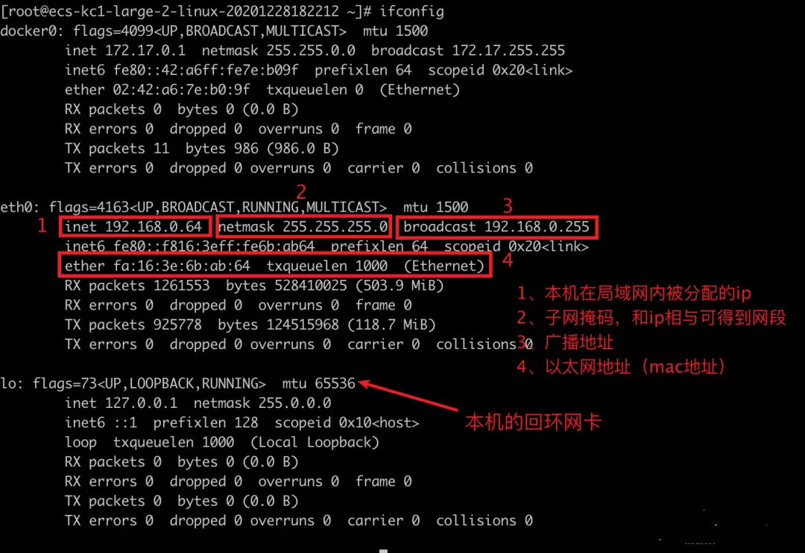

# 1. 一次网络请求都发生了什么
[[toc]]

- 当你请求www.baidu.com时都发生了什么？
    - 以及数据包经历了怎样的过程才被转发到百度的IDC机房的?
    - 以及你的电脑又是如何接收到百度的返回的数据包的?

这篇文章会串讲：IPv4、MAC、DNS、交换机、ARP、路由器、路由表、NAT、NAPT、私网、公网、OSI7层网络模型、以及不同机器互联互通原理等计算机网络知识点。


## 1.1 同一个局域网中不同主机的互联
先看个简单的，同一个局域网中的不同主机A、B之间是如何互联交换数据的。如下图：

<a data-fancybox title="同一个局域网中不同主机的互联" href="./images/network01.png"></a>

那既然是同一个局域网中，说明A、B的ip地址在同一个网段，如上图就假设它们都在192.168.1.0网段。

还得再看下面这张OSI 7层网络模型图。
<a data-fancybox title="同一个局域网中不同主机的互联" href="./images/network02.png"></a>
<a data-fancybox title="同一个局域网中不同主机的互联" href="./images/network03.png"></a>

主机A向主机B发送数据，对主机A来说数据会从最上层的应用层一路往下层传递。比如应用层使用的http协议、传输层使用的TCP协议，那数据在往下层传递的过程中，会根据该层的协议添加上不同的协议头等信息。

根据OSI7层网络模型的设定，对于接受数据的主机B来说，它会接收到很多数据包！这些数据包会从最下层的物理层依次往上层传递，依次根据每一层的网络协议进行拆包。一直到应用层取出主机A发送给他的数据。

- 那么问题来了，主机B怎么判断它收到的数据包是否是发送给自己的呢？万一有人发错了呢？

答案是：**根据MAC地址**，逻辑如下

```c
if 收到的数据包.MAC地址 == 自己的MAC地址{
  // 接收数据
  // 处理数据包
}else{
 // 丢弃
}
```

那对于主机A来说，它想发送给主机B数据包，还不能让主机B把这个数据包扔掉，它只能中规中矩的按以太网网络协议要求封装将要发送出去的数据包，往下传递到数据链路层（这一层传输的数据要求，必须要有目标mac地址，因为数据链路层是基于mac地址做数据传输的）。

- 那数据包中都需要哪些字段呢？如下：

```c
src ip = 192.168.1.2  //源ip地址，交换机
dst ip = 192.168.1.3  //目标ip地址
//本机的mac地址（保证从主机B回来的包正常送达主机A，且主机A能正常处理它）
src mac = 主机A的mac地址
dst mac = 主机B的mac地址//目标mac地址
```

其中的 `dst ip`好说，我们可以直接固定写，或者通过DNS解析域名得到目标ip。

那 `dst mac`怎么获取呢？

这就不得不说 `ARP` 协议了! ARP其实是一种地址解析协议，它的作用就是：**以目标ip为线索，找到目的ip所在机器的mac地址**。也就是帮我们找到dst mac地址！

大概的过程如下几个step：
<a data-fancybox title="同一个局域网中不同主机的互联" href="./images/network04.png"></a>


:::tip 简述这个过程：
- 主机A想给主机B发包，那需要知道主机B的mac地址

- 主机A查询本地的**arp高速缓存中是否已经存在dst ip和dst mac地址的映射关系**了，如果已存在，那就直接用。

- 本地arp高速缓存中不存在dst ip和dst mac地址的映射关系的话那就只能广播arp请求包，同一网段的所有机器都能收到arp请求包。

- 收到arp请求包的机器会对比arp包中的`dst ip`是否是自己的ip，如果不是则直接丢弃该arp包。如果是的话就将自己的mac地址写到arp响应包中。并且它会把请求包中src ip和src mac的映射关系存储在自己的本地。
:::

**`总结：ARP是可以根据ip地址找到对方的Mac地址`**

> **`补充：`**  
> - 交换机本身也有学习能力，他会记录mac地址和交换机端口的映射关系。比如：mac=a，端口为1。
> - 那当它接收到数据包，并发现mac=a时，它会直接将数据扔向端口1。


- 再看下linux操作系统中的arp命令：
```bash
# 显示所有接口的当前 ARP 缓存表
~]# arp -a
gateway (192.168.0.1) at fa:16:3e:66:c8:15 [ether] on eth0
? (192.168.0.254) at fa:fa:fa:fa:fa:01 [ether] on eth0

# 可以看到网关ip地址：192.168.0.1，mac地址是：fa:16:3e:66:c8:15 网卡是eth0
# 广播地址：192.168.0.254，mac地址是：fa:fa:fa:fa:fa:01 网卡是eth0
```

在arp协议的帮助下，主机A顺利拿到了主机B的mac地址。于是数据包从网络层流转到数据链路层时已经被封装成了下面的样子：
```arp
src ip = 192.168.1.2
src mac = 主机A的mac地址
dst ip = 192.168.1.3
dst mac = 主机B的mac地址
```
> 网络层基于ip地址做数据做转发
> 数据链路基于mac地址做数据转发

根据OIS7层网络模型，我们都知道数据包经过物理层发送到机器B，机器B接收到数据包后，再将数据包向上流转，拆包。流转到主机B的数据链路层。

那主机B是如何判断这个在数据链路层的包是否是发给自己的呢？答案前面说了，根据目的mac地址判断。

```c
// 主机B
if 收到的数据包.MAC地址 == 自己的MAC地址{
  if dst ip == 本机ip{
    // 本地处理数据包
  }else{
    // 查询路由表，根据路由表的规则，将数据包转某个某卡、或者默认网关
  }
}else{
 // 直接丢弃
}
```

这个例子比较简单，dst ip就是主机B的本机ip 所以它自己会处理这个数据包。

那数据包处理完之后是需要给主机A一个响应包，那问题又来了，响应包该封装成什么样子呢？对主机B来说响应包也需要src ip、src mac、dst ip、dst mac

```c
src ip = 192.168.1.3
src mac = 主机B的mac地址
dst ip = 192.168.1.2
src mac = 主机A的mac地址 （之前通过arp记录在自己的arp高速缓存中了，所以，这次直接用）
```

同样的道理，响应包也会按照如下的逻辑被主机A接受，处理。
```c
// 主机A
if 收到的数据包.MAC地址 == 自己的MAC地址{
  if dst ip == 本机ip{
    // 本地处理数据包
  }else{
    // 查询路由表，根据路由表的规则，将数据包转某个某卡、或者默认网关
  }
}else{
 // 直接丢弃
}
```

然后再补充一点，我们可以通过下面的命令查看路由转发是否开启：
```bash
 ~]# cat /proc/sys/net/ipv4/ip_forward
1
```

同一个局域网中的不同主机的通信方式大概就是这样子。下面我们再来看一下跨网段的不同主机的互联原理。

# 1.2 跨网段请求百度的服务器

那不同网段的主机之间是如何互联的呢？

当你访问：www.baidu.com 时，都发生了什么？你的请求是如何打到百度的服务器机房里面去的？

我们先尝试ping一下百度，如下，可以看到百度服务对外暴露的ip地址是`220.181.38.251`
```bash
[root@TXYUN-NO1 ~]# ping baidu.com
PING baidu.com (220.181.38.251) 56(84) bytes of data.
64 bytes from 220.181.38.251 (220.181.38.251): icmp_seq=1 ttl=251 time=3.02 ms
64 bytes from 220.181.38.251 (220.181.38.251): icmp_seq=2 ttl=251 time=3.06 ms
64 bytes from 220.181.38.251 (220.181.38.251): icmp_seq=3 ttl=251 time=3.03 ms
64 bytes from 220.181.38.251 (220.181.38.251): icmp_seq=4 ttl=251 time=3.06 ms

--- baidu.com ping statistics ---
4 packets transmitted, 4 packets received, 0.0% packet loss
round-trip min/avg/max/stddev = 23.507/33.673/38.944/6.277 ms
```

那，再通过`ifconfig`命令看下我的本机ip地址是`192.168.0.64`

<a data-fancybox title="跨网段请求百度的服务器" href="./images/network05.png"></a>

像这种192.168.xx.xx这种局域网机器的ip通常使用dhcp动态分配

我们也可以设置手动设置静态ip

比如可以通过如下命令设置eth0网卡信息
```
vi /etc/sysconfig/network-scripts/ifcfg-eth0
```

- 另外我的机器还有运营商分配的公网ip地址：`121.36.30.75`


有了上面这些信息，于是我们就能画出下面这张图：
<a data-fancybox title="跨网段请求百度的服务器" href="./images/network06.png"></a>

然后我们再看一下当我们使用192.168.0.64访问百度时，数据包是如何被一层层转发到百度的IDC机房的，然后我电脑又是如何处理百度的回包的！


对我的机器来说，我想访问百度的服务器，也就是往百度的服务器发数据包的话，那我的电脑得先封装好数据包吧！
```c
// 那数据包里面起码要包含哪些信息呢？其实在上面的第一节中我们已经说过了，也就是src ip、src mac、dst ip、dst mac
src ip = 192.168.0.64
src mac = fa:16:3e:6b:ab:64 （本机mac地址）
dst ip = 220.181.38.251 (通过DNS服务解析www.baidu.com获取到)
dst mac = ???
```


那`dst mac`目的mac地址是多少呢？这是个问题！

因为我是`192.168.0.X`网段，百度的服务器在`220.181.38.X`网段，我们都不在一个网段中！我的机器没法直接获取到百度对外暴露的网关的mac地址。

那怎么我的机器怎么办呢？

答案是：我的机器会先查看一下自己的路由表，路由表会记录该将这个数据包转发到哪里去。具体可通过route -n命令可以查看到，如下：

```bash
[root@TXYUN-NO1 ~]# route -n
Kernel IP routing table
Destination     Gateway         Genmask         Flags Metric Ref    Use Iface
0.0.0.0         192.168.0.1      0.0.0.0         UG    0      0        0 eth0
169.254.0.0     0.0.0.0         255.255.0.0     U     1002   0        0 eth0
172.17.0.0      0.0.0.0         255.255.0.0     U     0      0        0 docker0
192.168.0.0      0.0.0.0         255.255.240.0   U     0      0        0 eth0

```

具体的做法就是，拿着dst ip `220.181.38.251`，分别和`路由表中的Genmask`**做与操作**，

ip地址 与 子网掩码可以得到该ip地址所在的网段，那得到了dst ip所在的网段之后呢，就拿着这个网段和路由表中的Destination对比，如果相同的话，就将数据包准发给他。

在我们这个例子中，很明显dst ip `220.181.38.251`跟后三条路由相与得到的结果和route表期望的Destination都不匹配。

但是dst ip 220.181.38.251跟第一条路由表中的记录相与，得到的结果肯定符合route预期的Destination，毕竟谁与0，结果都是0嘛。
（它的Flags为UG，表示它就是网关，也就是网络的出口）

找到了符合预期的路由后，我的机器就会先将数据包发送给网关，对应的网卡就是eth0 ，那这也就意味着我们找到了第一个跳目的ethernet地址。于是数据包被封装成下面这样

```c
src ip = 192.168.0.64
src mac = fa:16:3e:6b:ab:64 （本机mac地址）
dst ip = 220.181.38.251 (通过DNS服务解析www.baidu.com获取到)
dst mac = eth0网卡的mac地址。(ip地址是：192.168.0.1)
```
<a data-fancybox title="跨网段请求百度的服务器" href="./images/network07.png"></a>

- 同样的道理，当eth0网卡收到这个数据包后，路由器进行如下的判断。

```c
if 数据包.mac == 自己的mac{
 // mac地址相同，说明这是发送给自己的包，所以它不会丢弃。
 if 数据包.ip == 自己的ip{
  // 说明这就是发给他的数据包，但是它只是一个路由器，只有OSI7层网络中的前三层。所以他的将数据包发给其他设备 
 }else{
  // 继续查看自己的路由表，找到合适的下一跳地址（扔给网关）。
 }
}else{
 // 直接丢弃
}
```

- 经过上面伪代码的判断，eth0知道了这个包虽然是发给它的，但它并不能继续处理这个数据包，他需要将这个数据包准发给下一跳。

对它现在来说：

```c
src ip = 192.168.0.1 (上图LAN口的ip地址)
src mac = eth0的mac地址，
dst ip = 220.181.38.251
dst mac = ???
```

那`dst mac地址`怎么获取到呢？

其实和上面的流程类似，需要查询路由表。使用src ip和路由表中的子网掩码相与，得到网段后再与Desitantion对比。由于这个路由器上确实没有连接220.180.38.xxx的网段，所以数据包最终依然会被转发到这个路由器的公网网关。
<a data-fancybox title="跨网段请求百度的服务器" href="./images/network08.png"></a>

经过这一步，数据包流转到路由器的WAN口，再往下走就流入公网啦！

数据包在公网中各个路由节点之间跳转，最终会流转到百度对外暴露的网关路由器的公网WAN口。

然后数据包会从这个WAN口流入百度内网的IDC机房集群。
<a data-fancybox title="跨网段请求百度的服务器" href="./images/network09.png"></a>

你可能会问：那这次请求会打向百度IDC机房中的那台机器呢？

嗯，这就没法再展开了，百度肯定会有他自己的负载均衡机制。我们只需知道这个数据包最终肯定会流转到某一台具体的物理器、或者是某个容器内就好啦！

### 百度的响应包如何再打回到你的机器？

这就要讲到NAT技术了，看下面的这张图：

<a data-fancybox title="跨网段请求百度的服务器" href="./images/network10.png"></a>

数据包传输出去的过程中，虽然dst ip始终都是百度对外暴露公网网关的ip地址，但是src ip却一直不断的被改变。从一开始的`192.168.0.64 =>192.168.0.1 => 121.36.30.75`
```
---------------我的机器------------
=> src ip = 192.168.0.64 ....   
---------------我的机器------------

---------------路由器----------------
然后=> src ip = 192.168.0.1 .... （路由器的LAN口）
然后=> src ip = 121.36.30.75 ....（路由器的WAN口）
---------------路由器----------------
```

在数据包在被发送到公网之前会被路由器做一次SNAT处理，全称是：`source network address translator`源网络地址转换，它的目的就是将私网ip转换成路由器的公网ip。

当然了，路由器也都会记录下`SNAT`转换前和转换后的状态。**毕竟如果不出意外话，路由器总能接受到百度给他的回包**，但他是不能解析处理这个数据包的。（只有请求的发送者192.168.0.64这台机器的应用层才能正确解析出这个响应包）。所以路由器需要根据转发记录将这个包转发给我们起初发送请求的机器（也就是`192.168.0.64`）。

而这些记录会被路由器记录在它的`地址转换表`中。

如下：
<a data-fancybox title="跨网段请求百度的服务器" href="./images/network11.png"></a>

看上图中绿色的部分，在地址转换表中记录，数据包的原地址从`192.168.0.64:1234`被转成了`121.36.30.75:1234`。(这种带端口号的地址转换其实叫NAPT)

那我们继续往下看，假如我们的路由器收到百度的响应包长下面这样：

```c
src ip = 220.181.38.251 （百度公网网关路由器WAN口ip地址）
src mac = 百度公网网关路由器的mac地址
dst ip = 121.36.30.75:1234 （我们家里路由器的WAN口ip地址）
dst mac = 我们家里路由器的mac地址
```

同样的道理，我们家里路由器会有下面伪代码的判断逻辑。

```c
if 响应包.mac == 自己的mac{
 // 说明这是发给自己包，所以不能丢弃
  if 响应包.ip == 自己的ip{
    // 哎？ip也是自己的ip！
    // 但是它只是一个路由器，只有OSI7层网络模型的前三层
    // 所以路由器并不能真正的处理解析这个数据包,只能根据NAT表继续转发
    if 地址转换表.Contains(响应包.dstIp){
      // 通过查地址转换表发现：
      // dst ip = 121.36.30.75:1234 的流量，需要转给：192.168.0.64:1234
      // 转发...
    }  
  }else{
    // 查自己的route表，找下一跳
  }
}else{
 // 直接丢弃
}
```

这样的话，我们的发送请求的机器就接收到百度的响应包了，响应数据再一路往OIS7层网络模型的上层传递，最后到应用层根据http协议解析出响应报文，经过浏览器渲染html报文，于是下面的网页就展现在了我们面前！
