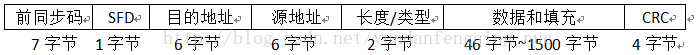
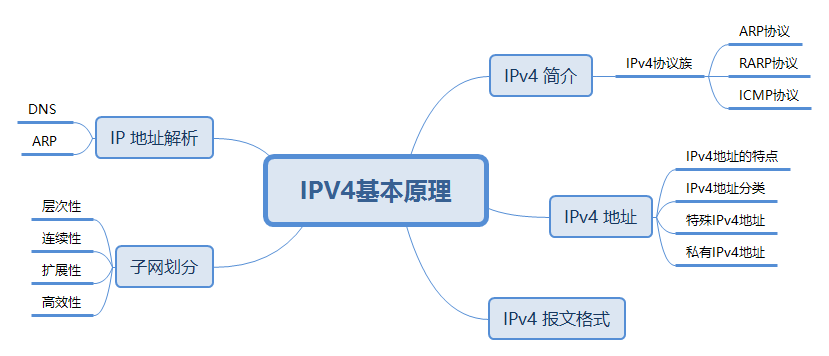
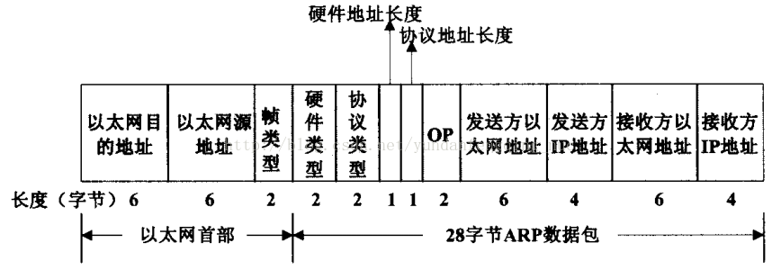
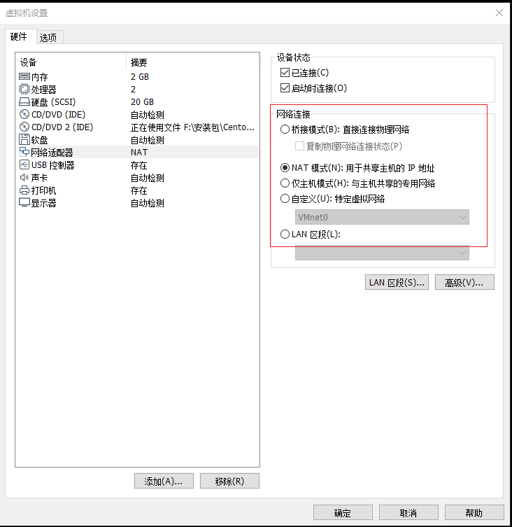
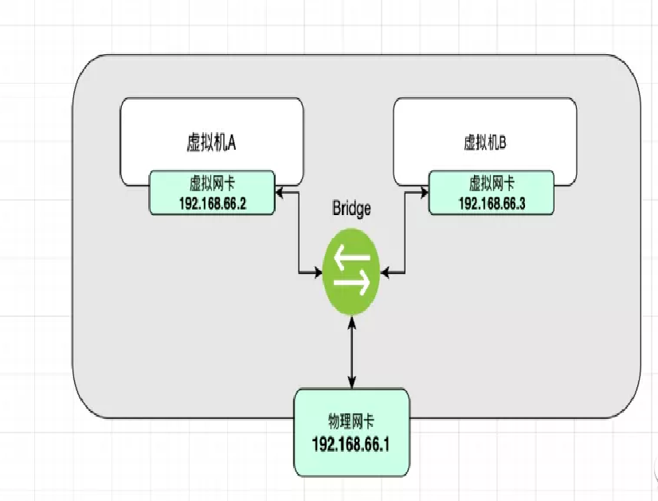
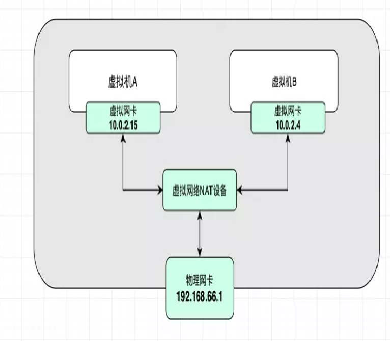
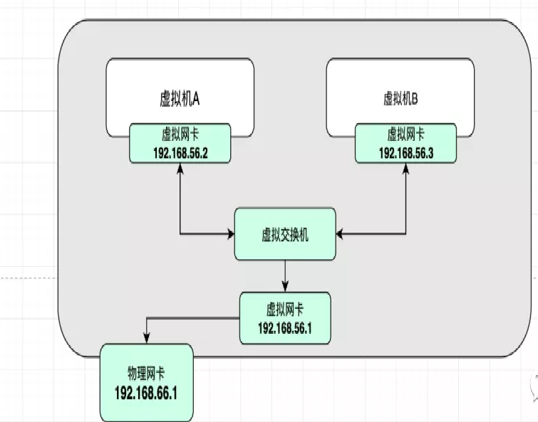

# 0. 网络基础知识

## 0.1 以太网
**以太网是目前最流行的一种局域网组网技术**（其他常见局域网组网技术还有令牌环局域网、无线局域网、ATM局域网），以太网技术的正式标准是IEEE 802.3标准，它规定了在以太网中传输的数据帧结构，如下图所示。
<a data-fancybox title="IPv4" href="./images/ipv4-02.png"></a>

 在以太网帧中，目的地址可以分为三类：**单播地址、多播地址和广播地址**。
 
 :::tip 
 - 单播地址通常与一个具体网卡的MAC地址相对应，它要求第一个字节的bit0（即最先发出去的位）必须是0；
 - 多播地址则要求第一个字节的bit0为1，这样，在网络中多播地址不会与任何网卡的MAC相同，多播数据可以被很多个网卡同时接收；
 - 广播地址的所有48位全为1（即FF-FF-FF-FF-FF-FF），**同一局域网中的所有网卡可以接收广播数据包**。
:::

## 0.2 IPv4 简介

IPv4 协议族是 TCP/IP 协议族中最为核心的协议族。

:::tip IPv4 协议族主要包括
- **地址解析协议 ARP**（Address Resolution Protocol）
- **逆地址解析协议 RARP**（Reverse Address Resolution Protocol）
- **互联网控制消息协议 ICMP**（Internet Control Message Protocol）
- **传输控制协议 TCP**（TransmissionContronl Protocol）
- **用户数据报协议 UDP**（User Datagram Protocol）等协议
:::

从图可以看出来， ARP 和 RARP 的功能是地址解析，介于数据链路层和网络层之间，所以常常被调用。

<a data-fancybox title="IPv4" href="./images/ipv4-01.png"></a>

ICMP 协议的功能是为了更有效地转发 IP 数据报文和提高数据报文交付成功的机会，是介于网络层和传输层之间的协议。


### 0.2.2 ARP协议

ARP 是用来将 IP 地址解析为 MAC 地址的协议，可以分为动态和静态两种类型。另外 ARP 还有扩展应用功能，包括 Proxy ARP 功能、免费 ARP、 ARP 安全以及 ARP-Ping。

<a data-fancybox title="IPv4" href="./images/ipv4-03.png"></a>


### 0.2.3 RARP协议

RARP 和 ARP 正好相反，是将主机的 MAC 地址解析为 IP 地址的协议。


### 0.2.4 ICMP协议
为了更有效地转发 IP 数据报文和提高数据报文交付成功的机会，在网络层使用 ICMP 协议。ICMP允许主机或路由器报告差错情况和提供有关异常情况的报告。ICMP 报文作为 IP 层数据报文的数据，加上数据报文的首部，组成 IP 数据报文发送出去。

### 0.2.5 DNS
在域名注册商那里注册了域名之后如何才能看到自己的网站内容，用一个专业术语就叫“域名解析”。

域名是为了方便记忆而专门建立的一套地址转换系统，要访问一台的服务器的互联网，最终还必须通过IP地址来实现，域名解析就是将域名重新转换为IP地址的过程。一个域名对应一个IP地址，一个IP地址可以对应多个域名；所以多个域名可以同时被解析到一个IP地址。域名解析需要由专门的域名解析服务器(DNS)来完成。


### 网络数据在WAN口和LAN口的传输过程

　　当家庭网络中的机器向外部网络发送数据包的时候，首先发送一个请求到默认网关，也就是发送到宽带路由器。路由器在分析该数据包中的内网IP地址时会检查设备本身的NAT地址转换表。在找到相应的条目后，就会利用WAN口IP地址去与外部网络进行通信。

　　外部网络接收到数据包后，会解析出数据包中的路由器的WAN口IP地址，并对该地址进行响应，将响应数据包发送到路由器。然后路由器再次进行NAT地址转换，将WAN口IP地址转换为发送请求的内网IP地址，最终完成整个数据包的发送和接收过程


## 0.3 ip地址

### 0.3.1 什么是ip地址
通常我们看到的ip地址会长这样（由点分割的十进制数）：192.168.1.1

其实ip地址是一个32位的二进制数，被分割成4部分，每部分8位。也就是说他们其实长成这样
```bash
11000000.10101000.00000001.00000001
```

每一部分都是8位的二进制数，那他能表示的范围其实就是0～255，并且在一个子网中，第一个0为保留位，最后一个255为广播位，这两位不会划分出去。（比如在局域网中找不到一个完全匹配的ip时，可能就会广播数据报文，广播的地址就会使用255）

所以说，一般情况下，局域网中可以使用的ip为1～254

> 0.0.0.0 回环地址
>
> 255.255.255.255 广播地址

## 0.4 划分子网
### 0.4.1 为什么要划分子网
划分子网是为了更好的利用ip地址资源，因为ip地址就是上面提到的4个byte字节组成的，一共就有2的32方个，**随着互联网的发展，ip地址已经不够用了**

现在的解决方案有两种，**一种是将ipv4升级成ipv6，第二种就是现在说的划分子网**，通过合理划分子网来缓解ip地址枯竭的问题。

### 0.4.2 子网分类
子网分类说的是人为的将子网分成A、B、C、D类，每个分类都有两部分组成：网络号+主机号

无论怎么划分，网络号和主机号一共32位是不会变的
```bash
A类：8位网络号  24位主机号
B类：16位网络号 16位主机号
C类：24位网络号 8位主机号
```

### 0.4.3 子网划分

**子网划分的应用场景：**

上面C类子网支持254台主机，B类子网支持6万多台主机。

那假设现在有一个公司，他们公司有几千名员工，如果为他们申请ip的话请问是该申请C类地址还是B类地址呢？

很显然，C类肯定不够用，B类又会浪费掉好几万个ip资源～

这时就得进行子网划分，拿这个例子来说就是我们给该公司申请一个B类地址，然后将B类地址中的部分主机位当作网络ID，这样的话，主机位数就变少了，**最新的网络号 = 网络号+从主机位划分出来的网络ID，原来的二级Ip 地址被划分成三级Ip地址，收益就是：实现节省ip地址**

**实战子网划分**

假设我们对192.168.1.0这个网络号进行子网划分。

然后我们从主机号借用两位当作网络号

```bash
# 如果不进行子网分，它是一个C类网络地址，可以承载254台机器
192.168.1.00000000

# 借两位主机位当作网络id来 划分子网，可以得到下面四个子网
192.168.1.00 000000
192.168.1.01 000000
192.168.1.10 000000
192.168.1.11 000000
```

网络号相同的ip视为在一个局域网中，这样就将原来的一个C类地址划分成四个网络地址，也就能给四个公司使用，而且每个网络中都能分配2的6次方个左右的ip地址。

<font color='blue'>一个设备有多个ip是正常的，甚至当有它有多个物理网卡，就能有多个公网ip，相应的每个设备也有私网ip，也就是他所在的局域网中的ip（一般是通过DHCP获取的）></font>

<font color='red'>想接入互联网就的有公网ip，全球有42亿的ipv4的公网ip，我们的硬件设备默认有一个自己的本地ip，比如192.168..., 当设备连通局域网后，设备的本地ip其实是这个公网ip下的局域网的ip地址之一，这样可以尽最大可能的利用有限的ip网络地址资源（而不用为每一台设备都分配一个独有的公网ip）</font>

### 0.4.4 子网掩码

在上一个例子中我们将这个网络号192.168.1.0，通过子网划分，分成了四个网络，如下

```bash
# 如果不进行子网分，它是一个C类网络地址，可以承载254台机器
192.168.1.00000000
# 借两位主机位当作网络id来 划分子网，可以得到下面四个子网
192.168.1.00 000000
192.168.1.01 000000
192.168.1.10 000000
192.168.1.11 000000
```

<font color='red'>问题是怎么让机器区分开这是四个网络地址，而不是一个C类地址呢？</font>

这就引出了子网掩码的概念:  **子网掩码和ip地址同为32位，子网掩码为1的区域对应着ip地址的网络号部分，子网掩码为0的区域对应着ip地址的主机号部分。**

就这个例子来说，它的子网掩码如下

```sh
# 192.168.1.0  ==转二进制==>   11000000.10101000.00000001.00000000
# 本来他是C类网络地址：它的网络号为前24位，后8位为主机号
# 然后我们划分子网，从主机位给网络位借两位，也就是前26位是网络号，后6位是主机号
# 对应的子网掩码位：前26位为1，后6位为0。即11111111.11111111.11111111.11000000
# 11111111.11111111.11111111.11000000 =转十进制=>255.255.255.192
```
如果通过ip和子网掩码得出网络ID呢？
```bash
# 两者的二进制表示做与运算
# 相同为1，不同为0
```
网络ID相同，说明这两个ip在同一个局域子网中

### 0.4.5 无分类-构成超网
这里说的无分类-构成超网**本质上也是一种ip地址的编址方式**，并且它消除了传统的ABCD这种划分子网的概念。

它的编制方式为：网络号/主机号

通常使用这种方式编址的ip长这个样子：192.68.1.1/20

在ipv4中，ip地址的总长度为32位这是不会变的，这里的20表示的是在这总长为32位的地址中，前20为网络号，剩下的12位是主机号

## 0.5 网络模式
常见的网络模式有：**桥接模式、NAT模式、仅主机模式**。比如在vmware中设置虚拟机的网络模式时，可以看到
<a data-fancybox title="网络模式" href="./images/network13.png"></a>

### 0.5.1 桥接

<font color='red'>桥接模式的本质是：使用一个虚拟的交换机，将虚拟机和物理机网卡打通。他们同属于一个网段</font>

<a data-fancybox title="网络模式" href="./images/network14.png"></a>

:::tip 在这种模式下有如下特性：

- 虚拟机和物理机同属一个网段
- 虚拟机之间可以相同Ping通
- 虚拟机和物理机之间可以相互ping通
- 只要主机能上网，虚拟机就能上网
:::

### 0.5.2 NAT

<font color='red'>NAT是一种网络地址转换技术，实现了局域网内的使用自己的本地IP即可联通互联网（NAT会将本地Ip，转换成全球IP）</font>

常见的你家里的wifi，家里按了网线之后会有一个公网ip，但是家里的任何智能设备通过路由器连接上wifi后都能同时上网，因为路由器会分配给设备一个局域网ip，设备使用这个局域网ip上网，其中的转换技术就是NAT技术

<a data-fancybox title="网络模式" href="./images/network15.png"></a>


:::tip 有如下特性：
- 主机能上网，虚拟机就能上网
- 虚拟机直接可以互通
:::

### 0.5.3 Host
Host，仅主机，即它是存在于主机内部的一个虚拟网络。

<a data-fancybox title="网络模式" href="./images/network16.png"></a>

这仅主机模式下，有一块虚拟网卡，这块网卡的网段和主机上物理网卡的网段是不相同的。

所有的虚拟机在虚拟网卡的网段下，所以他们彼此直接互通。

默认情况下，虚拟机可以访问到物理机，但是默认情况下虚拟机不能上网的。（也可以通过修改配置让他们上互联网）

### 0.5.4 内部网络
在内部网络下，虚拟机和外部完全隔断，只允许虚拟机之间才能相互访问