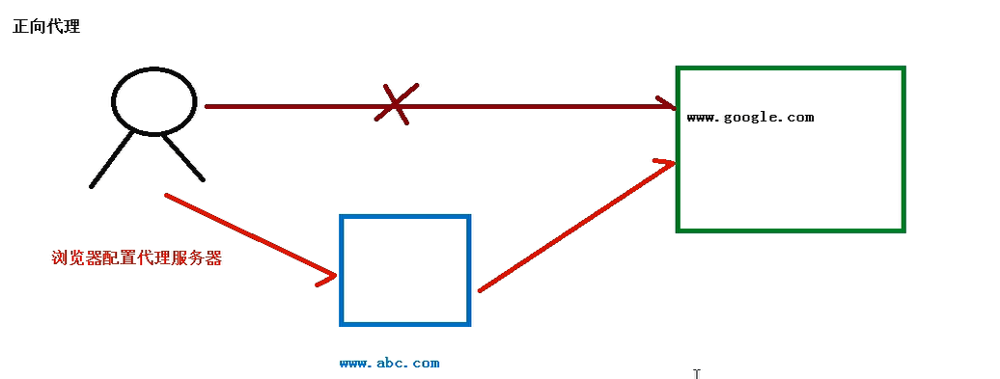
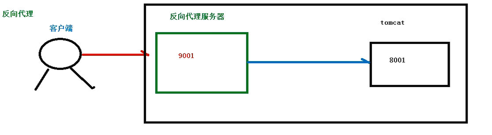
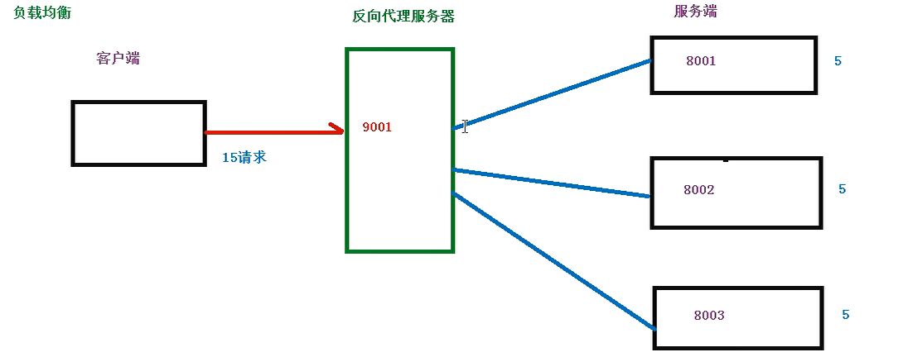
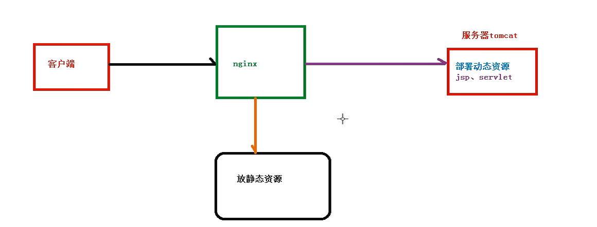
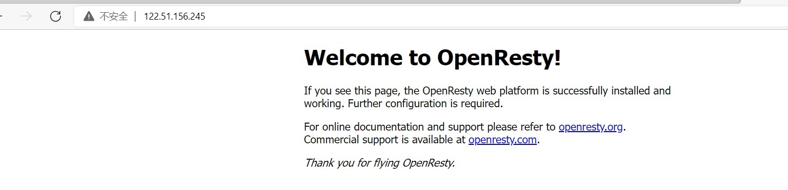

# 1. Nginx简介

## 1.1 Nginx概述
Nginx官网  https://www.nginx.com/

Nginx 是一款高性能的HTTP服务器和反**向代理服务器**，同时支持**IMAP/POP3/SMTP**代理服务

### 1.1.1 什么是Nginx

Nginx 是一款高性能的 http 服务器/反向代理服务器及电子邮件（IMAP/POP3）代理服务器。由俄罗斯的程序设计师伊戈尔·西索夫（Igor Sysoev）所开发，官方测试 nginx 能够支支撑 5 万并发链接， 并且 cpu、内存等资源消耗却非常低，运行非常稳定。 由C语言编写 

## 1.2 Nginx应用场景

:::tip Nginx应用场景

1. **http服务器**,Nginx 是一个 http 服务可以独立提供 http 服务。可以做**网页静态服务器**。

2. **虚拟主机**,可以实现在一台服务器虚拟出多个网站。例如个人网站使用的虚拟主机。

3. **反向代理，负载均衡**,当网站的访问量达到一定程度后，单台服务器不能满足用户的请求时，需要用多台服务器集群可以使用 nginx 做反向代理。并且多台服务器可以平均分担负载，不会因为某台服务器负载高宕机而某台服务器闲置的情况。  
:::

### 1.2.1 正向代理

　　弄清楚什么是代理了，那么什么又是正向代理呢？

　　这里我再举一个例子：大家都知道，现在国内是访问不了 Google的，那么怎么才能访问 Google呢？我们又想，美国人不是能访问 Google吗（这不废话，Google就是美国的），如果我们电脑的对外公网 IP 地址能变成美国的 IP 地址，那不就可以访问 Google了。你很聪明，VPN 就是这样产生的。我们在访问 Google 时，先连上 VPN 服务器将我们的 IP 地址变成美国的 IP 地址，然后就可以顺利的访问了。

　　这里的 VPN 就是做正向代理的。正向代理服务器位于客户端和服务器之间，为了向服务器获取数据，客户端要向代理服务器发送一个请求，并指定目标服务器，代理服务器将目标服务器返回的数据转交给客户端。这里客户端是要进行一些正向代理的设置的。



### 1.2.2 反向代理

反向代理，其实客户端对代理是无感知的，因为客户端不需要任何配置就可以访问，我们只需要将请求发送到反向代理服务器，由反向代理服务器去选择目标服务器获取数据后，在返回给客户端，此时反向代理服务器和目标服务器对外就是一个服务器，暴露的是代理服务器地址，隐藏了真实服务器IP地址。

　　反向代理和正向代理的区别就是：**正向代理代理客户端，反向代理代理服务器。**

　　反向代理，其实客户端对代理是无感知的，因为客户端不需要任何配置就可以访问，我们只需要将请求发送到反向代理服务器，由反向代理服务器去选择目标服务器获取数据后，在返回给客户端，此时反向代理服务器和目标服务器对外就是一个服务器，暴露的是代理服务器地址，隐藏了真实服务器IP地址。


　　理解这两种代理的关键在于代理服务器所代理的对象是什么，正向代理代理的是客户端，我们需要在客户端进行一些代理的设置。而反向代理代理的是服务器，作为客户端的我们是无法感知到服务器的真实存在的。

　　总结起来还是一句话：**正向代理代理客户端，反向代理代理服务器。**



### 1.2.3 负载均衡

客户端发送多个请求到服务器，服务器处理请求，有一些可能要与数据库进行交互，服务器处理完毕后，再将结果返回给客户端。

这种架构模式对于早期的系统相对单一，并发请求相对较少的情况下是比较适合的，成本也低。但是随着信息数量的不断增长，访问量和数据量的飞速增长，以及系统业务的复杂度增加，这种架构会造成服务器相应客户端的请求日益缓慢，并发量特别大的时候，还容易造成服务器直接崩溃。很明显这是由于服务器性能的瓶颈造成的问题，那么如何解决这种情况呢？

我们首先想到的可能是升级服务器的配置，比如提高CPU执行频率，加大内存等提高机器的物理性能来解决此问题，但是我们知道摩尔定律的日益失效，硬件的性能提升已经不能满足日益提升的需求了。最明显的一个例子，天猫双十一当天，某个热销商品的瞬时访问量是极其庞大的，那么类似上面的系统架构，将机器都增加到现有的顶级物理配置，都是不能够满足需求的。那么怎么办呢？

上面的分析我们去掉了增加服务器物理配置来解决问题的办法，也就是说纵向解决问题的办法行不通了，那么横向增加服务器的数量呢？这时候集群的概念产生了，单个服务器解决不了，我们增加服务器的数量，然后将请求分发到各个服务器上**，将原先请求集中到单个服务器上的情况改为将请求分发到多个服务器上，将负载分发到不同的服务器，也就是我们所说的负载均衡**





### 1.2.4 动静分离

为了加快网站的解析速度，可以把动态页面和静态页面由不同的服务器来解析，加快解析速度。降低原来单个服务器的压力




## 1.3 openresty来安装nginx

### 1.3.1 检查是否安装Perl环境

不安装会报错
**you may need to install the Temp module**
```sh
yum install perl

yum install cpan

# 检查是否安装成功
perl -V
```

### 1.3.3 创建文件制作**自动安装脚本**

vim  openresty.sh
```sh
yum install -y pcre-devel openssl-devel gcc curl
cd /usr/local/
wget https://openresty.org/download/openresty-1.17.8.2.tar.gz
cd /usr/local/
tar -zxvf openresty-1.17.8.2.tar.gz
cd /usr/local/
mv openresty-1.17.8.2 openresty
cd /usr/local/openresty/
 ./configure --with-luajit \
            --without-http_redis2_module \
            --with-http_iconv_module
cd /usr/local/openresty/ 
make && make install
```


1. 赋予执行文件 

```sh
chmod +x openresty.sh
```

2. 运行即可 

```sh
./openresty.sh 
```

3. 修改环境 

```shell
$ vi /etc/profile
 
export PATH=/usr/local/openresty/nginx/sbin:$PATH
$ source /etc/profile
```

至此结束 配置完成,启动nginx
```sh
cd /usr/local/openresty/nginx/sbin

 
#> 1、启动命令
 ./nginx

#> 2、关闭命令

 ./nginx -s stop

#> 3、重新加载命令
./nginx -s reload
```
<a data-fancybox title="启动nginx" href="./image/nginx02.jpg"></a>

这个脚本可以复用,下次直接赋予执行文件配置 环境即可  


## 1.4 官网安装包安装nginx

### 1.4.1 创建安装脚本
```cpp

vi nginx.sh

#!/bin/bash
#一键安装上面四个依赖
yum -y install gcc zlib zlib-devel pcre-devel openssl openssl-devel

#创建一个文件夹
cd /usr/local

#下载tar包
# wget http://nginx.org/download/nginx-1.13.7.tar.gz
wget http://nginx.org/download/nginx-1.16.0.tar.gz

#解压安装包
tar -xzvf nginx-1.16.0.tar.gz

#修改路径
mv  nginx-1.16.0  nginx

cd /usr/local/nginx
./configure --prefix=/usr/local/nginx --conf-path=/usr/local/nginx/nginx.conf
# 编译
make & make install

#启动nginx
/usr/local/nginx/sbin/nginx 

```


### 1.4.2 日志备份脚本

```sh
#!/bin/bash
LOGS_PATH=/usr/local/nginx/logs/oldlogs
CUR_LOGS_PATH=/usr/local/nginx/logs
YESTERDAY=$(date +%Y%m%d)
mv $CUR_LOGS_PATH/access.log  $LOGS_PATH/${YESTERDAY}_access.log
mv $CUR_LOGS_PATH/_access.log  $LOGS_PATH/${YESTERDAY}_access_bak.log
mv $CUR_LOGS_PATH/error.log  $LOGS_PATH/${YESTERDAY}_error.log
mv $CUR_LOGS_PATH/_error.log  $LOGS_PATH/${YESTERDAY}_error_bak.log
kill -USR1 $(cat /usr/local/nginx/logs/nginx.pid)
```
-------------------

```sh
#添加定时任务处理
crontab -e
0 1 * * * /usr/local/nginx/logs/backup.sh

crontab -l 查看
```

### 1.4.3 nginx安装图片压缩模块


#### 1.4.3.1 安装图片压缩模块
```sh
#!/bin/bash
cd /usr/local/nginx
#GD library安装命令：
yum install gd-devel   //centos7系统
#apt-get install libgd2-xpm libgd2-xpm-dev   Ubuntu系统
##----不安装报以下错误
#PS: HttpImageFilterModule模块需要依赖gd-devel的支持，可以使用yum或apt-get方便地安装，如果未安装回报“/configure: error:the HTTP image filter module requires the GD library.”错误

#安装命令：
./configure   --prefix=/usr/local/nginx  --with-http_image_filter_module=dynamic
# 编译
make

#关闭nginx
systemctl stop nginx

cd /usr/local/nginx/objs
cp ./nginx  /usr/local/nginx/sbin/nginx
#将动态库文件放在一个固定目录下
cp ngx_http_image_filter_module.so  /usr/local/nginx/moudles/

```
---------------------
#### 1.4.3.2 检查图片压缩模块

```cpp
//查看nginx版本
/usr/local/nginx/sbin/nginx -V  

//查看image模块 
./configure --help| grep image

//回显信息
  --with-http_image_filter_module    enable ngx_http_image_filter_module
  --with-http_image_filter_module=dynamic
                                     enable dynamic ngx_http_image_filter_module
```

#### 1.4.3.3 Nginx配置实例-动静分离

```sh

#修改配置文件
vi /usr/local/nginx/conf/nginx.conf

# 全局内配置
load_module "moudles/ngx_http_image_filter_module.so";

# server http内配置
location /images/ {
    root /root/ftpadmin ;
    #root 能够让访问 /images/ 路径时，访问到 /User/XX/Desktop/images，
    #如果将 root 替换为 alias，则访问的是 /User/XX/Desktop/；其中 /User/XX/Desktop/ 是本机中的绝对路径。
    autoindex on; #打开目录浏览功能
    image_filter   resize  800 1200;
}

# 重新加载配置文件
# nginx: [error] open() "/usr/local/nginx/logs/nginx.pid" failed (2: No such file or directory)
/usr/local/nginx/sbin/nginx -c /usr/local/nginx/conf/nginx.conf

#  重启
/usr/local/nginx/sbin/nginx  -s reload
```


### 1.4.4 ssl证书安装


#### 1.4.4.1 SSL证书模块

```sh
#!bin/bash 


cd /usr/local/nginx
# 安装 openssl-devel
yum  install  -y  openssl-devel
# 安装httpssl证书模块   
./configure   --prefix=/usr/local/nginx  --with-http_image_filter_module=dynamic --with-http_ssl_module
#编译 使用
make
#关闭nginx
systemctl stop nginx

#查看 objs目录查看编译好的文件 
cd /usr/local/nginx/objs

cp ./nginx  /usr/local/nginx/sbin/nginx

```

#### 1.4.4.2 修改nginx.conf配置文件

```sh
./configure --help|grep ssl

cd /usr/local/nginx/conf

# 查看公钥秘钥存放路径--/usr/local/nginx/conf
ls -lrt
-rw-r--r-- 1 root root  3925 May 24 16:13 1_tianqikai.club_bundle.crt
-rw-r--r-- 1 root root  1678 May 24 16:13 2_tianqikai.club.key


#修改配置文件
vi /usr/local/nginx/conf/nginx.conf
server {
     #SSL 访问端口号为 443
     listen 443 ssl; 
     #填写绑定证书的域名
     server_name tianqikai.club; 
     #证书文件名称
     ssl_certificate 1_tianqikai.club_bundle.crt; 
     #私钥文件名称
     ssl_certificate_key 2_tianqikai.club.key; 
     ssl_session_timeout 5m;
     #请按照以下协议配置
     ssl_protocols TLSv1 TLSv1.1 TLSv1.2; 
     #请按照以下套件配置，配置加密套件，写法遵循 openssl 标准。
     ssl_ciphers ECDHE-RSA-AES128-GCM-SHA256:HIGH:!aNULL:!MD5:!RC4:!DHE; 
     ssl_prefer_server_ciphers on;
     location / {
        #网站主页路径。此路径仅供参考，具体请您按照实际目录操作。
         root /var/www/tianqikai.club; 
         index  index.html index.htm;
     }
 }

# 重新加载配置文件
# nginx: [error] open() "/usr/local/nginx/logs/nginx.pid" failed (2: No such file or directory)
/usr/local/nginx/sbin/nginx -c /usr/local/nginx/conf/nginx.conf

#  重启
/usr/local/nginx/sbin/nginx  -s reload
```
 
#### 1.4.4.3 AB压测工具
```sh
yum -y install httpd-tools

ab -c 1 -n 100   http://49.233.34.168/
# -c 10表示并发用户数为10

# -n 100表示请求总数为100
```