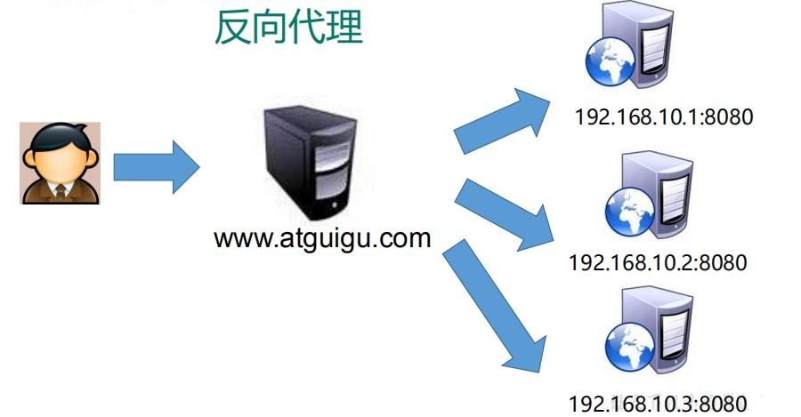

# 3. Nginx 反向代理

## 3.1 Nginx反向代理范例一

**使用 nginx 反向代理 122.51.156.245 直接跳转到127.0.0.1:8888**

```sh
vi /usr/local/openresty/nginx/conf/nginx.conf

 server {
    listen       80;
    server_name  122.51.156.245;

    location / {
        proxy_pass http://127.0.0.1:8888;
        index  index.html index.htm index.jsp;
    }
 }
```

---------------------------------

<a title='反向代理范例一' href='http://122.51.156.245/'>http://122.51.156.245/</a>

<a data-fancybox title="Nginx反向代理范例一" href="./image/nginx06.jpg"></a>

----------------------------------

## 3.2 Nginx反向代理范例二

```sh
vi /usr/local/openresty/nginx/conf/nginx.conf

    server {
        listen       9000;
        server_name  122.51.156.245;

        location ~ /tqk001/ {
            proxy_pass http://127.0.0.1:5555;
        }

        location ~ /tqk/ {
            proxy_pass http://127.0.0.1:5557;
        }
    }

```
------------------------------

**两个tomcat服务在webapp下添加tqk/tqk.html  tqk001/tqk.html 文件**

<a title='反向代理范例二' href='http://122.51.156.245:9000/tqk/tqk.html'>http://122.51.156.245:9000/tqk/tqk.html</a>

<a title='反向代理范例二' href='http://122.51.156.245:9000/tqk001/tqk.html'>http://122.51.156.245:9000/tqk001/tqk.html</a>

-----------------------------

<a data-fancybox title="反向代理范例二" href="./image/nginx05.jpg"></a>

-------------------------------


## 3.3 Nginx反向代理相关指令介绍


### 3.3.1 listen

该指令用于配置网络监听。主要有如下三种配置语法结构：

#### 3.3.1.1 配置监听的IP地址

```sh
listen address[:port] [default_server] [setfib=number] [backlog=number] [rcvbuf=size] [sndbuf=size] [deferred]
    [accept_filter=filter] [bind] [ssl];
```

#### 3.3.1.2 配置监听端口

```sh
listen port[default_server] [setfib=number] [backlog=number] [rcvbuf=size] [sndbuf=size] [accept_filter=filter] 
    [deferred] [bind] [ipv6only=on|off] [ssl];
```

#### 3.3.1.3 配置 UNIX Domain Socket

```sh
listen unix:path [default_server]  [backlog=number] [rcvbuf=size] [sndbuf=size] [accept_filter=filter] 
    [deferred] [bind] [ssl];
```

#### 3.3.1.4 上面的配置看似比较复杂，其实使用起来是比较简单的：

```sh
1 listen *:80 | *:8080 #监听所有80端口和8080端口
2 listen  IP_address:port   #监听指定的地址和端口号
3 listen  IP_address     #监听指定ip地址所有端口
4 listen port     #监听该端口的所有IP连接
```
:::tip 下面分别解释每个选项的具体含义：

1. <font color='red'><strong>address:IP地址</strong></font>，如果是 IPV6地址，需要使用中括号[] 括起来，比如[fe80::1]等。

2. <font color='red'><strong>port:端口号</strong></font>，如果只定义了IP地址，没有定义端口号，那么就使用80端口。

3. <font color='red'><strong>path</strong></font>:socket文件路径，如 var/run/nginx.sock等。

4. <font color='red'><strong>default_server</strong></font>:标识符，将此虚拟主机设置为 address:port 的默认主机。（在 nginx-0.8.21 之前使用的是 default 指令）

5. <font color='red'><strong>setfib=number</strong></font>:Nginx-0.8.44 中使用这个变量监听 socket 关联路由表，目前只对 FreeBSD 起作用，不常用。

6. <font color='red'><strong>backlog=number</strong></font>:设置监听函数listen()最多允许多少网络连接同时处于挂起状态，在 FreeBSD 中默认为 -1,其他平台默认为511.

7. <font color='red'><strong>rcvbuf=size</strong></font>:设置监听socket接收缓存区大小。

8. <font color='red'><strong>sndbuf=size</strong></font>:设置监听socket发送缓存区大小。

9. <font color='red'><strong>deferred</strong></font>:标识符，将accept()设置为Deferred模式。

10. <font color='red'><strong>accept_filter=filter</strong></font>:设置监听端口对所有请求进行过滤，被过滤的内容不能被接收和处理，本指令只在 FreeBSD 和 NetBSD 5.0+ 平台下有效。filter 可以设置为 dataready 或 httpready 。

11. <font color='red'><strong>bind</strong></font>:标识符，使用独立的bind() 处理此address:port，一般情况下，对于端口相同而IP地址不同的多个连接，Nginx 服务器将只使用一个监听指令，并使用 bind() 处理端口相同的所有连接。

12. <font color='red'><strong>ssl</strong></font>:标识符，设置会话连接使用 SSL模式进行，此标识符和Nginx服务器提供的 HTTPS 服务有关。

:::

### 3.3.2 server_name

该指令用于虚拟主机的配置。通常分为以下两种：

#### 3.3.2.1 基于名称的虚拟主机配置
语法格式如下：

```sh
server_name   name ...;
```


#### 3.3.2.2 对于name 来说，可以只有一个名称，也可以有多个名称，中间用空格隔开。而每个名字由两段或者三段组成，每段之间用“.”隔开。

```sh
server_name 123.com www.123.com
```

#### 3.3.2.3 可以使用通配符“*”，但通配符只能用在由三段字符组成的首段或者尾端，或者由两端字符组成的尾端。

```sh
server_name *.123.com www.123.*
```

#### 3.3.2.4 还可以使用正则表达式，用“~”作为正则表达式字符串的开始标记。

```sh
server_name ~^www\d+\.123\.com$;
```

该表达式“~”表示匹配正则表达式，以www开头（“^”表示开头），紧跟着一个0~9之间的数字，在紧跟“.123.co”，最后跟着“m”($表示结尾)

以上匹配的顺序优先级如下：

```sh
1. 准确匹配 server_name
2. 通配符在开始时匹配 server_name 成功
3. 通配符在结尾时匹配 server_name 成功
4. 正则表达式匹配 server_name 成功
```

#### 3.3.2.5 基于 IP 地址的虚拟主机配置

**语法结构和基于域名匹配一样，而且不需要考虑通配符和正则表达式的问题**

```sh
server_name 192.168.1.1

```


### 3.3.3 location

**该指令用于匹配 URL**

语法如下：

```sh
1 location [ = | ~ | ~* | ^~] uri {
2 
3 }
```
:::tip 通配符说明
  
1. <font color='red'><strong>=</strong></font>：用于不含正则表达式的 uri 前，要求请求字符串与 uri 严格匹配，如果匹配成功，就停止继续向下搜索并立即处理该请求。

2. <font color='red'><strong>~</strong></font>：用于表示 uri 包含正则表达式，并且区分大小写。

3. <font color='red'><strong>~*</strong></font>：用于表示 uri 包含正则表达式，并且不区分大小写。

4. <font color='red'><strong>^~</strong></font>：用于不含正则表达式的 uri 前，要求 Nginx 服务器找到标识 uri 和请求字符串匹配度最高的 location 后，立即使用此 location 处理请求，而不再使用 location 块中的正则 uri 和请求字符串做匹配。

注意：如果 uri 包含正则表达式，则必须要有 ~ 或者 ~* 标识。
:::


### 3.3.4 proxy_pass

**该指令用于设置被代理服务器的地址。可以是主机名称、IP地址加端口号的形式**

语法结构如下：

```sh
proxy_pass URL;
```

URL 为被代理服务器的地址，可以包含传输协议、主机名称或IP地址加端口号，URI等。

```sh
proxy_pass  http://www.123.com/uri;
```

### 3.3.6 index

**该指令用于设置网站的默认首页**

语法为：

```sh
index  filename ...;
```

后面的文件名称可以有多个，中间用空格隔开。

```sh
index  index.html index.jsp;
```

通常该指令有两个作用：第一个是用户在请求访问网站时，请求地址可以不写首页名称；第二个是可以对一个请求，根据请求内容而设置不同的首页。

