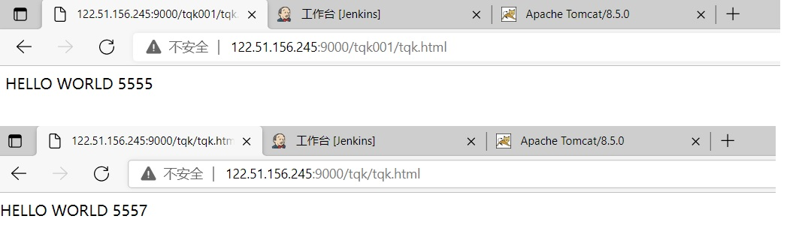
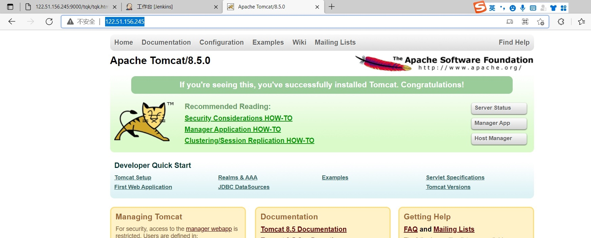

# 3. nginx反向代理

## 3.1 正向代理

Nginx 不仅可以做反向代理，实现负载均衡。还能用作正向代理来进行上网等功能。
正向代理：如果把局域网外的 Internet 想象成一个巨大的资源库，则局域网中的客户端要访
问 Internet，则需要通过代理服务器来访问，这种代理服务就称为正向代理。

## 3.2 nginx反向代理

反向代理，其实客户端对代理是无感知的，因为客户端不需要任何配置就可以访问，我们只
需要将请求发送到反向代理服务器，由反向代理服务器去选择目标服务器获取数据后，在返
回给客户端，此时反向代理服务器和目标服务器对外就是一个服务器，暴露的是代理服务器
地址，隐藏了真实服务器 IP 地址。

### 3.2.1 反向代理实例一

