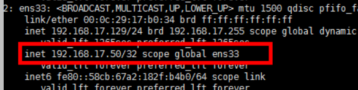
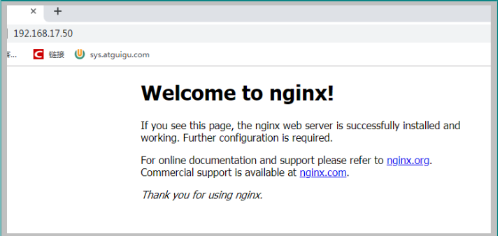
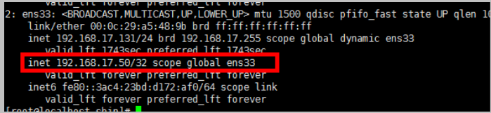
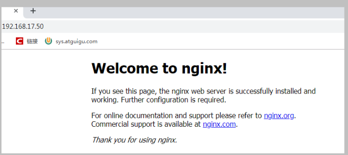
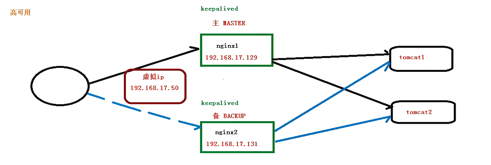

# 6. Nginx搭建高可用集群

## 6.1 配置高可用准备工作

1. 需要两台服务器 192.168.17.129 和192.168.17.131

2. 在两台服务器 安装 nginx

3. 在两台服务器安装 keepalived


## 6.2 在两台服务中 安装keepalived

1. 使用 yum 命令安装

```bash
yum install keepalived -y
```

2. 安装后 在 etc里面生成目录 keepalive 有文件 keepalivec.conf配置文件


## 6.3 完成高可用配置 ( 主从配置 )

1. 修改/etc/keepalived/keepalivec.conf配置文件

```sh
global_defs {
	notification_email {
		acassen@firewall.loc
		failover@firewall.loc
		sysadmin@firewall.loc
	}
	notification_email_from Alexandre.Cassen@firewall.loc
		smtp_server 122.51.156.245
		smtp_connect_timeout 30
		router_id 122.51.156.245
	}
	
vrrp_script chk_http_port {
    script "/usr/local/src/nginx_check.sh"
    interval 2      #（检测脚本执行的间隔）
    weight 2
}


vrrp_instance VI_1 {
	state MASTER    # 备份服务器上将MASTER 改为BACKUP  
	interface eth0  # 网卡
	virtual_router_id 51  # 主、备机的virtual_router_id必须相同
	priority 100          # 主、备机取不同的优先级，主机值较大，备份机值较小
	advert_int 1
	authentication {
		auth_type PASS
		auth_pass 1111
	}
	virtual_ipaddress {
	    192.168.200.16
        192.168.200.17
        192.168.200.18
		// VRRP H虚拟地址 云服务器上需要在同一网段
	}
}
```

2. 在/usr/local/src 添加检测脚本

```bash
#!/bin/bash
# 检查nginx进程是否存在
A=`ps -C nginx --no-header |wc -l`
if [ $A -eq 0 ];then
    # 如果不存在尝试重启
    /usr/local/nginx/sbin/nginx
    sleep 2
    # 如果重启之后还是不行，进行 keepalived 切换
    if [ `ps -C nginx --no-header |wc -l` -eq 0 ];then
        killall keepalived
    fi
fi

```

3. 把两台服务器上nginx和keepalived启动

```sh
#启动nginx：
./nginx

#启动keepalived：
systemctl start keepalived.service
```

## 6.3 最终测试
1. 在浏览器地址栏输入虚拟ip地址192.168.17.50 

<a data-fancybox title="image-20201012163807688" href="./image/image-20201012163807688.png"></a>

<a data-fancybox title="image-20201012163817357" href="./image/image-20201012163817357.png"></a>

2. 把主服务器（192.168.17.129）nginx和keepalived停止，再输入192.168.17.50

<a data-fancybox title="image-20201012163836255" href="./image/image-20201012163836255.png"></a>

<a data-fancybox title="image-20201012163840741" href="./image/image-20201012163840741.png"></a>


<a data-fancybox title="image-20201012162304285" href="./image/image-20201012162304285.png"></a>

