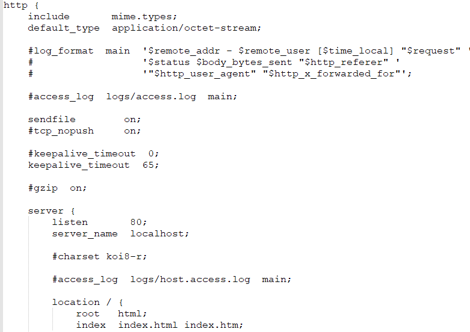

# 2. nginx配置文件
[[toc]]
##  2.1 Nginx配置文件解读

配置文件的大体分为三大块全局块，events块，http模块
```xml
#   nginx配置文件主要分为六个区域： 核心区域 
#    main(全局设置)  作用域是全局 （从配置文件开始到events 块之间的内容）
#    events(nginx工作模式)
#   upstream(负载均衡服务器设置）
#    http(http设置) 
#   	 sever(主机设置) 
#   		 location(URL匹配)
#   
```

###  2.1.1 全局块

从配置文件开始到events 块之间的内容，主要会设置一些影响nginx 服务器整体运行的配置指令，主要包括配置运行Nginx 服务器的用户（组）、允许生成的worker process 数，进程PID 存放路径、日志存放路径和类型以及配置文件的引入等。比如上面第一行配置的

<a data-fancybox title="全局块" href="./image/image-20201012105805808.png"></a>

这是nginx 服务器并发处理服务的关键配置，worker_processes 值越大，可以支持的并发处理量就越多，但是会受到硬件、软件等设备的制约


###  2.1.2 events 块

<a data-fancybox title="events 块" href="./image/image-20201012105928481.png"></a>

events 块涉及的指令主要影响Nginx 服务器与用户的网络连接，常用的设置包括是否开启对多work process 下的网络连接进行序列化，是否允许同时接收多个网络连接，选取哪种事件驱动模型来处理连接请求，每个word process 可以同时支持的最大连接数等。

上述例子就表示每个work process 支持的最大连接数为1024

这部分的配置对Nginx 的性能影响较大，在实际中应该灵活配置


###  2.1.3 http块

<a data-fancybox title="http块" href="./image/image-20201012110023268.png"></a>

这是 Nginx 服务器中最频繁的部分，代理，缓存，日志，定义的功能绝大多数功能和第三方模块都在这里

需要注意的是：http 块 可以包含 **http全局块，server块**


--------------------
## Nginx 配置文件解读 

配置文件的几大块 

```xml
#   nginx配置文件主要分为六个区域： 核心区域 
#    main(全局设置)  作用域是全局 
#    events(nginx工作模式)
#   upstream(负载均衡服务器设置）
#    http(http设置) 
#   	 sever(主机设置) 
#   		 location(URL匹配)
#   

```


## 2.2 配置文件 

```xml
#设置用户的权限  root nobody 指定 用户名虚拟机内用户   或者 Ip访问 
#user  nobody;
#设置工作进程数 一般为 Cpu 核心*2  4*2 
worker_processes  8;  
# 日志输出参数 
#error_log  logs/error.log;
#error_log  logs/error.log  notice;
#error_log  logs/error.log  info;
# 进程ID 
#pid        logs/nginx.pid;

events {
#指定运行模型 
    use epoll;
# 工作连接数  默认512 根据自己的情况调整 
    worker_connections  1024;
}

#http模块 
http {
#  能够支持的类型 在 这个文件下写着  mime.types
    include       mime.types;
# 默认的类型  在 application/octet-stream;
    default_type  application/octet-stream;
# 日志的格式 
    #log_format  main  '$remote_addr - $remote_user [$time_local] "$request" '
    #                  '$status $body_bytes_sent "$http_referer" '
    #                  '"$http_user_agent" "$http_x_forwarded_for"';
#访问日志记录 
    #access_log  logs/access.log  main;
#启动 发送文件 
    sendfile        on;
# 开启TCP 推送 
    #tcp_nopush     on;
# 连接超时时间 
    #keepalive_timeout  0;
    keepalive_timeout  65;
# 开启压缩文件 
    #gzip  on;
# 服务 
# 服务分组  反向代理的核心关键 
 upstream tuling {
# ip 方式 最大失败3个连接  间隔 30S  权重为 5
        server 127.0.0.1:8080       max_fails=3 fail_timeout=30s weight=5;
#根据ip 利用Hash算法决定访问哪台机器 
   ip_hash;
    }
    server {
        listen       80;
        server_name  localhost;
        #charset koi8-r;
#访问日志记录 以及位置  
        #access_log  logs/host.access.log  main;
# 匹配位置 支持正则表达式 
        location / {
# 寻找位置 默认在Nginx 目录下的  类型 
            root   html;
            index  index.html index.htm;
			 proxy_pass   http://127.0.0.1;
        }
#错误信息 页面 
        #error_page  404              /404.html;
#将服务器错误页重定向到静态页/50x.html
        # redirect server error pages to the static page /50x.html
        #
        error_page   500 502 503 504  /50x.html;
        location = /50x.html {
            root   html;
        }
#实例 入 将访问尾缀为 \.php 跳转到 127.0.0.1
        # proxy the PHP scripts to Apache listening on 127.0.0.1:80
        #
        #location ~ \.php$ {
        #    proxy_pass   http://127.0.0.1;
        #}
#将PHP脚本传递给正在侦听127.0.0.1:9000的FastCGI服务器
        # pass the PHP scripts to FastCGI server listening on 127.0.0.1:9000
        #
        #location ~ \.php$ {
        #    root           html;
        #    fastcgi_pass   127.0.0.1:9000;
        #    fastcgi_index  index.php;
        #    fastcgi_param  SCRIPT_FILENAME  /scripts$fastcgi_script_name;
        #    include        fastcgi_params;
        #}
#拒绝访问.htaccess文件，如果Apache的文档根
        # deny access to .htaccess files, if Apache's document root
        # concurs with nginx's one
        #
        #location ~ /\.ht {
        #    deny  all;
        #}
    }


    # another virtual host using mix of IP-, name-, and port-based configuration
    #
    #server {
    #    listen       8000;
    #    listen       somename:8080;
    #    server_name  somename  alias  another.alias;

    #    location / {
    #        root   html;
    #        index  index.html index.htm;
    #    }
    #}


    # HTTPS server
    #
    #server {
    #    listen       443 ssl;
    #    server_name  localhost;

    #    ssl_certificate      cert.pem;
    #    ssl_certificate_key  cert.key;

    #    ssl_session_cache    shared:SSL:1m;
    #    ssl_session_timeout  5m;

    #    ssl_ciphers  HIGH:!aNULL:!MD5;
    #    ssl_prefer_server_ciphers  on;

    #    location / {
    #        root   html;
    #        index  index.html index.htm;
    #    }
    #}
}
```

## 2.3 文字版描述 

```xml
################### main区域 #################################
#user :来指定Nginx Worker进程运行用户以及用户组，默认由nobody账号运行。也可以创建nginx用户指定用户。
#    创建www用户，在nginx配置文件中把user noboby noboby;-->user www www;即可
#    /usr/sbin/groupadd www 
#    /usr/sbin/useradd -g www www
#worker_processes:来指定了Nginx要开启的子进程数。每个Nginx进程平均耗费10M~12M内存。根据经验，一般指定1个进程就足够了，如果是多核CPU，
#    建议指定和CPU的数量一样的进程数即可。我这里写2，那么就会开启2个子进程，总共3个进程。
#error_log:用来定义全局错误日志文件。日志输出级别有debug、info、notice、warn、error、crit可供选择，其中，debug输出日志最为最详细，而crit输出日志最少。
#pid:用来指定进程id的存储文件位置。
#worker_rlimit_nofile:用于指定一个nginx进程可以打开的最多文件描述符数目，这里是65535，需要使用命令“ulimit -n 65535”来设置。

user  nobody;
worker_processes  1;
error_log  logs/error.log;
error_log  logs/error.log  notice;
error_log  logs/error.log  info;
pid        logs/nginx.pid;


#####################event 区域###############################
#use：用来指定Nginx的工作模式。Nginx支持的工作模式有select、poll、kqueue、epoll、rtsig和/dev/poll。
#    其中select和poll都是标准的工作模式，kqueue和epoll是高效的工作模式，不同的是epoll用在Linux平台上，
#    而kqueue用在BSD系统中,对于Linux系统，epoll工作模式是首选。
#worker_connections：用于定义Nginx每个进程的最大连接数，即接收前端的最大请求数，默认是1024。
#    最大客户端连接数由worker_processes和worker_connections决定，即Max_clients=worker_processes*worker_connections，
#   在作为反向代理时，Max_clients变为：Max_clients = worker_processes * worker_connections/4。 
#    进程的最大连接数受Linux系统进程的最大打开文件数限制，在执行操作系统命令“ulimit -n 65536”后worker_connections的设置才能生效。

events {
    use epoll;
    worker_connections  1024;
}
######################### http设置#####################################
#    http模块负责HTTP服务器相关属性的配置，有server和upstream两个子模块
http {
#include ：来用设定文件的mime类型,类型在配置文件目录下的mime.type文件定义，来告诉nginx来识别文件类型。
#default_type：设定了默认的类型为二进制流，也就是当文件类型未定义时使用这种方式，例如在没有配置asp的locate环境时，Nginx是不予解析的，此时，用浏览器访问asp文件就会出现下载了。
#log_format：用于设置日志的格式，和记录哪些参数，这里设置为main，刚好用于access_log来纪录这种类型。
    include       mime.types;
    default_type  application/octet-stream;
    log_format  main  '$remote_addr - $remote_user [$time_local] "$request" '
                      '$status $body_bytes_sent "$http_referer" '
                      '"$http_user_agent" "$http_x_forwarded_for"';
    access_log  logs/access.log  main;
    sendfile        on;
    tcp_nopush     on;
    keepalive_timeout  0;
    keepalive_timeout  65;
    gzip  on;

######################### server设置#####################################
#server用来定一个虚拟主机，标志定义虚拟主机开始。
#listen：用于指定虚拟主机的服务端口。
#server_name：用来指定IP地址或者域名，多个域名之间用空格分开。
#root ：表示在这整个server虚拟主机内，全部的root web根目录。注意要和locate {}下面定义的区分开来。
#index ：全局定义访问的默认首页地址。注意要和locate {}下面定义的区分开来。
#charset：用于设置网页的默认编码格式。
#access_log：用来指定此虚拟主机的访问日志存放路径，最后的main用于指定访问日志的输出格式。
    server {
        listen       80;
        server_name  localhost;
        root   /Users/hk/www;
        index  index.php index.html index.htm; 
        charset utf-8;
        access_log  logs/host.access.log  main;
        aerror_log  logs/host.error.log   main;

######################### location设置#####################################
# location模块 负载均衡,反向代理,虚拟域名等配置。是来定位的，定位URL，解析URL，它也提供了强大的正则匹配功能，也支持条件判断匹配，
#    可以通过location指令实现Nginx对动,静态网页进行过滤处理。
#/表示匹配访问根目录。
#root指令用于指定访问根目录时，虚拟主机的web目录，这个目录可以是相对路径（相对路径是相对于nginx的安装目录）。也可以是绝对路径。
#proxy_pass：代理转发，如果在proxy_pass后面的url加/，表示绝对根路径；如果没有/，表示相对路径，把匹配的路径部分也给代理走。
#proxy_set_header：允许重新定义或者添加发往后端服务器的请求头。
#include：加载配置文件，后面介绍nginx多个配置文件时候会提到。
#root：定位localtion匹配的url资源路径。
#index：定义页面显示html，一般和alias配合使用。
        location / {       
            root   html;    
            index  index.html index.htm;
        }

        error_page  404              /404.html;       
        error_page   500 502 503 504  /50x.html;
        location = /50x.html {
            root   html;
        }
        
        
        #反向代理配置
        location /jyb {
            proxy_pass http://qurt/;
            proxy_read_timeout 1800s;
            proxy_set_header   Host $host:$server_port;
            proxy_set_header   X-real-ip  $remote_addr;
            proxy_set_header   X-Forwarded-For $proxy_add_x_forwarded_for;  
            proxy_set_header   X-Forwarded-Proto  $scheme; 
         }
     
        
         #采用uwsgi方式
         location /python/ {
             include uwsgi_params;
             uwsgi_pass 127.0.0.1:33333;
         }
        
        # FastCGI方式
        location ~ \.php$ {
            root           html;
            fastcgi_pass   127.0.0.1:9000;
            fastcgi_index  index.php;
            fastcgi_param  SCRIPT_FILENAME  /scripts$fastcgi_script_name;
            include        fastcgi_params;
        }
        
        #访问nginx本机目录的文件
        location / {
            root   /home/hk/;
            index  index.html index.htm;
        }
        
        location  /static/ {
             alias /var/static/;
        }

        # deny access to .htaccess files, if Apache's document root
        # concurs with nginx's one
        #
        location ~ /\.ht {
            deny  all;
        }
    }


    # another virtual host using mix of IP-, name-, and port-based configuration
    server {
        listen       8000;
        listen       somename:8080;
        server_name  somename  alias  another.alias;

        location / {
            root   html;
            index  index.html index.htm;
        }
    }


    # HTTPS server    
    server {
        listen       443 ssl;
        server_name  localhost;

        ssl_certificate      cert.pem;
        ssl_certificate_key  cert.key;

        ssl_session_cache    shared:SSL:1m;
        ssl_session_timeout  5m;

        ssl_ciphers  HIGH:!aNULL:!MD5;
        ssl_prefer_server_ciphers  on;

        location / {
            root   html;
            index  index.html index.htm;
        }
    }
    
##############upstram 模块################
# upstream 模块  负载均衡模块，通过一个简单的调度算法来实现客户端IP到后端服务器的负载均衡。
#Nginx的负载均衡模块目前支持4种调度算法:
#    weight 轮询（默认）。每个请求按时间顺序逐一分配到不同的后端服务器，如果后端某台服务器宕机，故障系统被自动剔除，使用户访问不受影响。
#        weight指定轮询权值，weight值越大，分配到的访问机率越高，主要用于后端每个服务器性能不均的情况下。
#    ip_hash。每个请求按访问IP的hash结果分配，这样来自同一个IP的访客固定访问一个后端服务器，有效解决了动态网页存在的session共享问题。
#    fair。比上面两个更加智能的负载均衡算法。此种算法可以依据页面大小和加载时间长短智能地进行负载均衡，
#        也就是根据后端服务器的响应时间来分配请求，响应时间短的优先分配。Nginx本身是不支持fair的，如果需要使用这种调度算法，必须下载Nginx的upstream_fair模块。
#    url_hash。按访问url的hash结果来分配请求，使每个url定向到同一个后端服务器，可以进一步提高后端缓存服务器的效率。Nginx本身是不支持url_hash的，
#        如果需要使用这种调度算法，必须安装Nginx 的hash软件包。

#在HTTP Upstream模块中，可以通过server指令指定后端服务器的IP地址和端口，同时还可以设定每个后端服务器在负载均衡调度中的状态。常用的状态有：
#    down，表示当前的server暂时不参与负载均衡。
#    backup，预留的备份机器。当其他所有的非backup机器出现故障或者忙的时候，才会请求backup机器，因此这台机器的压力最轻。
#    max_fails，允许请求失败的次数，默认为1。当超过最大次数时，返回proxy_next_upstream 模块定义的错误。
#    fail_timeout，在经历了max_fails次失败后，暂停服务的时间。max_fails可以和fail_timeout一起使用。

#注意 当负载调度算法为ip_hash时，后端服务器在负载均衡调度中的状态不能是weight和backup。
#备注： nginx的worker_rlimit_nofile达到上限时，再有客户端链接报502错误. 用了log_format指令设置了日志格式之后，需要用access_log指令指定日志文件的存放路径。
    
    upstream server_group {
        ip_hash;
        server 192.168.123.1:80;
        server 192.168.123.2:80 down;
        server 192.168.123.3:8080  max_fails=3  fail_timeout=20s;
        server 192.168.123.4:8080;
    }
    
    server {
        listen       80;
        server_name  localhost;

        location / {
            proxy_pass http://server_group/;
        }
    }

}


######################nginx 中location中root和alias的区别 ####################
    nginx指定文件路径有两种方式root和alias，这两者的用法区别，使用方法总结了。
    root与alias主要区别在于nginx如何解释location后面的uri，这会使两者分别以不同的方式将请求映射到服务器文件上。
    [root]
        语法：root path
        默认值：root html
        配置段：http、server、location、if

    [alias]
        语法：alias path
        配置段：location

    root实例：

        location ^~ /t/ {
            root /www/root/html/;
        }
        如果一个请求的URI是/t/a.html时，web服务器将会返回服务器上的/www/root/html/t/a.html的文件。

    alias实例：
        location ^~ /t/ {
            alias /www/root/html/new_t/;
        }
        如果一个请求的URI是/t/a.html时，web服务器将会返回服务器上的/www/root/html/new_t/a.html的文件。注意这里是new_t，
        因为alias会把location后面配置的路径丢弃掉，把当前匹配到的目录指向到指定的目录。
    注意：
        1. 使用alias时，目录名后面一定要加"/"。
        2. alias在使用正则匹配时，必须捕捉要匹配的内容并在指定的内容处使用。
        3. alias只能位于location块中。（root可以不放在location中）
```

