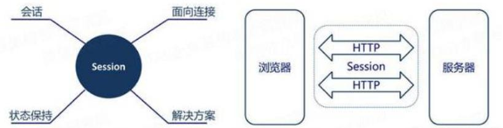
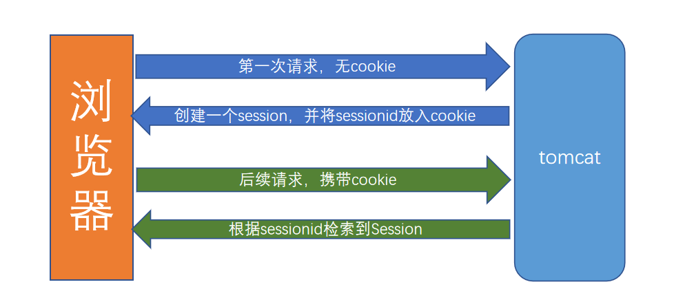
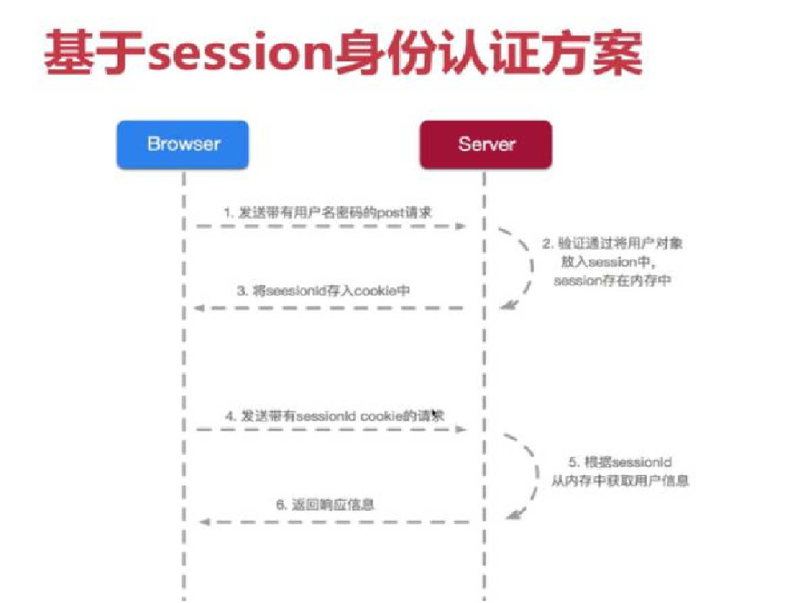
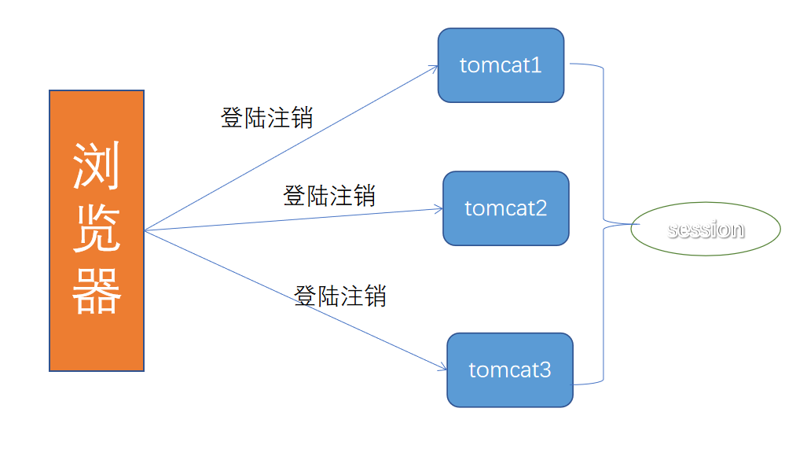
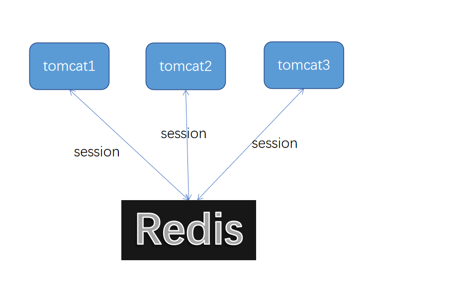
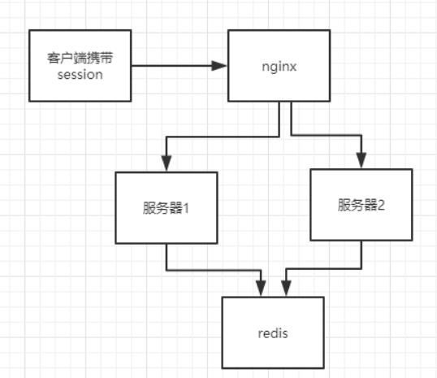

# 1. Session共享

## 1.1 传统Session认证方案

### 1.1.1 Cookie 与服务器的交互


如上图，http 是无状态的协议，客户每次读取 web 页面时，服务器都打开新的会话，而且 服务器也不会自动维护客户的上下文信息。比如我们现在要实现一个电商内的购物车功能，要怎 么才能知道哪些购物车请求对应的是来自同一个客户的请求呢？session 就是一种保存上下文 信息的机制，它是针对每一个用户的，变量的值保存在服务器端，通过 SessionID 来区分不同 的客户。session 是以 cookie 或 URL 重写为基础的，默认使用 cookie 来实现，系统会创造一 个名为 JSESSIONID 的值输出到 cookie。 

注意 JSESSIONID 是存储于浏览器内存中的，并不是写到硬盘上的，如果我们把浏览器的 cookie 禁止，则 web 服务器会采用 URL 重写的方式传递 Sessionid，我们就可以在地址栏看到 sessionid=KWJHUG6JJM65HS2K6 之类的字符串。 

通常 JSESSIONID 是不能跨窗口使用的，当你新开了一个浏览器窗口进入相同页面时，系 统会赋予你一个新的 sessionid，这样我们信息共享的目的就达不到了。

-------------------------


### 1.1.2 服务端的session的机制

session 机制是一种服务器端的机制，服务器使用一种类似于散列表的结构(也可能就是使用 散列表)来保存信息。 

> 但程序需要为某个客户端的请求创建一个 session 的时候，服务器首先检查这个客户端的请求里是否包含了一个 JSESSIONID 标识的 sessionid,
>
> 如果已经包含一个 session id 则说明以前已经为此客户创建过 session，服务器就根据 sessionid 把这个 session 检索出来使用(如果检索不到， 可能会新建一个，这种情况可能出现在服务端已经删除了该用户对应的 session 对象，但用户人为地在请求的 URL 后面附加上一个 JSESSION 的参数)。 
>
> 如果客户请求不包含 session id，则为此客户创建一个 session 并且生成一个与此 session 相关联的 session id，这个 session id 将在本次响应中返回给客户端保存。 

:::tip 对每次 http 请求，都经历以下步骤处理： 
- 服务端首先查找对应的 cookie 的值（sessionid）。 
- 根据 sessionid，从服务器端 session 存储中获取对应 id 的 session 数据，进行返回。 
- 如果找不到 sessionid，服务器端就创建 session，生成 sessionid 对应的 cookie，写入到响应头中
:::

### 1.1.3 基于session的身份认证




1. 服务器通过response.addCookie(Cookiecookie)向response Header中设置Cookie。  
	- 如: Set-Cookie: jsession=08e0456d-afa3-45f3-99ef-a42e2fc977d3; Domain=dev.com; Path=/; 
2. 浏览器接受response Header的cookie值并保存。在下次请求的request Header中，携带此cookie信息。  
	- 如：Cookie: jsession=08e0456d-afa3-45f3-99ef-a42e2fc977d3
3. sessionid被服务器设置到cookie中，以后浏览器的请求皆携带此sessionid，服务器据此检索对应session  
4. 当程序请求session时，首先根据cookie中携带的session id检索session（检索不到，会新建一个）



## 1.2 集群环境Session解决方案



如上图，随着分布式架构的流行，单个服务器已经不能满足系统的需要了，通常都会把系统部署在多台服务器上，通过负载均衡把请求分发到其中的一台服务器上，这样很可能同一个用户的请 求被分发到不同的服务器上，因为 session 是保存在服务器上的，那么很有可能第一次请求访问 的 A 服务器，创建了 session，但是第二次访问到了 B 服务器，这时就会出现取不到 session 的情况。

我们知道，Session 一般是用来存会话全局的用户信息（不仅仅是登陆方面的问题），用来简化/加速后续的业务请求。要在集群环境下使用，最好的的解决办法就是使用 **session 共享**：



### 1.2.1 Session共享实现思路


:::tip 两种实现思路： 
- session 集中存储（redis，memcached，hbase 等）。 
- 不同服务器上 session 数据进行复制，此方案延迟问题比较严重。 
:::
我们一般推荐第一种方案，基于 session 集中存储的实现方案，见下图：


:::tip 具体过程如下： 
1. 新增 Filter，拦截请求，包装 HttpServletRequest（使用 HttpServletRequestWrapper） 
2. 改写 getSession 方法，从第三方存储中获取 session 数据（若没有则创建一个），返回自定义 的 HttpSession 实例 
3. 在 http 返回 response 时，提交 session 信息到第三方存储中
:::

### 1.2.2 需要考虑的问题

:::tip 需要考虑以下问题： 
> session 数据如何在 Redis 中存储？ 
> session 属性变更何时触发存储？ 
:::

> **实现：** 
考虑到 session 中数据类似 map 的结构，采用 redis 中 hash 存储 session 数据比较合适，如果使用单个 value 存储 session 数据，不加锁的情况下，就会存在 session 覆盖的问题

因此**使用 hash 存储 session**，每次只保存本次变更 session 属性的数据，避免了锁处理，性能更好。 如果每改一个 session 的属性就触发存储，在变更较多 session 属性时会触发多次 redis 写操作， 对性能也会有影响，我们是在每次请求处理完后，做一次 session 的写入，并且只写入变更过的属性。 

如果本次没有做 session 的更改，是不会做 redis 写入的，仅当没有变更的 session 超过一个 时间阀值（不变更 session 刷新过期时间的阀值），就会触发 session 保存，以便 session 能够延长有效期。

### 1.2.3 代码示例

```java
package com.enjoy.session;

import com.enjoy.utils.CookieBasedSession;
import org.springframework.data.redis.core.RedisTemplate;

import javax.servlet.http.HttpServletRequest;
import javax.servlet.http.HttpServletRequestWrapper;
import java.util.HashMap;
import java.util.Map;
import java.util.UUID;

/**
 * Created by Peter on 2018/8/15.
 * request包装类
 */
public class MyRequestWrapper extends HttpServletRequestWrapper {
    private volatile boolean committed = false;
    private String uuid = UUID.randomUUID().toString();

    private MySession session;
    private RedisTemplate redisTemplate;

    public MyRequestWrapper(HttpServletRequest request,RedisTemplate redisTemplate) {
        super(request);
        this.redisTemplate = redisTemplate;
    }

    /**
     * 提交session内值到redis
     */
    public void commitSession() {
        if (committed) {
            return;
        }
        committed = true;

        MySession session = this.getSession();
        if (session != null && null != session.getAttrs()) {
            redisTemplate.opsForHash().putAll(session.getId(),session.getAttrs());
        }
    }

    /**
     * 创建新session
     * @return
     */
    public MySession createSession() {
        //todo 从页面传来的
        String sessionId = CookieBasedSession.getRequestedSessionId(this);
        Map<String,Object> attr ;
        if (null != sessionId){
            attr = redisTemplate.opsForHash().entries(sessionId);
        } else {
            System.out.println("create session by rId:"+uuid);
            sessionId = UUID.randomUUID().toString();
            attr = new HashMap<>();
        }

        //session成员变量持有
        session = new MySession();
        session.setId(sessionId);
        session.setAttrs(attr);

        return session;
    }

    /**
     * 取session
     * @return
     */
    @Override
    public MySession getSession() {
        return this.getSession(true);
    }

    /**
     * 取session
     * @return
     */
    @Override
    public MySession getSession(boolean create) {
        if (null != session){
            return session;
        }
        return this.createSession();
    }

    /**
     * 是否已登陆
     * @return
     */
    public boolean isLogin(){
        Object user = getSession().getAttribute(SessionFilter.USER_INFO);
        return null != user;
    }

}
```
