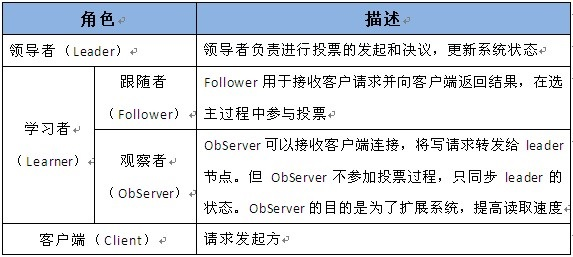
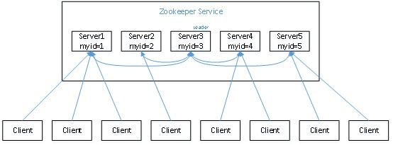
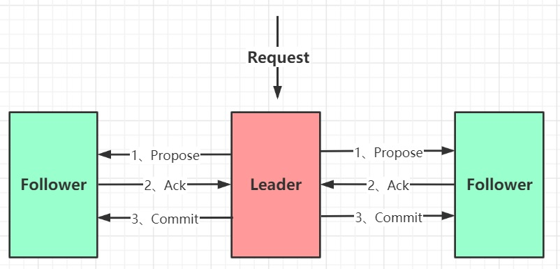
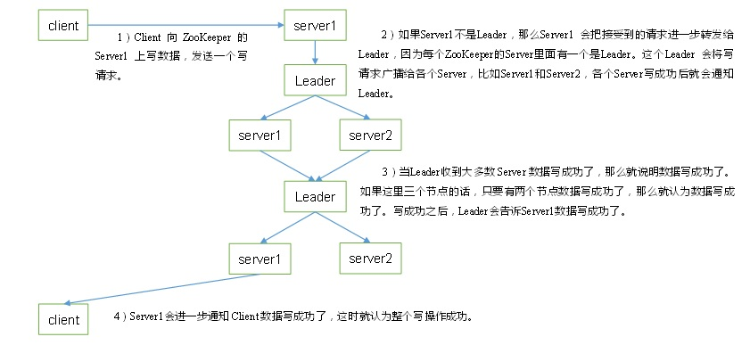
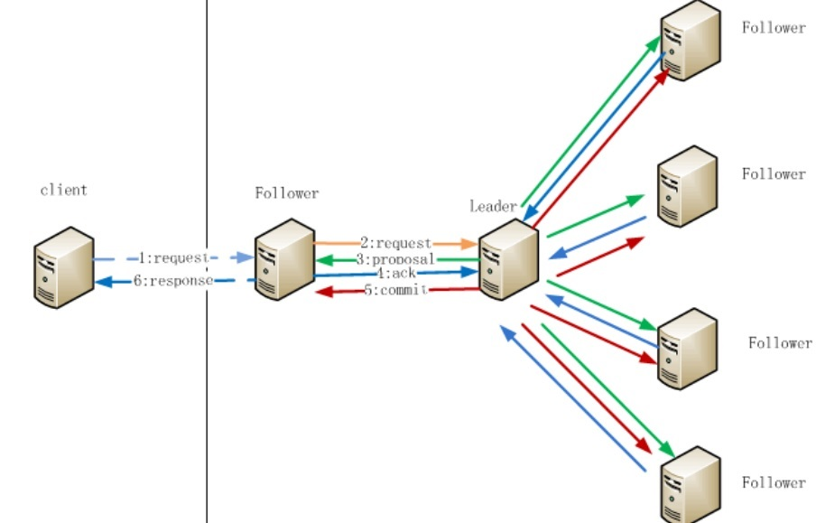
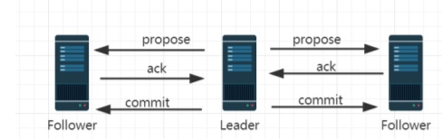
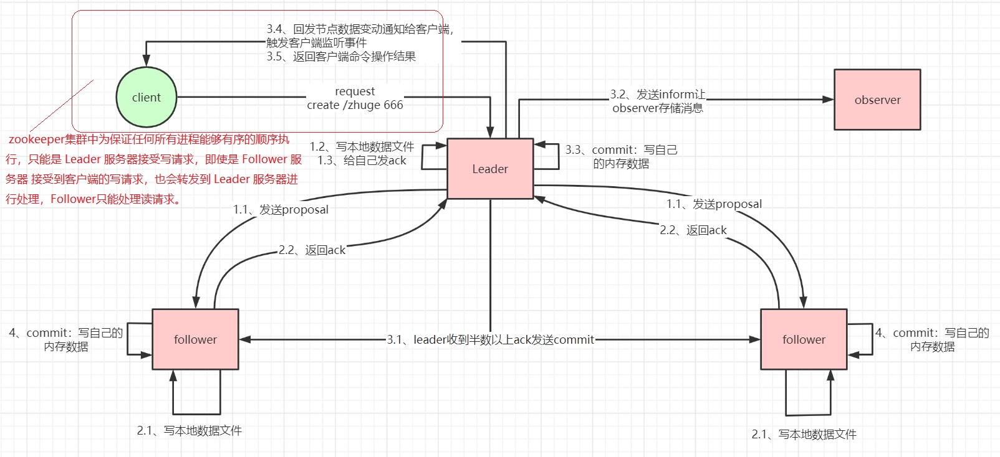
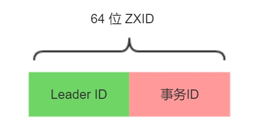
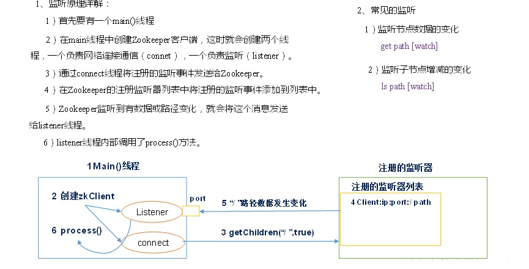

# 5. zookeeper内部原理
[[toc]]

:::tip Zookeeper的角色
1. 领导者（leader），负责进行投票的发起和决议，更新系统状态
2. 学习者（learner），包括跟随者（follower）和观察者（observer），follower用于接受客户端请求并想客户端返回结果，在选主过程中参与投票
3. Observer可以接受客户端连接，将写请求转发给leader，但observer不参加投票过程，只同步leader的状态，observer的目的是为了扩展系统，提高读取速度
4. 客户端（client），请求发起方
:::
 

## 5.1 选举机制（面试重点）

1. **半数机制**：集群中**半数以上机器存活**，集群可用；所以Zookeeper适合安装**奇数**台服务器。  
2. Zookeeper虽然在配置文件中并没有指定Master和Slave。但是，Zookeeper工作时，是有一个节点为Leader，其他则为Follower，**Leader是通过内部的选举机制临时产生的**。  
3. 以一个简单的例子来说明整个选举的过程。   
 
假设有五台服务器组成的Zookeeper集群，它们的id从1-5，同时它们都是最新启动的，也就是没有历史数据，在存放数据量这一点上，都是一样的。  
假设这些服务器依序启动，来看看会发生什么，如下图所示。 

 

:::tip Zookeeper选举机制(五台为例)
1. 服务器 1 启动，发起一次选举。服务器 1 投自己一票。此时服务器 1 票数一票，
不够半数以上（3 票），选举无法完成，服务器 1 状态保持为 LOOKING； 
2. 服务器 2 启动，再发起一次选举。服务器 1 和 2 分别投自己一票并交换选票信息：
此时服务器 1 发现服务器 2 的 ID 比自己目前投票推举的（服务器 1）大，更改选票为推举
服务器 2。此时服务器 1 票数 0 票，服务器 2 票数 2 票，没有半数以上结果，选举无法完成，
服务器 1，2 状态保持 LOOKING
3. 服务器 3 启动，发起一次选举。此时服务器 1 和 2 都会更改选票为服务器 3。此
次投票结果：服务器 1 为 0 票，服务器 2 为 0 票，服务器 3 为 3 票。此时服务器 3 的票数已
经超过半数，服务器 3 当选 Leader。服务器 1，2 更改状态为 FOLLOWING，服务器 3 更改
状态为 LEADING； 
4. 服务器 4 启动，发起一次选举。此时服务器 1，2，3 已经不是 LOOKING 状态，
不会更改选票信息。交换选票信息结果：服务器 3 为 3 票，服务器 4 为 1 票。此时服务器 4
服从多数，更改选票信息为服务器 3，并更改状态为 FOLLOWING； （5）服务器 5 启动，同 4 一样当小弟。
:::

## 5.2 ZAB协议

**ZAB 协议全称**：Zookeeper Atomic Broadcast（Zookeeper 原子广播协议）。 

Zookeeper 是一个为分布式应用提供高效且可靠的分布式协调服务。在解决分布式一致性方面，Zookeeper 并没有使用 Paxos ，而是采用了 ZAB 协议，**ZAB是Paxos算法的一种简化实现**。 

ZAB 协议定义：ZAB 协议是为分布式协调服务 Zookeeper 专门设计的一种支持** **崩溃恢复** 和 **原子广播**的协议。下面我们会重点讲 这两个东西。 

基于该协议，Zookeeper 实现了一种 主备模式 的系统架构来保持集群中各个副本之间数据一致性。具体如下图所示：

 

上图显示了 Zookeeper 如何处理集群中的数据。所有客户端写入数据都是写入到Leader节点，然后，由 Leader 复制到Follower节 点中，从而保证数据一致性。 

那么复制过程又是如何的呢？复制过程类似两阶段提交(2PC)，ZAB 只需要 Follower(含leader自己的ack) 有一半以上返回 Ack 信息 就可以执行提交，大大减小了同步阻塞。也提高了可用性。 

简单介绍完，开始重点介绍 消息广播 和 崩溃恢复。整个 Zookeeper 就是在这两个模式之间切换。 简而言之，当 Leader 服务可以 正常使用，就进入消息广播模式，当 Leader 不可用时，则进入崩溃恢复模式。

### 5.2.1 消息广播

ZAB 协议的消息广播过程使用的是一个原子广播协议，类似一个两阶段提交过程。对于**客户端发送的写请求，全部由 Leader 接收**，Leader 将请求封装成一个事务 Proposal，将其发送给所有 Follwer ，然后根据所有 Follwer 的反馈，如果超过半数(含leader 自己)成功响应，则执行 commit 操作。
 

 

消息广播的过程实际上是一个 简化版本的二阶段提交过程

1. leader 接收到消息请求后，将消息赋予一个全局唯一的64 位自增 id，叫：zxid，通过 zxid 的大小比较既可以实现因果有序这个特征

2. leader 为每个 follower 准备了一个 FIFO 队列（通过 TCP协议来实现，以实现了全局有序这一个特点）将带有 zxid的消息作为一个提案（proposal）分发给所有的 follower

3. 当 follower 接收到 proposal，先把 proposal 写到磁盘，写入成功以后再向 leader 回复一个 ack

4. 当 leader 接收到合法数量（超过半数节点）的 ACK 后，leader 就会向这些 follower 发送 commit 命令，同时会在本地执行该消息

5. 当 follower 收到消息的 commit 命令以后，会提交该消息
 

--------------------------------

 

:::tip 细节： 
1. Leader 在收到客户端请求之后，会将这个请求封装成一个事务，并给这个事务分配一个全局递增的唯一 ID，称为事务 ID（ZXID），ZAB 协议需要保证事务的顺序，因此必须将每一个事务按照 ZXID 进行先后排序然后处理，主要通过消息队列 实现。 
2. 在 Leader 和 Follwer 之间还有一个消息队列，用来解耦他们之间的耦合，解除同步阻塞。
3. zookeeper集群中为保证任何所有进程能够有序的顺序执行，只能是 Leader 服务器接受写请求，即使是 Follower 服务器 接受到客户端的写请求，也会转发到 Leader 服务器进行处理，Follower只能处理读请求。 
4. ZAB协议规定了如果一个事务在一台机器上被处理(commit)成功，那么应该在所有的机器上都被处理成功，哪怕机器出现 故障崩溃。
:::

### 5.2.2 崩溃恢复

刚刚我们说消息广播过程中，Leader 崩溃怎么办？还能保证数据一致吗？ 

实际上，当 Leader 崩溃，即进入我们开头所说的崩溃恢复模式（崩溃即：Leader 失去与过半 Follwer 的联系）。

下面来详细讲述。

假设1：Leader 在复制数据给所有 Follwer 之后，还没来得及收到Follower的ack返回就崩溃，怎么办？ 
假设2：Leader 在收到 ack 并提交了自己，同时发送了部分 commit 出去之后崩溃怎么办？ 

针对这些问题，ZAB 定义了 2 个原则： 

1. ZAB 协议**确保丢弃那些只在 Leader 提出/复制，但没有提交的事务**。 
2. ZAB 协议**确保那些已经在 Leader 提交的事务最终会被所有服务器提交**。 

所以ZAB 设计了下面这样一个选举算法： 
**能够确保提交已经被 Leader 提交的事务，同时丢弃已经被跳过的事务**
针对这个要求，如果让 Leader 选举算法能够保证新选举出来的 Leader 服务器拥有集群中所有机器 ZXID 最大的事务，那么就能够保证这个**新选举出来的 Leader 一定具有所有已经提交的提案**。 

而且这么做有一个好处是：**可以省去 Leader 服务器检查事务的提交和丢弃工作的这一步操作**。

### 5.2.3 数据同步
当崩溃恢复之后，需要在正式工作之前（接收客户端请求），Leader 服务器首先确认事务是否都已经被过半的 Follwer 提交了，即是否完成了数据同步。目的是为了保持数据一致。 

当 Follwer 服务器成功同步之后，Leader 会将这些服务器加入到可用服务器列表中。 

实际上，Leader 服务器处理或丢弃事务都是依赖着 ZXID 的，那么这个 ZXID 如何生成呢？ 

答：在 ZAB 协议的事务编号 ZXID 设计中，ZXID 是一个 64 位的数字，其中低 32 位可以看作是一个简单的递增的计数器，针对客户端的每一个事务请求，Leader 都会产生一个新的事务 Proposal 并对该计数器进行 + 1 操作。 而高 32 位则代表了 Leader 服务器上取出本地日志中最大事务 Proposal 的 ZXID，并从该 ZXID 中解析出对应的 epoch 值(leader 选举周期)，当一轮新的选举结束后，会对这个值加一，并且事务id又从0开始自增。

 

高 32 位代表了每代 Leader 的唯一性，低 32 代表了每代 Leader 中事务的唯一性。同时，也能让 Follwer 通过高 32 位识别不同的 Leader。简化了数据恢复流程。 

基于这样的策略：当 Follower 连接上 Leader 之后，Leader 服务器会根据自己服务器上最后被提交的 ZXID 和 Follower 上的 ZXID 进行比对，比对结果要么回滚，要么和 Leader 同步。

## 5.3 监听器原理（面试重点）
 
 

## 5.2 Stat结构体

:::tip 四种类型的znode：
PERSISTENT-持久化目录节点      客户端与zookeeper断开连接后，该节点依旧存在  
PERSISTENT_SEQUENTIAL-持久化顺序编号目录节点   客户端与zookeeper断开连接后，该节点依旧存在，只是Zookeeper给该节点名称进行顺序编号  
EPHEMERAL-临时目录节点    客户端与zookeeper断开连接后，该节点被删除  
EPHEMERAL_SEQUENTIAL-临时顺序编号目录节点    客户端与zookeeper断开连接后，该节点被删除，只是Zookeeper给该节点名称进行顺序编号  
:::

:::danger
1. czxid-创建节点的事务zxid
每次修改ZooKeeper状态都会收到一个zxid形式的时间戳，也就是ZooKeeper事务ID。  
事务ID是ZooKeeper中所有修改总的次序。每个修改都有唯一的zxid，如果zxid1小于zxid2，那么zxid1在zxid2之前发生。  
2. ctime - znode被创建的毫秒数(从1970年开始)
3. mzxid - znode最后更新的事务zxid
4. mtime - znode最后修改的毫秒数(从1970年开始)
5. pZxid-znode最后更新的子节点zxid
6. cversion - znode子节点变化号，znode子节点修改次数
7. dataversion - znode数据变化号
8. aclVersion - znode访问控制列表的变化号
9. ephemeralOwner- 如果是临时节点，这个是znode拥有者的session id。如果不是临时节点则是0。
10. dataLength- znode的数据长度
11. numChildren - znode子节点数量
:::

# 五、zookeeper企业面试真题

5.1 请简述ZooKeeper的选举机制
详见3.1。
5.2 ZooKeeper的监听原理是什么？
详见3.4。
5.3 ZooKeeper的部署方式有哪几种？集群中的角色有哪些？集群最少需要几台机器？
（1）部署方式单机模式、集群模式
（2）角色：Leader和Follower
（3）集群最少需要机器数：3
5.4 ZooKeeper的常用命令
ls create get delete set…

## zookeeper优化

[zookeeper优化](https://www.cnblogs.com/EasonJim/p/7488834.html)