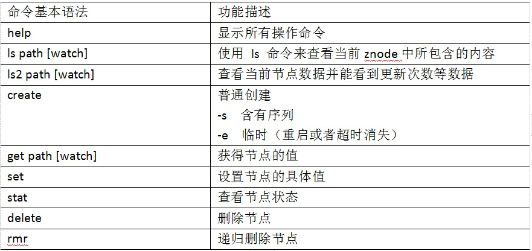

# 二、Zookeeper安装

## 2.1 zookeeper单机版安装

<font color='red' size=4><strong>1. 安装前准备</strong></font>  
（1）安装 Jdk  
（2）上传zookeeper 安装包到 Linux 系统下(apache-zookeeper-3.6.3-bin.tar.gz)  
（3）解压到指定目录  
```vb
tar -zxvf apache-zookeeper-3.6.3-bin.tar.gz  -C /usr/local/zookeeper/
```
<font color='red' size=4><strong>2．配置修改</strong></font>  
（1）将/usr/local/zookeeper/apache-zookeeper-3.6.3-bin/conf 这个路径下的 zoo_sample.cfg 修改为 zoo.cfg；  
```vb
mv zoo_sample.cfg  zoo.cfg
```
（2）打开 zoo.cfg 文件，修改 dataDir 路径：  
 vim zoo.cfg
```vb
dataDir=/usr/local/zookeeper/apache-zookeeper-3.6.3-bin/zkData
```
（3）在/usr/local/zookeeper/apache-zookeeper-3.6.3-bin/这个目录上创建 zkData 文件夹  
```vb
 mkdir zkData
```
<font color='red' size=4><strong>3．操作 Zookeeper</strong></font>   
（1）启动 Zookeeper  -- sh zkServer.sh start
```vb
[root@VM-0-16-centos bin]# sh zkServer.sh start
/usr/bin/java
ZooKeeper JMX enabled by default
Using config: /usr/local/zookeeper/apache-zookeeper-3.6.3-bin/bin/../conf/zoo.cfg
Starting zookeeper ... STARTED

```
（2）查看进程是否启动  --jps
```vb
[root@VM-0-16-centos bin]# jps
10752 blog.jar
30913 Jps
30726 QuorumPeerMain

```
（3）查看状态：  --sh zkServer.sh status
```vb
[root@VM-0-16-centos bin]# sh zkServer.sh status
/usr/bin/java
ZooKeeper JMX enabled by default
Using config: /usr/local/zookeeper/apache-zookeeper-3.6.3-bin/bin/../conf/zoo.cfg
Client port found: 2181. Client address: localhost. Client SSL: false.
Mode: standalone

```
（4）启动客户端： 
 --sh zkCli.sh
 --./zkCli.sh -server 本机ip:zookeeper端口号
```vb
 sh zkCli.sh
 ./zkCli.sh -server localhost:2185
```
（5）退出客户端：  --quit
```vb
[zk: localhost:2181(CONNECTED) 0] quit
```
（6）停止 Zookeeper  --sh zkServer.sh stop
```vb
[root@VM-0-16-centos bin]# sh zkServer.sh stop
/usr/bin/java
ZooKeeper JMX enabled by default
Using config: /usr/local/zookeeper/apache-zookeeper-3.6.3-bin/bin/../conf/zoo.cfg
Stopping zookeeper ... STOPPED

```

## 2.2 配置参数解读

::: warning Zookeeper中的配置文件zoo.cfg中参数含义解读如下：
<font color='red'><strong>1．tickTime =2000：通信心跳数，Zookeeper 服务器与客户端心跳时间，单位毫秒 </strong></font>    
Zookeeper使用的基本时间，服务器之间或客户端与服务器之间维持心跳的时间间隔，
也就是每个tickTime时间就会发送一个心跳，时间单位为毫秒。
它用于心跳机制，并且设置最小的session超时时间为两倍心跳时间。(session的最小超时时间是2*tickTime)  
<font color='red'><strong>2．initLimit =10：LF 初始通信时限</strong></font>    
集群中的Follower跟随者服务器与Leader领导者服务器之间初始连接时能容忍的最多心
跳数（tickTime的数量），用它来限定集群中的Zookeeper服务器连接到Leader的时限。  
<font color='red'><strong>3．syncLimit =5：LF 同步通信时限</strong></font>      
集群中Leader与Follower之间的最大响应时间单位，假如响应超过syncLimit * 
tickTime，Leader认为Follwer死掉，从服务器列表中删除Follwer。   
<font color='red'><strong>4．dataDir：数据文件目录+数据持久化路径</strong></font>      
主要用于保存 Zookeeper 中的数据。   
<font color='red'><strong>5．clientPort =2181：客户端连接端口</strong></font>      
监听客户端连接的端口。  
:::

## 2.3 zookeeper分布式安装

### 2.3.1、集群的规划
机器编号	Ip 地址	端口  
Zk-1	49.232.21.151	2181  
Zk-2	49.232.21.151	2182 
Zk-3	49.232.21.151	2183  

### 2.3.2、创建/usr/local/zk-cluster

```vb
mkdir /usr/local/zk-cluster
```

### 2.3.3、在usr/local/zk-cluster里面复制三个zk
```vb
cp -r /usr/local/zookeeper/apache-zookeeper-3.6.3-bin  /usr/local/zk-cluster/zk-1
cp -r /usr/local/zookeeper/apache-zookeeper-3.6.3-bin  /usr/local/zk-cluster/zk-2
cp -r /usr/local/zookeeper/apache-zookeeper-3.6.3-bin  /usr/local/zk-cluster/zk-3
```


### 2.3.4、创建log/data目录

```vb
mkdir  /usr/local/zk-cluster/zk-1/data
mkdir  /usr/local/zk-cluster/zk-2/data
mkdir  /usr/local/zk-cluster/zk-3/data

mkdir  /usr/local/zk-cluster/zk-1/log
mkdir  /usr/local/zk-cluster/zk-2/log
mkdir  /usr/local/zk-cluster/zk-3/log
```

### 2.3.5、创建data/myid文件

```vb
touch /usr/local/zk-cluster/zk-1/data/myid

touch /usr/local/zk-cluster/zk-2/data/myid

touch /usr/local/zk-cluster/zk-3/data/myid
```
### 2.3.6、分别修改data/myid文件

```vb
vim /usr/local/zk-cluster/zk-1/data/myid
1
vim /usr/local/zk-cluster/zk-2/data/myid
2
vim /usr/local/zk-cluster/zk-3/data/myid
3
```

### 2.3.5、分别修改conf/zoo.cfg文件
1. conf目录下的zoo_sample.cfg为zoo.cfg  
```vb
mv zoo_sample.cfg  zoo.cfg
```
2. 打开zoo.cfg文件  -- vim zoo.cfg
修改数据存储路径配置
```vb
dataDir=/usr/local/zk-cluster/zk-1/data
dataLogDir=/usr/local/zk-cluster/zk-1/log
```
增加如下配置
```vb
quorumListenOnAllIPs=true
#######################cluster##########################
server.1=49.232.21.151:2186:3886
server.2=49.232.21.151:2189:3889
server.3=49.232.21.151:2187:3887
```
<font color='red'><strong>三台zookeeper分别进行修改</strong></font>
```vb

# The number of milliseconds of each tick
tickTime=2000
# The number of ticks that the initial
# synchronization phase can take
initLimit=10
# The number of ticks that can pass between
# sending a request and getting an acknowledgement
syncLimit=5
# the directory where the snapshot is stored.
# do not use /tmp for storage, /tmp here is just
# example sakes.
dataDir=/usr/local/zk-cluster/zk-1/data
dataLogDir=/usr/local/zk-cluster/zk-1/log
# the port at which the clients will connect
clientPort=2181
# the maximum number of client connections.
# increase this if you need to handle more clients
#maxClientCnxns=60
quorumListenOnAllIPs=true
#######################cluster##########################
server.1=49.232.21.151:2186:3886
server.2=49.232.21.151:2189:3889
server.3=49.232.21.151:2187:3887

#
# Be sure to read the maintenance section of the
# administrator guide before turning on autopurge.
#
# http://zookeeper.apache.org/doc/current/zookeeperAdmin.html#sc_maintenance
#
# The number of snapshots to retain in dataDir
#autopurge.snapRetainCount=3
# Purge task interval in hours
# Set to "0" to disable auto purge feature
#autopurge.purgeInterval=1

```
3. 同步zoo.cfg配置文件   
```vb
 xsync zoo.cfg
``` 
4. 配置参数解读   
server.A=B:C:D。  
A是一个数字，表示这个是第几号服务器；  
集群模式下配置一个文件myid，这个文件在dataDir目录下，这个文件里面有一个数据就是A的值，Zookeeper启动时读取此文件，拿到里面的数据与zoo.cfg里面的配置信息比较从而判断到底是哪个server。  
B是这个服务器的ip地址；  
C是这个服务器与集群中的Leader服务器交换信息的端口；  
D是万一集群中的Leader服务器挂了，需要一个端口来重新进行选举，选出一个新的Leader，而这个端口就是用来执行选举时服务器相互通信的端口。  

### 2.3.6、启动测试

分别启动三台zookeeper服务器
```vb
 sh /usr/local/zk-cluster/zk-1/bin/zkServer.sh start
 sh /usr/local/zk-cluster/zk-2/bin/zkServer.sh start
 sh /usr/local/zk-cluster/zk-3/bin/zkServer.sh start
```
分别查看三台zookeeper服务状态
```vb
 sh /usr/local/zk-cluster/zk-1/bin/zkServer.sh status
 sh /usr/local/zk-cluster/zk-2/bin/zkServer.sh status
 sh /usr/local/zk-cluster/zk-3/bin/zkServer.sh status
```

分别停用三台zookeeper服务
```vb
 sh /usr/local/zk-cluster/zk-1/bin/zkServer.sh stop
 sh /usr/local/zk-cluster/zk-2/bin/zkServer.sh stop
 sh /usr/local/zk-cluster/zk-3/bin/zkServer.sh stop
```
到此我们集群搭建完成
可以测试一下
在zk1下面创建一个节点
看看zk2和zk3下面有没有

--------------------

客户端连接zk1 zk2 zk3 
```vb
./zk-1/bin/zkCli.sh -server 127.0.0.1:2181  

./zk-2/bin/zkCli.sh -server 127.0.0.1:2182

./zk-2/bin/zkCli.sh -server 127.0.0.1:2183
```
## 2.4 客户端命令行操作

<a data-fancybox title="客户端命令行操作" href="../image/zookeeper10.jpg"></a>


1. 启动客户端  --zkCli.sh -server 127.0.0.1:2181

```vb
sh /usr/local/zk-cluster/zk-1/bin/zkCli.sh -server 127.0.0.1:2181
```
2. 显示所有操作命令 --help

```vb
[zk: 127.0.0.1:2181(CONNECTED) 0] help
ZooKeeper -server host:port cmd args
	stat path [watch]
	set path data [version]
	ls path [watch]
	delquota [-n|-b] path
	ls2 path [watch]
	setAcl path acl
	setquota -n|-b val path
	history 
	redo cmdno
	printwatches on|off
	delete path [version]
	sync path
	listquota path
	rmr path
	get path [watch]
	create [-s] [-e] path data acl
	addauth scheme auth
	quit 
	getAcl path
	close 
	connect host:port
```
3. 查看当前znode中所包含的内容 -- ls /
```vb
[zk: 127.0.0.1:2181(CONNECTED) 1] ls /
[zookeeper, tqk]

```
4. 查看当前节点详细数据  --ls2 /
```vb
[zk: 127.0.0.1:2181(CONNECTED) 2] ls2 /
[zookeeper, tqk]
cZxid = 0x0
ctime = Thu Jan 01 08:00:00 CST 1970
mZxid = 0x0
mtime = Thu Jan 01 08:00:00 CST 1970
pZxid = 0x100000002
cversion = 0
dataVersion = 0
aclVersion = 0
ephemeralOwner = 0x0
dataLength = 0
numChildren = 2
```

5. 分别创建2个普通节点  --create /节点名

```vb
[zk: 127.0.0.1:2181(CONNECTED) 3] create /sanguo  "wuguo"
Created /sanguo
[zk: 127.0.0.1:2181(CONNECTED) 4] create /sanguo/shuguo  "诸葛亮"
Created /sanguo/shuguo

```
6. 获得节点的值

```vb
[zk: 127.0.0.1:2181(CONNECTED) 10] get /sanguo/shuguo
诸葛亮
cZxid = 0x100000006
ctime = Sun May 16 19:43:01 CST 2021
mZxid = 0x100000006
mtime = Sun May 16 19:43:01 CST 2021
pZxid = 0x100000006
cversion = 0
dataVersion = 0
aclVersion = 0
ephemeralOwner = 0x0
dataLength = 9
numChildren = 0
```

7. 创建短暂节点

```vb
[zk: 127.0.0.1:2181(CONNECTED) 12] create -e /sanguo/wuguo "周瑜"
Created /sanguo/wuguo
```
（1）在当前客户端是能查看到的
```vb
[zk: 127.0.0.1:2181(CONNECTED) 13] get /sanguo/wuguo
周瑜
```
（2）退出当前客户端然后再重启客户端
```vb
quit
sh /usr/local/zk-cluster/zk-1/bin/zkCli.sh -server 127.0.0.1:2181
```
（3）再次查看根目录下短暂节点已经删除
```vb
[zk: 127.0.0.1:2181(CONNECTED) 0] get /sanguo/wuguo 
Node does not exist: /sanguo/wuguo

```
8. 创建带序号的节点
	（1）先创建一个普通的根节点/sanguo/weiguo
    ```vb
    create /sanguo/weiguo "曹操"

    ```
	（2）创建带序号的节点 -- create -s XXX "XXX"

    ```vb
    [zk: 127.0.0.1:2181(CONNECTED) 2] create -s /sanguo/weiguo "许诸"
    Created /sanguo/weiguo0000000004
    [zk: 127.0.0.1:2181(CONNECTED) 3] create -s /sanguo/weiguo "许诸"
    Created /sanguo/weiguo0000000005
    [zk: 127.0.0.1:2181(CONNECTED) 4] create -s /sanguo/weiguo "许诸"
    Created /sanguo/weiguo0000000006
    ```
    如果原来没有序号节点，序号从0开始依次递增。如果原节点下已有2个节点，则再排序时从2开始，以此类推。
9. 修改节点数据值 -- set -s XXX "XXX"
    ```vb
    set /sanguo/weiguo0000000005  "司马懿"
    ```
10. 节点的值变化监听
	（1）在hadoop104主机上注册监听/sanguo节点数据变化
     ```vb
        get /sanguo watch
     ```
	（2）在hadoop103主机上修改/sanguo节点的数据
    ```vb
    set /sanguo/weiguo0000000006  "典韦"
    ```
	（3）观察hadoop104主机收到数据变化的监听
     ```vb
    [zk: 127.0.0.1:2182(CONNECTED) 0] get /sanguo/weiguo0000000006
    典韦
     ```
WATCHER::
WatchedEvent state:SyncConnected type:NodeDataChanged path:/sanguo

11. 节点的子节点变化监听（路径变化）
	（1）在hadoop104主机上注册监听/sanguo节点的子节点变化
    ```vb
       ls /sanguo watch
    ```
	（2）在hadoop103主机/sanguo节点上创建子节点
    ```vb
    [zk: 127.0.0.1:2182(CONNECTED) 1] create -s /sanguo/wuguo "孙权"
    Created /sanguo/wuguo0000000007
    ```
	（3）观察hadoop104主机收到子节点变化的监听
    ```vb
    WATCHER::

    WatchedEvent state:SyncConnected type:NodeChildrenChanged path:/sanguo
    [zk: 127.0.0.1:2181(CONNECTED) 17] get /sanguo/wuguo0000000007
    孙权
    ```
12. 删除节点
    ```vb
    delete /sanguo/weiguo
    ```
13. 递归删除节点
```vb
 rmr /sanguo/shuguo
```
14. 查看节点状态
```vb
[zk: 127.0.0.1:2181(CONNECTED) 22] stat /sanguo       
cZxid = 0x100000005
ctime = Sun May 16 19:42:35 CST 2021
mZxid = 0x100000005
mtime = Sun May 16 19:42:35 CST 2021
pZxid = 0x100000017
cversion = 12
dataVersion = 0
aclVersion = 0
ephemeralOwner = 0x0
dataLength = 5
numChildren = 4

```