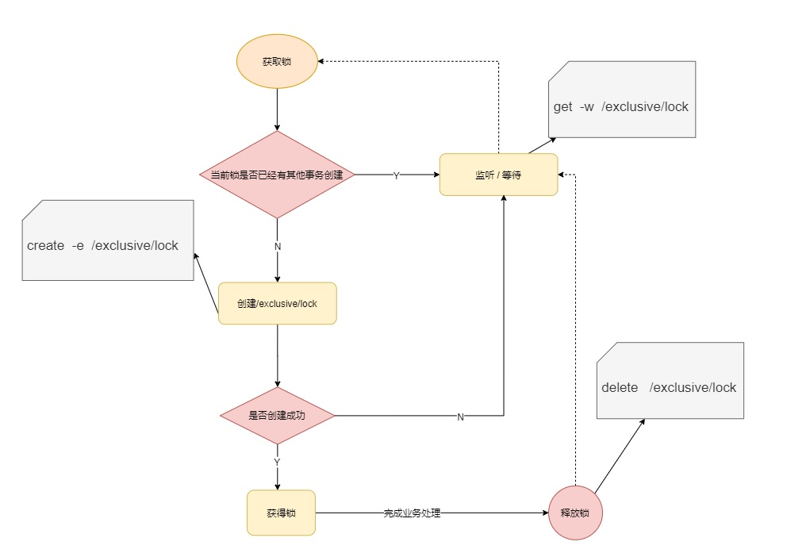
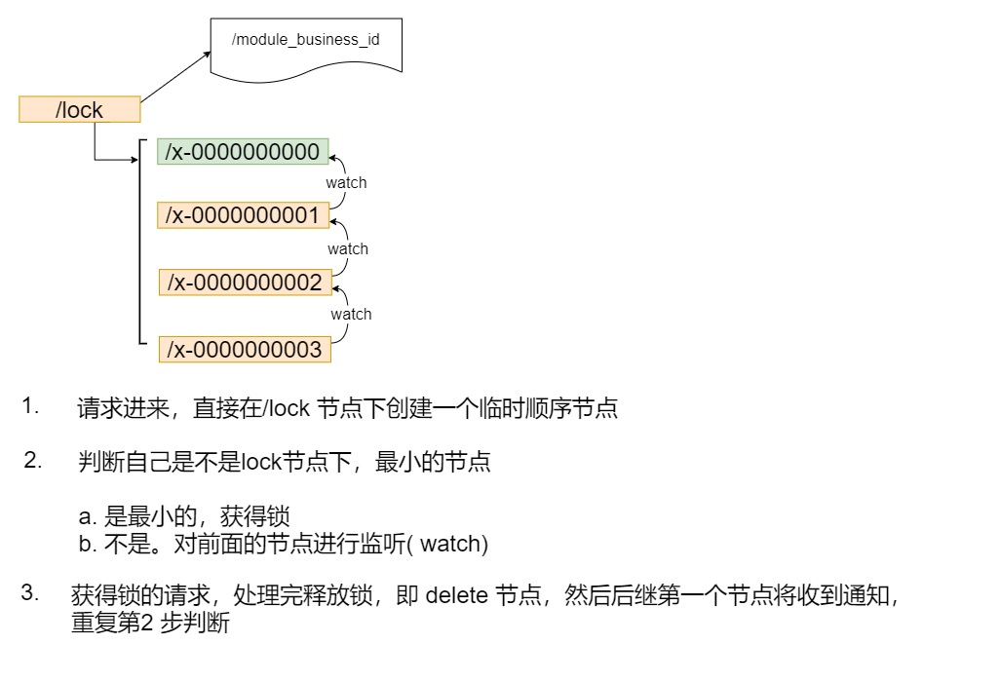
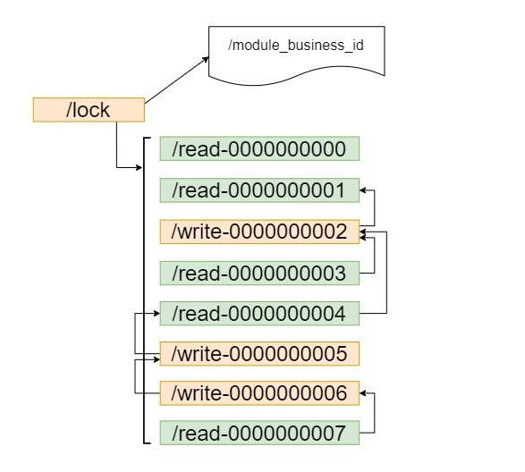

# 4. zookeeper实战

[[toc]]

## 4.1 ZK配置中心-Java原生客户端

zookeeper 官方的客户端没有和服务端代码分离， 他们为同一个jar 文件， 所以我们直接引入 zookeeper的maven即可， 这里版本请保持与服务端版本一致， 不然会有很多兼容性的问题

### 4.1.1 添加依赖

```xml
  <dependency>
   <groupId>org.apache.zookeeper</groupId>
   <artifactId>zookeeper</artifactId>
   <version>3.5.8</version>
  </dependency>
```
### 4.1.2 配置中心代码

```java
package zookeeper.client;

import com.fasterxml.jackson.databind.ObjectMapper;
import lombok.SneakyThrows;
import lombok.extern.slf4j.Slf4j;
import org.apache.zookeeper.*;

import java.io.IOException;
import java.util.concurrent.CountDownLatch;
import java.util.concurrent.TimeUnit;

@Slf4j
public class ConfigCenter {

    private final static  String CONNECT_STR="49.232.21.151:2181";

    private final static Integer  SESSION_TIMEOUT=30*1000;

    private static ZooKeeper zooKeeper=null;


    private static CountDownLatch countDownLatch=new CountDownLatch(1);

    public static void main(String[] args) throws IOException, InterruptedException, KeeperException {


        zooKeeper=new ZooKeeper(CONNECT_STR, SESSION_TIMEOUT, new Watcher() {
            @Override
            public void process(WatchedEvent event) {
                    if (event.getType()== Event.EventType.None
                            && event.getState() == Event.KeeperState.SyncConnected){
                        log.info("连接已建立");
                        countDownLatch.countDown();
                    }
            }
        });
        countDownLatch.await();


        MyConfig myConfig = new MyConfig();
        myConfig.setKey("anykey");
        myConfig.setName("anyName");

        ObjectMapper objectMapper=new ObjectMapper();

        byte[] bytes = objectMapper.writeValueAsBytes(myConfig);

        String s = zooKeeper.create("/myconfig", bytes, ZooDefs.Ids.OPEN_ACL_UNSAFE, CreateMode.PERSISTENT);


        Watcher watcher = new Watcher() {
            @SneakyThrows
            @Override
            public void process(WatchedEvent event) {
                if (event.getType()== Event.EventType.NodeDataChanged
                        && event.getPath()!=null && event.getPath().equals("/myconfig")){
                    log.info(" PATH:{}  发生了数据变化" ,event.getPath());
                    //todo 每次获取加上watch，方便一直监听
                    byte[] data = zooKeeper.getData("/myconfig", this, null);

                    MyConfig newConfig = objectMapper.readValue(new String(data), MyConfig.class);

                    log.info("数据发生变化: {}",newConfig);
                }
            }
        };

        byte[] data = zooKeeper.getData("/myconfig", watcher, null);
        MyConfig originalMyConfig = objectMapper.readValue(new String(data), MyConfig.class);
        log.info("原始数据: {}", originalMyConfig);
        TimeUnit.SECONDS.sleep(Integer.MAX_VALUE);
    }
}

```


## 4.2 Curator客户端

<a href='https://note.youdao.com/s/TKDySdmv'>https://note.youdao.com/s/TKDySdmv</a>


## 4.3 ZK分布式锁

### 4.3.1 ZK非公平锁

<a data-fancybox title="ZK非公平锁" href="./image/zklock01.jpg"></a> 


如上实现方式在并发问题比较严重的情况下，性能会下降的比较厉害，

主要原因是，所有的连接都在对同一个节点进行监听，当服务器检测到删除事件时，要通知所有的连接，所有的连接同时收到事件，再次并发竞争，这就是**羊群效应**。这种加锁方式是**非公平锁**的具体实现：


### 4.3.2 ZK公平锁

<a data-fancybox title="ZK公平锁" href="./image/zklock02.jpg"></a> 

```java
@PostMapping("/stock/deduct")
    public Object reduceStock(Integer id) throws Exception {
        //todo 创建锁--创建节点
        InterProcessMutex interProcessMutex = new InterProcessMutex(curatorFramework, "/product_" + id);

        try {
            //todo 获取锁
            //todo 获取锁，若失败则阻塞等待直到成功，支持重入
            //todo 超时获取锁，超时失败
            //todo public boolean acquire(long time, TimeUnit unit) throws Exception
            interProcessMutex.acquire();
            orderService.reduceStock(id);

        } catch (Exception e) {
            if (e instanceof RuntimeException) {
                throw e;
            }
        }finally {
            //todo 释放锁--删除节点
            interProcessMutex.release();
        }
        return "ok:" + port;
    }
```

如上借助于临时顺序节点，可以避免同时多个节点的并发竞争锁，缓解了服务端压力。这种实 现方式所有加锁请求都进行排队加锁，是**公平锁**的具体实现。


前面这两种加锁方式有一个共同的特质，就是都是**互斥锁**，同一时间只能有一个请求占用，如果 是大量的并发上来，性能是会急剧下降的，所有的请求都得加锁。

那是不是真的所有的请求都需要加锁呢？答案是否定的，比如如果数据没有进行任何修改的话，是不需要加锁的，但是如果读数据的请求还没读完，这个时候来了一个写请求，怎么办呢？有人已经在读数据了，这个时候是不能写数据的，不然数据就不正确了。

直到前面读锁全部释放掉以后，写请求才能执行，所以需 要给这个读请求加一个标识（读锁），让写请求知道，这个时候是不能修改数据的。不然数据就 不一致了。如果已经有人在写数据了，再来一个请求写数据，也是不允许的，这样也会导致数据 的不一致，所以所有的写请求，都需要加一个写锁，是为了避免同时对共享数据进行写操作。


### 4.3.3 ZK共享锁（读写锁）


<a data-fancybox title="ZK共享锁（读写锁）" href="./image/zklock03.jpg"></a> 

```java
@RestController
public class TestController {


    @Autowired
    private OrderService orderService;

    @Value("${server.port}")
    private String port;


    @Autowired
    CuratorFramework curatorFramework;

    @PostMapping("/stock/deduct")
    public Object reduceStock(Integer id) throws Exception {
        //todo 创建锁--创建节点
//        InterProcessMutex interProcessMutex = new InterProcessMutex(curatorFramework, "/product_" + id);
        //todo 创建读写锁--创建节点
        InterProcessReadWriteLock interProcessReadWriteLock = new InterProcessReadWriteLock(curatorFramework, "/product_" + id);
        InterProcessMutex interProcessMutex = interProcessReadWriteLock.writeLock();
        try {
            //todo 获取锁
            //todo 获取锁，若失败则阻塞等待直到成功，支持重入
            //todo 超时获取锁，超时失败
            //todo public boolean acquire(long time, TimeUnit unit) throws Exception
            interProcessMutex.acquire();
            orderService.reduceStock(id);

        } catch (Exception e) {
            if (e instanceof RuntimeException) {
                throw e;
            }
        }finally {
            //todo 释放锁--删除节点
            interProcessMutex.release();
        }
        return "ok:" + port;
    }
}
```

## 4.4 Leader选举

**zookeeper版本 3.5.9**

```java
package com.tqk.leader;

import org.apache.curator.RetryPolicy;
import org.apache.curator.framework.CuratorFramework;
import org.apache.curator.framework.CuratorFrameworkFactory;
import org.apache.curator.framework.recipes.leader.LeaderSelector;
import org.apache.curator.framework.recipes.leader.LeaderSelectorListener;
import org.apache.curator.framework.recipes.leader.LeaderSelectorListenerAdapter;
import org.apache.curator.retry.ExponentialBackoffRetry;

import java.util.concurrent.CountDownLatch;
import java.util.concurrent.TimeUnit;

/**
 * @author tianqikai
 */
public class LeaderSelectorDemo {


    private static  final  String CONNECT_STR="49.232.21.151:2181";


    private static RetryPolicy retryPolicy=new ExponentialBackoffRetry( 5*1000, 10 );

    private  static  CuratorFramework curatorFramework;


     private static CountDownLatch countDownLatch = new CountDownLatch(1);


    public static void main(String[] args) throws InterruptedException {


        String appName = System.getProperty("appName");

        CuratorFramework curatorFramework = CuratorFrameworkFactory.newClient(CONNECT_STR, retryPolicy);
        LeaderSelectorDemo.curatorFramework = curatorFramework;
        curatorFramework.start();
        countDownLatch.await();
        LeaderSelectorListener listener = new LeaderSelectorListenerAdapter()
        {
            @Override
            public void takeLeadership(CuratorFramework client) throws Exception
            {

                System.out.println(" I' m leader now . i'm , "+appName);

                TimeUnit.SECONDS.sleep(5);

            }
        };

        LeaderSelector selector = new LeaderSelector(curatorFramework, "/cachePreHeat_leader", listener);
        selector.autoRequeue();  // not required, but this is behavior that you will probably expect
        selector.start();
        
    }
}
```


## 4.5 注册中心实战

**zookeeper版本 3.5.9**

### 4.5.1 依赖文件

```xml
<?xml version="1.0" encoding="UTF-8"?>
<project xmlns="http://maven.apache.org/POM/4.0.0" xmlns:xsi="http://www.w3.org/2001/XMLSchema-instance"
	xsi:schemaLocation="http://maven.apache.org/POM/4.0.0 https://maven.apache.org/xsd/maven-4.0.0.xsd">
	<modelVersion>4.0.0</modelVersion>
	<parent>
		<groupId>org.springframework.boot</groupId>
		<artifactId>spring-boot-starter-parent</artifactId>
		<version>2.3.5.RELEASE</version>
		<relativePath/> <!-- lookup parent from repository -->
	</parent>
	<groupId>com.example</groupId>
	<artifactId>product-center</artifactId>
	<version>0.0.1-SNAPSHOT</version>
	<name>product-center</name>
	<description>Demo project for Spring Boot</description>

	<properties>
		<java.version>1.8</java.version>
		<spring-cloud.version>Hoxton.SR8</spring-cloud.version>
	</properties>

	<dependencies>
		<dependency>
			<groupId>org.springframework.boot</groupId>
			<artifactId>spring-boot-starter-web</artifactId>
		</dependency>
		<dependency>
			<groupId>org.springframework.cloud</groupId>
			<artifactId>spring-cloud-starter-zookeeper-discovery</artifactId>
		</dependency>

		<dependency>
			<groupId>org.projectlombok</groupId>
			<artifactId>lombok</artifactId>
			<optional>true</optional>
		</dependency>
	</dependencies>

	<dependencyManagement>
		<dependencies>
			<dependency>
				<groupId>org.springframework.cloud</groupId>
				<artifactId>spring-cloud-dependencies</artifactId>
				<version>${spring-cloud.version}</version>
				<type>pom</type>
				<scope>import</scope>
			</dependency>
		</dependencies>
	</dependencyManagement>

	<build>
		<plugins>
			<plugin>
				<groupId>org.springframework.boot</groupId>
				<artifactId>spring-boot-maven-plugin</artifactId>
			</plugin>
		</plugins>
	</build>

</project>
```
```yml
spring.application.name=product-center
#zookeeper 连接地址
spring.cloud.zookeeper.connect-string=122.51.156.245:2181
#将本服务注册到zookeeper
spring.cloud.zookeeper.discovery.register=true
spring.cloud.zookeeper.session-timeout=30000

```
### 4.5.2 启动类

```java
package com.example.productcenter;

import org.springframework.beans.factory.annotation.Value;
import org.springframework.boot.SpringApplication;
import org.springframework.boot.autoconfigure.SpringBootApplication;
import org.springframework.web.bind.annotation.GetMapping;
import org.springframework.web.bind.annotation.RestController;

@SpringBootApplication
@RestController
public class ProductCenterApplication {

	@Value("${server.port}")
	private String port;

	@Value( "${spring.application.name}" )
	private String name;

	@GetMapping("/getInfo")
	public String getServerPortAndName(){

		return  this.name +" : "+ this.port;
	}
	public static void main(String[] args) {
		SpringApplication.run(ProductCenterApplication.class, args);
	}

}

```


### 4.5.3 心跳检测

```java
@Component
@Slf4j
public class HeartbeatEventListener implements ApplicationListener<HeartbeatEvent> {


    @Override
    public void onApplicationEvent(HeartbeatEvent event) {

        Object value = event.getValue();
        ZookeeperServiceWatch source = (ZookeeperServiceWatch)event.getSource();

        log.info(" event:source: {} ,event:value{}",source.getCache().getCurrentChildren("/services"),value.toString());
    }
}
```

### 4.5.4 测试节点

```sh
[zk: localhost:2181(CONNECTED) 51] ls /services/product-center 
[019a8d7d-b0ac-4378-8891-42d2c1a9dc56, 69b74f63-3211-4438-90a4-e2f179e1056e]
[zk: localhost:2181(CONNECTED) 52] get /services/product-center/019a8d7d-b0ac-4378-8891-42d2c1a9dc56 
{"name":"product-center","id":"019a8d7d-b0ac-4378-8891-42d2c1a9dc56","address":"LAPTOP-SFSA2FB7","port":10002,"sslPort":null,"payload":{"@class":"org.springframework.cloud.zookeeper.discovery.ZookeeperInstance","id":"application-1","name":"product-center","metadata":{"instance_status":"UP"}},"registrationTimeUTC":1639586726475,"serviceType":"DYNAMIC","uriSpec":{"parts":[{"value":"scheme","variable":true},{"value":"://","variable":false},{"value":"address","variable":true},{"value":":","variable":false},{"value":"port","variable":true}]}}
```

### 4.5.6 消费者（略）