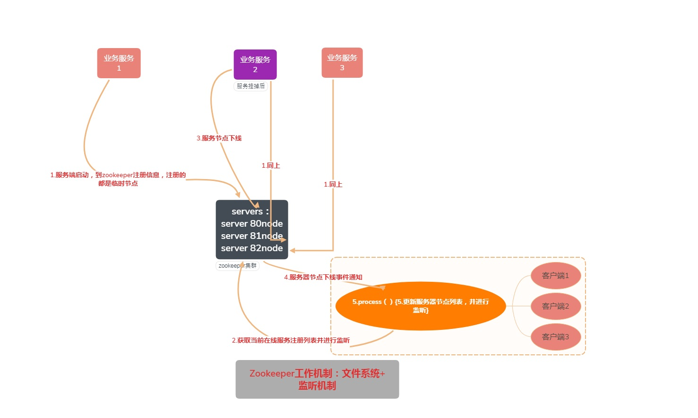
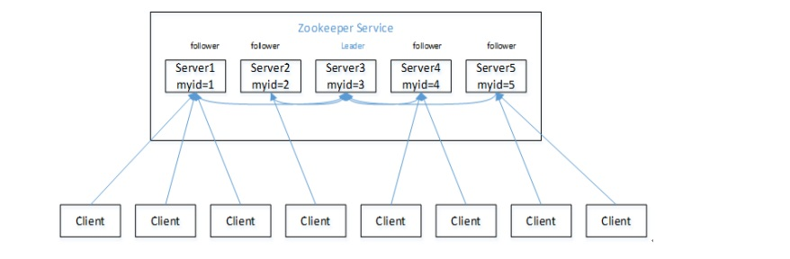
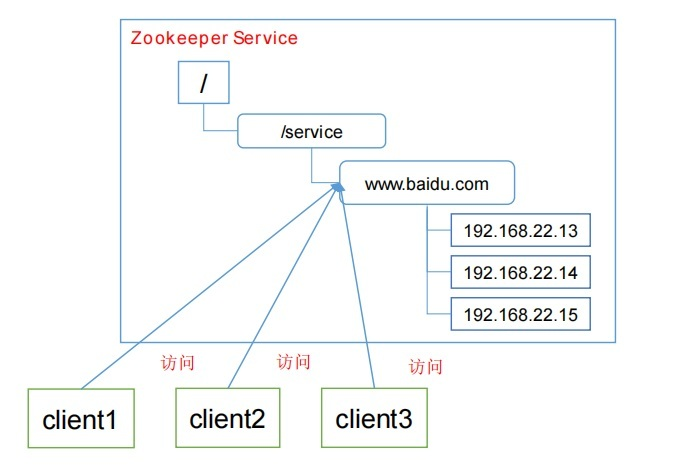
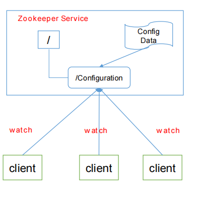
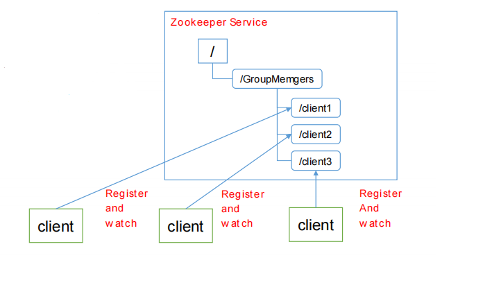
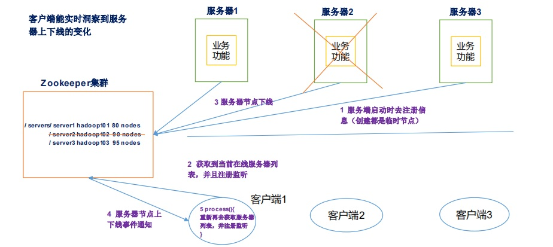
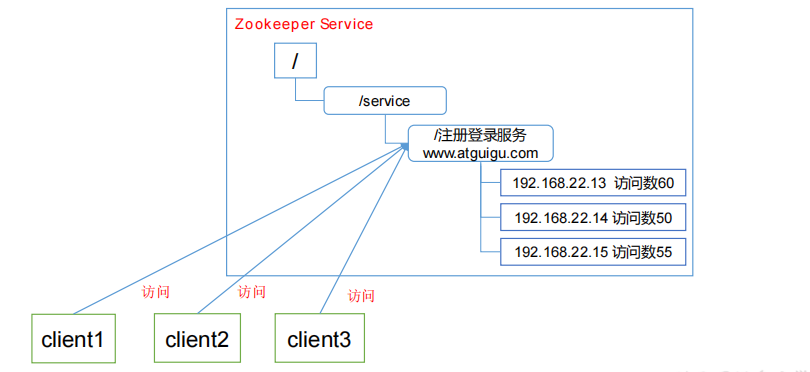

# 一、Zookeeper简介
[[toc]]
## 1.1 Zookeeper概述
Zookeeper是源代码开放的分布式协调服务，是一个高性能的分布式数据一致性的解决方案，它将那些复杂的，容易出错的分布式一致性服务封装起来。用户可以通过调用Zookeeper提供的接口来解决一些分布式应用中的实际问题.
## 1.2 Zookeeper工作机制
Zookeeper从设计模式的角度上来理解：属于观察者模型的一种分布式服务管理框架；它负责管理大家关心的数据和存储，然后接受观察者的注册;一旦这些数据的状态发生变化，zookeeper就会负责通知已经在zookeeper上注册的这些观察者做出相关的相应；

--------------

## 1.3 Zookeeper特点

1. Zookeeper：一个领导者（Leader），多个跟随者（Follower）组成的集群。 
2. 集群中只要有半数以上节点存活，Zookeeper集群就能正常服务。 
3. 全局数据一致：每个Server保存一份相同的数据副本，Client无论连接到哪个Server，数据都是一致的。 
4. 更新请求顺序进行，来自同一个Client的更新请求按其发送顺序依次执行。 
5. 数据更新原子性，一次数据更新要么成功，要么失败。 
6. 实时性，在一定时间范围内，Client能读到最新数据。

**zookeeper数据结构**  
ZooKeeper数据模型的结构与Unix文件系统很类似，整体上可以看作是一棵树，每个节点称做一个ZNode。每一个ZNode默认能够存储1M B的数据，每个ZNode都可以通过其路径唯一标识。

## 1.4 Zookeeper应用场景

 **提供的服务包括：统一命名服务、统一配置管理、统一集群管理、服务器节点动态上下线、软负载均衡等。**  
 1. <strong>统一命名服务</strong>  
 在分布式环境下，经常需要对应用/服务进行统一命名，便于识别。例如：IP不容易记住，而域名容易记住。  

 2. <strong>统一配置管理</strong>

 :::tip
 分布式环境下，配置文件同步非常常见：  
  （1）一般要求一个集群中，所有节点的配置信息是一致的，比如 Kafka 集群。  
  （2）对配置文件修改后，希望能够快速同步到各个节点上。  
 配置管理可交由ZooKeeper实现：   
 （1）可将配置信息写入ZooKeeper上的一个Znode。  
 （2）各个客户端服务器监听这个Znode。   
 （3）一 旦Znode中的数据被修改，ZooKeeper将通知各个客户端服务器。  
 :::

 3. <strong>统一集群管理</strong>

:::tip
 1. 分布式环境中，实时掌握每个节点的状态是必要的; 可根据节点实时状态做出一些调整。  
 2. ZooKeeper可以实现实时监控节点状态变化; 可将节点信息写入ZooKeeper上的一个ZNode。监听这个ZNode可获取它的实时状态变化。
:::

 4. <strong>服务器节点动态上下线</strong>

 5. <strong>软负载均衡</strong>

<strong>在Zookeeper中记录每台服务器的访问数，让访问数最少的服务器去处理最新的客户端请求</strong>

## 1.5 Zookeeper下载地址

[官网首页](https://zookeeper.apache.org/)
