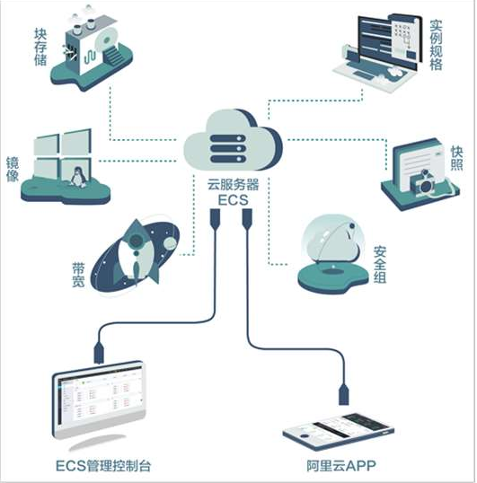
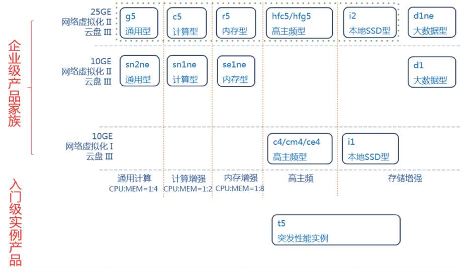
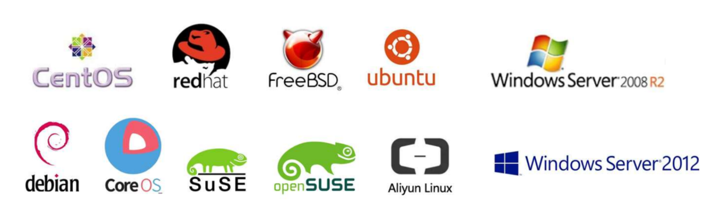

# 1.云服务器ECS

:::tip 考试范畴
**云服务器ECS（31%）**

- 熟悉云服务器ECS 相关的概念，主要包括地域及可用区、实例、磁盘、快照、镜像、网络、安全组；
- 了解云服务器ECS 的优势、计费、应用场景、API 及SDK；
- 能够基于云服务器ECS 产品进行应用的部署；
- 掌握云服务器ECS 实例、磁盘、安全组、快照、镜像和标签的使用和操作；
- 能够发现并解决云服务器ECS 实例的操作系统、服务器登录及其他产品使用中常见的问题；
- 能够基于云服务器ECS 与负载均衡SLB、专有网络VPC、对象存储OSS、内容分发网络CDN、云数据库RDS、弹性伸缩（AutoScaling）、云盾和云监控产品实现应用的解决方案；
:::

## 1.1 ECS的概念与定位

**概念**：云服务器 ECS（Elastic Compute Service）是一种`可弹性伸缩的计算服务`，助您降低 IT 成本，提升运维效率，使您更专注于核心业务创新

**定位**：最基础的计算服务

ECS及其上装载的操作系统，通常用作应用程序的运行环境。

**核心优势**： `弹性`

--------------------------------------

**ECS是由多个并列又相互关联的产品概念组成**  
:::tip  ECS组成  
- 实例（Instance）/ 实例规格（InstanceType）
- 磁盘（Disk）/ 快照（Snapshot）
- 镜像（Image）
- 虚拟专有网络（VPC, Virtual Private Cloud）/ EIP
- 安全组（Security Group）
- 地域（Region）/ 可用区（Zone）
:::

## 1.2 实例/实例规格

**实例（Instance）** 是提供计算服务的最小单位，由vCPU、内存、系统盘和镜像组成。
**实例规格（InstanceType）** 定义了实例的vCPU和内存的配置，代表能提供的计算能力。

• 根据业务场景和使用场景，ECS实例可以分为多种规格族。 
• 同一个规格族里，有多种不同的规格。

## 1.3 系统盘/系统镜像

**系统盘**：ECS必选组件，随ECS一起创建。 建议系统盘大小至少为40G  
**系统镜像**：阿里云提供了多个Window和Linux发行版本。

## 1.4 磁盘/快照/自定义镜像

**磁盘快照**：是磁盘数据在某一个时间点的拷贝，可以方便的创建实例的快照，保留某个时间点上的
系统数据状态，作为数据备份，或者制作镜像。

**自定义镜像**：从一个实例的系统盘快照，可以创建自定义镜像。当需要大规模复制同样的云服务器
时，自定义镜像是必不可少的，自定义镜像是可水平扩展的web层的自动伸缩服务的基础

## 1.5 专有网络

`VPC` 基于软件定义网络（SDN）和隧道技术（Tunneling），为用户建立隔离的、可自定义的虚拟专有网络。

1. 提供 VLAN 级别的安全隔离，阻断外部网络通讯；
2. 用户可以自定义网络拓扑，包括选择自有 IP 地址范围、划分网段、配置路由表和网关等；
3. 通过专线或VPN与原有数据中心连接，云上和云下的资源使用同一个网络地址规划，实现应
用的平滑迁移上云

<a data-fancybox title="专有网络" href="./image/ecs005.png">![专有网络]](./image/ecs005.png)</a>

## 1.6 安全组

**安全组：**
是阿里云上的虚拟防火墙。每个ECS实例至少要加入一
个安全组，同一安全组中的ECS拥有共同的安全策略。

**安全组规则：**
指定了一个或多个防火墙规则，规则包含容许/拒绝访
问的IP、端口等。

:::tip 典型的规则组成
-  source(ip range或安全组）
-  protocol
-  port
-  policy(accept/deny)
-  network type(内网或公网）
:::

<a data-fancybox title="安全组" href="./image/ecs006.png">![安全组]](./image/ecs006.png)</a>

<a data-fancybox title="安全组" href="./image/ecs007.png">![安全组]](./image/ecs007.png)</a>

## 1.7 ECS组件与地域/可用区的关系

<a data-fancybox title="ECS组件与地域/可用区的关系" href="./image/ecs008.png">![ECS组件与地域/可用区的关系]](./image/ecs008.png)</a>

## 1.8 弹性网卡

**弹性网卡**：

是一种可以附加到专有网络VPC类型ECS实例上的虚拟
网卡。通过弹性网卡，您可以在任何阿里云地域下实现
高可用集群搭建、低成本故障转移和精细化的网络管理。

**弹性网卡类型**：

1. `主网卡`：在创建专有网络实例
时随实例默认创建的弹性网卡
称作主网卡。主网卡的生命周
期和实例保持一致，无法分离
主网卡与实例。

2. `辅助网卡`：可以创建辅助网卡，
并将其附加到实例上或从实例
上分离。每个实例能附加的辅
助弹性网卡上限与实例规格相
关

<a data-fancybox title="弹性网卡" href="./image/ecs009.png">![弹性网卡]](./image/ecs009.png)</a>

## 1.9 标签

标签可以识别资源和用户组别，允许企业或个人将
相同云服务器ECS资源归类。便于搜索和资源聚合。 •支持添加标签的ECS服务或功能为：
ECS 实例、存储（包括云盘和共享块存储）、快
照、镜像和安全组等。

• 每个标签都由一对键值对（Key-Value）组成。

• 每个实例最多可以绑定20个标签，每次最多绑定
或解绑20个标签。  

• 每个资源的任一标签的标签键（Key）必须唯一，
相同标签键（Key）的标签会被覆盖。  

## 1.10  云助手

可以自动地批量地执行日常维护命令，完成运行
自动化运维脚本、轮询进程、安装或者卸载软件、
更新应用以及安装补丁等一些日常任务

<a data-fancybox title="云助手" href="./image/ecs010.png">![云助手]](./image/ecs010.png)</a>

:::tip 应用场景：
- 运行自动化运维脚本
- 运行实例上已有的脚本
- 软件生命周期管理
- 部署代码或者应用
- 轮询进程
- 安装补丁
- 从OSS或者yum源获取更新
- 修改主机名或登录密码
:::

## 1.11  ECS的创建与管理

<a data-fancybox title="ECS的创建与管理" href="./image/ecs011.png">![ECS的创建与管理]](./image/ecs011.png)</a>

### 1.11.2 ECS的管理方式：控制台
(1)登录控制台  
(2)选择“ECS”  
(3)选择“实例”   
(4)选择地域   
(5)找到实例   
(6)选择操作  

<a data-fancybox title="ECS的管理方式：控制台" href="./image/ecs012.png">![ECS的管理方式：控制台]](./image/ecs012.png)</a>
