# 1. VMware安装

## 1.1 创建虚拟机
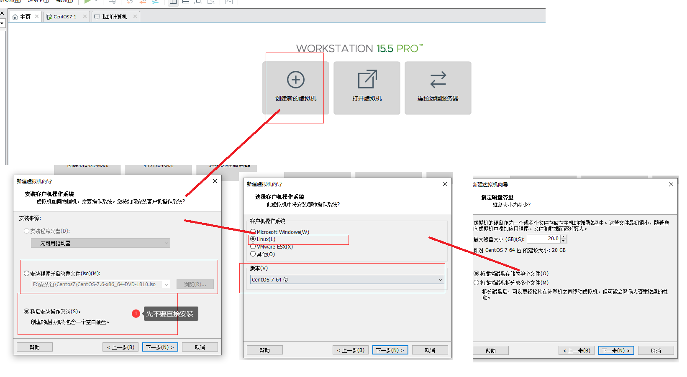
## 1.2 配置镜像源
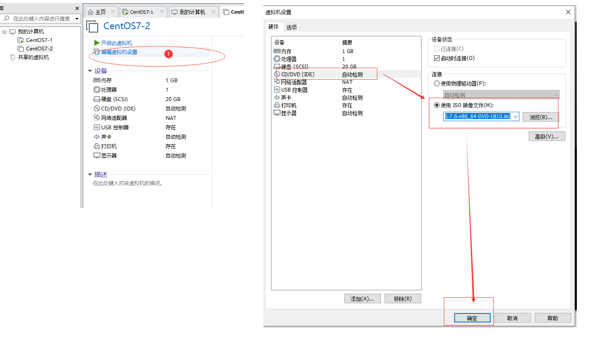
## 1.3 开启虚拟机

**开启虚拟机按提示一步一步安装即可**

# 2. VMware没有本地适配器问题
**遇到错误：安装VMware Workstation Pro这个软件，网络适配器中没有虚拟网卡，导致无法上网**

**出现这种情况的原因是：之前也按照过后，但是你卸载的时候可能方法不对，导致VMware**

## 2.1 Everything软件清理残余文件
如果已经安装好了的话,请先卸载掉(也可以不卸载)

## 2.2 打开服务
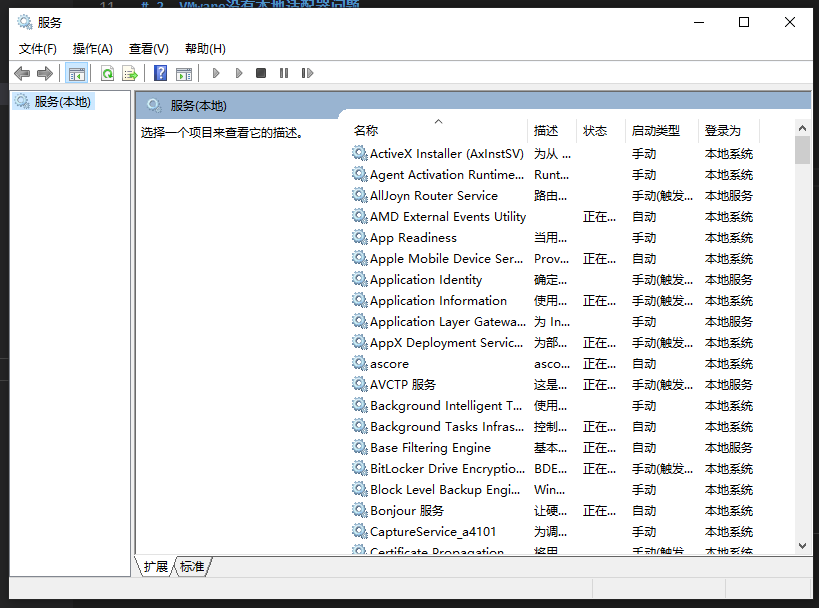

- 找到下面这两个服务，设置成自动开启，最初始是手动的(下面这个是我之前已经设置好了的)


- 如果你已经安装了VMware的话，那么将VMware开头的改为禁用，如果VMware已经卸载的话，也看看有没有这个服务，有的话，也改为禁用吧（下面截图是我已经安装好了，只参考服务名，记住是VMware开头的）
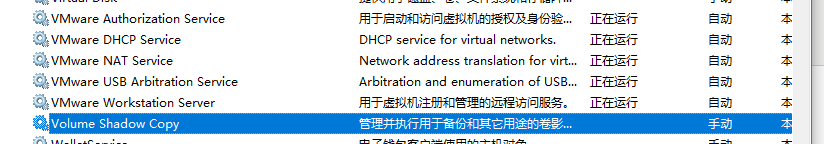

- 上面的步骤做好了之后呢，去这个https://www.52pojie.cn/thread-623430-1-1.html网站下载工具包，然后解压，直接可以用

- 解压之后，打开CCleaner.exe文件，并点击到下面这个选项，点击扫描注册，并且修复选定问题
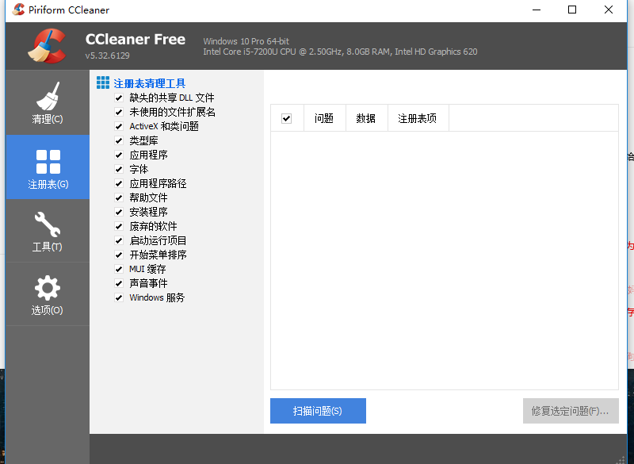
- 修复完毕之后呢，如果你之前安装过了，打开VMware这个软件，打开虚拟网络编辑器，这个虚拟网络编辑器在编辑选项下面，

    - 看到下面这个页面了，**点击还原默认设置**(在这之前先点击更改设置)，这样就可以解决了
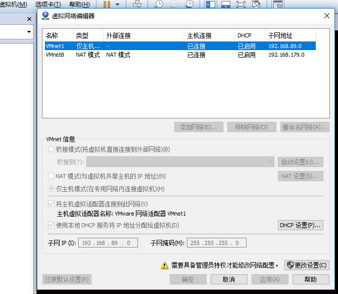

    - 如果你之前没有安装VMware的话，那就先安装吧，安装过后应该就会有虚拟网络适配器了。没有的话，再**还原默认设置**

- 再去网络连接那里，看看适配器，就会出现下面这个图

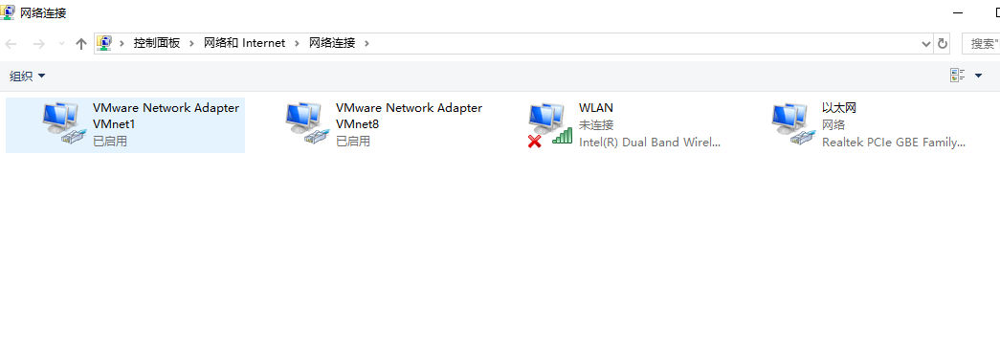

# 3. Xshell连接Linux虚拟机

- 检查Linux虚拟机的网络连接模式，确保它是NAT模式。（由于只在本机进行连接，所以没有选择桥接模式。当然，桥接模式的配置会有所不同，在此不做深入分析）
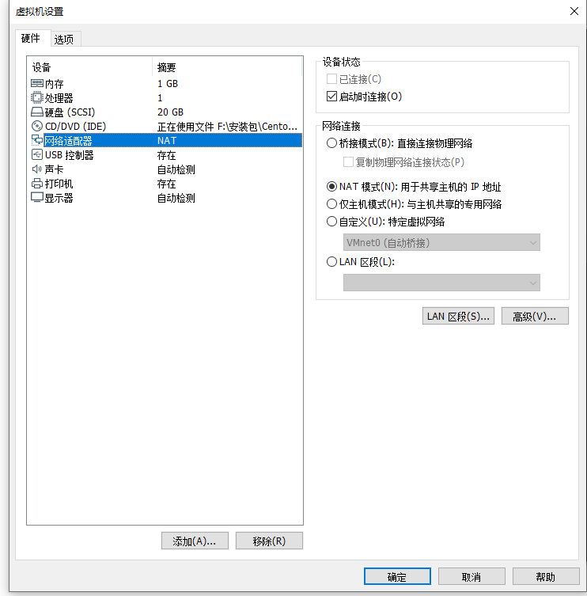


- 在VMware workstation里，点击菜单栏上的【编辑】-->【虚拟网络编辑器】，打开下方的虚拟网络编辑器。选择VMnet8（NAT模式），取消勾选【使用本地DHCP服务...】（若勾选，会设置动态IP）。 

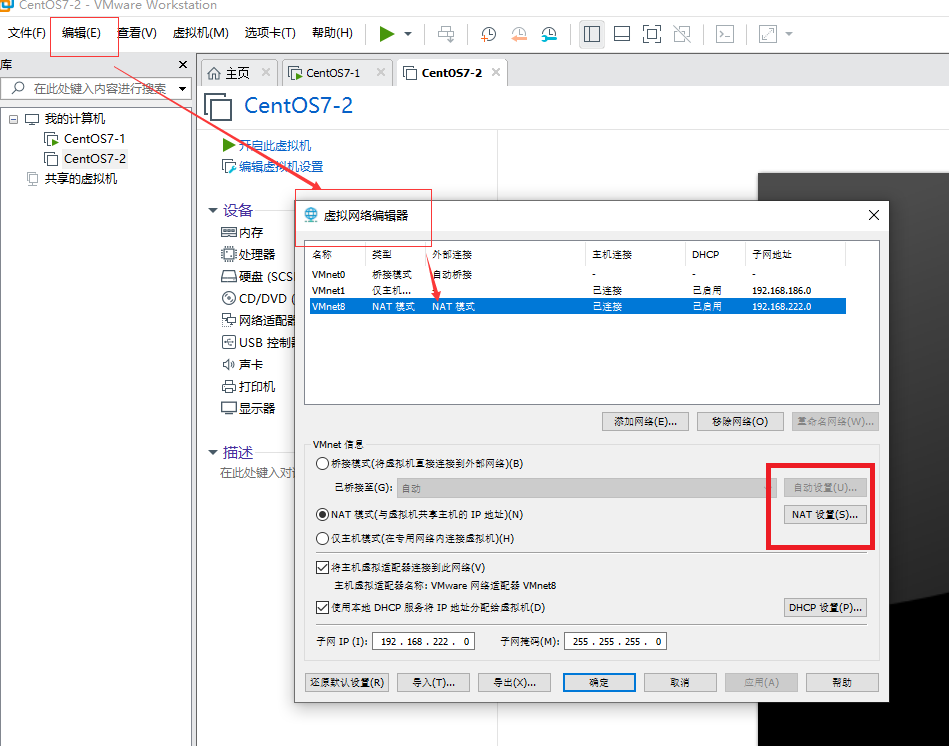

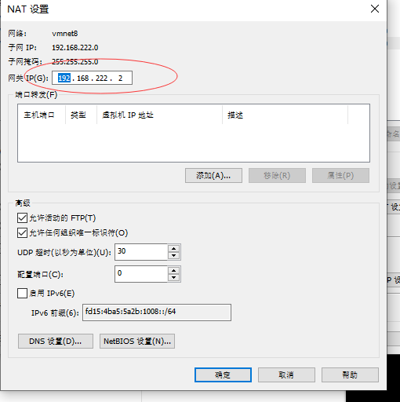
记住上图中的子网IP范围，如上图所示表示虚拟机在192.168.222.0~192.168.222.255范围内。


**注**：上图中192.168.222.2为网关地址，192.168.222.255为广播地址，192.168.222.0一般为网段IP，所以0,2,255这三个地址不能设置


# 4. 设置虚拟机的IP、DNS和主机名


- 设置IP地址、子网掩码和网关，如下图。

#vi /etc/sysconfig/network-scripts/ifcfg-ens* （*根据实际情况不同，本文为ens33）

```bash
#vi /etc/sysconfig/network-scripts/ifcfg-ens
TYPE=Ethernet
PROXY_METHOD=none
BROWSER_ONLY=no
BOOTPROTO=static
DEFROUTE=yes
IPV4_FAILURE_FATAL=no
IPV6INIT=yes
IPV6_AUTOCONF=yes
IPV6_DEFROUTE=yes
IPV6_FAILURE_FATAL=no
IPV6_ADDR_GEN_MODE=stable-privacy
NAME=ens33
UUID=cd0f49f5-715a-496e-92ec-77643dfce32d
DEVICE=ens33
ONBOOT=yes
IPADDR=192.168.222.3
NETMASK=255.255.255.0
GATEWAY=192.168.222.2


```

:::tip 参数说明
- ONBOOT：是指系统启动时是否激活网卡，默认为no，设置为yes，表示开机启动时激活网卡。

- BOOTPROTO：网络分配方式，静态。（一定记得修改为Static，否则无法连通网络）

- IPPADDR：手动指定ip地址。

- NETMASK：子网掩码。

- GATEWAY：网关ip。
:::

- 设置DNS

#vi /etc/resolv.conf

```bash
#vi /etc/resolv.conf
# Generated by NetworkManage
nameserver 192.168.222.2

```


- 设置主机名

#vi /etc/sysconfig/network
```bash
# vi /etc/sysconfig/network
# Created by anaconda
NETWORKING=yes
HOSTNAME=k8s-Master

```
#vi /etc/hostname

```
#vi /etc/hostname
localhost.localdomain
k8s-Master
```


- 上述文件配置成功后，重启虚拟机或使用**service network restart**命令重启网卡。

```sh
service network restart
```

- 设置VMnet8在Windows上的IP属性，如下图。（打开控制面板-->网络和Internet，在右侧点击【更改适配器设置】，进入“网络连接”页面）
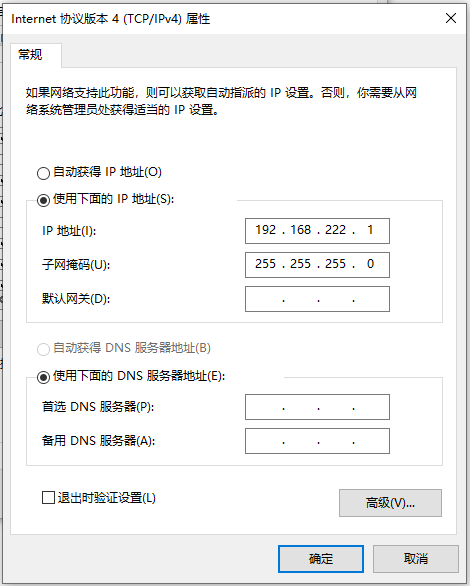


- 配置完上述步骤后就可以成功使用Xshell连接Linux虚拟机了

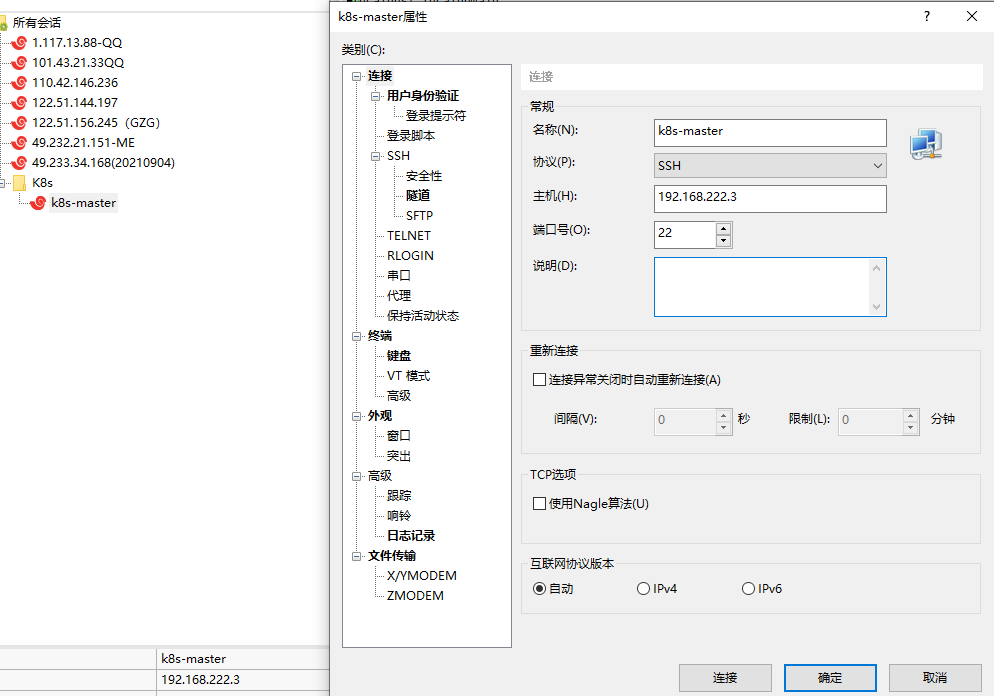


## 检查是否可以上网。

```sh
ping 114.114.114.114
```

- 如果不可以，调试通。通了之后下一步：

- 然后检查DNS设置是否正常。

```sh
ping www.baidu.com
```

- 不正常的话，设置DNS，如下：

```bash
#vi /etc/resolv.conf
nameserver 223.5.5.5
nameserver 223.6.6.6
#nameserver 114.114.114.144
#nameserver 114.114.115.115

#保存后。
#重启服务或者机器，再次ping baidu.或者下面连接。通了即可以。
#ping mirrorlist.centos.org
```
