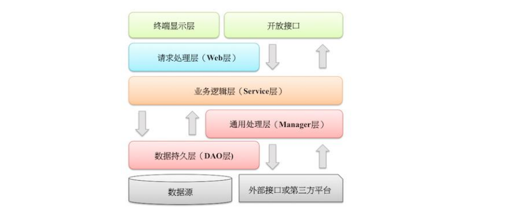

# 4. 工程结构 

## 4.1 应用分层 

<a data-fancybox title="应用分层" href="./01.png"></a>

### 4.1.1 应用分层
1. <font color='#7fb80e'>【推荐】</font>图中默认上层依赖于下层，箭头关系表示可直接依赖，

如：开放接口层可以依赖于Web 层，也可以直接依赖于 Service 层，依此类推：

- **开放接口层**：可直接封装 Service 方法暴露成 RPC 接口；通过 Web 封装成 http 接口；进行网关安全控制、流量控制等。
- **终端显示层**：各个端的模板渲染并执行显示的层。当前主要是 velocity 渲染，JS 渲染，JSP 渲染，移动端展示等。
- **Web 层**：主要是对访问控制进行转发，各类基本参数校验，或者不复用的业务简单处理等。
- **Service 层**：相对具体的业务逻辑服务层。
- **Manager 层**：通用业务处理层

:::tip 它有如下特征：
- 1） 对第三方平台封装的层，预处理返回结果及转化异常信息；
- 2） 对 Service 层通用能力的下沉，如缓存方案、中间件通用处理；
- 3） 与 DAO 层交互，对多个 DAO 的组合复用。
:::

- **DAO 层**：数据访问层，与底层 MySQL、Oracle、Hbase 进行数据交互。
- **外部接口或第三方平台**：包括其它部门 RPC 开放接口，基础平台，其它公司的 HTTP 接口。

### 4.1.2 分层异常处理规约

2. <font color='#8552a1'>【参考】</font> （分层异常处理规约）

- 在 `DAO 层`，产生的异常类型有很多，无法用细粒度的异常进行 catch，使用 catch(Exception e)方式，

并 throw new DAOException(e)，不需要打印日志，因为日志在 Manager/Service 层一定需要捕获并打到日志文件中去，如果同台服务器再打日志，浪费性能和存储。

- 在 `Service 层`出现异常时，必须记录出错日志到磁盘，尽可能带上参数信息，相当于保护案发现场。

- 如果 `Manager 层`与 Service 同机部署，日志方式与 DAO层处理一致，如果是单独部署，则采用与 Service 一致的处理方式。

- `Web 层`绝不应该继续往上抛异常，因为已经处于顶层，无继续处理异常的方式，如果意识到这个异常将导致页面无法正常
渲染，那么就应该直接跳转到友好错误页面，加上友好的错误提示信息。

- `开放接口层`要将异常处理成错误码和错误信息方式返回。

### 4.1.3 分层领域模型规约
3. <font color='#8552a1'>【参考】</font>分层领域模型规约：

- `DO（Data Object）`：与数据库表结构一一对应，通过 DAO 层向上传输数据源对象。
- `DTO（Data Transfer Object）`：数据传输对象，Service 和 Manager 向外传输的对象。
- `BO（Business Object）`：业务对象。可以由 Service 层输出的封装业务逻辑的对象。
- `Query`：数据查询对象，各层接收上层的查询请求。注：超过 2 个参数的查询封装，禁止使用 Map 类来传输。
- `VO（View Object）`：显示层对象，通常是 Web 向模板渲染引擎层传输的对象。 

## 4.2 二方库依赖 

### 4.2.1 定义GAV遵从以下规则

1. <font color='red'>【强制】</font>定义 GAV 遵从以下规则：

- 1） GroupID 格式：com.{公司/BU }.业务线.[子业务线]，最多 4 级。

<font color='#8e7437'>说明：</font>{公司/BU} 例如：alibaba/taobao/tmall/aliexpress 等 BU 一级；子业务线可选。  

<font color='#1d953f'>正例：</font>com.taobao.jstorm 或 com.alibaba.dubbo.register

- 2） ArtifactID 格式：产品线名-模块名。语义不重复不遗漏，先到中央仓库去查证一下。

<font color='#1d953f'>正例：</font>dubbo-client / fastjson-api / jstorm-tool

- 3） Version：详细规定参考下方。

### 4.2.2 二方库版本号命名方式：主版本号.次版本号.修订号
2. <font color='red'>【强制】</font>二方库版本号命名方式：主版本号.次版本号.修订号

:::tip 二方库版本号命名
- 1） 主版本号：当做了不兼容的 API 修改，或者增加了能改变产品方向的新功能。
- 2） 次版本号：当做了向下兼容的功能性新增（新增类、接口等）。
- 3） 修订号：修复 bug，没有修改方法签名的功能加强，保持 API 兼容性。
:::

<font color='#8e7437'>说明：</font>注意：起始版本号必须为：1.0.0，而不是 0.0.1 正式发布的类库必须先去中央仓库
进行查证，使版本号有延续性，正式版本号不允许覆盖升级。

如当前版本：1.3.3，那么下一个合理的版本号：1.3.4 或 1.4.0 或 2.0.0

### 4.2.3 线上应用不要依赖 SNAPSHOT 版本

3. <font color='red'>【强制】</font>线上应用不要依赖 SNAPSHOT 版本（安全包除外）。

<font color='#8e7437'>说明：</font>不依赖 SNAPSHOT 版本是保证应用发布的幂等性。另外也可以加快编译时的打包构建。

### 4.2.4 二方库的新增或升级

4. <font color='red'>【强制】</font>二方库的新增或升级，保持除功能点之外的其它jar包仲裁结果不变。

如果有改变，必须明确评估和验证，建议进行 `dependency:resolve `前后信息比对，

如果仲裁结果完全不一致，那么通过 `dependency:tree `命令，找出差异点，进行&lt;excludes&gt;排除 jar 包。

:::tip 依赖库
- 一方库：本工程范围内，各个模块和包之间的相互依赖。
- 二方库：引入的同一个公司内部的其他工程。
- 三方库：公司以外的其他依赖，比如apache，google等。
:::

### 4.2.5 二方库里可以定义枚举类型

5. <font color='red'>【强制】</font>二方库里可以定义枚举类型，参数可以使用枚举类型，但是接口返回值不允许使用枚
举类型或者包含枚举类型的 POJO 对象。

### 4.2.6 依赖于一个二方库群时，定义统一的版本变量
6. <font color='red'>【强制】</font>依赖于一个二方库群时，必须定义一个统一的版本变量，避免版本号不一致。

<font color='#8e7437'>说明：</font>依赖 springframework-core,-context,-beans，它们都是同一个版本，可以定义一
个变量来保存版本：${spring.version}，定义依赖的时候，引用该版本。

### 4.2.7 禁止在子项目的 pom 依赖中出现相同的 GroupId，相同的 ArtifactId，但是不同的Version。

7. <font color='red'>【强制】</font>禁止在子项目的 pom 依赖中出现相同的 GroupId，相同的 ArtifactId，但是不同的Version。

<font color='#8e7437'>说明：</font>在本地调试时会使用各子项目指定的版本号，但是合并成一个 war，只能有一个版本号
出现在最后的 lib 目录中。可能出现线下调试是正确的，发布到线上却出故障的问题。


- GroupID是项目组织唯一的标识符，实际对应JAVA的包的结构，是main目录里java的目录结构。

- ArtifactID就是项目的唯一的标识符，实际对应项目的名称，就是项目根目录的名称。一般GroupID就是填com.leafive.test这样子

```xml
    <groupId>com.tqk</groupId>
    <artifactId>SecKill</artifactId>
    <version>0.0.1-SNAPSHOT</version>
```

### 4.2.8  pom 文件中的依赖声明放在dependencies
8. <font color='#7fb80e'>【推荐】</font>所有 pom 文件中的依赖声明放在&lt;dependencies&gt;语句块中，所有版本仲裁放在
&lt;dependencyManagement&gt;语句块中。

<font color='#8e7437'>说明：</font>&lt;dependencyManagement&gt;里只是声明版本，并不实现引入，因此子项目需要显式的声
明依赖，version 和 scope 都读取自父 pom。

而&lt;dependencies&gt;所有声明在主 pom 的&lt;dependencies&gt;里的依赖都会自动引入，并默认被所有的子项目继承。

### 4.2.9 二方库不要有配置项，最低限度不要再增加配置项
9. <font color='#7fb80e'>【推荐】</font>二方库不要有配置项，最低限度不要再增加配置项。

### 4.2.10 二方库发布者应当遵循以下原则
10. <font color='#8552a1'>【参考】</font>为避免应用二方库的依赖冲突问题，

:::tip 二方库发布者应当遵循以下原则：
- 1）**精简可控原则**。移除一切不必要的 API 和依赖，只包含 Service API、必要的领域模型对象、Utils 类、常量、枚举等。如果依赖其它二方库，尽量是 provided 引入，让二方库使用者去依赖具体版本号；无 log 具体实现，只依赖日志框架。

- 2）**稳定可追溯原则**。每个版本的变化应该被记录，二方库由谁维护，源码在哪里，都需要能方便查到。除非用户主动升级版本，否则公共二方库的行为不应该发生变化。
::: 

## 4.3 服务器 

### 4.3.1 高并发服务器建议调小 TCP 协议的 time_wait 超时时间
1. <font color='#7fb80e'>【推荐】</font>高并发服务器建议调小 TCP 协议的 time_wait 超时时间。

<font color='#8e7437'>说明：</font>操作系统默认 240 秒后，才会关闭处于 time_wait 状态的连接，在高并发访问下，服
务器端会因为处于 time_wait 的连接数太多，可能无法建立新的连接，所以需要在服务器上调小此等待值。

<font color='#1d953f'>正例：</font>在 linux 服务器上请通过变更`/etc/sysctl.conf` 文件去修改该缺省值（秒）：

```conf
net.ipv4.tcp_fin_timeout = 30
```

### 4.3.2 调大服务器所支持的最大文件句柄数

2. <font color='#7fb80e'>【推荐】</font>调大服务器所支持的最大文件句柄数（File Descriptor，简写为 fd）。

<font color='#8e7437'>说明：</font>主流操作系统的设计是将 TCP/UDP 连接采用与文件一样的方式去管理，

即一个连接对应于一个 fd。主流的 linux 服务器默认所支持最大 fd 数量为 `1024`，当并发连接数很大时很

容易因为 fd 不足而出现“open too many files”错误，导致新的连接无法建立。 

建议将 linux服务器所支持的最大句柄数调高数倍（与服务器的内存数量相关）。

### 4.3.3 给JVM设置-XX:+HeapDumpOnOutOfMemoryError 参数

3. <font color='#7fb80e'>【推荐】</font>给 JVM 设置-XX:+HeapDumpOnOutOfMemoryError 参数，让 JVM 碰到 OOM 场景时输出dump 信息。

<font color='#8e7437'>说明：</font>OOM 的发生是有概率的，甚至有规律地相隔数月才出现一例，出现时的现场信息对查错非常有价值。

### 4.3.4 服务器内部重定向使用 forward

4. <font color='#8552a1'>【参考】</font>服务器内部重定向使用 forward；外部重定向地址使用 URL 拼装工具类来生成，否则会带来 URL 维护不一致的问题和潜在的安全风险

```java
// 使用forward()方法

RequestDispatcher rd = request.getRequestDispatcher("wel.jsp");
rd.forward(request, response);
// 这种方法实现跳转效率高，同时request对象还可以在下一个页面引用，并且有助于隐藏实际的链接
```