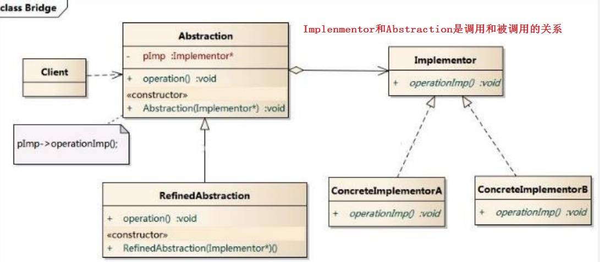
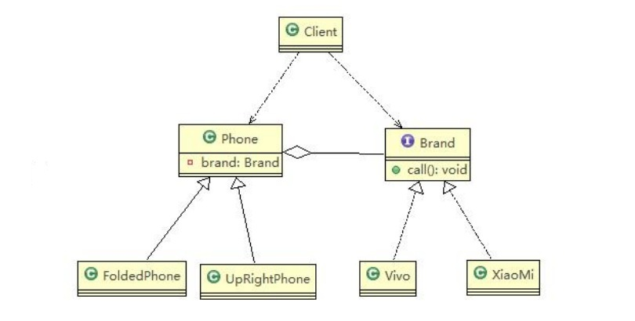
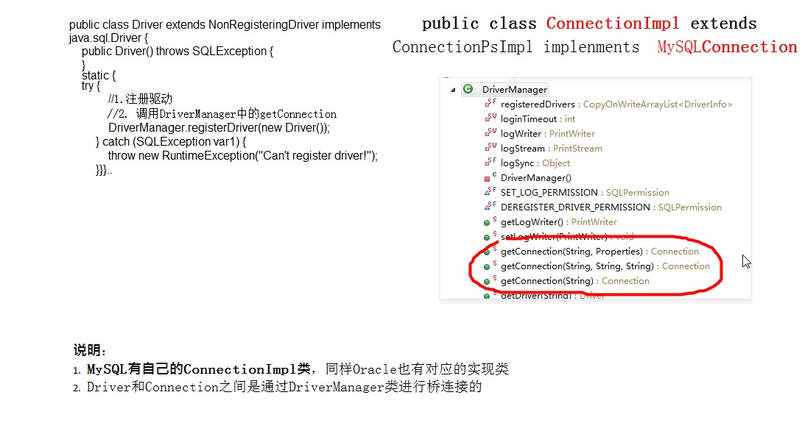
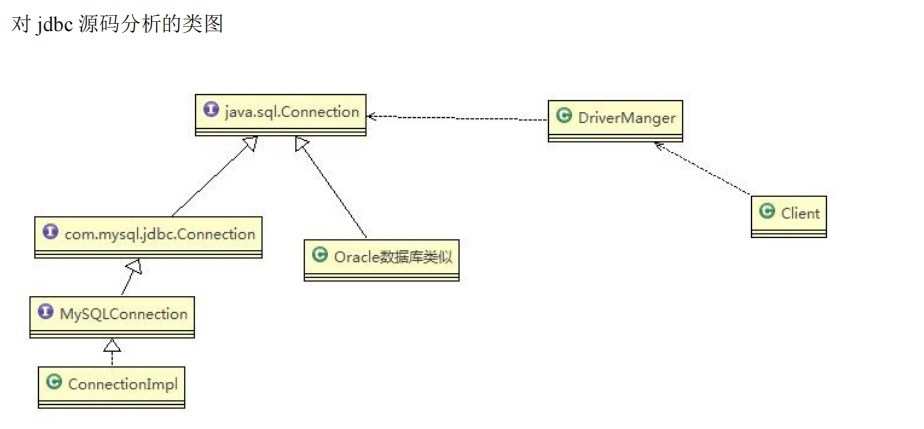

# 桥接模式

## 桥接模式(Bridge)-基本介绍
1. 桥接模式(Bridge模式)是指：将实现与抽象放在两个不同的类层次中，使两个层次可以独立改变。
2. 是一种结构型设计模式
3. Bridge模式基于类的最小设计原则，通过使用封装、聚合及继承等行为让不同的类承担不同的职责。它的主要特点是把抽象(Abstraction)与行为实现(Implementation)分离开来，从而可以保持各部分的独立性以及应对他们的功能扩展

**总结：** 具体实现就是 抽象类中成员属性包含接口实现，抽象类中的方法：调用接口中的方法

<a data-fancybox title="桥接模式" href="./image/Bridge2.jpg"></a>

```java
//接口
public interface Brand {
	void open();
	void close();
	void call();
}


class Vivo implements Brand {

	@Override
	public void open() {
		// TODO Auto-generated method stub
		System.out.println(" Vivo手机开机 ");
	}

	@Override
	public void close() {
		// TODO Auto-generated method stub
		System.out.println(" Vivo手机关机 ");
	}

	@Override
	public void call() {
		// TODO Auto-generated method stub
		System.out.println(" Vivo手机打电话 ");
	}

}
 class XiaoMi implements Brand {

	@Override
	public void open() {
		// TODO Auto-generated method stub
		System.out.println(" 小米手机开机 ");
	}

	@Override
	public void close() {
		// TODO Auto-generated method stub
		System.out.println(" 小米手机关机 ");
	}

	@Override
	public void call() {
		// TODO Auto-generated method stub
		System.out.println(" 小米手机打电话 ");
	}

}
```
```java
public abstract  class Phone {
    private  Brand brand;

    public Phone(Brand brand) {
        this.brand = brand;
    }
    String open(){
        return this.brand.open();
    }
    String close(){
        return this.brand.close();
    }
    String call(){
        return this.brand.call();
    }
}
public class UpRightPhone extends Phone{
    public UpRightPhone(Brand brand) {
        super(brand);
    }

    @Override
    String open() {
        String typeName=super.open();
        System.out.println(typeName+"直立手机开机");
        return typeName;
    }

    @Override
    String close() {
        String typeName=super.close();
        System.out.println(typeName+"直立手机关机");
        return typeName;
    }

    @Override
    String call() {
        String typeName=super.call();
        System.out.println(typeName+"直立手机打电话");
        return typeName;
    }
}
//折叠式手机类，继承 抽象类 Phone
public class FoldedPhone  extends Phone{
    public FoldedPhone(Brand brand) {
        super(brand);
    }
    @Override
    String open(){
        String typeName=super.open();
        System.out.println(typeName+"折叠式手机开机");
        return typeName;
    }
    @Override
    String close(){
        String typeName=super.close();
        System.out.println(typeName+"折叠式手机关机");
        return typeName;
    }
    @Override
    String call(){
        String typeName=super.call();
        System.out.println(typeName+"折叠式手机打电话");
        return typeName;
    }
}
```
```java
public class Client {
    public static void main(String[] args) {
        FoldedPhone xmfl=new FoldedPhone(new XiaoMi());
        xmfl.open();
        xmfl.call();
        UpRightPhone hwur=new UpRightPhone(new HuaWei());
        hwur.open();
        hwur.call();
    }
}
```
<a data-fancybox title="桥接模式" href="./image/Bridge.jpg"></a>

## 桥接模式在JDBC的源码剖析

1. Jdbc 的 Driver接口，如果从桥接模式来看，Driver就是一个接口，下面可以有MySQL的Driver，Oracle的Driver，这些就可以当做实现接口类
2. 代码分析+Debug源码

<a data-fancybox title="桥接模式在JDBC的源码剖析" href="./image/BridgeJDBC2.jpg"></a>


<a data-fancybox title="桥接模式在JDBC的源码剖析" href="./image/BridgeJDBC.jpg"></a>

## 桥接模式其它应用场景

1. 对于那些不希望使用继承或因为多层次继承导致系统类的个数急剧增加的系统，桥接模式尤为适用.  
2. 常见的应用场景:  
-JDBC驱动程序  
-银行转账系统  
转账分类: 网上转账，柜台转账，AMT转账  
转账用户类型：普通用户，银卡用户，金卡用户..  
-消息管理  
消息类型：即时消息，延时消息  
消息分类：手机短信，邮件消息，QQ消息...  
