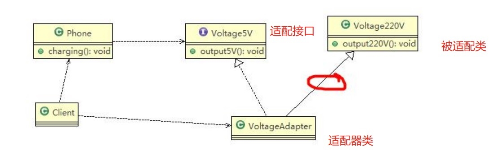
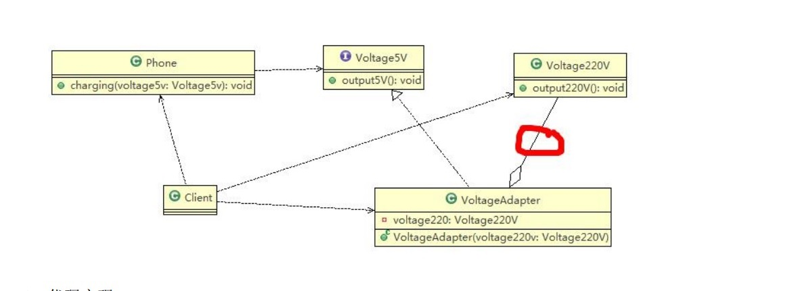

# 适配器模式

## 适配器模式基本介绍

:::tip 适配器模式基本介绍
1. **适配器模式(Adapter Pattern)** 将某个类的接口转换成客户端期望的另一个接口表示，主的目的是兼容性，让原本因接口不匹配不能一起工作的两个类可以协同工作。其别名为包装器(Wrapper)
2. 适配器模式属于结构型模式
3. 主要分为三类：<font color='red'><strong>类适配器模式、对象适配器模式、接口适配器模式</strong></font>
:::

## 类适配器模式介绍
基本介绍：Adapter类，通过继承 src类，实现 dst 类接口，完成src->dst的适配。

**类适配器模式应用实例**
<a data-fancybox title="类适配器模式" href="./image/classadapter.jpg"></a>
1. 以生活中充电器的例子来讲解适配器，充电器本身相当于Adapter，220V交流电相当于src (即被适配者)，我们的目dst(即 目标)是5V直流电

```java
public class Client {
    public static void main(String[] args) {
        // TODO Auto-generated method stub
        System.out.println(" === 类适配器模式 ====");
        Phone phone = new Phone();
        phone.charging(new VoltageAdapter());
    }
}
//适配器类
public class VoltageAdapter extends Voltage220V implements IVoltage5V {
	@Override
	public int output5V() {
		// TODO Auto-generated method stub
		//获取到220V电压
		int srcV = output220V();
		int dstV = srcV / 44 ; //转成 5v
		return dstV;
	}
}
//被适配的类
public class Voltage220V {
	//输出220V的电压
	public int output220V() {
		int src = 220;
		System.out.println("电压=" + src + "伏");
		return src;
	}
}
//适配接口
public interface IVoltage5V {
    public int output5V();
}

public class Phone {
    //充电
    public void charging(IVoltage5V iVoltage5V) {
        if(iVoltage5V.output5V() == 5) {
            System.out.println("电压为5V, 可以充电~~");
        } else if (iVoltage5V.output5V() > 5) {
            System.out.println("电压大于5V, 不能充电~~");
        }
    }
}
```

## 对象适配器模式

1. 基本思路和类的适配器模式相同，只是将Adapter类作修改，不是继承src类，而是持有src类的实例，以解决兼容性的问题。即:持有src类，实现dst类接口， 完成src->dst的适配
2. 根据"合成复用原则"，在系统中尽量使用关联关系来替代继承关系。
3. **对象适配器模式是适配器模式常用的一种**

<a data-fancybox title="对象适配器模式" href="./image/objectadapter.jpg"></a>

```java
public class Client {
	public static void main(String[] args) {
		// TODO Auto-generated method stub
		System.out.println(" === 对象适配器模式 ====");
		Phone phone = new Phone();
		phone.charging(new VoltageAdapter(new Voltage220V()));
	}
}
//适配器类
public class VoltageAdapter  implements IVoltage5V {

    private Voltage220V voltage220V; // 关联关系-聚合
    //通过构造器，传入一个 Voltage220V 实例
    public VoltageAdapter(Voltage220V voltage220v) {

        this.voltage220V = voltage220v;
    }
    @Override
    public int output5V() {

        int dst = 0;
        if(null != voltage220V) {
            int src = voltage220V.output220v();//获取220V 电压
            System.out.println("使用对象适配器，进行适配~~");
            dst = src / 44;
            System.out.println("适配完成，输出的电压为=" + dst);
        }
        return dst;
    }
}
//被适配的类
public class Voltage220V {
	//输出220V的电压
	public int output220V() {
		int src = 220;
		System.out.println("电压=" + src + "伏");
		return src;
	}
}
//适配接口
public interface IVoltage5V {
    public int output5V();
}

public class Phone {
    //充电
    public void charging(IVoltage5V iVoltage5V) {
        if(iVoltage5V.output5V() == 5) {
            System.out.println("电压为5V, 可以充电~~");
        } else if (iVoltage5V.output5V() > 5) {
            System.out.println("电压大于5V, 不能充电~~");
        }
    }
}
```
## 接口适配器模式
1. 一些书籍称为：适配器模式(Default Adapter Pattern)或缺省适配器模式。
2. 当不需要全部实现接口提供的方法时，可先设计一个抽象类实现接口，并为该接口中每个方法提供一个默认实现（空方法），那么该抽象类的子类可有选择地覆盖父类的某些方法来实现需求
3. 适用于一个接口不想使用其所有的方法的情况

```java
public interface InterfaceAdapter {
    public void m1();
    public void m2();
    public void m3();
    public void m4();
}
//在AbsAdapter 我们将 Interface4 的方法进行默认实现
public abstract  class AbsAdapter implements InterfaceAdapter{
    public void m1() {

    }
    public void m2() {

    }
    public void m3() {

    }
    public void m4() {

    }
}
public class Client {
    public static void main(String[] args) {
        AbsAdapter absAdapter1=new AbsAdapter() {
            @Override
            public void m1() {
                System.out.println("调用方法1");
            }
        };
        absAdapter1.m1();
    }
}
```

## 适配器模式在SpringMVC框架应用的源码分析