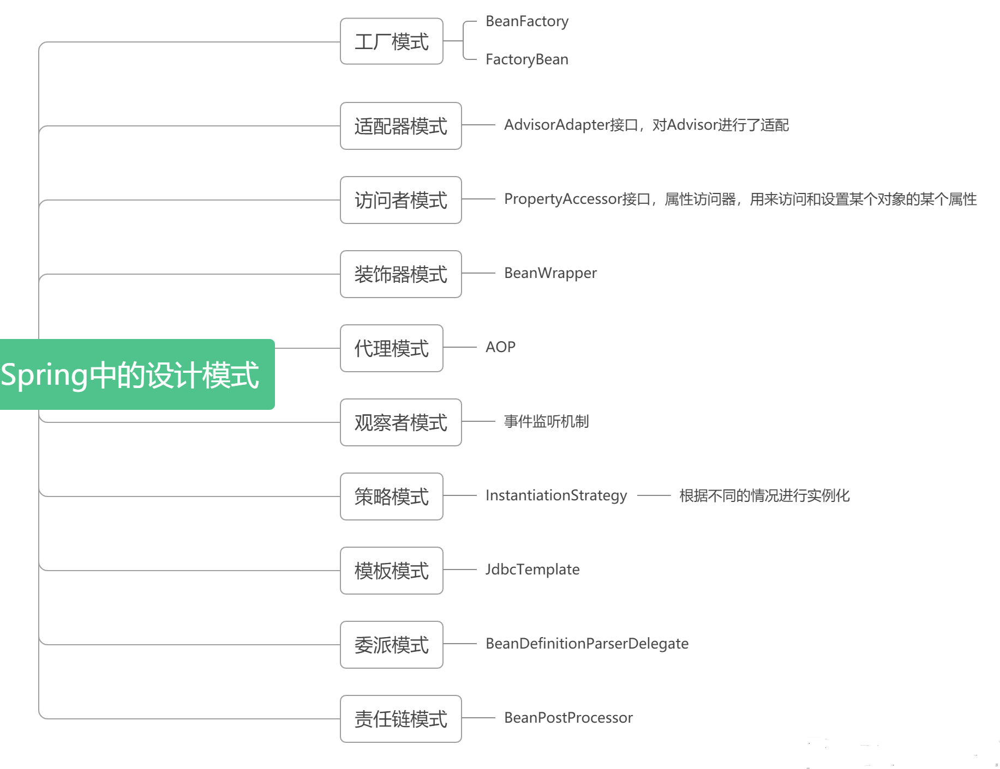

# 5. 开发框架

## 5.1 Spring中的Bean创建的⽣命周期有哪些步骤

:::tip Spring中⼀个Bean的创建⼤概分为以下⼏个步骤：
1. 推断构造⽅法
2. 实例化
3. 填充属性， 也就是依赖注⼊
4. 处理Aware回调
5. 初始化前， 处理@PostConstruct注解
6. 初始化， 处理InitializingBean接⼝
7. 初始化后， 进⾏AOP
:::

当然其实真正的步骤更加细致， 可以看下⾯的流程图

## 5.2 Spring中Bean是线程安全的吗

Spring本身并没有针对Bean做线程安全的处理：
1. 如果Bean是⽆状态的， 那么Bean则是线程安全的
2. 如果Bean是有状态的， 那么Bean则不是线程安全的

-----------------------

另外， Bean是不是线程安全， 跟Bean的作⽤域没有关系， Bean的作⽤域只是表示Bean的⽣命周期范围， 对于任何⽣命周期的Bean都是⼀个对象， 这个对象是不是线程安全的， 还是得看这个Bean对象本 身。

## 5.3 ApplicationContext和BeanFactory有什么区别

BeanFactory是Spring中⾮常核⼼的组件， 表示Bean⼯⼚， 可以⽣成Bean， 维护Bean， ⽽ApplicationContext继承了BeanFactory， 所以ApplicationContext拥有BeanFactory所有的特点， 也是⼀个Bean⼯⼚， 但是ApplicationContext除开继承了BeanFactory之外， 还继承了诸如EnvironmentCapable、MessageSource、ApplicationEventPublisher等接⼝， 从⽽ApplicationContext还有获取系统环境变量、国际化、事件发布等功能， 这是BeanFactory所不具备的

## 5.4 Spring中的事务是如何实现的

1. Spring事务底层是基于数据库事务和AOP机制的
2. ⾸先对于使⽤了@Transactional注解的Bean， Spring会创建⼀个代理对象作为Bean
3.  当调⽤代理对象的⽅法时， 会先判断该⽅法上是否加了@Transactional注解
4. 如果加了， 那么则利⽤事务管理器创建⼀个数据库连接
5. 并且修改数据库连接的autocommit属性为false， 禁⽌此连接的⾃动提交， 这是实现Spring事务⾮ 常重要的⼀步
6. 然后执⾏当前⽅法， ⽅法中会执⾏sql
7. 执⾏完当前⽅法后， 如果没有出现异常就直接提交事务
8. 如果出现了异常， 并且这个异常是需要回滚的就会回滚事务， 否则仍然提交事务
9. Spring事务的隔离级别对应的就是数据库的隔离级别
10. Spring事务的传播机制是Spring事务⾃⼰实现的， 也是Spring事务中最复杂的
11. Spring事务的传播机制是基于数据库连接来做的， ⼀个数据库连接⼀个事务， 如果传播机制配置为 需要新开⼀个事务， 那么实际上就是先建⽴⼀个数据库连接， 在此新数据库连接上执⾏sql

## 5.5 Spring中什么时候@Transactional会失效

1. 因为Spring事务是基于`代理来实现的`， 所以某个加了`@Transactional的⽅法只有是被代理对象调⽤时， 那么这个注解才会⽣效`， 所以如果是被代理对象来调⽤这个⽅法， 那么@Transactional是不会失效的。

2. 同时如果某个⽅法是`private的`， 那么@Transactional也会失效， 因为底层cglib是基于⽗⼦类来实现的， `⼦类是不能重载⽗类的private⽅法的`， 所以⽆法很好的利⽤代理， 也会导致@Transactianal失效

## 5.6 Spring容器启动流程是怎样的

:::tip 在创建Spring容器， 也就是启动Spring时：
1. ⾸先会进⾏扫描， 扫描得到所有的BeanDefinition对象， 并存在⼀个Map中
2. 然后筛选出`⾮懒加载的单例BeanDefinition`进⾏创建Bean， 对于`多例Bean不需要在启动过程中去进⾏创建`， 对于多例Bean会在每次获取Bean时利⽤BeanDefinition去创建
3. 利⽤BeanDefinition创建Bean就是Bean的创建⽣命周期， 这期间包括了合并`BeanDefinition、推断构造⽅法、实例化、属性填充、初始化前、初始化、初始化后`等步骤， 其中AOP就是发⽣在初始化后这⼀步骤中
--------------------

4. 单例Bean创建完了之后， Spring会发布⼀个容器启动事件
5. Spring启动结束
6. 在源码中会更复杂， ⽐如源码中会提供⼀些模板⽅法， 让⼦类来实现， ⽐如源码中还涉及到⼀些 BeanFactoryPostProcessor和BeanPostProcessor的注册， Spring的扫描就是通过BenaFactoryPostProcessor来实现的， 依赖注⼊就是通过BeanPostProcessor来实现的
7. 在Spring启动过程中还会去处理@Import等注解

## 5.7 Spring⽤到了哪些设计模式

## 5.8 SpringMVC的底层⼯作流程

1. ⽤户发送请求⾄前端控制器DispatcherServlet。
2. DispatcherServlet 收到请求调⽤  HandlerMapping 处理器映射器。
3. 处理器映射器找到具体的处理器(可以根据 xml 配置、注解进⾏查找)， ⽣成处理器及处理器拦截器 (如果有则⽣成)⼀并返回给 DispatcherServlet。
4. DispatcherServlet 调⽤  HandlerAdapter 处理器适配器。
5. HandlerAdapter 经过适配调⽤具体的处理器(Controller， 也叫后端控制器)
6. Controller 执⾏完成返回 ModelAndView。
7. HandlerAdapter 将 controller 执⾏结果 ModelAndView 返回给 DispatcherServlet。
8. DispatcherServlet 将 ModelAndView 传给 ViewReslover 视图解析器。
9. ViewReslover 解析后返回具体 View。
10. DispatcherServlet 根据 View 进⾏渲染视图 （即将模型数据填充⾄视图中）  。
11. DispatcherServlet 响应⽤户。

## 5.9 SpringBoot中常⽤注解及其底层实现
1. @SpringBootApplication注解： 这个注解标识了⼀个SpringBoot⼯程， 它实际上是另外三个注解 的组合， 这三个注解是：
    - @SpringBootConfiguration： 这个注解实际就是⼀个@Configuration， 表示启动类也是⼀个 配置类
    - @EnableAutoConfiguration： 向Spring容器中导⼊了⼀个Selector， ⽤来加载ClassPath下 SpringFactories中所定义的⾃动配置类， 将这些⾃动加载为配置Bean
    - @ComponentScan： 标识扫描路径， 因为默认是没有配置实际扫描路径， 所以SpringBoot扫 描的路径是启动类所在的当前⽬录
2. @Bean注解： ⽤来定义Bean， 类似于XML中的<bean>标签， Spring在启动时， 会对加了@Bean注 解的⽅法进⾏解析， 将⽅法的名字做为beanName， 并通过执⾏⽅法得到bean对象
3. @Controller、@Service、@ResponseBody、@Autowired都可以说

## 5.10 SpringBoot是如何启动Tomcat的
1. ⾸先， SpringBoot在启动时会先创建⼀个Spring容器
2. 在创建Spring容器过程中， 会利⽤`@ConditionalOnClass`技术来判断当前classpath中是否存在`Tomcat依赖`， 如果存在则会⽣成⼀个`启动Tomcat的Bean`
3. Spring容器创建完之后， 就会获取启动Tomcat的Bean， 并创建Tomcat对象， 并绑定端⼝等， 然后启动Tomcat

## 5.11 SpringBoot中配置⽂件的加载顺序是怎样的？

优先级从⾼到低， ⾼优先级的配置覆盖低优先级的配置， 所有配置会形成互补配置。
1. 命令⾏参数 。所有的配置都可以在命令⾏上进⾏指定；
2. Java系统属性 （System.getProperties()） ；
3. 操作系统环境变量 ；
4. jar包外部的application-{profile}.properties或application.yml(带spring.profile)配置⽂件
5. jar包内部的application-{profile}.properties或application.yml(带spring.profile)配置⽂件 再来加 载不带profile
6. jar包外部的application.properties或application.yml(不带spring.profile)配置⽂件
7. jar包内部的application.properties或application.yml(不带spring.profile)配置⽂件
8. @Configuration注解类上的@PropertySource

## 5.12 Mybatis存在哪些优点和缺点

> **优点：**
1. 基于 SQL 语句编程， 相当灵活， 不会对应⽤程序或者数据库的现有设计造成任何影响， SQL单独写， 解除 sql 与程序代码的耦合， 便于统⼀管理。
2. 与 JDBC 相⽐， 减少了50%以上的代码量， 消除了JDBC⼤量冗余的代码， 不需要⼿动开关连接；
3. 很好的与各种数据库兼容 （ 因为 MyBatis 使⽤ JDBC 来连接数据库， 所以只要JDBC ⽀持的数据 库MyBatis 都⽀持）  。
4. 能够与 Spring 很好的集成；
5. 提供映射标签， ⽀持对象与数据库的 ORM 字段关系映射；  提供对象关系映射标签， ⽀持对象关 系组件维护。

> **缺点：**
1. SQL 语句的编写⼯作量较⼤， 尤其当字段多、关联表多时， 对开发⼈员编写SQL 语句的功底有⼀定要求。
2. SQL 语句依赖于数据库， 导致数据库移植性差， 不能随意更换数据库

## 5.13 Mybatis中#{}和${}的区别是什么？
1. `#{}是预编译处理、是占位符`，`${}是字符串替换 、是拼接符`
2. Mybatis 在处理#{}时， 会将 sql 中的#{}替换为?号， 调⽤  PreparedStatement 来赋值
3. Mybatis 在处理${}时， 就是把${}替换成变量的值， 调⽤ Statement 来赋值
4. 使⽤`#{}可以有效的防⽌SQL注⼊`， 提⾼系统安全性

