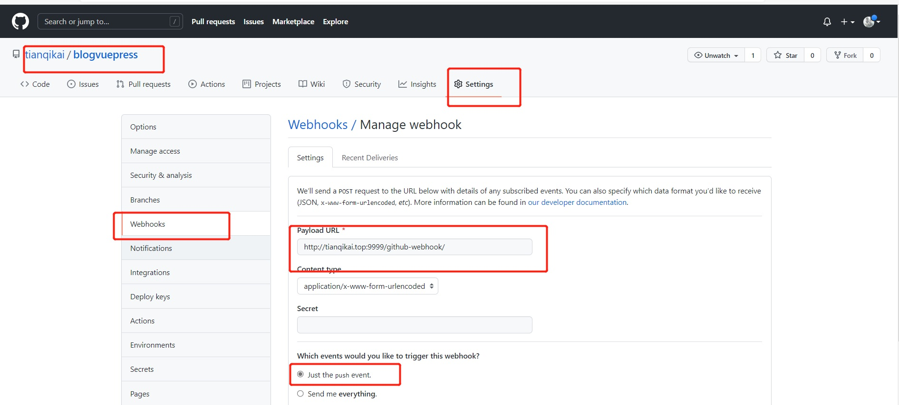
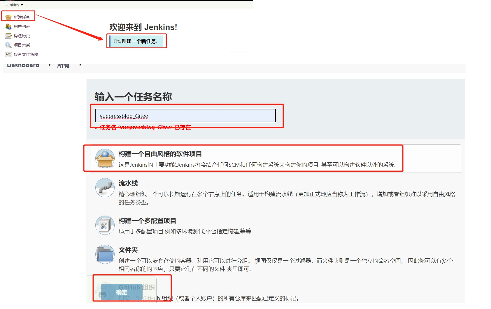
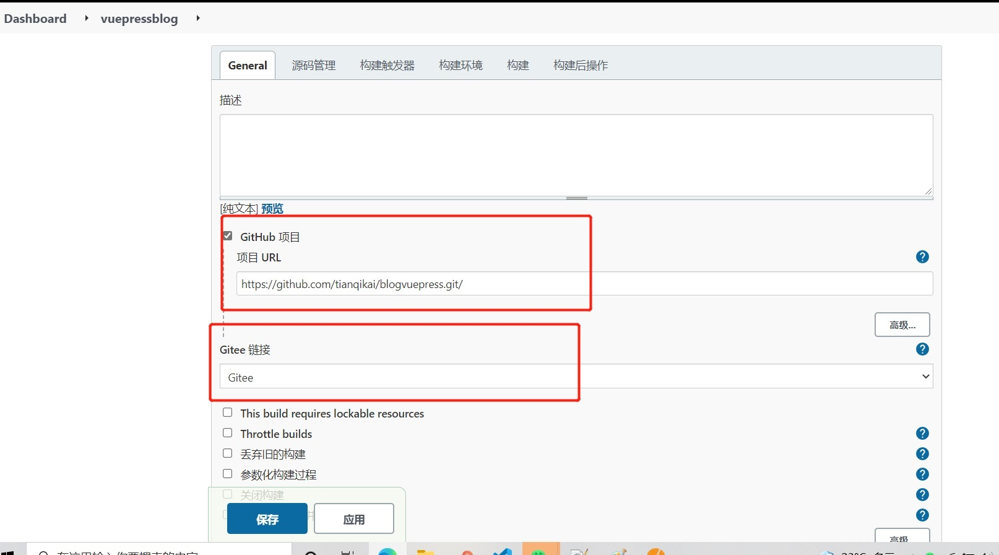
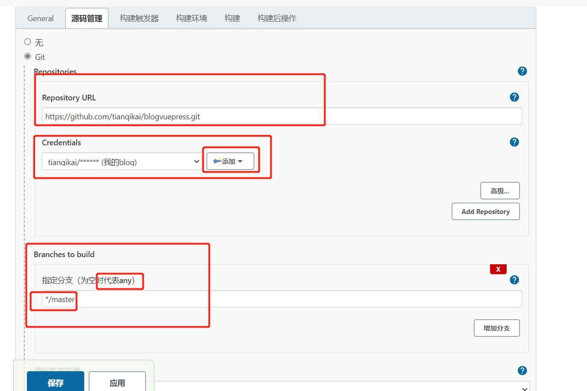
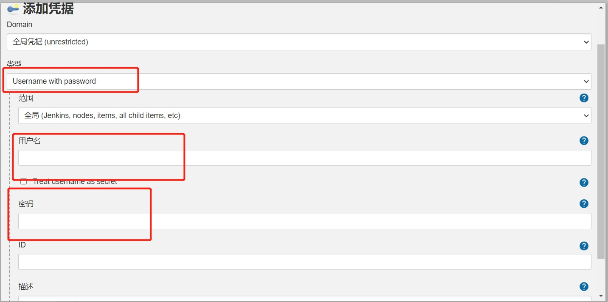
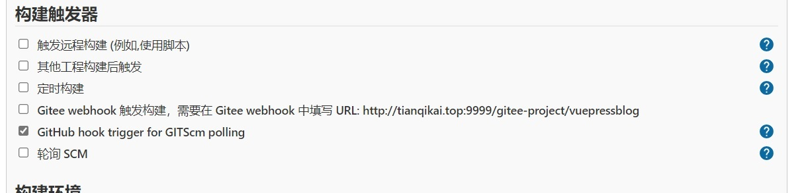
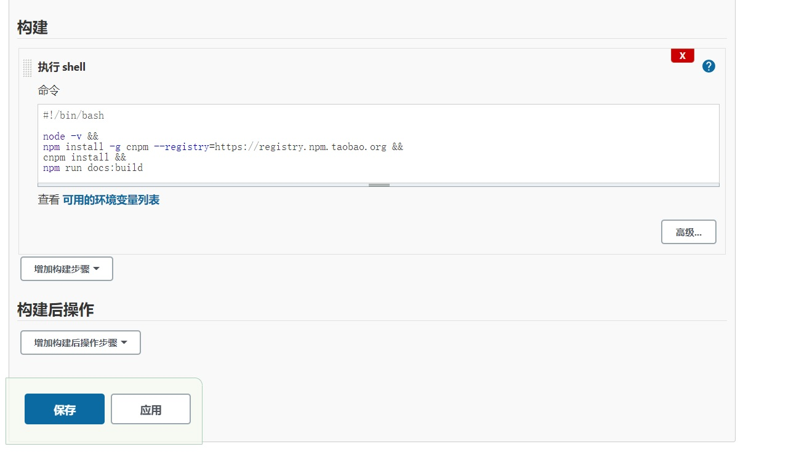

# 3. Jenkins+GitHub自动化构建
[[toc]]
## 3.1 Jenkins安装Github插件

Jenkins如果默认已经安装过来，可不执行此步骤

**系统管理->插件管理->可用插件**

 

## 3.2 配置GitHub链接

**系统管理->系统配置->GitHub配置**
 

 

**GitHub添加WebHook**
 

## 3.3 创建一个自由风格的任务

 

### 3.3.1 General

 

### 3.3.2 源码管理

 

 

### 3.3.3 构建触发器

 

### 3.3.4 构建

 
