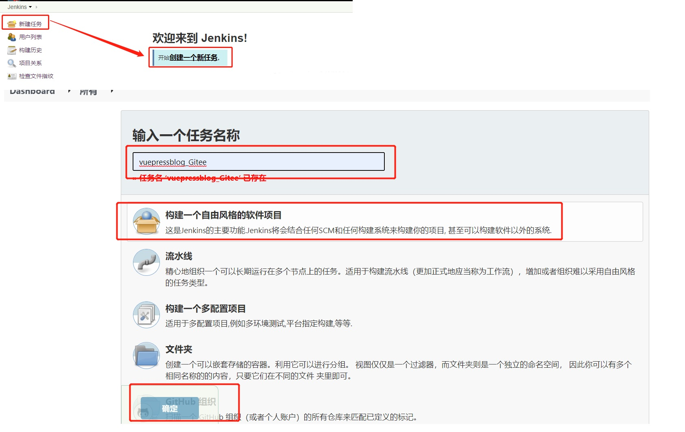

# 2. Jenkins+Gitee自动化构建

## 2.1 安装Gitee插件

系统管理->插件管理->可选插件->筛选Gitee->选中直接安装，安装成功之后重启jenkins服务

<a data-fancybox title="安装Gitee插件" href="./image/JenkinsGitee0.jpg"></a> 

## 2.2 添加Gitee(码云)链接配置

系统管理->系统配置->Gitee配置

<a data-fancybox title="添加Gitee链接配置" href="./image/JenkinsGitee1.jpg"></a> 

<a data-fancybox title="创建自由风格的任务" href="./image/JenkinsGitee2.jpg"></a> 


## 2.3 创建一个自由风格的任务

<a data-fancybox title="创建自由风格的任务" href="./image/JenkinsGitee3.jpg"></a> 

-------------

### 2.3.1 General
<a data-fancybox title="General" href="./image/JenkinsGitee4.jpg"></a> 

### 2.3.2 源码管理
<a data-fancybox title="源码管理" href="./image/JenkinsGitee5.jpg"></a> 

### 2.3.3 构建触发器
<a data-fancybox title="构建触发器" href="./image/JenkinsGitee6.jpg"></a> 

<a data-fancybox title="构建触发器" href="./image/JenkinsGitee7.jpg"></a> 


### 2.3.4 构建

我在这里没有在服务端进行项目编译打包，全部是本地编译完成之后，上传服务器。
如果需要，需要放开npm编译打包命令
<a data-fancybox title="构建触发器" href="./image/JenkinsGitee8.jpg"></a> 

```sh
#!/bin/bash

#node -v &&
#npm install -g cnpm --registry=https://registry.npm.taobao.org &&
#cnpm install &&
#npm run docs:build

pwd

cd /var/lib/jenkins/workspace/vuepressblog_Gitee/docs/.vuepress

tar cvf dist.tar /var/lib/jenkins/workspace/vuepressblog_Gitee/docs/.vuepress/dist

cp dist.tar /usr/local/nginx/html

cd /usr/local/nginx/html

tar xvf dist.tar dist

rm -rf blogvuepress

cp -rf var/lib/jenkins/workspace/vuepressblog_Gitee/docs/.vuepress/dist  blogvuepress
```