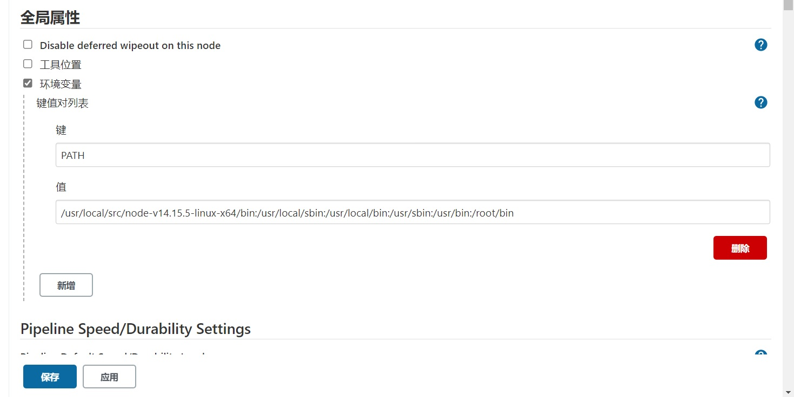
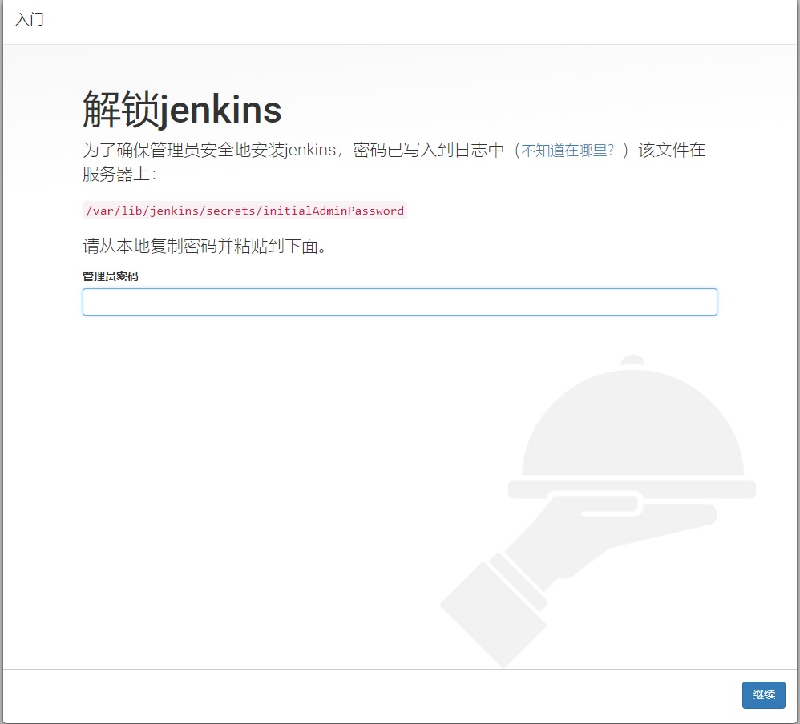
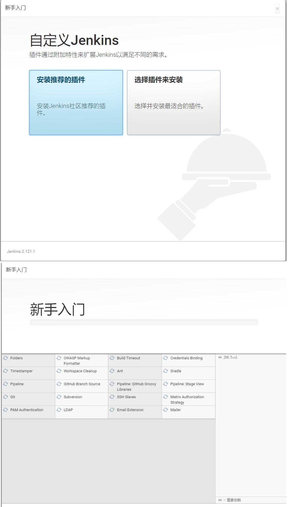
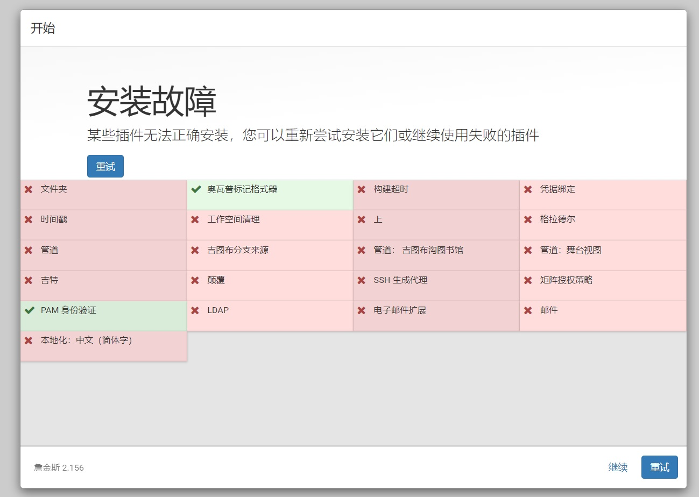
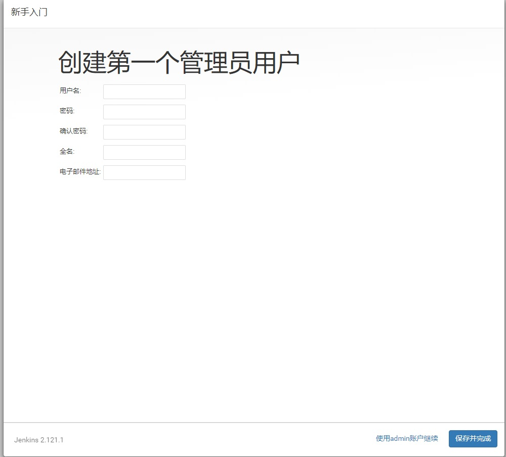
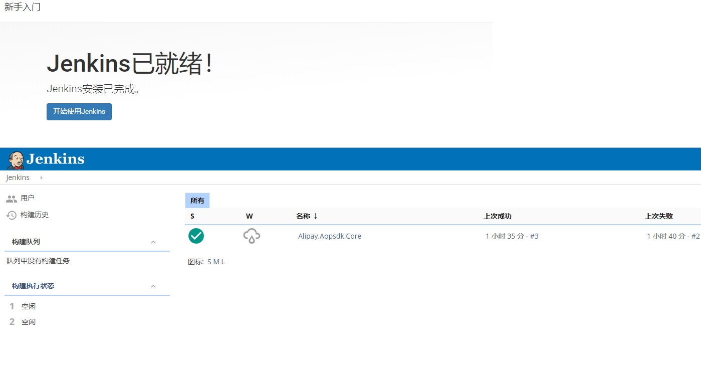
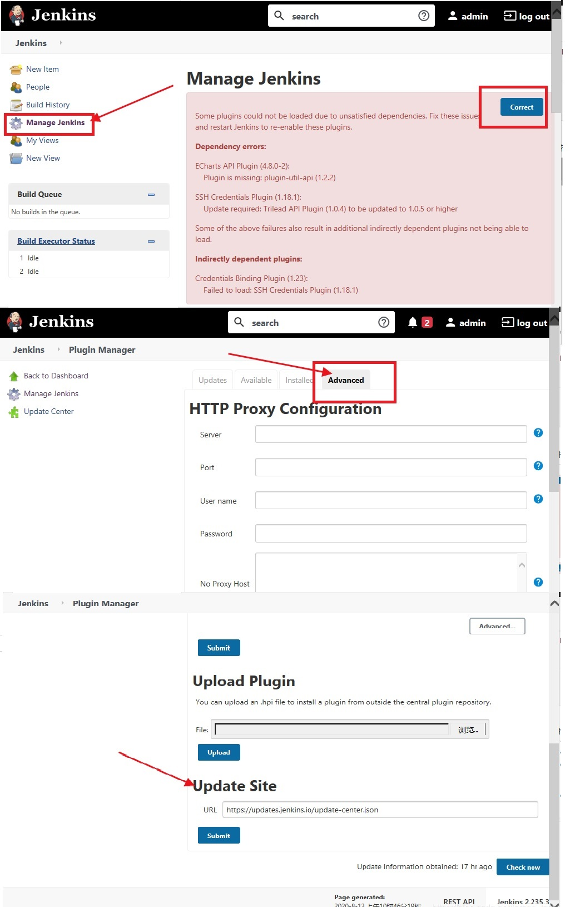
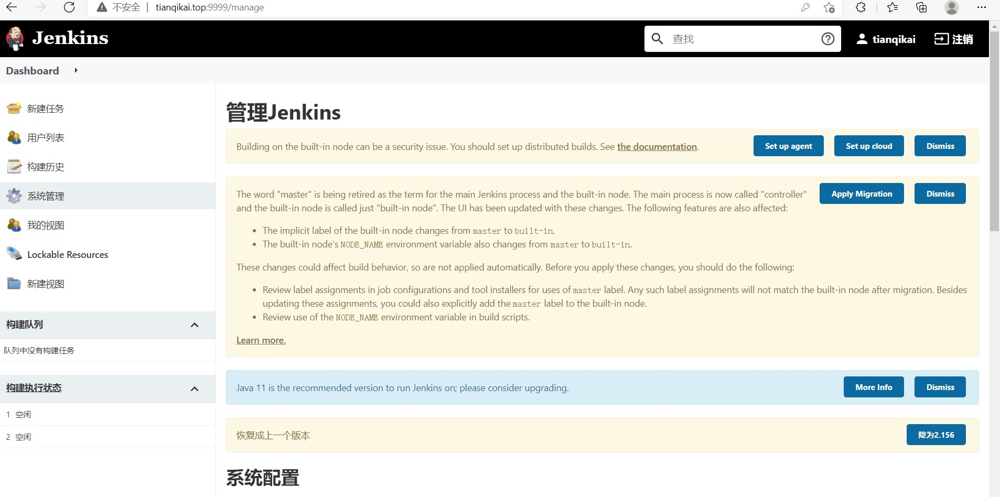

# 1. CentOS 7 安装 Jenkins

<font color='red'><strong>★ 安装前提需要安装 jDK</strong></font>

<font color='red'><strong>★ 如果你的系统没有自带git，那么也需要安装一个</strong></font>

```sh
yum install git

//安装完成后
[root@tianqikai ~]# whereis git
git: /usr/bin/git /usr/share/man/man1/git.1.gz

```

<font color='red'><strong>★ 安装Node js</strong></font>

安装完成配置环境变量，不然Jenkins可能找不到 node npm

```sh
[root@tianqikai ~]# echo $PATH
/usr/local/src/node-v14.15.5-linux-x64/bin:/usr/local/sbin:/usr/local/bin:/usr/sbin:/usr/bin:/root/bin
```
**系统管理->系统配置->全局变量**
<a data-fancybox title="Jenkins PATH" href="./image/Jenkins10.jpg"></a> 

## 1.1 下载安装包并安装

### 1.1.1 安装方式一

```sh
sudo wget -O /etc/yum.repos.d/jenkins.repo https://pkg.jenkins.io/redhat-stable/jenkins.repo

sudo rpm --import https://pkg.jenkins.io/redhat-stable/jenkins.io.key

yum install jenkins
```
### 1.1.2 安装方式二

```sh
wget https://pkg.jenkins.io/redhat/jenkins-2.156-1.1.noarch.rpm
rpm -ivh jenkins-2.156-1.1.noarch.rpm

[root@tianqikai ~]# ls -lrt
total 389376
-rw-r--r-- 1 root root  75872652 Dec 17  2018 jenkins-2.156-1.1.noarch.rpm

```

## 1.2 修改配置文件

```sh
vim /etc/sysconfig/jenkins

#监听端口
JENKINS_PORT="8080"


#修改配置
$JENKINS_USER="root"
```
## 1.3 修改目录权限

```sh
chown -R root:root /var/lib/jenkins
chown -R root:root /var/cache/jenkins
chown -R root:root /var/log/jenkins
```
## 1.4 启动Jenkins

```sh
service jenkins restart
ps -ef | grep jenkins

systemctl start jenkins
```

## 1.5 访问使用Jenkin

### 1.5.1 访问jenkins地址 http:<ip或者域名>:8080
<a href='http://tianqikai.top:9999/manage'>http://tianqikai.top:9999</a>

### 1.5.2 执行命令查看密码

```sh
cat /var/lib/jenkins/secrets/initialAdminPassword
```
<a data-fancybox title="Jenkins初始密码" href="./image/Jenkins1.jpg"></a> 

### 1.5.3 插件安装选择推荐插件

<a data-fancybox title="Jenkins安装插件" href="./image/Jenkins2.jpg"></a> 

可能会安装失败
<a data-fancybox title="Jenkins安装插件" href="./image/Jenkins.jpg"></a> 

安装失败后续登陆之后处理

### 1.5.4 创建管理员账户

<a data-fancybox title="创建管理员账户" href="./image/Jenkins3.jpg"></a> 

### 1.5.5 安装完成

<a data-fancybox title="安装完成" href="./image/Jenkins4.jpg"></a> 

## 1.6 Jenkins安装插件失败问题解决方案

<a data-fancybox title="Jenkins安装插件" href="./image/Jenkins.jpg"></a> 

### 1.6.1 切换下载源地址

**点击Manage Jenkins->Correct->Advanced**

<a data-fancybox title="切换下载源地址" href="./image/Jenkins5.jpg"></a> 

找到页面最下面的Update Site，替换链接为：https://mirrors.tuna.tsinghua.edu.cn/jenkins/updates/update-center.json

### 1.6.2 更新相关插件

### 1.6.2.1 更新报错插件

**点击Manage Jenkins 找到报错信息，执行更新操作即可**

### 1.6.2.2 在Available里面搜索重装即可

**插件安装成功之后**

<a data-fancybox title="插件安装成功之后" href="./image/Jenkins6.jpg"></a> 

https://blog.csdn.net/qq_34272964/article/details/93747652
https://juejin.cn/post/6844903864466948110#heading-6


你的私人令牌自动构建Jenkins使用已生成

8e482a2f314b4b2189a66871791537b4

Gitee WebHook 密码
d16e44e59eb6e13ad27f7594c6db0089


wget https://nodejs.org/dist/v14.15.5/node-v14.15.5-linux-arm64.tar.xz
