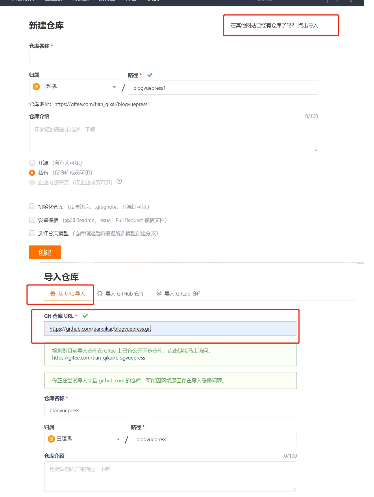

# 代码同时提交Gitee和GitHUb

众所周知，GitHub 是全球最大的面向开源及私有软件项目的托管平台，里面不缺乏大神写的优秀的开源项目，可是 GitHub 有一个致命的弊端，就是**国内访问速度太慢了**。为了解决这个问题，一个优秀的国产代码托管平台 Gitee(码云)应用而生，但是 Gitee 并没有 GitHub 那么有知名度。那么我们想我的代码既能放到最知名的GitHub上，同时也要兼容访问和下载速度，那怎么办呢？


答案就是同时将代码提交到 GitHub 和 Gitee 上，那该如何去做呢？接下来我将一步步从头新建一个项目，然后同时提交到 GitHub 和 Gitee 两个仓库。


## 1.1 同步GitHub代码到Gitee

<a data-fancybox title="同步代码到Gitee" href="./image/git1.jpg"></a>

## 1.2 命令方式同步

**同步的前提是Gitee和Github两个ssh都要配置好了**

### 1.2.1 删除已关联的名为origin的远程库

```sh
git remote rm origin
```

### 1.2.2 关联GitHub的远程库

```sh
git remote add github git@github.com:tianqikai/blogvuepress.git
```

### 1.2.3 关联码云的远程库

```sh
git remote add gitee git@gitee.com:tian_qikai/blogvuepress.git
```

### 1.2.4 查看配置文件

**如果[remote "github"] [remote "gitee"] 没有生成，将上述文件内容[remote "origin"]内容复制，修改origin名称内容如下 修改.git文件夹内的config文件**

```sh 
[core]
        repositoryformatversion = 0
        filemode = false
        bare = false
        logallrefupdates = true
        symlinks = false
        ignorecase = true
[remote "github"]
        url = git@github.com:tianqikai/blogvuepress.git
        fetch = +refs/heads/*:refs/remotes/github/*
[remote "gitee"]
        url = git@gitee.com:tian_qikai/blogvuepress.git
        fetch = +refs/heads/*:refs/remotes/gitee/*
[branch "master"]
          remote = origin
          merge = refs/heads/master
```

### 1.2.5 查看远程库

通过以上两种方式的任一种方式配置完成后，我们用
```sh
git remote -v
```
查看远程库信息：

```sh
$ git remote -v
gitee   git@gitee.com:tian_qikai/blogvuepress.git (fetch)
gitee   git@gitee.com:tian_qikai/blogvuepress.git (push)
github  git@github.com:tianqikai/blogvuepress.git (fetch)
github  git@github.com:tianqikai/blogvuepress.git (push)
```
可以看到两个远程库，说明配置生效了。

### 1.2.6 上传代码

```sh

git add test.txt
git commit -m "update"


#提交到github
git push github master
#上述命令不行，可以试一下这个
git push github main

#提交到码云
git push gitee master
#上述命令不行，可以试一下这个
git push gitee main

#更新代码
# 从github拉取更新
git pull github

# 从gitee拉取更新
git pull gitee

```
**这时候vscode idea 也可以提交到多个远程仓库了**