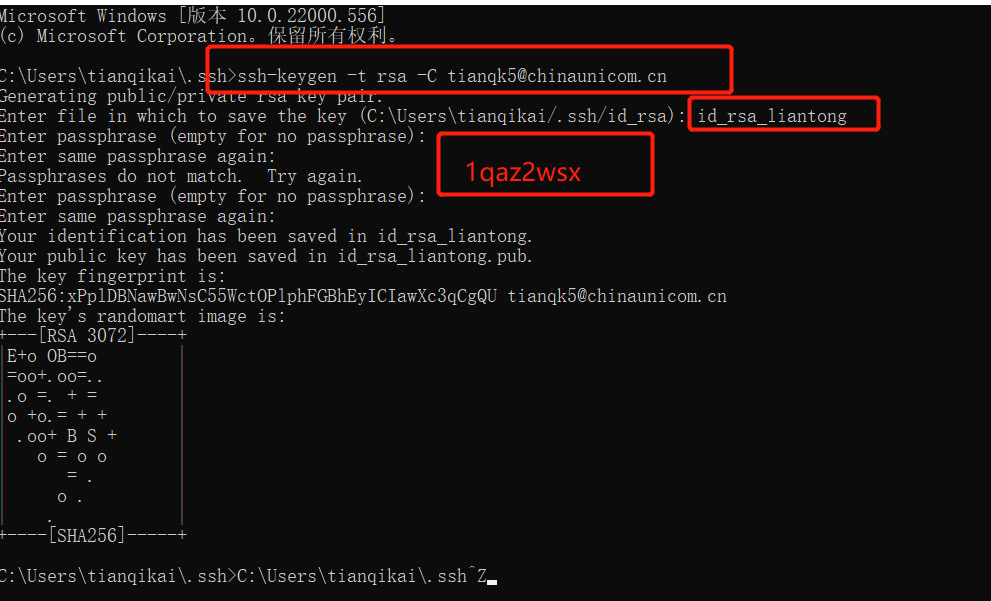
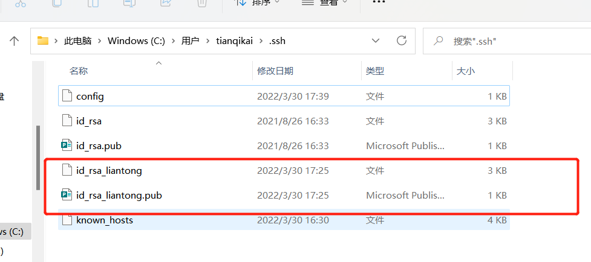

工作学习中，有时我们自己的电脑可能会提交项目到自己`学习使用的远程仓库`和`工作的远程仓库`；

# 1. 设置全局版本身份

```sh
git config --global user.name ‘tianqikai’
git config --global user.email ‘953811508@qq.com’
git config --global user.phone ‘18562328330’
```

这种方式在本地仓库中不设置本地用户时，默认使用的时全局身份

# 2. 设置本地仓库用户信息

```bash
tianqikai@LAPTOP-SFSA2FB7 MINGW64 /代码/gitlab/ops-cloudmarket-bill (master)
$ git config user.name tianqk5

tianqikai@LAPTOP-SFSA2FB7 MINGW64 /代码/gitlab/ops-cloudmarket-bill (master)
$ git config user.email tianqk5@chinaunicom.cn
```

- 这时候就可以在本地仓库用以上设置的`用户名`和`邮箱`进行提交验证了

# 3. 设置工作的远程仓库ssl

## 3.1 执行命令`ssh-keygen -t rsa -C email`

创建github对应的sshkey，命名为id_rsa_liantong，密码 1qaz2wsx 
 
<a data-fancybox title="" href="./image/git1.png"></a>


## 3.2 生成公私密钥
<a data-fancybox title="" href="./image/git2.png"></a>

## 3.3 远程仓库配置ssl公钥密钥
略

# 4. 拉去远程仓库某个分支文件

在Git Bash中直接输入指令：git clone -b dev 代码仓库地址 （dev是分支名称）

```bash
git clone -b develop http://XXX.XXX.XXX.XXX/wangq511/ops-cloudmarket-bill.git
```
